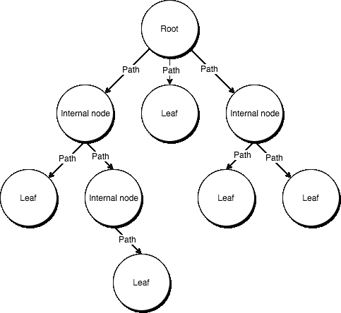
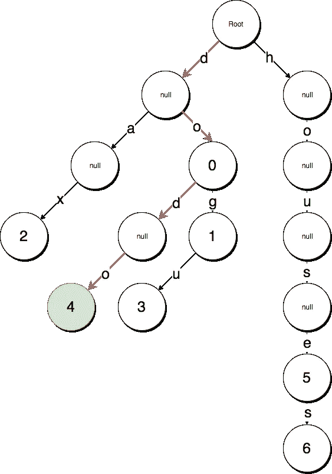
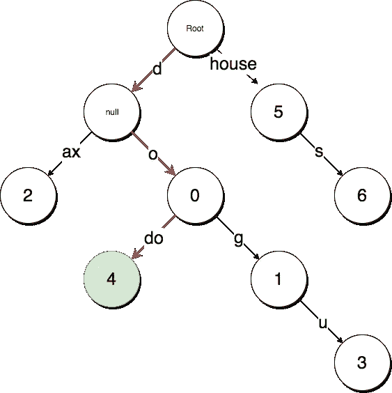
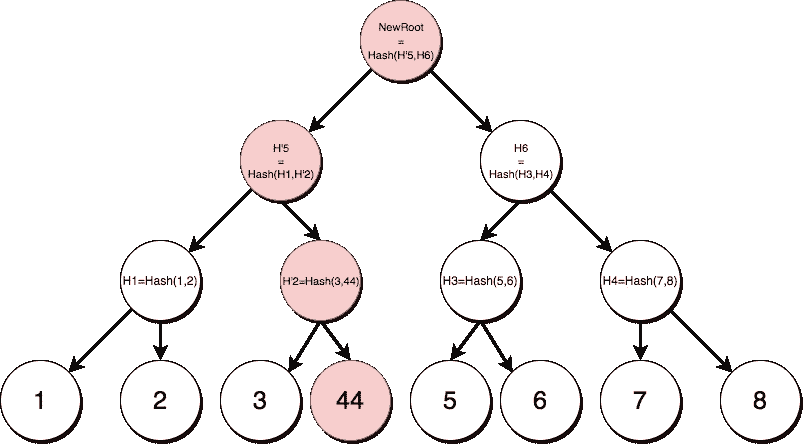

# 以太坊中的数据结构|第 2 集:基数 trie 和 Merkle trie。

> 原文：<https://medium.com/coinmonks/data-structure-in-ethereum-episode-2-radix-trie-and-merkle-trie-d941d0bfd69a?source=collection_archive---------1----------------------->

Trie is a main data structure used in Ethereum.

在[第 1 集](/@phansnt/data-structure-in-ethereum-episode-1-recursive-length-prefix-rlp-encoding-decoding-d1016832f919) [和 1+](/@phansnt/data-structure-in-ethereum-episode-1-compact-hex-prefix-encoding-12558ae02791) 中，我们熟悉了一些用于构建以太坊数据的编码/解码算法。现在，我们将继续讨论以太坊中的数据组织。我将介绍两种 trie，它们是 Radix trie 和 Merkle trie。实际上，它们并不用于 raw，以太坊将它们混合在一起，创建了一个更加优化的新 trie，并命名为 Patricia trie。这一集为我们理解帕特丽夏·特里做了准备。

> 如果你从未听说过 trie 或 tries，不要担心*👌*。它们非常容易理解。

***特里***

Trie 是在科学计算机中表示数字树的单词或术语。有时，我们可以看到“树”被使用，这是可以的，因为同样的意思。

换句话说，trie 是一个有序的数据结构，用于存储一个动态集合或关联数组，它是由键值组成的，其中的键通常是字符串。

Trie.

通过上图，我们可以熟悉一些术语。此外，根、内部节点、叶的集合将被称为公共节点。

***数据集***

> 我们将在所有示例中使用这个数据样本。

Dataset.

在数据集中，键是字符串，值是整数。

***基数 trie***

> 基数 trie 用于优化搜索🔭。

在 radix trie 中，数据集中的键将是到达值的路径。

Basic radix trie.

正如你所看到的，trie 的每个路径代表一个 ASCII 字符，它用于搜索值。

例如，我们正在寻找 key 的值，即`dodo`。就从根开始，尝试先寻找`d`路径，并沿着整个路径继续下降。最终结果是红线和绿色节点，值为`4`。

Radix trie.

但是，`house`和`houses`键的分支被降级，带有`null`值的内部节点太多。为了达到`houses`的值，我们必须沿着路径下降很多次。这会造成空间浪费。

因此，可以通过组合降级路径来改进它。现在，路径不是由单个字符表示的，而是一个字符串。

我们对基数 trie 进行了改进，如下图所示。

为了到达`houses`节点，我们只需要下降两次，这似乎对搜索很有好处。

***默克尔特里***

> Merkle trie 用于验证数据

在 merkle trie 中，它的数据被用来创建一个确定性的加密散列来帮助认证数据。

为了获得细节，我们举一个例子:

Merkle trie.

全部数据将存储在树叶中。那些叶子的父值将等于`Hash(valueOfChild1, valueOfChild2, …)`。

Deterministic cryptographic hash.

如果我们尝试将第四个节点的值更改为 44。因此，从第 4 个节点到根的路径上的父节点将完全改变，`H2 → H’2 | H5 → H’5 | Root → NewRoot`。

因此，如果我们持有根的值，我们可以通过重建 trie 来获得根并将其与我们的根进行比较，从而验证数据的一致性。实际上，不改变根的值是不可能伪造数据的。

**结论&参考文献 **

通过理解这两种方法，我们就接近了最终目标。

Why did I write this series so long? Because it is a SERIES 😑

下一集，我将向你展示以太坊如何结合这些和一些改进来创建 Patricia trie，它有更多优化的东西，并且还保留了主要的属性，即优化搜索和确定性加密。

 [## 基数树-维基百科

### 在计算机科学中，基数树(也叫基数 trie 或紧凑前缀树)是一种数据结构，它表示一个…

en.wikipedia.org](https://en.wikipedia.org/wiki/Radix_tree)  [## 默克尔树-维基百科

### 在密码学和计算机科学中，散列树或 Merkle 树是这样一种树，其中每个叶节点都标有…

en.wikipedia.org](https://en.wikipedia.org/wiki/Merkle_tree)  [## 以太坊/维基

### 维基-以太坊维基-

github.com](https://github.com/ethereum/wiki/wiki/Patricia-Tree) 

> [直接在您的收件箱中获得最佳软件交易](https://coincodecap.com/?utm_source=coinmonks)

