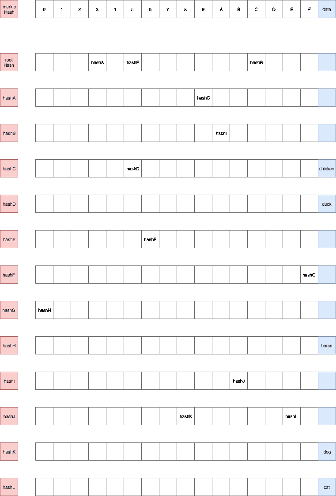
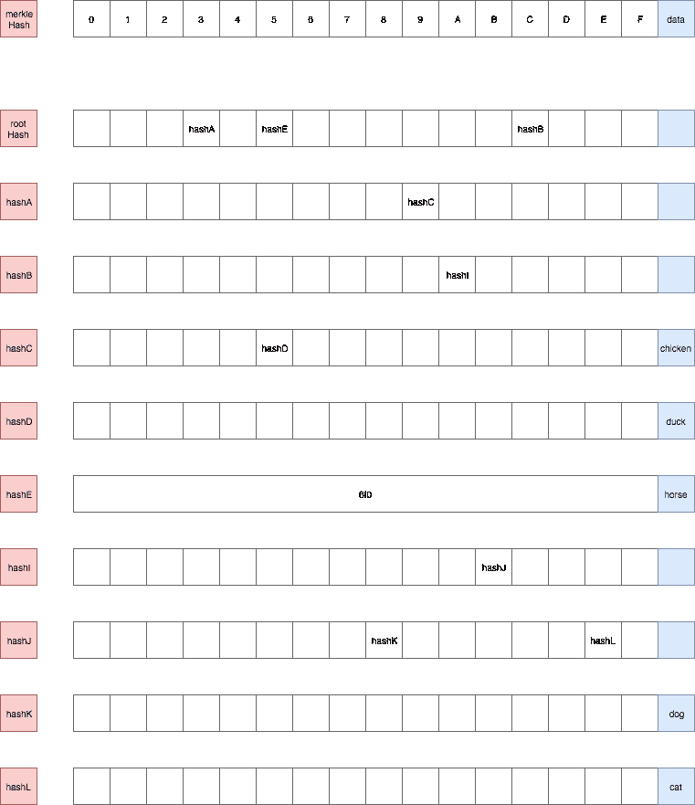
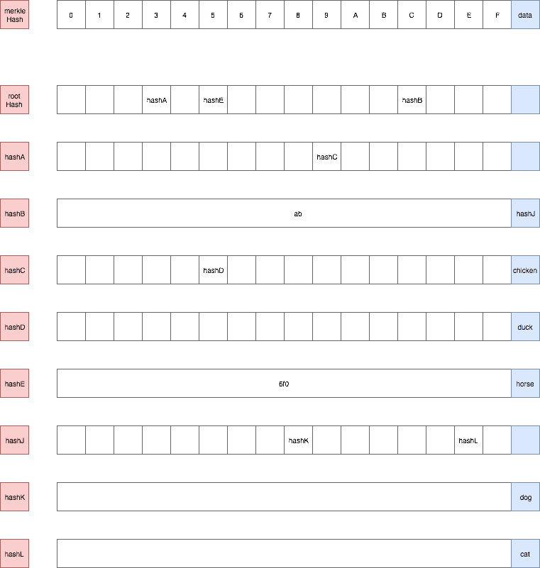
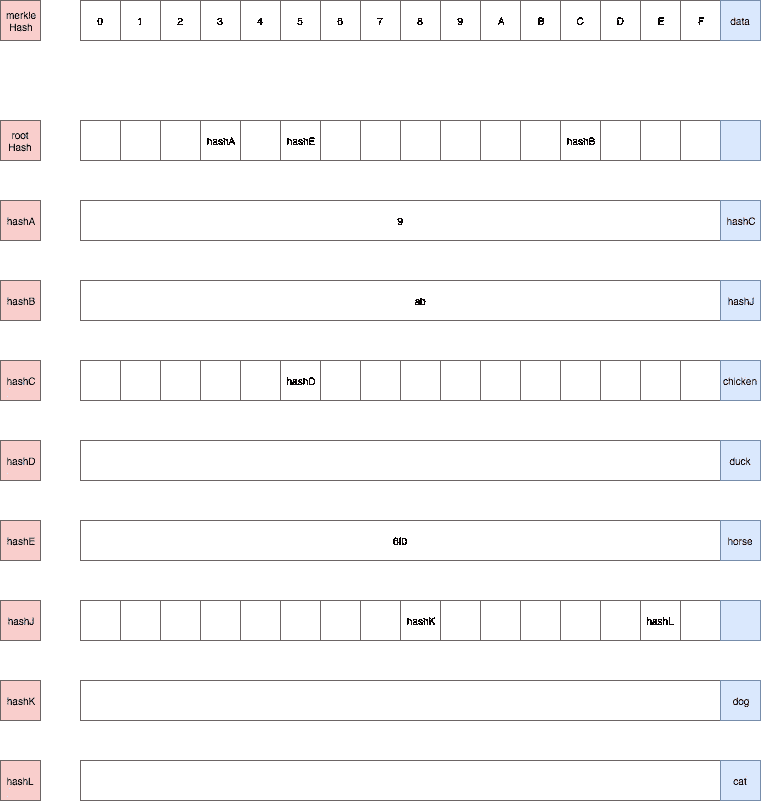
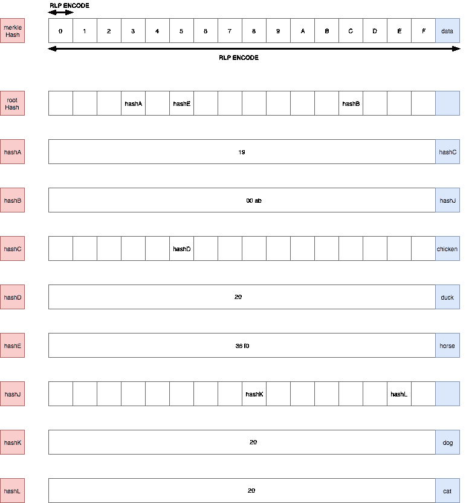

# 以太坊中的数据结构|第 3 集:Patricia trie。

> 原文：<https://medium.com/coinmonks/data-structure-in-ethereum-episode-3-patricia-trie-b7b0ccddd32f?source=collection_archive---------0----------------------->

Image source: [**/r/ethereum**](https://www.reddit.com/r/ethereum/comments/67sds9/ethereum_background_wallpaper_image_in_hd/) by [**BitcoinIsTehFuture**](https://www.reddit.com/user/BitcoinIsTehFuture)

Patricia trie 是以太坊中用来存储数据的主要 trie。它是由 [Radix trie 和 Merkle trie](/@phansnt/data-structure-in-ethereum-episode-2-radix-trie-and-merkle-trie-d941d0bfd69a) 混合而成。

> 为了使它容易理解，我将首先带我们去一个低效的帕特丽夏·特里，然后去“改进的”帕特丽夏·特里，最后是“真正的”帕特丽夏·特里。这种方法有助于我们了解某些结构产生的原因。
> 
> 这意味着关于动机和直觉*🏃。*

> [发现并评估最佳区块链 api 和节点产品](https://coincodecap.com/category/blockchain-node-and-api)

***数据集***

***术语***

A node.

以太坊中的节点存储为键值，键值是节点的散列。值是一个包含 17 个元素的数组。在 17 个元素中，前 16 个元素由从`0`到`f`的十六进制数索引，最后一个是该节点包含的数据。

> 键与路径

请注意，`key`用于“数据库查找”(意为通过数据库机制找到一个节点)，而`path`用于“trie 查找”(意为通过路径降序查找数据，如 [Radix trie](/@phansnt/data-structure-in-ethereum-episode-2-radix-trie-and-merkle-trie-d941d0bfd69a) )。

> 如果仍然不明确，下面的例子会更简单。

***效率低下的帕特丽夏·特里***

我们构建一个 trie 来表示我们的数据集。

Building trie by dataset.

为了再次测试，让我们尝试一步一步地搜索`395`路径的值。

> 符号:“这是数据库查找”——**tdl**，“这是 trie 查找”——**TTL**；

1.  我们将`395`下降到 3 个部分`3`、`9`、`5`，依次使用。
2.  从`rootHash`开始，我们要找到与`rootHash`对应的`rootNode`(**tdl**)。
3.  路径的第一部分是`3`，所以我们得到由`rootNode`的`3`索引的元素，那就是`hashA` ( **ttl** )。
4.  查找`hashA` ( **tdl** )，获取由`9` ( **ttl** )索引的元素，元素的值为`hashC`。
5.  寻找`hashC` ( **tdl** )，获取由`5` ( **ttl** )索引的元素，元素的值为`hashD`。
6.  此时，我们沿着整个路径向下，这样我们将获得与`hashD` ( **ttl** )对应的节点的数据元素(最后一个元素)中包含的值，结果是`duck`。

您可以看到，我们使用 path 来查找值(Radix trie 的一个属性),如果 trie 中的一个值被更改，它将导致 trie 的`rootHash`被更改(Merkle trie 的一个属性)。

此外，trie 的数据元素中有太多的空值节点，我们必须改进它以提高效率。

***【改良版】帕特丽夏·特里***

> 我们如何改进它？最好的答案在以太坊维基里，我不会解释的更好，下面就引用一下*💅💅💅。*

[圣答](https://github.com/ethereum/wiki/wiki/Patricia-Tree#optimization)。

Finally, chose one 💆💆💆.

在[第一集+](/@phansnt/data-structure-in-ethereum-episode-1-compact-hex-prefix-encoding-12558ae02791) 中我已经提到过`leaf`节点和`extension`节点，但是我们不知道它们是什么。我们遇到了一些使我们的树退化的情况，那些是没有分支的长路径(没有分叉的路径)。

比如:`56f0`，要获取`horse`值，需要下行太多空值节点。

但是，这导致了两个子问题。

1.  没有分叉的路径指向数据的末端。比如:`56f0`。
2.  中间没有分叉的路径。比如:`{cabe, cab8}`的`cab`。

为了解决第一个问题，他们引入了`leaf`节点，为了解决第二个问题，他们引入了`extension`节点。它们是具有 2 个元素的数组形式的节点，第一个元素是`partialPath`，帮助减少空值节点，第二个元素包含值，如果是`leaf`则为`data`，如果是`extension`则为`merkleHash`。

Using leaf node.

`hashE`现在变成了一个`leaf`节点，要得到`56f0`路径的值我们可以这样做:

1.  获取索引为`5`的元素`rootHash`，值为`hashE`。
2.  因为`hashE`可能是一个`leaf`或`extension`节点，我们必须将路径的剩余部分(remainder)与`hashE`的`partialPath`进行比较。余数是`6f0`，`partialPath`是`6f0`(二者相同)，所以这个节点是`leaf`节点。我们返回`data`字段，结果是`horse`。

Using leaf node and extension node.

`hashB`现在变成了`extension`节点。例如，获取`cab8`路径的`data`:

1.  获取由`rootHash`的`c`索引的元素，值为`hashB`。
2.  我们可以看到`hashB`是一个有 2 个值的数组，所以我们不断比较余数和`partialPath`来知道哪个是节点。余数为`ab8`且`partialPath`为`ab`，表示节点为`extension`节点。我们从路径的当前剩余部分移除`partialPath`，我们得到路径的新剩余部分是`8`，下一个散列是`hashJ`。
3.  找到`hashJ`对应的节点，获取`8`索引的元素，值为`hashK`。余数现在是空的。
4.  寻找`hashK`并且我们收到一个空的节点`partialPath`(叶节点，因为余数等于`partialPath`)，返回`dog`。

另外，我们可以看到`hashD`、`hashK`和`hashL`也是`leaf`节点。实际上，我们的 trie 仍然没有完全优化。

Optimized trie.

现在，这个 trie 似乎被`leaf`节点和`extension`节点充分优化了。

> 以上两个例子有助于我们理解为什么以及如何建立和改进帕特里夏特里。现在我们将完成它，并得到以太坊使用的最终帕特里夏特里。*🚀🚀🚀*

***帕特丽夏·特里***

一些附加规则:

1.  每一次`partialPath`出手前都会被 [HP 编码](/@phansnt/data-structure-in-ethereum-episode-1-compact-hex-prefix-encoding-12558ae02791)。
2.  节点中的每个元素都将被 [RLP 编码](/@phansnt/data-structure-in-ethereum-episode-1-recursive-length-prefix-rlp-encoding-decoding-d1016832f919)。
3.  值(节点)将在存储下来之前进行 RLP 编码。

Patricia trie.

***以太坊数据结构***

在以太坊中，Patricia trie 用于 4 trie:

1.  stateRoot
2.  storageRoot
3.  transactionRoot
4.  收据根

其中，`stateRoot`、`transactionRoot`和`receiptRoot`包含在块头中。特别地，`storageRoot`是子 trie 并且包含在状态 trie 的数据中。

下面的链接是对它们的完美解释。

 [## 以太坊/维基

### 维基-以太坊维基-

github.com](https://github.com/ethereum/wiki/wiki/Patricia-Tree#tries-in-ethereum) 

***结论***

我从第 1 集到第 3 集展示的一切都是一些理论上的东西，似乎不足以理解 Patricia trie 在实践中是如何工作的。在下一集，我们将做一个连接数据库的例子，并展示 trie 是如何组织的。那真的很酷。

> 你需要先了解一些关于 geth、web3 和 levelDB 的知识，以便在阅读第四集时更加流畅。

> [直接在您的收件箱中获得最佳软件交易](https://coincodecap.com/?utm_source=coinmonks)

***参考文献***

来自维基以太坊的文档:

 [## 以太坊/维基

### 维基-以太坊维基-

github.com](https://github.com/ethereum/wiki/wiki/Patricia-Tree#optimization)