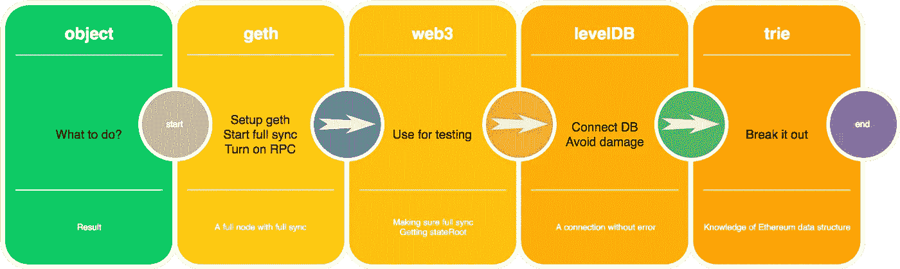
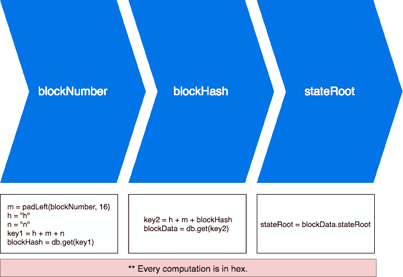
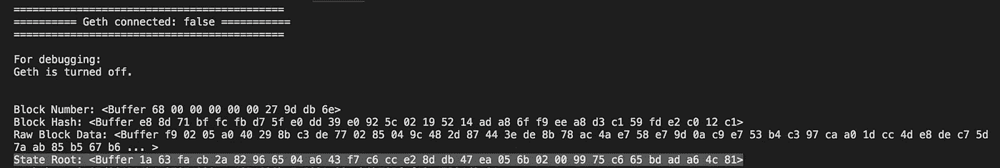
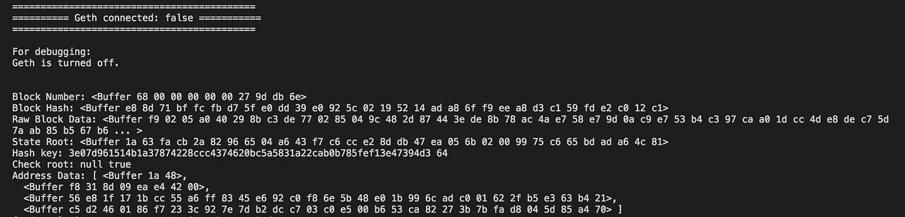

# 以太坊中的数据结构|第 4 集:深入示例。

> 原文：<https://medium.com/coinmonks/data-structure-in-ethereum-episode-4-diving-by-examples-f6a4cbd8c329?source=collection_archive---------0----------------------->


Image source: [**pxhere.com**](https://pxhere.com/en/photo/674690)

从第一集到这里似乎是一个漫长的旅程，我们已经得到了我们需要的一切，这一次，这将是最后一次让一切都清楚以太坊数据在实践中是如何组织的。

> 在我看来，用例子练习是处理和深入任何问题的最好方法。通过创建一个例子，我真心希望它能帮助你清楚地理解以太坊中的数据结构。

如果不想弄脏自己的手，可以克隆我的 git(开发分支)更方便。

[](https://github.com/sontuphan/Trie/tree/develop) [## 松图潘/特里

### 在 GitHub 上创建一个帐户，为 Trie 开发做出贡献。

github.com](https://github.com/sontuphan/Trie/tree/develop) 

一些规格:

1.  完整节点:Geth
2.  网络:Ropsten testnet
3.  编程语言:Javascript/NodeJS
4.  研究主题:state trie (stateRoot)



What we have to do.

***Geth***

通过这个链接，你将知道如何在你的计算机上设置 geth 为一个完整的节点。

[](https://github.com/ethereum/go-ethereum/wiki/geth) [## 以太坊/围棋以太坊

### 以太坊-以太坊协议的官方 go 实现

github.com](https://github.com/ethereum/go-ethereum/wiki/geth) 

要启动 Ropsten testnet 的完全同步模式并打开 RPC，可以使用以下命令:

```
geth --testnet --datadir "~/Library/Ethereum/ropsten" --rpc --rpcapi "eth,net,personal,web3" --rpcaddr "0.0.0.0" --rpccorsdomain "*" --ws --wsapi "eth,net,personal,web3" --wsorigins "0.0.0.0"
```

请记住，您应该在`--datadir`标志之后更改参数，以便您可以使用。

因为我们在完全同步模式下运行 geth，这意味着 geth 需要时间(相当长😂在我的情况下，大约 3 天)来同步整个区块链数据。当你看到这样的日志，我很确定它完成了。


Full sync.

***Web3 —测试 geth***

请参考网站 3 的链接:

[](https://github.com/ethereum/wiki/wiki/JavaScript-API) [## 以太坊/维基

### 维基-以太坊维基-

github.com](https://github.com/ethereum/wiki/wiki/JavaScript-API) 

首先，我们需要创建一个 nodeJS 项目，然后安装 web3 包。

尝试运行`getStateRoot`功能，其中`blockNumber`是 Ropsten 上几乎最新的块号。我们避免获取最新的，因为这将导致延迟同步的风险，所以接近最新的块号是一个明智的选择。我的选择是`2596315`在你读这篇文章的那一刻可能就不一样了。小心点。

我跑`getStateRoot(2596315)`的结果:

```
stateRoot: 0x1a63facb2a82966504a643f7c6cce28ddb47ea056b02009975c665bdada64c81
```

> 此时，我们可以确保完整节点能够完美地工作。

***levelDB***

[](https://github.com/google/leveldb) [## 谷歌/leveldb

### leveldb 是一个由 Google 编写的快速键值存储库，它提供了从 string…

github.com](https://github.com/google/leveldb) 

关于 levelDB，我们需要注意的是，它一次只允许一个连接。因此，我们需要在完全同步后停止 geth，以便进行后续步骤。

为了通过 NodeJS 创建连接，我们将使用两个包`levelup`和`leveldown`。所以请安装`levelup`、`leveldown`和`path`模块。

[](https://github.com/Level/levelup) [## 水平/水平提升

### level up——一个 node.js 包装器，用于兼容抽象级别降低的存储

github.com](https://github.com/Level/levelup) 

创建连接:

Create a connection to levelDB.

在这里，我尝试用指向我的 chaindata 文件夹的特定路径连接到我的 levelDB(这个路径取决于我们启动 geth 时的配置)。然后，我将它全球化以备后用。

***先潜入数据库***

> 在 Web3 — Testing geth 部分，我得到了块号为 2596315 的 stateRoot。因为我们用了 web3，所以结果肯定是正确的。

现在，我们通过在与特定块号对应的块头中获取 stateRoot 来发出警告，然后我们将它与 Web3 中的先前结果进行比较—测试 geth 部分。

请先安装`ethereumjs-block`模块，我们需要它来解析块数据。



Warn-up steps.

源代码:

**关于`utils`库，请看一下我的回购获取源代码。路径是`./libs/utils`。

第一步，我们需要在`2596315`的左边填充一个数字`0`，这样总长度就是 16，注意我们做的所有事情都是十六进制的。

`hexBlockNumber = 00 00 00 00 00 27 9d db`

在 geth 中，他们用`h`做前缀，用`n`做后缀。

```
prefix = 68
suffix = 6e
```

然后，我们把它们按顺序连接起来。

```
keyString = prefix + hexBlockNumber + suffix = 68 00 00 00 00 00 27 9d db 6e
```

结果如下:



Warn-up results.

正如我们所见，最终结果与 web3 部分的结果相同。

> 恭喜你！！！我们第一次潜入真正的*💩*

**变深*变深*变深**

我们将使用`merkle-patricia-tree`和`rlp`模块，让我们安装它。

现在，我们开始创建一个`trie`库，它使用以太坊地址来解析保存在状态 trie 中的全部信息。

针对`getInfoByAddress`函数，我们使用`merkle-patricia-tree`创建带有`root`输入的 trie，然后通过这个 trie 得到一个地址的数据。请记住，所有数据在保存下来之前都是由`rlp`编码的，为了读出这些数据，我们需要对它们进行解码。

这是一个完整的例子:

结果是:



The final result.

一个地址数据包含 4 个信息。它们依次是 nonce、balance、storageRoot 和 codeHash。

> [直接在您的收件箱中获得最佳软件交易](https://coincodecap.com/?utm_source=coinmonks)

[](https://coincodecap.com/?utm_source=coinmonks)

***结论***

这不是这个系列的结束，我们将有一些关于修剪树。但是也许将来会被分享，因为我对它的了解还不多。


😱

> 听到这里可能会难过:))

***参考文献***

[](https://ethereum.stackexchange.com/questions/28976/leveldb-in-geth-key-and-values) [## Geth、key 和值中的 LevelDB

### 当解析 levelDB 或 RocksDB 时(取决于您使用的客户端),有字符串值…

ethereum.stackexchange.com](https://ethereum.stackexchange.com/questions/28976/leveldb-in-geth-key-and-values) [](https://wanderer.github.io/ethereum/nodejs/code/2014/05/21/using-ethereums-tries-with-node/) [## 用 Node.js 探索以太坊的状态 trie

### 漫游者又名 null_radix 在这里写东西。主要是关于编程

漫游者. github.io](https://wanderer.github.io/ethereum/nodejs/code/2014/05/21/using-ethereums-tries-with-node/)