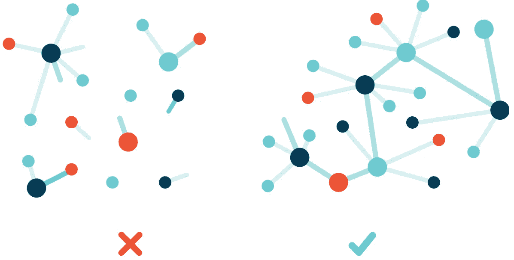
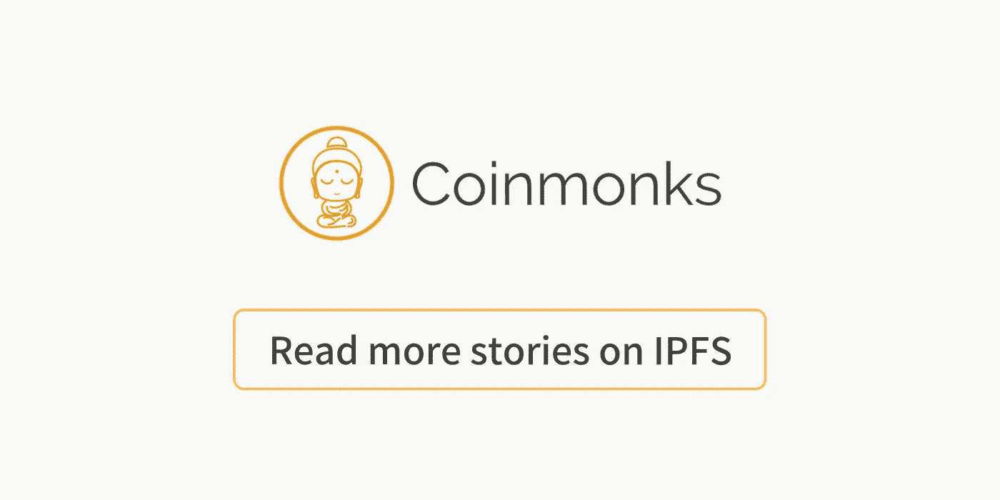

# IPFS —简介

> 原文：<https://medium.com/coinmonks/day-17-1-year-of-blockchain-c9a9f81f478?source=collection_archive---------0----------------------->



[IPFS](https://ipfs.io/images/ipfs-illustration-network.svg)

# 第 17 天–区块链一周年

IPFS

IPFS 是一个分布式存储协议，它的目标是最终用一个更高效、带宽需求更少的 P2P 网络取代 HTTP。我想安装它与 [Embark](https://github.com/iurimatias/embark-framework) 一起使用，以探索拥有一个‘无服务器’后端会是什么样子(无服务器在这个意义上不是 AWS Lambda 函数，而是一个使用以太坊和 IPFS 的分布式后端)。我很好奇这样一个 app 是怎么架构的。

为那些倾向于弄脏手的人安装。

```
# Install Nix
$ curl https://nixos.org/nix/install | sh
# Reload shell 
$ source /nix/var/nix/profiles/default/etc/profile.d/nix-daemon.sh
# Install IPFS
$ nix-env -i ipfs
# Run it!
$ ipfs daemon
```

您应该在端口 5001 上运行一个 API，在端口 8080 上运行一个网关(很差的默认设置)。

通过命令行存储和检索是微不足道的，IPFS 网站宣布这项技术今天就可以使用。我很好奇这在实践和生产中意味着什么。我能把视频传到这东西上吗？

> [在您的收件箱中直接获得最佳软件交易](https://coincodecap.com/?utm_source=coinmonks)

[](https://coincodecap.com/?utm_source=coinmonks)

我在考虑开发一种你在现实生活中玩的游戏。我将尝试使用所有这些组件来建立一个完全分布式的应用程序，在区块链直播视频流和支付。如果它通过了我强制性的两周想法测试(在我为一个新想法写代码之前，我必须等待两周)。我倾向于在记起做好生产准备有多少该死的工作之前就开始构建东西，然后它就会开始，我将主要写那个项目的实现。

[](https://medium.com/coinmonks/ipfs/home)

**click to read more IPFS stories**