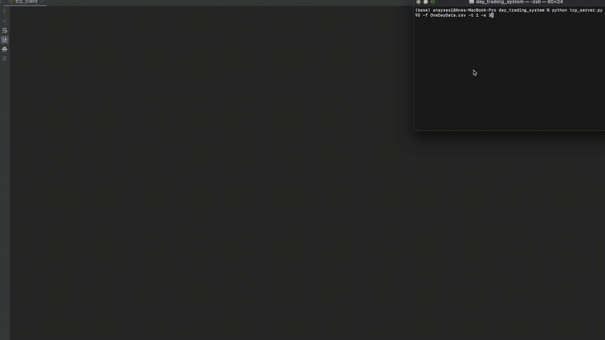
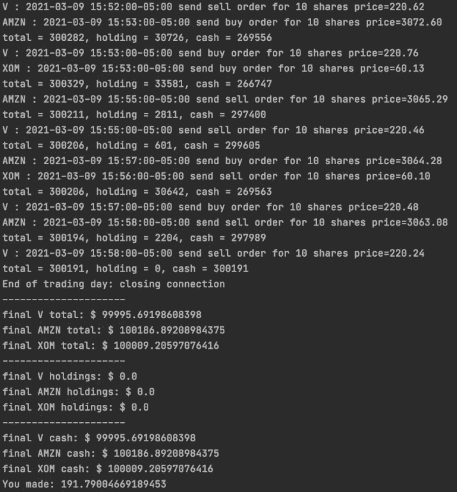
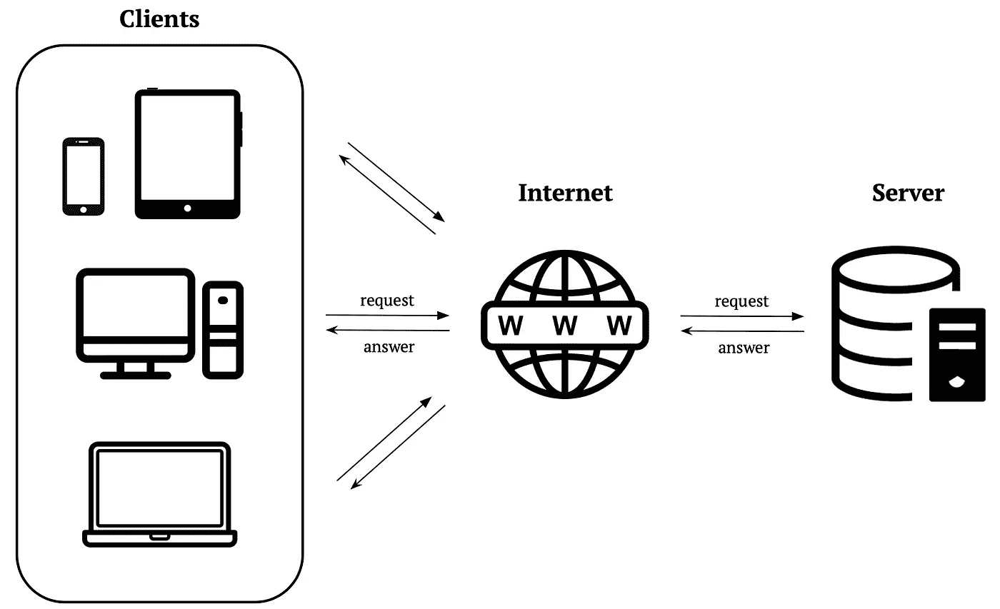
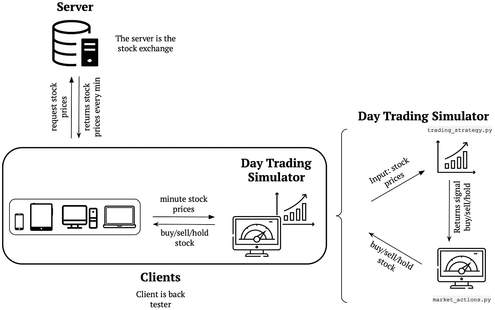
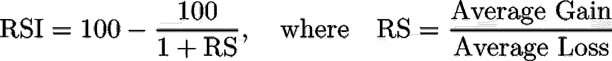
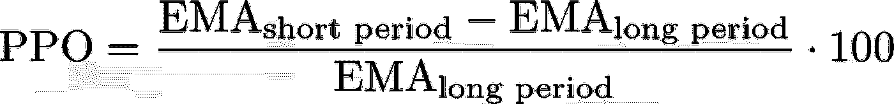
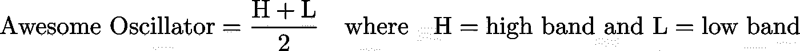
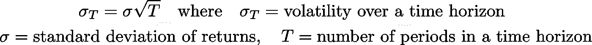
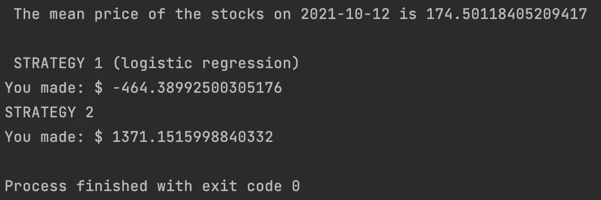

# 日间交易模拟器

> 原文：<https://medium.com/coinmonks/day-trading-simulator-ed60493cd395?source=collection_archive---------5----------------------->

使用 Python 创建了一个平台，帮助投资者在真实情况下使用之前尝试他们的交易策略并加以改进。


Photo by [Tim Rüßmann](https://unsplash.com/@timaesthetic?utm_source=medium&utm_medium=referral) on [Unsplash](https://unsplash.com?utm_source=medium&utm_medium=referral)

# 什么是日内交易？

日内交易包括您在同一天内进入和退出头寸的任何股票交易操作。日内交易包括但不限于货币、股票、原材料，甚至加密货币。收益通常是通过利用大量资本来利用高流动性工具来实现的，这些工具每天、每小时、有时每分钟都在市场上持续产生微小的价格波动。

在承担与日内交易相关的内在风险之前，期货日内交易者需要了解的两个基本因素是**流动性**和**波动性**。

*   **流动性**描述了一项资产的市场状态，即该资产在不影响其价格的情况下交易的速度。可以快速出售而对资产价格影响很小或没有影响的资产市场被认为具有高流动性，而市场中相反的特征表明流动性低。高流动性资产意味着风险较低，因为它们可以快速转移。
*   **波动性**是对证券稳定性的一种衡量，通常计算为特定时期内连续复合回报的标准差。它也可以被定义为特定证券的离差的统计度量，通过方差或标准差来衡量。低波动性资产意味着较低的风险，因为它们不会偏离 30 天或 60 天的平均值太多。

当日交易策略通常会考虑股票的波动性或流动性(或两者都考虑)。策略是日内交易者成功与否的基础。在本文中，我们将带您了解我们的两个基本策略以及它们是如何工作的。

我们今天要给你介绍的这两种策略相对来说是不同的。一个使用逻辑回归，另一个使用不同的波动指标来决定是否买入、卖出或持有股票。

# **为什么要创建模拟器？**

通常，在日内交易中，利润的大小与投入的资本直接相关。在没有充分了解相关风险的情况下投入大量资金可能会导致潜在的灾难性后果。因此，在决定一个特定的策略之前，创建一个允许您随着时间的推移测试策略性能的机制是很重要的。

有两种方法可以做到这一点。首先，用少量的钱来测试你的策略，看看这些钱是如何随着时间的推移而增加/减少的。这很好，因为在策略失败的情况下，你内在地限制了你的风险。这种方法的缺点是，你的测试可能无法交易昂贵的商品——如果你的实际策略依赖于交易更昂贵的商品，这个测试可能无法准确地反映你的实际策略将如何执行。第二个选择，也是我们推荐的选择，是创建一个模拟器。

一个模拟器接收实时真实的股票市场数据，并用虚拟/假钱在上面运行你的策略。你可以控制启动资金是多少，它可以设置为任意数字。在本文中，我们介绍了一个模拟器，它可以在 Python 中从`yfinance`下载的标准普尔 500 股票的分钟数据上运行。

我们使用的模拟器试图模仿一个真实的日交易系统，该系统使用客户端-服务器模型，每分钟都做出购买、出售或持有标准普尔 500 股票的决定。在买卖股票的情况下，会向投资者发送通知，并更新头寸(总资本、持股和可用现金)。

模拟器每分钟的响应如下所示:

```
AMZN: 2021-03-09 15:52:00-05:00 send sell order for 10 shares price=220.62
total = 300282, holding = 30726, cash = 269556
```



Animation of the system. We can see that the terminal has the real-time stock info by the minute whereas the console is displaying all buy and sell orders along with total $ (speed-up for the purpose of showing output).



Image 1: Output of the simulator for the trade of 3 different stocks

# **客户端-服务器模式**

客户端-服务器概念指的是通过网络链接几个计算设备的通信模型。在这个框架中，客户机向服务器发出服务请求，服务器负责满足这些要求。

使用这种体系结构，任务在服务器(提供服务)和客户机(需要这些服务)之间分配。换句话说:客户机向服务器请求资源，服务器提供响应。

以下是典型的客户端-服务器模型的可视化表示:



*Image 2:* Client-Server model schema

# **客户-服务器模型在我们的日间交易模拟器中的作用。**

为什么我们的项目需要客户机-服务器模型？让我们首先呈现整个系统的可视化表示:



*Image 3: Architecture of the simulator*

在我们的客户端-服务器系统**、**中，客户端请求每只标准普尔 500 股票在该时刻的股价信息。然后，服务器将这些信息发送给客户端。客户端捕获服务器发送的信息，并将这些信息输入到我们的策略中。然后，策略算法返回每只股票的买入、卖出或持有操作。

找到[客户端代码](https://github.com/anapysasi/day_trading_system/blob/main/tcp_client.py)和[服务器代码](https://github.com/anapysasi/day_trading_system/blob/main/tcp_server.py)。

# **系统遵循的策略**

我们使用 python 中的包`[yfinance](https://pypi.org/project/yfinance/)`下载分钟历史数据，它可以检索美国市场开放的时间范围(东部时间周一到周五上午 9:30 到下午 4:00)内最近 7 天的(分钟数据)。我们将这些数据保存到一个 CSV 文档中，供服务器稍后将数据发送给用户时使用。

服务器发送的数据如下所示:

```
{‘Datetime’: ‘2021–03–09 15:59:00–05:00’, ‘Open’: 214.6999969482422, ‘High’: 214.8699951171875, ‘Low’: 214.42999267578125, ‘Close’: 214.42999267578125, ‘Volume’: 33963, ‘Dividends’: 0, ‘Stock Splits’: 0, ‘Symbol’: ‘ECL’}
```

我们使用这些信息(日期/开盘/最高/最低/收盘/成交量/股息/股票分割)来计算以下特征(实时):

*   **相对强弱指数(RSI):** 衡量价格曲线的瞬时或相对变化。范围从 0 到 100。高于 70 表示超买，低于 30 表示超卖。



*   **移动平均线收敛/发散(MACD):** 衡量快速(短周期)指数移动平均线(EMA)和慢速(长周期)EMA 之间的差异，即衡量两个不同周期数的指数移动平均线的收敛或发散。


*   **百分比价格振荡器(PPO):** 用百分比表示两个指数移动平均线(EMA)之间的关系。当 PPO 高于 0 时，表明上涨趋势，因为短期均线高于长期均线。



*   **布林线(上下带):**允许动态观察资产价格相对于移动平均线的变化。价格上下的距离取决于价格的波动性。
*   **牛逼振荡指标:**衡量股票走势的强弱。它告知趋势是看涨还是看跌，也告知金融资产是上涨还是下跌得更快或更慢。



*   **成交量变化:**指某一证券在一段时间内交易的股份数量。
*   **波动性:**衡量一项资产的盈利能力在给定时间内相对于其平均值的变化程度。



*   **移动平均:**资产在特定时间段内的平均价格。这样，我们可以更清楚地看到价格的趋势，因为无论是短期、中期还是长期，它都是价格运动的平滑器。我们计算 5 分钟、10 分钟和 30 分钟的移动平均线。
*   **相关性:**衡量两种证券相对移动的程度。

由于服务器每分钟发送新数据，系统将所述数据保存到数据帧中。我们创建了一个函数来计算动量、RSI、移动平均线收敛/发散(MACD)、百分比价格振荡指标、awesome 振荡指标、每日日志回报柱、回报、变化、波动性、5-10 和 30 分钟移动平均线、高波段指标、低波段指标、存储的股票数据框架的相关性。代码如下:

# **策略如何运作**

我们创建了一个*类*，它定义了每一个策略([策略 1](https://github.com/anapysasi/day_trading_system/blob/main/trading_strategy1.py) 、[策略 2](https://github.com/anapysasi/day_trading_system/blob/main/trading_strategy2.py) )。如*图 3:模拟器的架构*所示，然后在`market actions.py`中使用该类最终发送信号([策略 1](https://github.com/anapysasi/day_trading_system/blob/main/market_actions_strategy1.py) 、[策略 2](https://github.com/anapysasi/day_trading_system/blob/main/market_actions_strategy2.py) )。

这两个类都有一些共同的函数定义(区别在于逻辑回归使用更多的特性)，为了简化策略的代码，稍后，我们将首先显示共同的类定义。代码如下:

**Logistic** **回归策略:**

由于股票市场价格运动是随机的，只有一个`BUY`或`SELL`方向是我们最终关心的交易策略，我们决定选择二项式分类回归算法。

利用`yfinance`给出的财务特征和之前解释的财务特征，逻辑回归模型生成一个输出，指示股票价格是上涨还是下跌。使用的[代码](https://github.com/anapysasi/day_trading_system/blob/main/trading_strategy1.py)如下:(之前定义的策略类里面的代码)。

**牛逼的振荡器和波段指标策略:**

以前的策略依赖于拟合一个新的逻辑回归模型，并使用它来每分钟给我们一个`BUY`或`SELL`动作。如果用户想同时交易大量股票，模型拟合速度太慢，跟不上数据流。

在这种情况下，我们将 Awesome 振荡器和波段指标结合使用，而不必在每次系统获得新数据时重新训练模型。

可怕的振荡指标是一只股票的 5 周期移动平均线和 34 周期移动平均线之间的差异。在我们的例子中，周期是一分钟。负的振荡值意味着过去 5 分钟内的平均股票价值低于过去 34 分钟内的平均股票价值，这意味着该股票当时被低估了。

同样，较低波段(`LBand`)和较高波段(`HBand`)指标显示股票价格是否低于/高于其 20 期移动平均线的 2 个标准差。考虑到这些概念，系统发送:

*   任何时候股票价格在 Awesome 振荡器上返回负值，或者使用`LBand`指标有信号，都是一个`BUY`信号
*   Awesome 振荡器为正时或使用高频带`HBand`指示器有信号时的`SELL`信号

这种策略确保了我们只买入基于 20 或 34 周期移动平均线被低估的股票，只卖出基于 20 或 34 周期移动平均线被高估的股票。使用的[代码](https://github.com/anapysasi/day_trading_system/blob/main/trading_strategy2.py)如下:(之前定义的策略类内的代码)。

# 策略用例

我们在 2021 年 10 月 12 日对标准普尔 500 的所有股票尝试了这些策略，每种策略的结果如下:



Results of the strategies on 2021–10–12

我们可以看到，通过使用逻辑回归，我们损失了钱，算法仍然需要一些改进。我们创建了一个[特征重要性文件](https://github.com/anapysasi/day_trading_system/blob/main/log_reg_important_features.py)，它可以用来更好地选择模型中的特征。

令人敬畏的振荡器和波段指标策略似乎表现不错，我们赚了 1371.15 美元。测试策略的[代码](https://github.com/anapysasi/day_trading_system/blob/main/use_case.py)如下:

**特别感谢**[**samb hav Jain**](https://www.linkedin.com/in/sambhav-jain-136675a5/)**帮助撰写本文。**

查看 [GitHub](https://github.com/anapysasi/day_trading_system/) 库，查看所有代码。

# 注意事项:

改变了 API，一些股票的数据不再可用。到目前为止，以下符号不可用，需要删除:`ALXN`、`MXIM`、`VAR`、`LB`、`COG`、`FLIR`。

> 加入 Coinmonks [电报频道](https://t.me/coincodecap)和 [Youtube 频道](https://www.youtube.com/c/coinmonks/videos)了解加密交易和投资

## 也阅读

*   [买 PancakeSwap(蛋糕)](https://blog.coincodecap.com/buy-pancakeswap)|[matrix export Review](https://blog.coincodecap.com/matrixport-review)
*   [最佳免费加密信号](https://blog.coincodecap.com/free-crypto-signals) | [YoBit 评论](/coinmonks/yobit-review-175464162c62) | [Bitbns 评论](/coinmonks/bitbns-review-38256a07e161)
*   [OKEx 评论](/coinmonks/okex-review-6b369304110f) | [Kucoin 交易机器人](/coinmonks/kucoin-trading-bot-automate-your-trades-8cf0ca2138e0) | [期货交易机器人](/coinmonks/futures-trading-bots-5a282ccee3f5)
*   [AscendEx Staking](https://blog.coincodecap.com/ascendex-staking)|[Bot Ocean Review](https://blog.coincodecap.com/bot-ocean-review)|[最佳比特币钱包](https://blog.coincodecap.com/bitcoin-wallets-india)
*   [霍比审核](https://blog.coincodecap.com/huobi-review) | [OKEx 保证金交易](https://blog.coincodecap.com/okex-margin-trading) | [期货交易](https://blog.coincodecap.com/futures-trading)
*   [比特币基地跑马圈地](https://blog.coincodecap.com/coinbase-staking) | [Hotbit 评论](/coinmonks/hotbit-review-cd5bec41dafb) | [KuCoin 评论](https://blog.coincodecap.com/kucoin-review)
*   [最佳加密交易信号电报](/coinmonks/best-crypto-signals-telegram-5785cdbc4b2b) | [MoonXBT 评论](/coinmonks/moonxbt-review-6e4ab26d037)
*   [Coinswitch 俱吠罗评论](/coinmonks/coinswitch-kuber-review-1a8dc5c7a739) | [电网交易机器人](https://blog.coincodecap.com/grid-trading) | [比特币基地收费](/coinmonks/coinbase-fees-831e77d4f2c5)
*   [Bitget 回顾](https://blog.coincodecap.com/bitget-review)|[Gemini vs block fi](https://blog.coincodecap.com/gemini-vs-blockfi)|[OKEx 期货交易](https://blog.coincodecap.com/okex-futures-trading)
*   [OKEx vs KuCoin](https://blog.coincodecap.com/okex-kucoin) | [摄氏替代品](https://blog.coincodecap.com/celsius-alternatives) | [如何购买 VeChain](https://blog.coincodecap.com/buy-vechain)
*   [币安期货交易](https://blog.coincodecap.com/binance-futures-trading)|[3 commas vs Mudrex vs eToro](https://blog.coincodecap.com/mudrex-3commas-etoro)
*   [在印度利用加密套利赚取被动收入](https://blog.coincodecap.com/crypto-arbitrage-in-india)