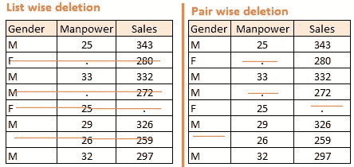
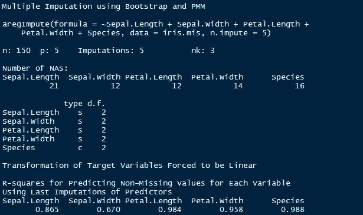
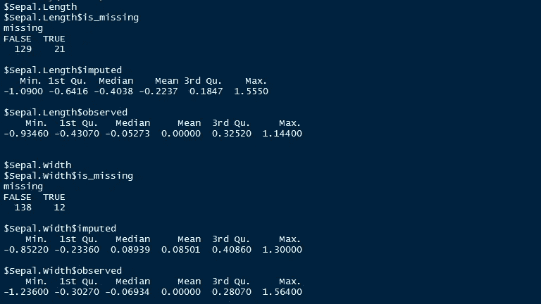

# 使用 R 处理缺失数据

> 原文：<https://medium.com/coinmonks/dealing-with-missing-data-using-r-3ae428da2d17?source=collection_archive---------1----------------------->

大家好，

我是 Harshitha，这是我第一篇关于媒体的文章。我打算尽我所能帮助我的数据科学爱好者，所以我在这里写了一个每个人都应该掌握的重要主题。

数据科学融合了三个主要领域:**数学、技术和商业战略。**数学是数据科学的心脏和核心。在我们对数据应用任何算法之前，很明显，数据应该是整齐的或结构化的。但在现实世界中，我们最初看到的数据大多是非结构化的。因此，为了使其整洁，并进一步应用任何算法来获得洞察力，必须清理数据。数据不整齐的主要原因是因为缺失值和异常值的存在。

在我们处理缺失数据之前，最好先检查缺失数据的数量。在 R 中，我们有不同的包来处理丢失的数据。

> 例如:为了检查丢失的数据，我们在 R

*   以下命令按列给出整个数据框中缺失值的总和:

***colsum(is.na(数据帧))***

*   以下命令给出特定列中缺失值的总和。此命令也可能会产生误导，因为缺失值实际上被视为空值，而不是 na，sum(is.na())只对数据集中值被赋为 NA 的值求和。因此，在读取 r 中的数据集时，设置 **na.string = True** 。

***sum(is.na(数据帧$列名)***

**缺失值可以用以下方法处理**:

1.  **删除:**当缺失变量的概率对于所有观测值都相同时，使用删除方法。

> 例如:数据收集过程中的受访者决定在抛公平硬币后宣布他们的收入。如果出现 head，被调查者申报他/她的收入，反之亦然。在这里，每个观察值都有相同的丢失值的机会。

删除可以以两种方式执行:列表删除和成对删除。

*   在列表删除中，我们删除任何变量缺失的观察值。简单是这种方法的主要优点之一，但是这种方法降低了模型的功效，因为它减少了样本量。为了简单起见，我们可以说，这种方法删除了数据缺失的整行观察值。
*   在成对删除中，我们对存在感兴趣的变量的所有情况进行分析。这种方法的优点是，它保持尽可能多的案例可供分析。这种方法的一个缺点是，它对不同的变量使用不同的样本量。

**2。均值/众数/中位数插补:**插补是一种用估计值填充缺失值的方法。目标是利用已知的关系，这些关系可以在数据集的有效值中识别，以帮助估计缺失值。均值/众数/中位数插补是最常用的方法之一。它包括用该变量所有已知值的平均值或中值(定量属性)或众数(定性属性)替换给定属性的缺失数据。它可以有两种类型:-

*   **广义插补:**在这种情况下，我们计算该变量所有非缺失值的平均值或中值，然后用平均值或中值替换缺失值。如上表所示，变量“**人力”**缺失，因此我们取“**人力”** ( **28.33** )所有非缺失值的平均值，然后用它替换缺失值。
*   **类似情况插补:**在这种情况下，我们分别计算非缺失值的性别“**男“**”(29.75)和“**女**”(25)的平均值，然后根据性别替换缺失值。对于“**男**”，我们将用 29.75 替换缺失的人力值，对于“**女**”用 25 替换缺失的人力值。

**3。预测模型**:预测模型是处理缺失数据的复杂方法之一。在这里，我们创建了一个预测模型来估计将替代缺失数据的值。在这种情况下，我们将数据集分成两组:一组没有变量的缺失值，另一组有缺失值。第一个数据集成为模型的训练数据集，而具有缺失值的第二个数据集是测试数据集，并且具有缺失值的变量被视为目标变量。接下来，我们创建一个模型，根据训练数据集的其他属性预测目标变量，并填充测试数据集的缺失值。我们可以使用回归、方差分析、逻辑回归和各种建模技术来实现这一点。这种方法有两个缺点:

1.  模型估计值通常比真实值表现得更好
2.  如果与数据集中的属性和具有缺失值的属性没有关系，那么模型对于估计缺失值将是不精确的。

**4。KNN 插补:**在这种插补方法中，使用与缺失值的属性最相似的给定数量的属性对属性的缺失值进行插补。使用距离函数来确定两个属性的相似性。众所周知它也有一定的优点&缺点。

**优点:**

*   k 近邻可以预测定性和定量属性
*   不需要为具有缺失数据的每个属性创建预测模型
*   具有多个缺失值的属性很容易处理
*   考虑数据的相关结构

**缺点:**

*   KNN 算法在分析大型数据库时非常耗时。它在所有数据集中搜索最相似的实例。
*   k 值的选择非常关键。较高的 k 值将包括与我们所需要的显著不同的属性，而较低的 k 值意味着遗漏了重要的属性。

尽管有上述方法，R 有各种包来处理丢失的数据。

# R 包列表

1.  老鼠
2.  无肢
3.  错过森林
4.  Hmisc
5.  大音阶的第三音

# MICE 包装

MICE(通过链式方程的多变量插补)是 R 用户常用的软件包之一。与单一插补(如平均值)相比，创建多重插补可解决缺失值的不确定性。

MICE 假设缺失数据是随机缺失的(MAR)，这意味着值缺失的概率仅取决于观察值，并且可以使用它们进行预测。它通过为每个变量指定一个插补模型，对每个变量的数据进行插补。

**例如:**假设我们有 X1，X2…Xk 变量。如果 X1 有缺失值，那么它将在其他变量 X2 到 Xk 上回归。然后，X1 中缺失的值将被获得的预测值替换。类似地，如果 X2 有缺失值，那么 X1，X3 到 Xk 变量将在预测模型中作为独立变量使用。稍后，缺失值将被预测值替换。

默认情况下，线性回归用于预测连续缺失值。逻辑回归用于分类缺失值。一旦这个循环完成，就会产生多个数据集。这些数据集的不同之处仅在于估算缺失值。一般来说，在这些数据集上分别建立模型并组合它们的结果被认为是一个好的实践。

确切地说，这个包使用的方法是:

1.  PMM(预测均值匹配)—用于数值变量
2.  logreg(逻辑回归)—用于二元变量(有两个级别)
3.  polyreg(贝叶斯同态回归)—用于因子变量(> = 2 级)
4.  比例优势模型(有序，> = 2 级)

现在就来实际了解一下吧。

`#load data`
`> data <- iris`

`#Get summary`

因为，老鼠假设随机值缺失。让我们使用 prodNA 函数在数据集中播种缺失值。您可以通过安装 missForest 包来访问该功能。

`#Generate 10% missing values at Random` T12`> iris.mis <- prodNA(iris, noNA = 0.1)`

`#Check missing values introduced in the data`

我去掉了分类变量。让我们在这里关注连续值。要处理分类变量，只需对级别进行编码并遵循以下程序。

`# Removing categorical data`

`> iris.mis <- subset(iris.mis, select = -c(Species))`
`> summary(iris.*mis)*`

*#安装鼠标*
`> install.packages("mice")`
`> library(mice)`

mice 包有一个函数叫做 *md.pattern()。*它以表格形式返回数据集中每个变量的缺失值。

> md.pattern(虹膜. mis)

让我们来理解这张表。有 98 个观察值没有缺失值。萼片长度中有 10 个观察值缺失。同样，萼片中有 13 个值缺失。宽度等等。

这看起来很丑。对吗？我们还可以创建一个视觉来表示缺失的值。它看起来也很酷。我们去看看。

`> install.packages("VIM")`
`> library(VIM)`
`> mice_plot <- aggr(iris.mis, col=c('navyblue','yellow'),`
`numbers=TRUE, sortVars=TRUE,`
`labels=names(iris.mis), cex.axis=.7,`
`gap=3, ylab=c("Missing data","Pattern"))`

我们来快速了解一下这个。数据集中有 67%的值没有缺失值。花瓣中有 10%的值缺失。长度，花瓣中缺少 8%的值。宽度等等。您还可以查看直方图，它清楚地描述了变量中缺失值的影响。

现在，让我们估算缺失值。

`> imputed_Data <- mice(iris.mis, m=5, maxit = 50, method = 'pmm', seed = 500)`
`> summary(imputed_Data)`

输出:

`Multiply imputed data set`
`Call:`
`mice(data = iris.mis, m = 5, method = "pmm", maxit = 50, seed = 500)`
`Number of multiple imputations: 5`
`Missing cells per column:`
`Sepal.Length Sepal.Width Petal.Length Petal.Width`
`13 14 16 15`
`Imputation methods:`
`Sepal.Length Sepal.Width Petal.Length Petal.Width`
`"pmm" "pmm" "pmm" "pmm"`
`VisitSequence:`
`Sepal.Length Sepal.Width Petal.Length Petal.Width`
`1 2 3 4`
`PredictorMatrix:`
`Sepal.Length Sepal.Width Petal.Length Petal.Width`
`Sepal.Length 0 1 1 1`
`Sepal.Width 1 0 1 1`
`Petal.Length 1 1 0 1`
`Petal.Width 1 1 1 0`

以下是对所用参数的解释:

1.  m —指 5 个估算数据集
2.  maxit 指用于估算缺失值的迭代次数
3.  方法——指插补中使用的方法。我们使用预测平均匹配。

`#check imputed values`
`> imputed_Data$imp$Sepal.Width`

由于有 5 个估算数据集，您可以使用 *complete()* 功能选择任何一个。

`#get complete data ( 2nd out of 5)`
`> completeData <- complete(imputed_Data,2)`

此外，如果您希望在所有 5 个数据集上构建模型，您可以使用带有()命令的*一次完成。您还可以使用 *pool()* 命令组合这些模型的结果并获得一个合并的输出。*

`#build predictive model`
`> fit <- with(data = iris.mis, exp = lm(Sepal.Width ~ Sepal.Length + Petal.Width))`

`#combine results of all 5 models`
`> combine <- pool(fit)
> summary(combine)`

请注意，我使用上面的命令只是为了演示。你可以替换你那端的变量值，试试看。

# 无肢

该软件包还执行多重插补(生成插补数据集)来处理缺失值。多重插补有助于减少偏差和提高效率。它启用了基于 EMB 算法的 bootstrap，使其能够更快、更稳健地估算许多变量，包括横截面、时间序列数据等。此外，它还支持使用多核 CPU 的并行插补功能。

它做出以下假设:

1.  数据集中的所有变量都具有多元正态分布(MVN)。它使用均值和协方差来汇总数据。
2.  缺失数据本质上是随机的(随机缺失)

它是这样工作的。首先，它取 m 个自举样本，并对每个样本应用 EMB 算法。均值和方差的 m 个估计值是不同的。最后，第一组估计值用于通过回归估算第一组缺失值，然后第二组估计值用于第二组，依此类推。

与 MICE 相比，MVN 在一些关键方面存在差距，例如:

1.  MICE 以变量为基础估算数据，而 MVN 使用基于多元正态分布的联合建模方法。
2.  MICE 能够处理不同类型的变量，而 MVN 的变量需要正态分布或转换为近似正态分布。
3.  此外，MICE 可以管理在数据子集上定义的变量插补，而 MVN 则不能。

因此，当数据具有多变量正态分布时，该软件包工作得最好。如果不是，就要进行转换，使数据接近正常。

现在就来实际了解一下吧。

`#install package and load library`
`> install.packages("Amelia")`

`#load data`
`> data("iris")`

唯一需要注意的是对变量进行分类。它有 3 个参数:

1.  idvars 保留所有 ID 变量和其他不想估算的变量
2.  noms 在此保留名义变量

`#seed 10% missing values`
`> iris.mis <- prodNA(iris, noNA = 0.1)`
`> summary(iris.mis)`

`#specify columns and run amelia`
`> amelia_fit <- amelia(iris.mis, m=5, parallel = "multicore", noms = "Species")`

`#access imputed outputs`
`> amelia_fit$imputations[[1]]`
`> amelia_fit$imputations[[2]]`
`> amelia_fit$imputations[[3]]`
`> amelia_fit$imputations[[4]]`
`> amelia_fit$imputations[[5]]`

要检查数据集中的特定列，请使用以下命令

`> amelia_fit$imputations[[5]]$Sepal.Length`

`#export the outputs to csv files`
`> write.amelia(amelia_fit, file.stem = "imputed_data_set")`

# 错过森林

顾名思义，missForest 是[随机森林](https://www.analyticsvidhya.com/blog/2015/09/random-forest-algorithm-multiple-challenges/)算法的一个实现。这是一种适用于各种变量类型的非参数插补方法。那么，什么是非参数方法呢？

非参数方法不对 *f* (任意函数)的函数形式做出明确的假设。相反，它试图估算出 *f* ，使其尽可能接近数据点而不显得不切实际。

它是如何工作的？简而言之，它为每个变量构建了一个随机森林模型。然后，它使用模型在观察值的帮助下预测变量中缺失的值。

它产生 OOB(袋外)插补误差估计。此外，它还提供了对插补流程的高度控制。它可以选择单独返回 OOB(对于每个变量)，而不是在整个数据矩阵上聚合。这有助于更仔细地观察模型对每个变量的估算值的准确程度。

让我们实际地理解它。因为 bagging 在分类变量上也工作得很好，所以我们不需要在这里删除它们。它很好地处理了与变量类型相关的缺失值:

`#missForest`
`> install.packages("missForest")`

`#load data`
`> data("iris")`

`#seed 10% missing values`
`> iris.mis <- prodNA(iris, noNA = 0.1)`
`> summary(iris.mis)`

`#impute missing values, using all parameters as default values`
`> iris.imp <- missForest(iris.mis)`

`#check imputed values`T32`> iris.imp$ximp`

`#check imputation error`
`> iris.imp$OOBerror`

`NRMSE PFC`
`0.14148554 0.02985075`

NRMSE 是归一化均方误差。它用于表示因输入连续值而产生的误差。PFC(错误分类的比例)用于表示从输入分类值中得出的误差。

`#comparing actual data accuracy`
`> iris.err <- mixError(iris.imp$ximp, iris.mis, iris)`

`NRMSE PFC`

这表明分类变量的估算误差为 6%，连续变量的估算误差为 15%。这可以通过调整 *mtry* 和 *ntree* 参数的值来改善。mtry 是指每次分割时随机抽样的变量数量。ntree 是指森林中生长的树木数量。

# Hmisc

Hmisc 是一个多用途软件包，可用于数据分析、高级图形、输入缺失值、高级表格制作、模型拟合和诊断(线性回归、逻辑回归和 cox 回归)等。在这个软件包包含的广泛的函数中，它提供了 2 个强大的输入缺失值的函数。它们是*估算()*和*精确计算()*。虽然它也有 *transcan()* 功能，但是 aregImpute()更好用。

*impute()* 函数使用用户定义的统计方法(平均值、最大值、平均值)简单地估算缺失值。它的默认值是中值。另一方面， *aregImpute()* 允许使用加法回归、自举和预测均值匹配进行均值插补。

在 bootstrapping 中，不同的 bootstrap 重采样用于多次插补中的每一次。然后，一个灵活的加性模型(非参数回归方法)适用于从原始数据和缺失值(作为因变量)使用非缺失值(自变量)预测替代样本。

然后，它使用预测均值匹配(默认)来估算缺失值。预测平均匹配适用于连续和分类(二进制和多级)，无需计算残差和最大似然拟合。

以下是该软件包的一些重要亮点:

1.  它假设被预测的变量是线性的。
2.  [费希尔最优评分](https://en.wikipedia.org/wiki/Scoring_algorithm)法用于预测分类变量。

让我们实际地理解它。

`#install package and load library`
`> install.packages("Hmisc")`
`> library(Hmisc)`

`#load data`
`> data("iris")`

`#seed missing values ( 10% )`
`> iris.mis <- prodNA(iris, noNA = 0.1)`
`> summary(iris.mis)`

`# impute with mean value`
`> iris.mis$imputed_age <- with(iris.mis, impute(Sepal.Length, mean))`

`# impute with random value`
`> iris.mis$imputed_age2 <- with(iris.mis, impute(Sepal.Length, 'random'))`

`#similarly you can use min, max, median to impute missing value`

`#using argImpute`
`> impute_arg <- aregImpute(~ Sepal.Length + Sepal.Width + Petal.Length + Petal.Width +
Species, data = iris.mis, n.impute = 5)`

argImpute()自动识别变量类型并相应地处理它们。

`> impute_arg`

输出显示了预测缺失值的 R 值。该值越高，预测的值越好。您也可以使用以下命令检查估算值

`#check imputed variable Sepal.Length`
`> impute_arg$imputed$Sepal.Length`

# 大音阶的第三音

mi(带诊断的多重插补)软件包提供了几个处理缺失值的功能。与其他软件包一样，它也构建了多个插补模型来逼近缺失值。并且，使用预测平均匹配方法。

虽然，我已经在上面解释了预测均值匹配(pmm ),但是如果你还没有理解，这里有一个更简单的版本:对于一个变量中的每个具有缺失值的观察值，我们(从可用值中)找到具有最接近该变量的预测均值的观察值。这个“匹配”的观察值然后被用作估算值。

以下是该产品包的一些独特特征:

1.  它允许插补模型的图形诊断和插补过程的收敛。
2.  它使用贝叶斯版本的回归模型来处理分离问题。
3.  插补模型规范类似于 R 中的回归输出
4.  它自动检测数据中的不规则性，如变量之间的高度共线性。
5.  同时，在插补过程中加入噪声，解决了附加约束问题。

让我们实际地理解它。

`#install package and load library`
`> install.packages("mi")`
`> library(mi)`

`#load data`
`> data("iris")`

`#seed missing values ( 10% )`
`> iris.mis <- prodNA(iris, noNA = 0.1)`
`> summary(iris.mis)`

`#imputing missing value with mi`
`> mi_data <- mi(iris.mis, seed = 335)`

我使用了参数的默认值，即:

1.  rand.imp.method 作为“引导”
2.  n.imp(多重插补次数)为 3
3.  n.iter(迭代次数)为 30

`> summary(mi_data)`

这里是输入缺失值后 mi 包的摘要输出的快照。如图所示，它使用汇总统计数据来定义估算值。

资料来源:AnalyticsVidhya

如果您喜欢这篇文章，请关注我，获取更多与数据科学相关的文章。

> 加入 Coinmonks [电报频道](https://t.me/coincodecap)和 [Youtube 频道](https://www.youtube.com/c/coinmonks/videos)获取每日[加密新闻](http://coincodecap.com/)

## 另外，阅读

*   [密码电报信号](http://Top 4 Telegram Channels for Crypto Traders) | [密码交易机器人](/coinmonks/crypto-trading-bot-c2ffce8acb2a)
*   [复制交易](/coinmonks/top-10-crypto-copy-trading-platforms-for-beginners-d0c37c7d698c) | [加密税务软件](/coinmonks/crypto-tax-software-ed4b4810e338)
*   [网格交易](https://coincodecap.com/grid-trading) | [加密硬件钱包](/coinmonks/the-best-cryptocurrency-hardware-wallets-of-2020-e28b1c124069)
*   [加密交易所](/coinmonks/crypto-exchange-dd2f9d6f3769) | [印度的加密应用](/coinmonks/buy-bitcoin-in-india-feb50ddfef94)