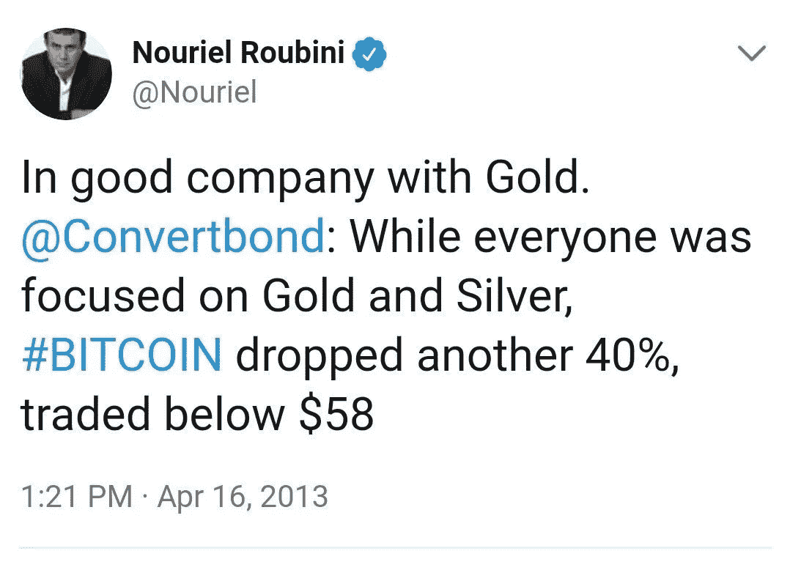

# 亲爱的富达客户，欢迎来到地狱

> 原文：<https://medium.com/coinmonks/dear-fidelity-customer-welcome-to-hell-ea2ff23e931b?source=collection_archive---------2----------------------->

> 这不是财务建议。
> 
> 我不建议任何人购买、出售或交易比特币或任何其他加密货币或任何相关产品，如衍生品、指数等。
> 
> 自己做研究。不要相信任何人。可能的话，运行一个完整节点。

**尊敬的富达客户，**

我谨代表加密社区*(这个社区并不存在，所以我不能代表任何人发言)*我很高兴富达把你们带到这里，带到我们这里，带到我们这个充满乐趣的小地狱的门口，这里也被称为“加密”。

如果你——出于某种原因——有真正通过大门的**疯狂想法**,这篇文章适合你。

> 免责声明:还有其他加密货币，其中一些似乎在寻求与比特币不同的目的，我个人认为这很有趣，它们有不同的安全和治理假设，在撰写本文时存在于比特币本身之外——例如以太坊、Monero——但为了你的精神健康，我在本文中主要指的是比特币。

## 一趟地狱之旅

在这个有趣、陌生的世界里，你会发现大胆、革命性的想法，作为最新伟大发明出售的 Rube Goldberg 机器，骗子，骗子，疯狗，最重要的是，你可能最终会发现自己——真正的自己——陷入所有这些疯狂之中。

你刚刚进入了一个由古怪想法和古怪术语组成的最古怪的马戏团——PoW、Solidity Developers、Maximalism、食肉者饮食、Nocoiners(你们中的大多数，现在)、Dapp、比特币 2.0、以太坊 2.0、EOS、HODL、BUIDL、第 2 层、分片、DPoS、Faketoshi、NFTs、Cryptokitties、DEX。

# WTF，你可能在想——对吧？

与你刚被录取的那个相比，但丁的地狱看起来像个儿童游乐场。

你们中的一些人会马上逃跑(这对你有好处)。你们中的一些人会不时回来。你们中的一些人最终会运行一个完整的节点。

你们中的一些人——也许是你——将会离开日常工作，在这个领域加入或创办一家公司。

你们中的一些人将开始“下一个比特币”。我向上帝发誓这最终会发生的。

你们大多数人都会损失一些钱。有些很多。

你们中的一些人会赚些钱。有些很多。

你们中很少有人会用钱来改变生活。

你们中的许多人将成为骗子。有些人知道，有些人不知道。

在我们的地狱里，即使没有熟人也是很好的骗子。

Predicting Bitcoin crash since $58\. Good job bro.

## 关于地狱的事情。这附近有真实的东西吗？或者这只是书呆子自由主义者的网络金钱幻想？

你们中的大多数人可能认为比特币是真实的，就像其他人认为它是真实的一样。

这就是为什么你们中的大多数人——在某些时候——会认为如果比特币成功了，那是因为其他人相信它。

如果这是真的，那么如果我们都相信某件事——那件事是真实的！

不要中这个圈套。

“如果有足够多的人以同样的方式思考，这将成为一个自我实现的预言”——中本聪，比特币白皮书。

我不确定我是否同意这一点，但这肯定不再是真的了。

比特币之所以有效，是因为它建立在不信任的基础上。

当只有 Satoshi 和 Hal Finney(你最好尽早开始学习我们的神话)在使用比特币时，比特币还能工作。

比特币今天有数百万用户，因为对系统如何工作、其局限性、它继续生存的攻击以及计算机能力与智能的混合每天都在使它更好、更强大、更不容易发生灾难性故障的共享知识。

[(嗯，我们最近实际上冒着被彻底毁灭的危险)](/@jimmysong/bitcoin-core-bug-cve-2018-17144-an-analysis-f80d9d373362)

棘手的是，我亲爱的 Nocoiners，共享的知识需要时间来实现，也需要时间来传播。

正如我的一个聪明的朋友在阅读这篇文章的草稿时指出的那样——比特币甚至不需要任何人去真正理解它。也许没有人还记得。

最后一件事:你通过这个非常独特的地狱的旅程需要时间来完成，它在[谢林点](https://en.wikipedia.org/wiki/Focal_point_(game_theory))结束。

这一点在哪里，如果你能到达那里，你会在旅程中失去或得到多少——这就是整个游戏。

享受✌️之旅

## PS:我的推特资料👉 [@tobdea](http://www.twitter.com/tobdea)

*   *感谢*[*Julia*](https://twitter.com/JuliaMorrongiel)*和*[*Stefano*](https://twitter.com/stefanopep3)*的反馈！*

> [直接在您的收件箱中获得最佳软件交易](https://coincodecap.com/?utm_source=coinmonks)

