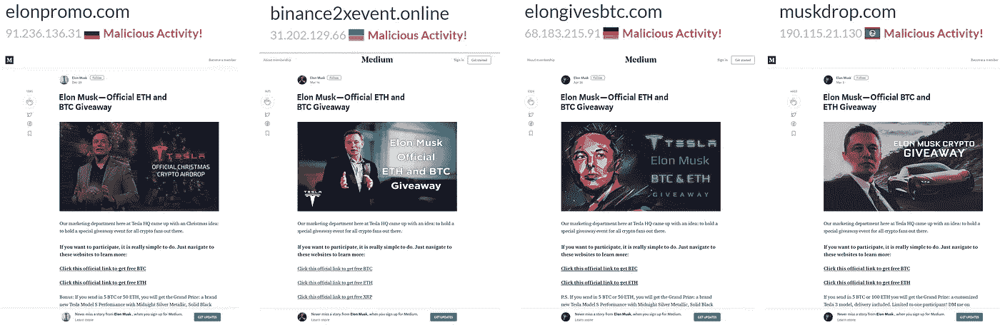
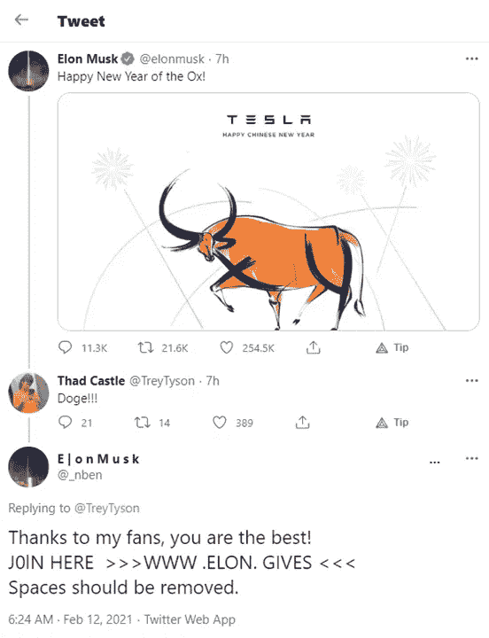
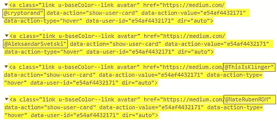
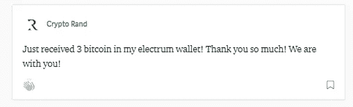
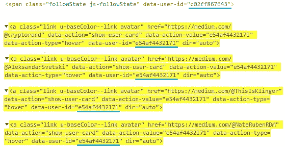
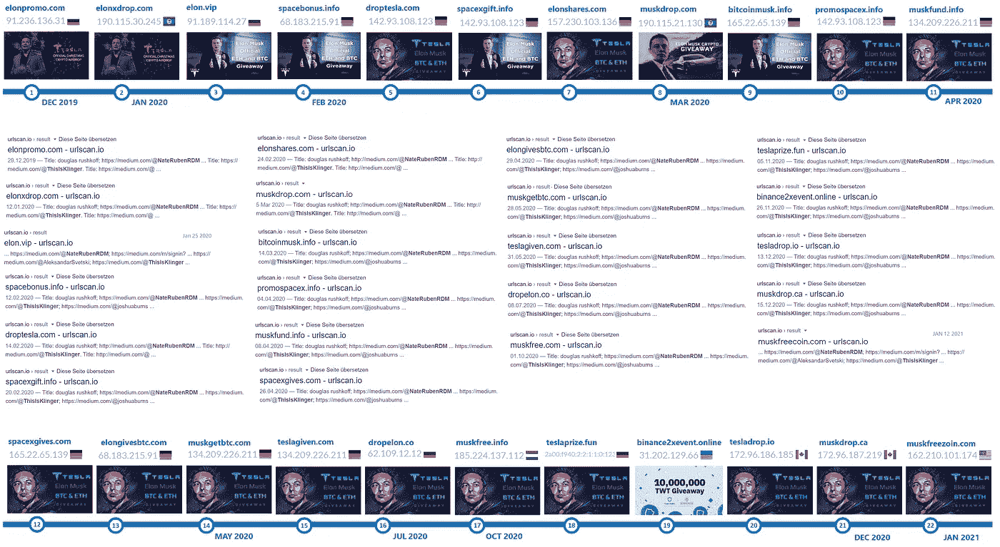
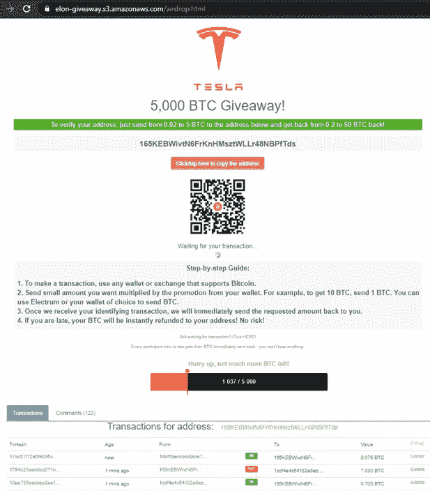

# 亲爱的媒体，比特币骗子第 23 次偷了你的网页

> 原文：<https://medium.com/coinmonks/dear-medium-bitcoin-scammers-stole-your-webpage-for-the-23rd-time-dad7cf78dfbb?source=collection_archive---------4----------------------->

## 骗子正在创建虚假的介质网页来欺骗比特币

Medium lookalike webpages used for Bitcoin Scams | Source: Screenshots from urlscan.io

# 怎么被骗？

农历新年到了。埃隆·马斯克(Elon Musk)在推特上发布了一张来自特斯拉的诙谐贺卡，用牛的粗体笔画出了特斯拉汽车的 *S3XY —* 型号名称。

一切看起来都很好，直到你向下滚动，发现几个冒充埃隆·马斯克的 Twitter 账户的无数评论。这些评论鼓励粉丝点击进入赠品网站。

该站点重定向到 Amazon Web Services (AWS)上的一个页面。

Left: Screenshot of Elon Musk’s Tweet with comments| Right: Screenshot of scam webpage

# 我在中等吗？

这个网页看起来很熟悉——顶部有一个中等大小的导航栏，一个引人入胜的图片作为故事的开始，哇，5326 次鼓掌。

为了显得真实，骗子复制了一个典型的媒体故事的结构，并注入诈骗信息，引诱网站访问者发送他们的比特币。

通过查看页面源代码，被盗故事的残余仍然存在，揭示了实际媒体用户的概况。

Source: Screenshot of page source from fake Medium webpage, showing Medium usernames

这些残余物可能会提供线索，以确定被剽窃的原始故事。

提到了以下几个媒体简介:[利兹·克林格](https://medium.com/u/edc1b3a66ee6?source=post_page-----dad7cf78dfbb--------------------------------)、 [Crypto Rand](https://medium.com/u/296e60376c9c?source=post_page-----dad7cf78dfbb--------------------------------) 和[内特·鲁本](https://medium.com/u/ef1638aaeae?source=post_page-----dad7cf78dfbb--------------------------------)。他们可能会对原故事发表评论或留下一些掌声。

Source: Screenshots of Medium profiles of [Liz Klinger](/@ThisIsKlinger/about), [Crypto Rand](/@cryptorand/about), and [Nate Ruben](/@NateRubenRDM/about)

骗子甚至厚颜无耻地使用 [Crypto Rand](https://medium.com/u/296e60376c9c?source=post_page-----dad7cf78dfbb--------------------------------) 的名字发布虚假的正面评论。

Source: Screenshot of scam webpage showing fake comment of Crypto Rand

被盗的 UI 源代码似乎还包含其他可能有助于识别骗子的 id(请参考下面截图中带蓝色下划线的 user-id)。希望熟悉 UI 代码的中型管理员能够发现更多线索。

Source: Screenshot of page source from fake Medium webpage, showing more user IDs

# 这普遍吗？

这不是骗子第一次抄袭 Medium UI 了。下面是一个由 [urlscan.io](https://urlscan.io/about/) 记录的诈骗网站列表，这是一个扫描、截图和分析潜在恶意网站的免费服务。

Source: Screenshot of Google search results and urlscan.io search results (non-exhaustive). Timeline representation by Author

从 2019 年 12 月开始，共记录了 22 个使用 Medium UI 代码的类似网站。这些网页的 IP 地址经常改变。

所有这些虚假的媒体页面都包含一个 URL，指向另一个包含骗子比特币地址的网页。

Source: Screenshot of scam webpage

这些页面被设计成看起来令人信服。也有被黑的 Youtube 频道推广这些诈骗网站。我在以前的一篇文章中对这些骗子的作案手法做过调查

 [## 精心策划的加密货币骗局

### The Verge 最近重访了“伟大的 Twitter 黑客”，在那里高调的 Twitter 账户被用来发布比特币…

medium.com](/coinmonks/an-elaborate-cryptocurrency-scam-82d2001704c4) 

调查内容包括:

*   观察 YouTube 频道的高收视率和用户数，因为它发生了
*   暴露用于在诈骗网站上欺骗交易的硬编码 JavaScript
*   在自由职业者网站上寻找相似的代码片段
*   追踪用于转移诈骗资金的比特币地址
*   揭露骗子利用网站复制器程序快速建立诈骗网站

# 不要指望这会停止

随着对比特币的兴趣持续增长，人们可以预计会在社交平台上看到更多的诈骗信息，以及更多的诈骗网页，专门捕食新的、不知情的投资者。

***参考文献***

[1]尼达尔·本对埃隆·马斯克推文的评论。推特。2021 年 2 月 12 日。【https://twitter.com/_nben/status/1359991813675876355 

[2]urlscan . io .[https://urlscan.io/about/](https://urlscan.io/about/)