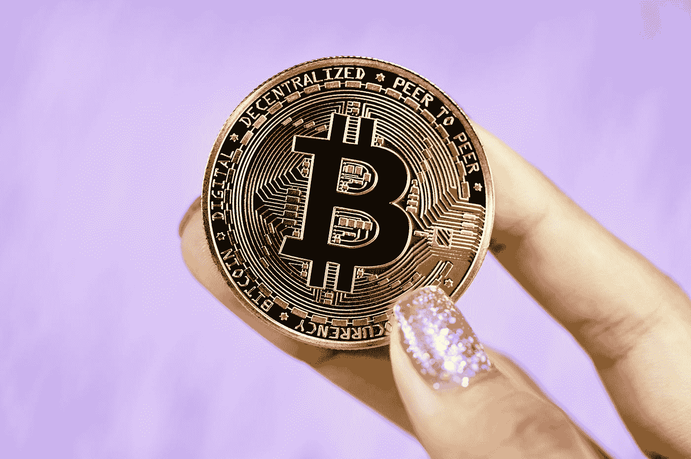

# 亲爱的千禧一代:做一个主人。为什么比特币是答案。

> 原文：<https://medium.com/coinmonks/dear-millennials-be-an-owner-why-bitcoin-is-the-answer-c6399e330d80?source=collection_archive---------7----------------------->

对于许多千禧一代来说，拥有住房似乎遥不可及，但比特币可以解决这个问题。

Photo by [Executium](https://unsplash.com/@executium?utm_source=medium&utm_medium=referral) on [Unsplash](https://unsplash.com?utm_source=medium&utm_medium=referral)

这不是秘密。

价格持续上涨，最近几年，一直在快速上涨。

食品价格上涨。

汽油，加满。

房租上涨。

通货膨胀是我们经济体系中固有的东西，随着生活费用和其他日常必需品的增加，通货膨胀的问题变得越来越明显。

# 但究竟什么是通货膨胀？

通货膨胀可以定义为价格的普遍上涨和货币购买力的下降。

但是，如果有另一种方式来看待通货膨胀呢？一种奖励富人的方式，惩罚穷人的方式。一种隐藏的系统，从穷人那里拿走，给富人。 ***一种只对所有者有利的制度。***

为什么

嗯，通货膨胀不仅仅是日常用品和生活费用的增加。它也影响 ***资产*** *的价格。*

在过去的五年里，纳斯达克综合指数已经增长了两倍多。

标准普尔 500 涨了一倍多。

如果你是股票所有者，你会激动不已。

根据《全球房地产指南》,纽约的平均房价在过去 5 年里上涨了 47.66%，在 10 年里上涨了 88.57%。

在我的家乡加拿大安大略省多伦多市，也有类似的情况——过去 5 年里上升了 44.96%，10 年里上升了 88.84%。

如果你是房地产的所有者，你会很激动。

# 但是如果你没有任何资产呢？

不拥有任何资产意味着不能参与如此巨大的资产增值。事实上，你现在发现自己的美元价值，以及你能用它购买的东西，包括资产，已经大幅贬值。正如亿万富翁投资者雷伊·达里奥所说:“现金是垃圾。”

如果你不是车主，你能做什么？如果买不起房产之类的资产？怎么才能出人头地？

你怎样才能积累财富？

# 积累财富的两个步骤是:

1.  **花的比赚的少**
2.  **获得并拥有资产**

我知道，我知道，说起来容易做起来难。

对许多千禧一代和新生代来说，拥有住房似乎越来越遥不可及。

今天在我居住的城市多伦多，普通的独立式住宅是*120 万美元。一般的 1 居室公寓是***【63.2 万美元*** 。即使利率处于历史最低点，购买和拥有一个家的想法似乎几乎是不可能的。没有大笔首付的帮助，拥有住房的梦想似乎遥不可及。*

*股票呢？*

*虽然你可能仍能在股市中找到一些价值，但道琼斯指数、纳斯达克指数和标准普尔 500 指数都处于或接近历史高点。TSX 也是如此，今年几次打破历史新高。然后是选择正确的股票的困难，那些具有巨大长期潜力和上升空间的股票。*

*换句话说，股票似乎存在泡沫，市场似乎被高估了。*

*如果你买不起房产，又在股市找不到价值，你还有什么其他选择？*

*还有什么方法可以让你成为 ***的拥有者？****

# *比特币:数字房地产*

*对我来说，答案从未如此清晰。 ***比特币*** ***是*** ***归属的方式。****

*比特币是一种稀缺的分散资产。这是数字稀缺的发明。只会有 2100 万个比特币被开采出来，其中一部分将永远消失，这个数字甚至会更小。*

*数字稀缺的概念对一些人来说可能很难理解。本质上，比特币是 ***数字黄金*** ，或者如 MicroStrategy CEO 迈克尔·塞勒(Michael Saylor)喜欢称之为——***数字房地产。****

*这是十年来表现最好的资产。年化收益 230%。*

*可以说，它的市值高达 1.25 万亿美元，现在已经大到不能倒了。相比之下，今天亚马逊的市值为 1.81 万亿美元，脸书的市值为 9320 亿美元。*

*尽管比特币的市值很大，但它仍有巨大的潜在上涨空间，因为一些分析师预计它最终会超过黄金的市值。*

*截至今日，黄金市值为 ***，11.6 万亿美元。****

*如今，比特币的价格约为*66，000 美元——如果它超过黄金的市值，将从这里上涨约 928%，这意味着比特币的价格为***【612，480 美元。*****

**这听起来可能是一个令人难以置信的数字，但著名投资者凯西·伍德(Cathie Wood)预测未来 5 年比特币将价值 50 万美元。北海巨妖首席执行官 Jesse Powell 预测比特币将达到 100 万美元，也有许多人看到了类似的预测。**

**比特币正处于主流采用的边缘，机构采用正在快速增长，特斯拉、Square 和 Paypal 等公司将比特币纳入其资产负债表。随着预计即将推出的比特币现货 ETF 的推出，这种机构采用可能会显著增加。**

**就在今年，萨尔瓦多宣布比特币为法定货币，萨尔瓦多拥有比特币钱包的人已经超过了传统银行账户。**

**换句话说， ***比特币就在这里待着*** ，而且只会越来越大。**

**因此，如果你觉得拥有住房的梦想遥不可及，你感到停滞不前，无法积累财富，因为生活成本吞噬了你每天薪水的一大部分。答案变得非常清楚。**

*****成为主人。*****

**如果你想积累财富:花的比赚的少，买比特币。**

**和任何投资工具一样，做你自己的研究和尽职调查。投资前了解风险，并咨询你的财务顾问。比特币目前接近历史高点，所以考虑你的切入点，随着时间的推移慢慢买入。**

> **加入 Coinmonks [电报频道](https://t.me/coincodecap)和 [Youtube 频道](https://www.youtube.com/c/coinmonks/videos)了解加密交易和投资**

## **另外，阅读**

*   **[CoinFLEX 评论](https://blog.coincodecap.com/coinflex-review) | [AEX 交易所评论](https://blog.coincodecap.com/aex-exchange-review) | [UPbit 评论](https://blog.coincodecap.com/upbit-review)**
*   **[AscendEx 保证金交易](https://blog.coincodecap.com/ascendex-margin-trading) | [Bitfinex 赌注](https://blog.coincodecap.com/bitfinex-staking) | [bitFlyer 审核](https://blog.coincodecap.com/bitflyer-review)**
*   **[Bitget 评论](https://blog.coincodecap.com/bitget-review) | [双子星 vs BlockFi](https://blog.coincodecap.com/gemini-vs-blockfi) | [OKEx 期货交易](https://blog.coincodecap.com/okex-futures-trading)**
*   **[AscendEx Staking](https://blog.coincodecap.com/ascendex-staking)|[Bot Ocean Review](https://blog.coincodecap.com/bot-ocean-review)|[最佳比特币钱包](https://blog.coincodecap.com/bitcoin-wallets-india)**
*   **[霍比审核](https://blog.coincodecap.com/huobi-review) | [OKEx 保证金交易](https://blog.coincodecap.com/okex-margin-trading) | [期货交易](https://blog.coincodecap.com/futures-trading)**
*   **[麻雀交换评论](https://blog.coincodecap.com/sparrow-exchange-review) | [纳什交换评论](https://blog.coincodecap.com/nash-exchange-review)**
*   **[美国最佳加密交易机器人](https://blog.coincodecap.com/crypto-trading-bots-in-the-us) | [经常性评论](https://blog.coincodecap.com/changelly-review)**
*   **[在印度利用加密套利赚取被动收入](https://blog.coincodecap.com/crypto-arbitrage-in-india)**
*   **[Godex.io 审核](/coinmonks/godex-io-review-7366086519fb) | [邀请审核](/coinmonks/invity-review-70f3030c0502) | [BitForex 审核](https://blog.coincodecap.com/bitforex-review)**
*   **[最佳比特币保证金交易](/coinmonks/bitcoin-margin-trading-exchange-bcbfcbf7b8e3) | [萝莉点评](/coinmonks/lolli-review-e6ddc7895ad8) | [比特币保证金交易](https://blog.coincodecap.com/bityard-margin-trading)**
*   **[创造并出售你的第一个 NFT](https://blog.coincodecap.com/create-nft) | [密码交易机器人](https://blog.coincodecap.com/best-crypto-trading-bots)**
*   **[如何在 CoinDCX 上购买柴犬(SHIB)币？](https://blog.coincodecap.com/buy-shiba-coindcx)**
*   **[折叠 App 回顾](https://blog.coincodecap.com/fold-app-review) | [LocalBitcoins 回顾](/coinmonks/localbitcoins-review-6cc001c6ed56) | [Bybit vs 币安](https://blog.coincodecap.com/bybit-binance-moonxbt)**
*   **[加密保证金交易交易所](/coinmonks/crypto-margin-trading-exchanges-428b1f7ad108) | [赚取比特币](/coinmonks/earn-bitcoin-6e8bd3c592d9) | [Mudrex 投资](https://blog.coincodecap.com/mudrex-invest-review-the-best-way-to-invest-in-crypto)**
*   **[WazirX vs coin dcx vs bit bns](/coinmonks/wazirx-vs-coindcx-vs-bitbns-149f4f19a2f1)|[block fi vs coin loan vs Nexo](/coinmonks/blockfi-vs-coinloan-vs-nexo-cb624635230d)**
*   **[杠杆代币](/coinmonks/leveraged-token-3f5257808b22) | [最佳密码交易所](/coinmonks/crypto-exchange-dd2f9d6f3769) | [Paxful 点评](/coinmonks/paxful-review-4daf2354ab70)**
*   **[加密套利](/coinmonks/crypto-arbitrage-guide-how-to-make-money-as-a-beginner-62bfe5c868f6)指南| [如何做空比特币](/coinmonks/how-to-short-bitcoin-568a2d0b4ae5)**
*   **[40 个最佳电报频道](https://blog.coincodecap.com/best-telegram-channels) | [1xBit 回顾](https://blog.coincodecap.com/1xbit-review)**
*   **[如何在印度购买以太坊？](https://blog.coincodecap.com/buy-ethereum-in-india) | [如何在币安购买比特币](https://blog.coincodecap.com/buy-bitcoin-binance)**
*   **[在美国如何使用 BitMEX？](https://blog.coincodecap.com/use-bitmex-in-usa) | [BitMEX 评论](https://blog.coincodecap.com/bitmex-review) | [买入索拉纳](https://blog.coincodecap.com/buy-solana)**
*   **[德国最佳加密交易所](https://blog.coincodecap.com/crypto-exchanges-in-germany) | [Arbitrum:第二层解决方案](https://blog.coincodecap.com/arbitrum)**