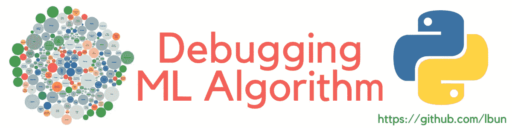

# 如何评价你的机器学习模型

> 原文：<https://medium.com/coinmonks/debugging-a-learning-algorithm-ef7c16936864?source=collection_archive---------3----------------------->

# 调试学习算法

Debugging a Machine Learning Algorithm

在我们将机器学习模型与数据拟合之后，我们应该做什么？显然，我们需要评估它，了解它是否有效，特别是在最后一种情况下，实施一些更改来改进它。

在这种情况下，我们需要调试我们的算法，但是从哪里开始呢？