# 揭穿一个秘密的浪漫骗局

> 原文：<https://medium.com/coinmonks/debunking-a-crypto-romance-scam-7dedc8be441e?source=collection_archive---------3----------------------->

自从印度教神话时代以来，欺骗一直是一种有效的方法，因为主毗湿奴的化身**莫希尼**在萨木德拉·曼坦期间，通过虚假的承诺引诱阿修罗在天神&阿修罗之间平等地提供不朽的甘露(你可以在这里读到它[)。](https://en.wikipedia.org/wiki/Samudra_manthan)

**扭曲因素** — **伪装报复**:斯瓦巴努，一个阿修罗人伪装成天神，坐在天神之中，以获得不朽的甘露。当他成功地喝下时，提婆立刻知道了，主毗瑟奴将他斩首。但由于长生不老，他的头和身体分开了——但仍然活着，因此形成了**拉胡** & **克图**(日蚀&月蚀)。如果有兴趣，你可以在这里[阅读](https://en.wikipedia.org/wiki/Ketu_(mythology))。

爱上一个“虚假”的网络角色是当今最大的挑战之一，尤其是如果这个账户很有吸引力，而且“如果”这个人最近获得了你的信任，并成功地在你的好书中找到了一席之地。

这是“爱情骗局”的开始，也叫“**钓鱼**”。

**Lord Vishnu’s Mohini Avatar with Nectar of Immortality | Source: Vedicfeed.com**

Catfishing 是骗子使用的一种欺骗性技术，他们通过创建虚假的社交网络个人资料来引诱受害者建立浪漫关系，并通过从经济上欺骗受害者来获利。

在本文中，我们将**揭露一个实时加密骗局**和**详细解释浪漫骗局**。

## **第一章—** 揭穿**密码交换**

这一切都始于各种金融论坛上一个名为 OBEX/OAEX(疑似中国实体)的加密交易所获得的可疑牵引力，该交易所于 2020 年 11 月 11 日注册(用于诈骗活动)。

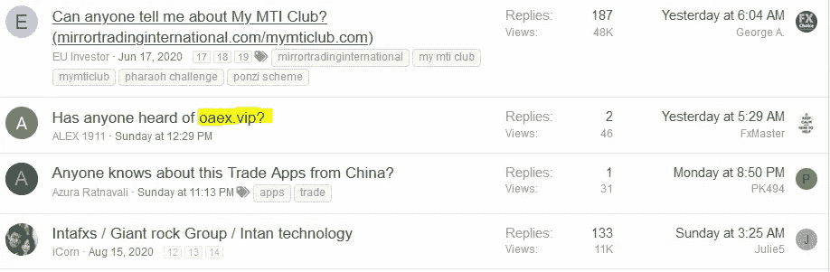

Seeking the Genuineness of OAEX

让我们一起探索 **OBEX/OAEX** ！

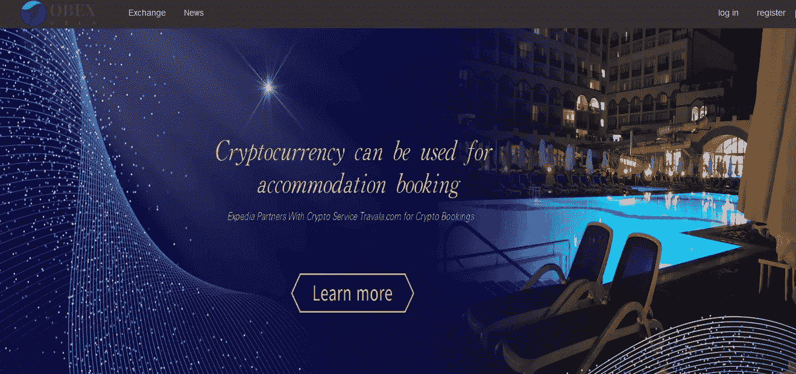

**Landing Page of OBEX**

登陆页面上展示的盛况也是一种欺骗公众的诱人方法，因为许多餐馆和其他服务机构开始在加密友好国家接受加密货币。此外，随着埃隆·马斯克**发推特**和特斯拉**宣布接受在 Crypto** 中为其电动汽车付款后比特币的飙升，也将 Crypto 划入了一项永久投资计划。

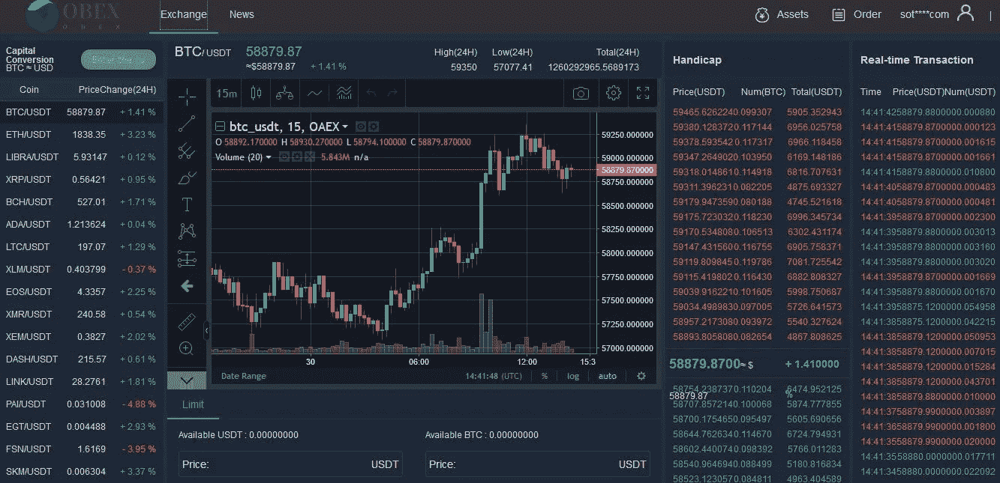

**Live Market Updates**

当登录时，就像任何其他交易所一样，它显示各种加密货币的实时图表，也方便用户根据市场趋势比较各种加密货币的价格值。

通过参考各种投诉论坛，发现:**一旦资金被添加并进行交易，客户的资金将被锁定，并将使人受到欺诈。**

这是一位顾客的文字记录

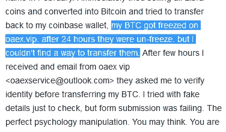

**Complaint Transcript**

> **注意**:我们将再次&详细讨论上面的图片

在对所谓的网站进行深入调查时，一个**的浪漫骗局**被揭开了。

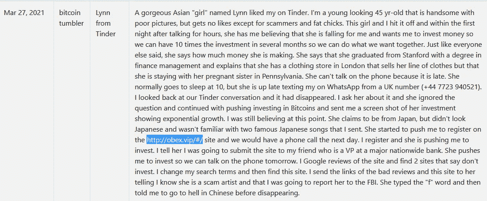

**Complaint raised by a victim against OBEX**

从上面的投诉来看，很明显这个人是通过交友应用被诈骗的。

在回顾了上面的评论之后，我开始回顾与 OBEX/OAEX 相关的其他类似评论。因此，骗子(或集团)的作案手法如下

> 使用流行的约会网站，如 Tinder、Bumble 或 OKCupid
> 主要使用英国号码聊天，该网站在和记 3G 注册(**+447882210129**&**+44 7723 940521**用于 Whatsapp)
> 自称亚洲人-日本人、新加坡人，但原籍是中国人
> 在 2 周-1 个月的时间范围内(与受害者)建立密切联系
> 要求在 OBEX/中投资资金

现在，让我们仔细检查从可怜的网络爱好者那里骗取的比特币数量…

这是**浪漫骗子**维护的主要比特币地址，用来向受害者(情人)勒索比特币:

**3 deqs 87 zautlkbypyhb 2k 55 JV 7 ys 6 i2fg**

勒索金额在 18 天内计为 17，093.76 美元(律师):-

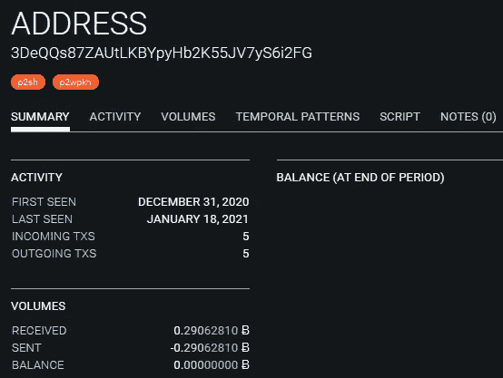

**Wallet Activity Log: 1**

从上面的交易历史可以清楚的看到，骗子正在**主动将勒索的钱导流到另一个硬件钱包地址**。

由于所有交易都以数字形式记录在区块链中，因此相对容易映射与该地址相关联的频繁比特币钱包地址。

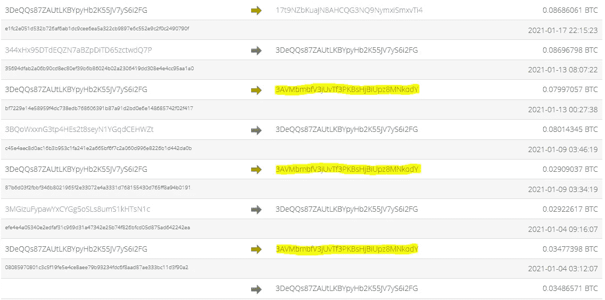

**Bitcoin Transaction History**

从这个交易历史，我们可以假设**3 avbmbfv 3 juvtf 3 kbshjbuipz 8 mnkody**是骗子的冷钱包(2 个中的一个)之一。还有你在上面看到的那个地址，我们将再次访问那个地址。

现在，如果我们缩小这个地址的范围——我们发现这个钱包在两个月内积聚了**61939.85**美元(ATTOW)！

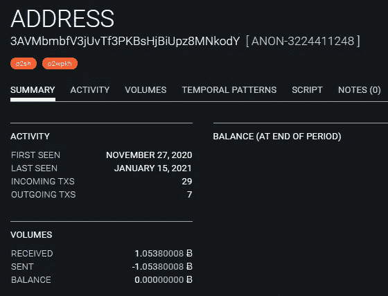

**Cold Wallet Activity Log: 1**

***注*** *:这个过程一直持续到没有新的交易分支，到达一个死胡同* ***或*** *任何交易都与比特币基地或币安这样的密码交换主钱包合并。*

让我们关注一下钱包地址，从**3 deq QS 87 zautlkbypyhb 2k 55 JV 7 ys 6 I2 fg**中只记录了 1 笔交易

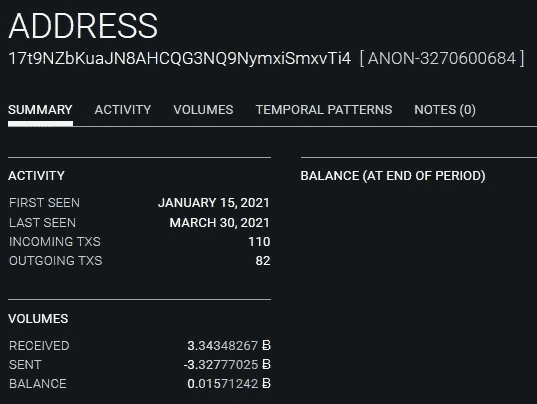

**Cold Wallet Activity Log: 2**

**仔细观察可以看到冷钱包活动日志:1 已经记录了 2021 年 1 月 15 日的最后一笔交易。同一天，冷钱包活动日志:2(见上)形成，并导致将全部金额转移到这个新钱包。**

现在，让我们深入挖掘一下:这些主要钱包的资金流向了谁。

> **3 avbmbfv 3 juvtf 3 pkbshjbuipz 8 mnkody**下降到**1 mfudjvaqu 9 STB 1 ye 77 SDO 4 QFD 5 z 33 dhdu**(一个火币钱包)
> 
> **17t 9 nzbkuajn 8 ahcqg 3 NQ 9 nymmxismxvti 4**降至**1 ndyjtntjmwk 5 pnhjgamu 4 hdhigtobu 1s**(币安热钱包)

值得注意的是**1 mfudjvaqu 9 STB 1 ye 77 SDO 4 QFD 5 z 33 dhdu**自 2018 年 3 月以来有余额**126，513.73 美元，**活跃。因此，这些比特币钱包持有者与浪漫骗子有直接联系。

> 结合**1 mfudjvaqu 9 STB 1 ye 77 SDO 4 QFD 5 z 33 dhdu**&**17t 9 nzbkuajn 8 ahc qg3 NQ 9 nymmxismxvti 4**，得出的金额为**3，23，145.52 美元**(考虑到其他分支机构被合并，一些钱包被倒入这两个钱包而被冲掉)

现在，是时候描绘出威胁因素了。基于 2 个因素，我们可以假设该集团(OBEX/OAEX)来自中国。以下是两个因素:-

1.  检查元素时在 OBEX 中检测到 Mandrian(默认值)。

**判断浏览器是 pc 端和移动端,并跳转到不同页面 (**Determine whether the browser is PC or mobile, and jump to a different page)

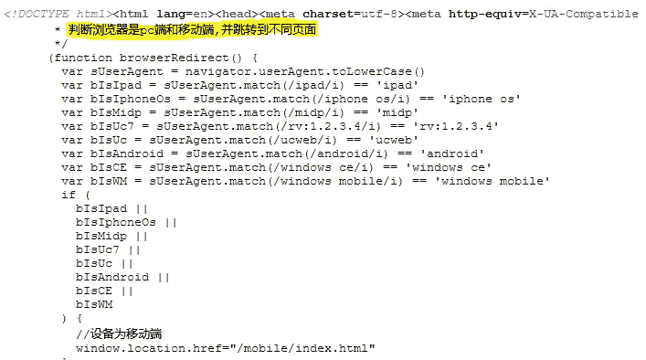

**OBEX/OAEX Source Inspection**

2.根据一名用户的投诉，注意到该女孩在与受害者分手前最终说了 Mandrian 语。

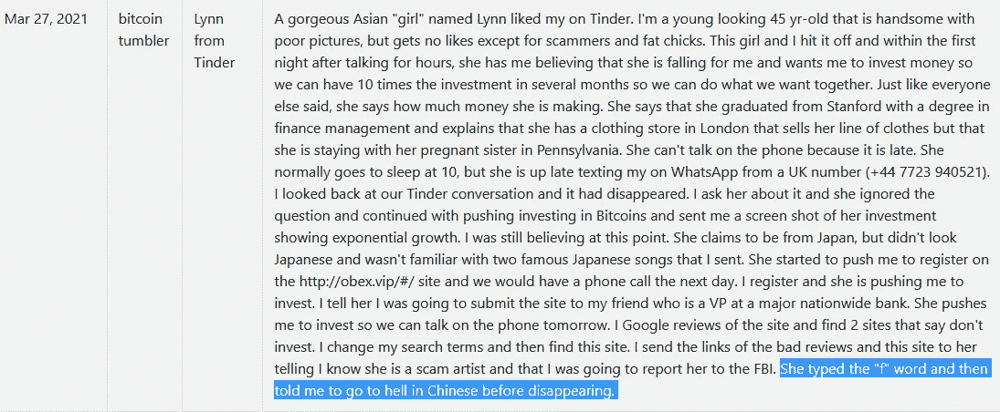

**User Review where victim’s hint is highlighted**

这两个因素不仅足以断定一个中国群体的存在，而且目前也足以得出一个粗略的估计。

## 像罪犯一样思考——关于 OBEX/OAEX 的广泛假设

> 许多人同时被诈骗，因此可能会形成一个诈骗集团
> 女孩被雇用，并通过诈骗人们发挥专业作用
> 订阅临时英国号码，通过 Whatsapp 与受害者沟通
> 他们可以采用相似的人口统计数据，如蒙古，新加坡，马来西亚，日本，越南，菲律宾，泰国，但来自中国(由于相似的面部特征)
> 只针对说英语的国家， 由于语言障碍，欧盟不容易接近
> 只针对加密友好的国家，在这些国家加密货币没有被禁止
> 通常针对中年人——单身或鳏夫
> 支持脸书加密项目**天秤座**——纯粹为了膨胀和紧缩

## **最后一章——详述爱情骗局**

浪漫骗局已经存在了几年，但与前几年相比，成功率相对较低。然而，随着约会网站的突然涌入和疫情的封锁，有利于浪漫骗局的领域开花结果。

> 根据美国联邦贸易委员会联邦贸易委员会的数据，据估计，2019 年受害者在美国损失了 2.01 亿美元。
> 
> 据英国广播公司报道，2020 年，6800 万英镑因爱情诈骗而流失。

在短时间内在网上浪漫骗局中损失如此巨大的金额，在缺乏经验的用户中引发了紧张情绪。最终，是时候让人们充实自己的知识来发现害群之马了。这一令人心痛的统计数据呼应了网民保持警惕，让自己意识到社交网站或约会渠道中的网络诈骗。

## **让我们深入挖掘一下爱情骗子的作案手法**

骗子使用 **2 种方法**获得在线身份——要么**模仿准确的个人资料**(但为了防止地理位置标签而改变位置)，要么**利用从各种来源(如公共 Instagram 个人资料或 VK 或 FB 等社交网站)获得的个人真实照片创建一个伪身份**。

有时，骗子通过叠加受害者的图像来使用伪造的身份证明，如护照或驾驶执照，作为一种防御手段，以避免被真实的护照号码识破。

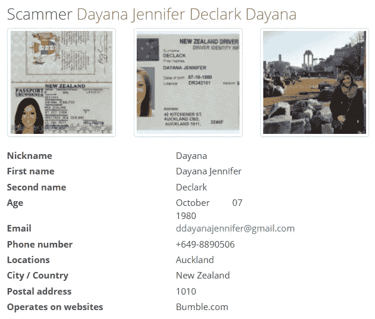

**Profile used by Scammer for Romance Scam| Source: datingscams.cc**

> **注意**:骗子使用的图片与图片中的真人没有任何真实联系。这绝对是用于诈骗的目的。

在获得一个身份后，骗子的目标主要是在 Bumble、OKCupid 或 Tinder 等流行约会应用上找到的中老年人。他们可能会右键点击他们订阅源上的每一个个人资料。

针对老年人的理由:因为他们知道大多数老年人(单身或丧偶)在退休后会得到一笔可观的遣散费，或者会获得国家老年公民补助。

**瞄准中年人的原因:**一些中年人在约会应用中不会得到完美的匹配。因此，他们会带着沮丧的心情去寻找更好的另一半。但这些都是还在服役的，有月收入优势的。

**自我介绍信息**将是一个现成的模板，在不同的网站上以不同的在线角色分发！！！

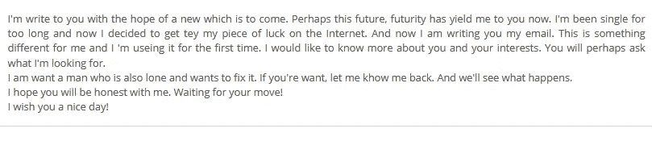

**Self-Intro Message**

一旦建立了连接…

**建立信任:这是罗密欧/朱丽叶解释他们灾难性的过去生活/关系或任何无助情况的初始阶段，以触发受害者的情感因素，从而获得受害者的同情。这个阶段从 1 周至 3 周的窗口期持续。**

****需要帮助，但没关系**:在这一阶段，受害者提到任何需要事先完成的重要任务，如护照更新、家中医院急救、弟弟/妹妹的教育基金、国家边境紧张局势等。这里最需要注意的是:**骗子会强调他们的无助，以激活受害者的“帮助心理”，这不会引起对骗子的任何怀疑。****

****乱世佳人**:这是骗子在他们的愿望清单中点击“游戏结束”标签的最后阶段。一旦钱被转移，骗子的电话号码/数字存在将消失，不会有任何先前存在的迹象。然而，这些电子邮件 id 将是功能性的(在某种程度上——除非它是一个一次性帐户)。一些聪明的工人甚至在被勒索后通过给出任何理由来保持与受害者的联系，因为这将有助于他们慢慢逃离。**

**现在，让我们来看看以下骗子行为**

> **拒绝视频通话
> 拒绝音频通话——可能给出静音
> 等理由要求受害者身份(DL &护照)以交换骗子的伪造文件(用于未来受害)
> **超额支付诈骗**:骗子将金额转移到受害者的账户(从被黑/被买的银行账户。在暗网上)并要求向不同的账户还款。
> 收到付款后阻止受害者**

**上述两个案例研究展示了不同的地理区域(亚洲和俄罗斯)，但我们确信这不是一个孤立的方法，它只在少数人口统计中出现。**

**随着约会网站不断涌现新的方法/想法，这也为骗子创造了足够的空间来牟取暴利。**

**因此，数字素养的采用是这个数字时代的号角，因为更多被诈骗的机会可以被成功阻止。**

> ****想象一下，上面的案例研究就是那些被举报/被终结的案例。在这一系列的浪漫骗局中，可能还有一条长长的链条有待解开。****

**如果你被一个浪漫的骗子骗了，没有必要感到羞愧，因为这些都是精心制定的计划，不能 100%怪你。**

****挺身而出，匿名举报骗局。****

> ***关注我的*[*Twitter*](https://twitter.com/RakeshKrish12/)*获取有趣的 DarkWeb/InfoSec 简短发现！；——)***
> 
> *****注:-* 文章纯属个人研究，未经作者同意，不得在任何地方使用/发表。****

> **加入 coin monks[Telegram group](https://t.me/joinchat/EPmjKpNYwRMsBI4p)学习加密交易和投资**

## **另外，阅读**

*   **[什么是融资融券交易](https://blog.coincodecap.com/margin-trading)**
*   **最好的[密码交易机器人](/coinmonks/crypto-trading-bot-c2ffce8acb2a) | [网格交易](https://blog.coincodecap.com/grid-trading)**
*   **[3 商业评论](/coinmonks/3commas-review-an-excellent-crypto-trading-bot-2020-1313a58bec92) | [Pionex 评论](/coinmonks/pionex-review-exchange-with-crypto-trading-bot-1e459d0191ea) | [Coinrule 评论](/coinmonks/coinrule-review-2021-a-beginner-friendly-crypto-trading-bot-daf0504848ba)**
*   **[AAX 交易所评论](/coinmonks/aax-exchange-review-2021-67c5ea09330c) | [德里比特评论](/coinmonks/deribit-review-options-fees-apis-and-testnet-2ca16c4bbdb2) | [FTX 交易所评论](/coinmonks/ftx-crypto-exchange-review-53664ac1198f)**
*   **[n ave 零点回顾](/coinmonks/ngrave-zero-review-c465cf8307fc) | [Phemex 回顾](/coinmonks/phemex-review-4cfba0b49e28) | [PrimeXBT 回顾](/coinmonks/primexbt-review-88e0815be858)**
*   **[Bybit Exchange 审查](/coinmonks/bybit-exchange-review-dbd570019b71) | [Bityard 审查](/coinmonks/bityard-review-7d104239be35) | [CoinSpot 审查](https://blog.coincodecap.com/coinspot-review)**
*   **[3 commas vs crypto hopper](/coinmonks/3commas-vs-pionex-vs-cryptohopper-best-crypto-bot-6a98d2baa203)|[赚取加密利息](/coinmonks/earn-crypto-interest-b10b810fdda3)**
*   **最好的比特币[硬件钱包](/coinmonks/the-best-cryptocurrency-hardware-wallets-of-2020-e28b1c124069?source=friends_link&sk=324dd9ff8556ab578d71e7ad7658ad7c) | [BitBox02 回顾](/coinmonks/bitbox02-review-your-swiss-bitcoin-hardware-wallet-c36c88fff29)**
*   **[总帐 vs n 平均](/coinmonks/ledger-vs-ngrave-zero-7e40f0c1d694) | [总帐 nano s vs x](/coinmonks/ledger-nano-s-vs-x-battery-hardware-price-storage-59a6663fe3b0)**
*   **[密码本交易平台](/coinmonks/top-10-crypto-copy-trading-platforms-for-beginners-d0c37c7d698c)**
*   **[CoinLoan 评论](/coinmonks/coinloan-review-18128b9badc4) | [YouHodler 评论](/coinmonks/youhodler-4-easy-ways-to-make-money-98969b9689f2) | [BlockFi 评论](/coinmonks/blockfi-review-53096053c097)**
*   **最好的[加密税务软件](/coinmonks/best-crypto-tax-tool-for-my-money-72d4b430816b) | [硬币追踪评论](/coinmonks/cointracking-review-a-reliable-cryptocurrency-tax-software-5114e3eb5737)**
*   **最佳[加密借贷平台](/coinmonks/top-5-crypto-lending-platforms-in-2020-that-you-need-to-know-a1b675cec3fa) | [杠杆令牌](/coinmonks/leveraged-token-3f5257808b22)**
*   **[block fi vs Celsius](/coinmonks/blockfi-vs-celsius-vs-hodlnaut-8a1cc8c26630)|[Hodlnaut 审查](/coinmonks/hodlnaut-review-best-way-to-hodl-is-to-earn-interest-on-your-bitcoin-6658a8c19edf)**
*   **[Bitsgap 审查](/coinmonks/bitsgap-review-a-crypto-trading-bot-that-makes-easy-money-a5d88a336df2) | [Quadency 审查](/coinmonks/quadency-review-a-crypto-trading-automation-platform-3068eaa374e1) | [Bitbns 审查](/coinmonks/bitbns-review-38256a07e161)**
*   **[埃利帕尔泰坦评论](/coinmonks/ellipal-titan-review-85e9071dd029) | [赛克斯斯通评论](/coinmonks/secux-stone-hardware-wallet-review-15-discount-coupon-2020-7577032faa6e)**
*   **[本地比特币评论](/coinmonks/localbitcoins-review-6cc001c6ed56) | [加密货币储蓄账户](https://blog.coincodecap.com/cryptocurrency-savings-accounts)**
*   **最佳[区块链分析](https://bitquery.io/blog/best-blockchain-analysis-tools-and-software)工具| [赚比特币](/coinmonks/earn-bitcoin-6e8bd3c592d9)**
*   **[加密套利](/coinmonks/crypto-arbitrage-guide-how-to-make-money-as-a-beginner-62bfe5c868f6)指南| [如何做空比特币](/coinmonks/how-to-short-bitcoin-568a2d0b4ae5)**
*   **最佳[加密制图工具](/coinmonks/what-are-the-best-charting-platforms-for-cryptocurrency-trading-85aade584d80) | [最佳加密交易所](/coinmonks/crypto-exchange-dd2f9d6f3769)**
*   **[如何在印度购买比特币？](/coinmonks/buy-bitcoin-in-india-feb50ddfef94) | [瓦济克斯评论](/coinmonks/wazirx-review-5c811b074f5b)**
*   **[印度比特币交易所](/coinmonks/bitcoin-exchange-in-india-7f1fe79715c9) | [比特币储蓄账户](/coinmonks/bitcoin-savings-account-e65b13f92451)**
*   **[CoinDCX 评论](/coinmonks/coindcx-review-8444db3621a2) | [加密保证金交易交易所](https://blog.coincodecap.com/crypto-margin-trading-exchanges)**

> **[直接在您的收件箱中获得最佳软件交易](/coinmonks/newsletters/coinmonks)**

****