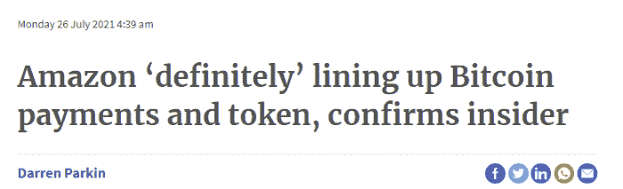
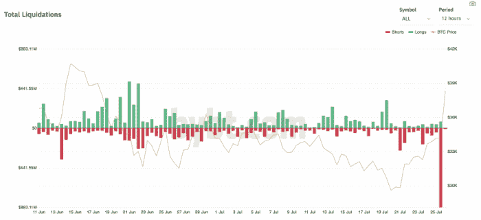
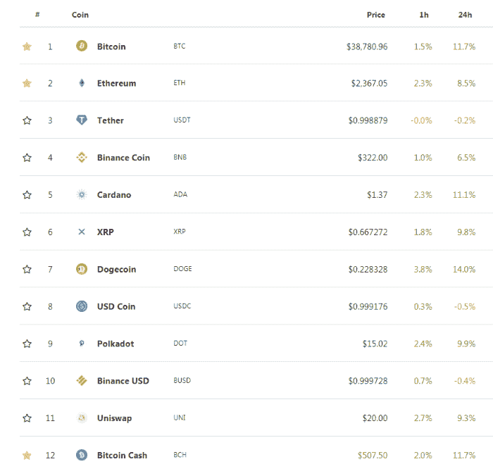

# 揭穿亚马逊比特币谣言

> 原文：<https://medium.com/coinmonks/debunking-the-amazon-rumor-fc05333583bd?source=collection_archive---------1----------------------->

亚马逊谣言出现后，市场再次增长，但这一谣言似乎也没有实质性的事实支持。如果在接下来的几天里没有新的有效信息，那么它将不会帮助市场，甚至在短期内也不会。

去年，加密行业的可靠消息来源宣布，PayPal 距离其在线应用和服务采用加密货币还有几个月的时间。这些谣言是在与 PayPal 高管讨论已知的加密货币个人后出现的。

PayPal 的谣言不仅仅是一个谣言，但主要是 PayPal 增加 BTC、比特币现金、以太坊和莱特币作为支付选项的预先公告。

同时，我们昨天读到的这个谣言有许多危险信号，我们不能忽视。一名匿名女性线人，据推测来自亚马逊高层，刚刚碰巧与英国一家不相关的报纸讨论了亚马逊集成加密货币的顶级计划。

事实上，除了亚马逊正在创建自己的数字货币，可能类似于今天加密货币的一些功能之外，这份由“Citi a.m .”报纸发表的报告没有任何可信之处。

# 谣言是如何开始流传的

加密新闻昨天开始传播亚马逊正在接受比特币的信息。

尽管谣言本身不仅提到了 BTC，还包含了比特币现金、以太坊和卡尔达诺，一些被加密媒体报道不足的东西。

*来源:* [*花旗*](https://www.cityam.com/amazon-definitely-lining-up-bitcoin-payments-and-token-confirms-insider/)

> 她补充道:“以太坊、卡尔达诺和比特币现金将是下一批，然后他们将推出八种最受欢迎的加密货币。”

*来源:* [*花旗上午*](https://www.cityam.com/amazon-definitely-lining-up-bitcoin-payments-and-token-confirms-insider/)

可以看到前两个危险信号:

*   **这个标题中的“肯定”一词给我们的暗示是，这个“知情人”并没有实际的知识，而只是推测。**
*   ****“证实”二字。**之前没有关于亚马逊的传言。谣言的确认出现在我们第一次有谣言流传之后。在这篇文章出现之前，谣言是不存在的。**

****

# **谣言就是这样传播的**

**亚马逊在其网站上发布了一个区块链专家的空缺，该专家将接管亚马逊数字货币创建的产品管理。([来源](https://www.amazon.jobs/en/jobs/1644513/digital-currency-and-blockchain-product-lead))**

> ****支付接受&体验团队正在寻找一位经验丰富的产品负责人，以制定亚马逊的数字货币和区块链战略和产品路线图。****
> 
> **亚马逊**

**在阅读了亚马逊的广告后，结论是亚马逊正在为其将在其私人区块链上运行的数字货币寻找产品经理。**

**我们掌握的事实只是来自这个亚马逊广告，并没有提到在亚马逊生态系统中引入其他加密货币。它将只是“亚马逊硬币”而不是别的。**

**广告本身不会“推动”市场，所以一个不可信的谣言必须出现，并在加密媒体中循环使用。**

## **市场对谣言的反应**

**亚马逊之前也发布过与加密货币相关的广告([来源](https://cryptobriefing.com/amazon-wants-hire-someone-with-experience-defi/))，但这并没有改变市场，之前也没有出现采用加密货币的传言。**

**它需要在一份没人听说过的可疑报纸上的匿名线人来创造一个“泵”。**

**同样有趣的是，这条消息在网上传播后，近 9 亿美元的空头在几分钟内被清算。**

****

***图片来源:* [*块加密*](https://www.theblockcrypto.com/linked/112437/crypto-short-liquidation-bitcoin-btc-39000?utm_source=cryptopanic&utm_medium=rss)**

**亚马逊的谣言尽管成真的可能性很小，但它成功地将价格推高了很多，平仓了空头，并创造了一种看涨的情绪。**

**事实是，不仅仅是上述加密货币像逻辑假设的那样上涨，所有东西都开始上涨。**

**多格科恩、波尔卡多特、XRP 或尤尼斯瓦普在这份报纸的名单上吗？没有，但他们仍然在上升，就像这个谣言会对他们有任何影响。**

**谣言是关于 **BTC** 、**以太坊**、**比特币现金**、**卡达诺**。没有提到任何其他加密货币，但这发生了:**

****

**Source: CoinGecko**

**Dogecoin 是所有加密货币中表现最好的，我们观察到今天所有加密货币都在上涨。**

****

# **结论**

> **这位内部人士解释道:“当所有这些密码鸭排成一列时，还有另一个转折让事情变得更有利于亚马逊——一个本地令牌。”..**

***来源:* [*花旗上午*](https://www.cityam.com/amazon-definitely-lining-up-bitcoin-payments-and-token-confirms-insider/)**

**关于亚马逊数字货币，正如许多人所预期的那样，与加密货币唯一相似的地方将是“区块链”这个词。它将是亚马逊控制下的中央集权货币。**

**亚马逊硬币被广泛认为是一种稳定的硬币。亚马逊可能会试图创造另一个“天秤座”，这也将遇到同样的监管阻力，不允许脸书继续其计划。**

*   ****亚马逊关于采用加密技术的传言****

**考虑到关于亚马逊接受加密的谣言，似乎有一些不良构造的谣言在一些可疑的加密新闻网站上传播，但从提供的信息来看，没有任何迹象表明亚马逊可以采用加密货币。([来源](https://cryptobriefing.com/amazon-hiring-blockchain-and-digital-currency-leader/))。猜测处于最低点，这些谣言是没有说服力的，除非一个内部人士将投下收养炸弹。**

**一位匿名内部人士不知从哪里冒出来，一份来自不可靠来源的报告引发了市场“暴涨”。一切看起来都是这样的。**

**我对这种谣言持保留态度，除非在接下来的几周内有来自可靠来源的内部消息严重泄露。**

**虽然我们都希望看到亚马逊采用加密货币，但这个谣言看起来像是编造的。**

**到目前为止，我们所目睹的只是一个虚构的内部人士，告诉我们“肯定”亚马逊正在寻求接受加密货币。**

****

****参考文献:****

*   **[亚马逊空缺职位](https://www.amazon.jobs/en/jobs/1644513/digital-currency-and-blockchain-product-lead)**
*   **[城市上午篇](https://www.cityam.com/amazon-definitely-lining-up-bitcoin-payments-and-token-confirms-insider/)**

****图像:****

*   ***导语图片来自:*[*Flickr*](https://www.flickr.com/photos/topgold/8325104250)*by*[*伯纳德·哥德巴赫*](https://www.flickr.com/photos/topgold/) *(* [*知识共享许可*](https://creativecommons.org/licenses/by/2.0/) *)***

*****激活于:*****

***●* [*念。现金*](https://read.cash/@Pantera) *●* [*噪音。现金*](https://noise.cash/u/Pantera99) *●* [*备忘录。现金*](https://memo.cash/profile/16QQohWB3U9PC9kwCNasPorwYKmZ5oNYeE) *●* [*中型*](/@panterabch) *●* [*蜂巢*](https://hive.blog/@pantera1)*●*[*Steemit*](https://steemit.com/@pantera1)*●*[*声乐*](https://vocal.media/authors/pantera) *●* [*头脑*](https://www.minds.com/pantera99/)**

***●* [*推特*](https://twitter.com/Panterabch)*●*[*LinkedIn*](https://www.linkedin.com/in/panterabch/)*●*[*Reddit*](https://www.reddit.com/user/PanteraBCH)**

***原发布于*[*https://read . cash*](https://read.cash/@Pantera/debunking-the-rumor-that-amazon-is-planning-to-accept-crypto-dd873ffa)*。***

## **另外，阅读**

** [## 2021 年 17 款最佳加密交易机器人(免费和付费)

### 2021 年币安、比特币基地、库币和其他密码交易所的最佳密码交易机器人。四进制，位间隙…

medium.com](/coinmonks/crypto-trading-bot-c2ffce8acb2a)  [## 最佳 6 个加密交易信号电报通道

### 这是乏味的找到正确的加密交易信号提供商。因此，在本文中，我们将讨论最好的…

medium.com](/coinmonks/best-crypto-signals-telegram-5785cdbc4b2b)  [## BlockFi 评论 2021:利弊和利率

### 今天，我们提出了一个全面的 BlockFi 评论，这是一个成立于 2017 年的加密贷款平台，拥有其…

blog.coincodecap.com](https://blog.coincodecap.com/blockfi-review)  [## 加密税务软件——五大最佳比特币税务计算器[2021]

### 不管你是刚接触加密还是已经在这个领域呆了一段时间，你都需要交税。

medium.com](/coinmonks/best-crypto-tax-tool-for-my-money-72d4b430816b)  [## Pionex 评论 2021 |免费加密交易机器人和交换

### Pionex 是为交易自动化提供工具的后起之秀。Pionex 上提供了 9 个加密交易机器人…

medium.com](/coinmonks/pionex-review-exchange-with-crypto-trading-bot-1e459d0191ea)  [## 存储比特币的最佳加密硬件钱包[2021]

### 保管您的数字资产很容易，但找到正确的存储方式却是一项繁琐的任务。在线钱包有一个风险…

blog.coincodecap.com](https://blog.coincodecap.com/best-hardware-wallet-bitcoin)**