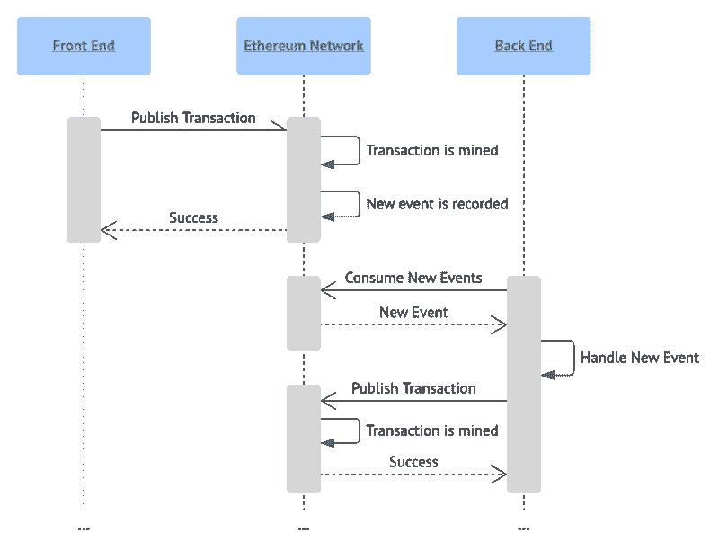
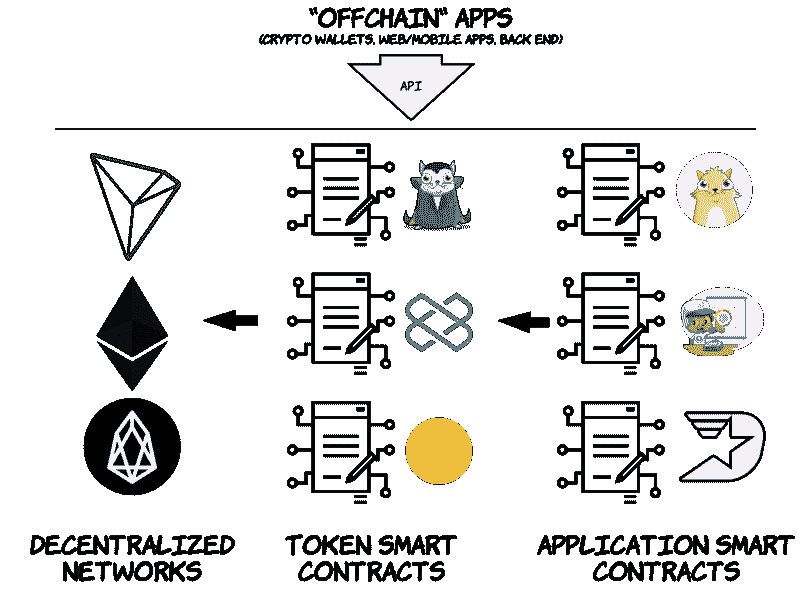

# 分散式应用程序—异构区块链

> 原文：<https://medium.com/coinmonks/decentralised-applications-heterogeneous-blockchains-4bbebb0b6eeb?source=collection_archive---------3----------------------->

## 支持分散式应用程序通过智能合约与不同的区块链进行交互

## 异质与混合区块链

异构区块链系统可以是同一协议的一个许可区块链和另一个非许可，以提供互操作性和安全数据共享以及一些访问控制。然而，混合系统将意味着拥有两个不同的区块链平台，如比特币区块链和以太坊区块链，它们采用不同的协议。

区块链可分为公共、财团和私人三类。

## 公共区块链。

世界上的任何人都可以读取、向有效用户发送交易，并可以参与共识过程。

## 财团(许可)区块链。

这是一个受控的区块链，允许预定义的节点执行某些任务。它也可以被认为是一个半分散或部分分散的网络，因为预先定义的节点改变了交易过程。

## 私有区块链。

在功能上类似于区块链财团，它是一个集中的区块链，具有对整个链中的事务的访问控制的中央权限，可以添加、删除或修改任何事务中的数据。它还可以有预定义的节点，对创建事务有限制。私有区块链的主要功能是操作数据库或其他用于敏感数据的私有应用程序。

区块链技术的分散性质和智能合同的存在是可以用来创建安全、灵活和更可靠的新型数据共享和访问系统的两个主要特征。

## **分散应用(DApps)**

DApps 运行在区块链网络上，没有任何中央权威，就像分散的客户-服务器模型。

An example flow of server’s reaction to the user’s action in the decentralized network[by [**Nikita Savchenko**](https://www.freecodecamp.org/news/author/zitro/)]

DApps 使用智能合约来与区块链网络相关联，并使用分布式协议(例如 Swarm 或 IPFS)托管在分散式存储上。DApps 的后端代码运行在一个分散的 P2P 网络上。它们更加灵活、透明、分散、有弹性。例如，与传统应用程序相反，DApps 能够将值存储在自己内部。DApps 的另一个优势是**信任服务不会被关闭，这与以前在线服务被中断的许多情况相反。**

根据业务流程和要处理的数据的性质，开发人员可以确定和选择运行 DApp 的区块链网络类型。他们可以在单个区块链网络的智能合约之上构建整个应用程序的业务逻辑(就像 [CryptoKitties](https://www.cryptokitties.co/) 所做的那样)，或者，他们可以利用异构的区块链，通过允许访问事务来实现对其服务器的部分控制。

Smart Contracts running on top of [Decentralised](https://www.freecodecamp.org/news/how-to-design-a-secure-backend-for-your-decentralized-application-9541b5d8bddb/) Blockchain Networks

然而，最好的方法被认为是在中间的某个地方。因此，利用异构区块链系统将为敏感数据带来透明性和安全性，并支持对其他业务逻辑的访问控制。

> 加入 [Coinmonks 电报频道](https://t.me/coincodecap)，了解加密交易和投资

## 另外，阅读

*   [尤霍德勒 vs 科恩洛安 vs 霍德诺特](/coinmonks/youhodler-vs-coinloan-vs-hodlnaut-b1050acde55a) | [Cryptohopper vs 哈斯博特](https://blog.coincodecap.com/cryptohopper-vs-haasbot)
*   [币安 vs 北海巨妖](https://blog.coincodecap.com/binance-vs-kraken) | [美元成本平均交易机器人](https://blog.coincodecap.com/pionex-dca-bot)
*   [如何在印度购买比特币？](/coinmonks/buy-bitcoin-in-india-feb50ddfef94) | [WazirX 审核](/coinmonks/wazirx-review-5c811b074f5b) | [BitMEX 审核](https://blog.coincodecap.com/bitmex-review)
*   [比特币主根](https://blog.coincodecap.com/bitcoin-taproot) | [Bitso 评论](https://blog.coincodecap.com/bitso-review) | [排名前 6 的比特币信用卡](/coinmonks/bitcoin-credit-card-bc8ab6f377c6)
*   [双子座 vs 比特币基地](https://blog.coincodecap.com/gemini-vs-coinbase) | [比特币基地 vs 北海巨妖](https://blog.coincodecap.com/kraken-vs-coinbase) | [硬币罐 vs 硬币点](https://blog.coincodecap.com/coinspot-vs-coinjar)
*   [印度密码交易所](/coinmonks/bitcoin-exchange-in-india-7f1fe79715c9) | [比特币储蓄账户](/coinmonks/bitcoin-savings-account-e65b13f92451) | [Paxful 审核](/coinmonks/paxful-review-4daf2354ab70)
*   [杠杆令牌](/coinmonks/leveraged-token-3f5257808b22) | [最佳密码交易所](/coinmonks/crypto-exchange-dd2f9d6f3769) | [密码交易机器人](https://blog.coincodecap.com/best-crypto-trading-bots)
*   [Godex.io 审核](/coinmonks/godex-io-review-7366086519fb) | [邀请审核](/coinmonks/invity-review-70f3030c0502) | [BitForex 审核](/coinmonks/bitforex-review-c4bb28d9e271) | [HitBTC 审核](/coinmonks/hitbtc-review-c5143c5d53c2)
*   [Crypto.com 费用](/coinmonks/binance-fees-8588ec17965) | [僵尸密码审查](/coinmonks/botcrypto-review-2021-build-your-own-trading-bot-coincodecap-6b8332d736c7) | [替代品](https://blog.coincodecap.com/crypto-com-alternatives)
*   [MXC 交易所评论](/coinmonks/mxc-exchange-review-3af0ec1cba8c) | [Pionex vs 币安](https://blog.coincodecap.com/pionex-vs-binance) | [Pionex 套利机器人](https://blog.coincodecap.com/pionex-arbitrage-bot)
*   [我的密码交易经验](/coinmonks/my-experience-with-crypto-copy-trading-d6feb2ce3ac5) | [比特币基地评论](/coinmonks/coinbase-review-6ef4e0f56064)
*   [加密货币储蓄账户](/coinmonks/cryptocurrency-savings-accounts-be3bc0feffbf) | [赌注加密](https://blog.coincodecap.com/staking-crypto) | [窃取 x 评论](/coinmonks/stealthex-review-396c67309988)
*   [BigONE 交易所评论](/coinmonks/bigone-exchange-review-64705d85a1d4) | [CEX。IO 审查](https://blog.coincodecap.com/cex-io-review) | [交换区审查](/coinmonks/swapzone-review-crypto-exchange-data-aggregator-e0ad78e55ed7)
*   [最佳比特币保证金交易](/coinmonks/bitcoin-margin-trading-exchange-bcbfcbf7b8e3) | [比特币保证金交易](https://blog.coincodecap.com/bityard-margin-trading) | [Prokey 审核](/coinmonks/prokey-review-26611173c13c)
*   [加密保证金交易交易所](/coinmonks/crypto-margin-trading-exchanges-428b1f7ad108) | [赚取比特币](/coinmonks/earn-bitcoin-6e8bd3c592d9) | [Mudrex 投资](https://blog.coincodecap.com/mudrex-invest-review-the-best-way-to-invest-in-crypto)
*   [WazirX vs CoinDCX vs bit bns](/coinmonks/wazirx-vs-coindcx-vs-bitbns-149f4f19a2f1)|[block fi vs coin loan vs Nexo](/coinmonks/blockfi-vs-coinloan-vs-nexo-cb624635230d)
*   [BlockFi 信用卡](https://blog.coincodecap.com/blockfi-credit-card) | [如何在币安购买比特币](https://blog.coincodecap.com/buy-bitcoin-binance)
*   [加密复制交易平台](/coinmonks/top-10-crypto-copy-trading-platforms-for-beginners-d0c37c7d698c) | [五大 BlockFi 替代品](https://blog.coincodecap.com/blockfi-alternatives)
*   [CoinLoan 点评](/coinmonks/coinloan-review-18128b9badc4)|[Crypto.com 点评](/coinmonks/crypto-com-review-f143dca1f74c) | [火币保证金交易](/coinmonks/huobi-margin-trading-b3b06cdc1519)
*   [顶级付费加密货币和区块链课程](https://blog.coincodecap.com/blockchain-courses) | [币安评论](/coinmonks/binance-review-ee10d3bf3b6e)
*   [在美国如何使用 BitMEX？](https://blog.coincodecap.com/use-bitmex-in-usa) | [BitMEX 回顾](https://blog.coincodecap.com/bitmex-review) | [币安 vs Bittrex](https://blog.coincodecap.com/binance-vs-bittrex)
*   [最佳免费加密信号](https://blog.coincodecap.com/free-crypto-signals) | [YoBit 评论](/coinmonks/yobit-review-175464162c62) | [Bitbns 评论](/coinmonks/bitbns-review-38256a07e161)
*   [OKEx 回顾](/coinmonks/okex-review-6b369304110f) | [Kucoin 交易机器人](/coinmonks/kucoin-trading-bot-automate-your-trades-8cf0ca2138e0) | [期货交易机器人](/coinmonks/futures-trading-bots-5a282ccee3f5)
*   [比特币基地赌注](https://blog.coincodecap.com/coinbase-staking) | [热点评论](/coinmonks/hotbit-review-cd5bec41dafb) | [库币评论](https://blog.coincodecap.com/kucoin-review)
*   [最佳加密交易信号电报](/coinmonks/best-crypto-signals-telegram-5785cdbc4b2b) | [MoonXBT 评论](/coinmonks/moonxbt-review-6e4ab26d037)
*   [Coinswitch 俱吠罗评论](/coinmonks/coinswitch-kuber-review-1a8dc5c7a739) | [电网交易机器人](https://blog.coincodecap.com/grid-trading) | [比特币基地费用](/coinmonks/coinbase-fees-831e77d4f2c5)