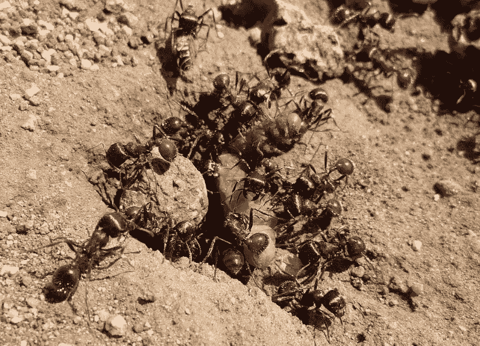
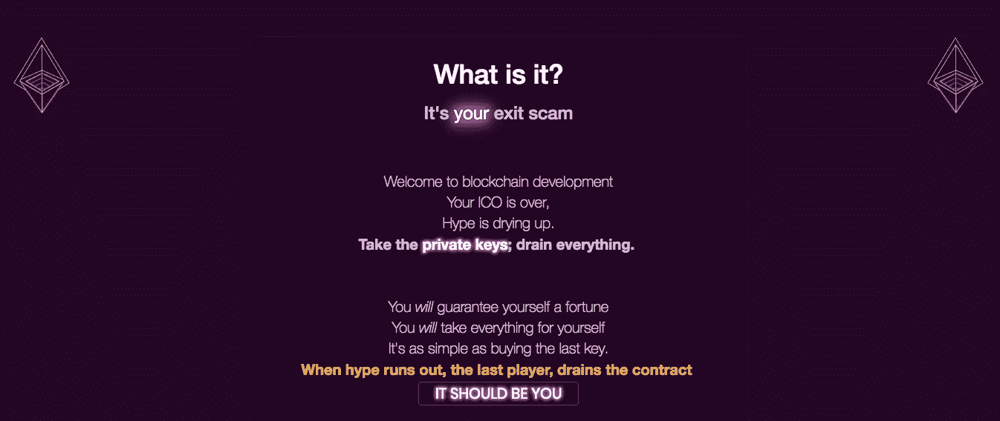

# 分散自治合作社(DAC)和新“公地”的兴起

> 原文：<https://medium.com/coinmonks/decentralised-autonomous-co-operatives-dac-and-the-rise-of-the-new-commons-721f5e1a7d3?source=collection_archive---------2----------------------->

资本主义正在消亡。我说的资本主义是指一群法人实体，他们的目标是争夺资源，为股东“最大化利润”。

资本主义正在消亡，因为新的数字“公共领域”正在活跃起来。资源稀缺是信息时代的神话。我们有丰富的数字资源，丰富的数字资源创造了共享的公共资源。

说它已经成为我的一个困扰是一种保守的说法。

TL/DR。

*第一个分权自治合作社(DAC)的创建将从零开始。一粒种子。*

他们将内置激励性的去中心化机制，他们将控制新的数字“公共资源”，为集体利益而编码。

这将是我们移交给机器和真正的道(分散自治组织)出现之前的最后一步。

# **什么是“公地”**

The Hulunbuir Grasslands in Inner Mongolia. An archetypal traditional commons.

> “公共资源是社会所有成员都可以利用的文化和自然资源，包括空气、水和可居住的地球等自然资源。这些资源是共有的，不是私有的。公共资源也可以理解为一群人(社区、用户组)为了个人和集体利益而管理的自然资源。从特征上看，这涉及治理机制所采用的各种非正式规范和价值观(社会实践)”。

*来源:维基百科*

“公地”是为了所有人的利益。

然而，如果作为人类，我们已经向自己表明，我们无法为所有人的集体利益管理我们的资源，会发生什么？

我个人认为，这就是我们已经达到的目标。我不是在指责任何一个人或事，但事实上，我们发明的资本主义帮助我们加速走向这一点。

“公地悲剧”是真实的，我们已经在很大程度上表明我们无法控制它。我们只是太局限，太偏颇，太贪婪。

# 新“公地”的兴起

因此，如果有更好的方法，如果我们暂停现实，做白日梦，新的数字共享会是什么样子？

首先，不会有所谓的“寻求”分权。在没有人为干预的情况下，新的公地会自然地朝着去中心化的方向发展。它们将被设计成这样。

Red Harvester ant colonies operate self perpetuating decentralised commons “all without being directed by a central controller or even another ant” Source: Wikipedia

他们可能需要被引导/重击到那里，这将需要在合作社的建设中仔细考虑，我将在后面讨论。

如果他们被“引导”到那里，那么可能会有受益者或“引导手”以公众为代价获利，讽刺的是，这再现了我们经常寻求/努力推翻的东西，即财富分配不均。

拆东墙补西墙，把所有的钱都给保罗……或者更糟，创造更多的“新”钱给我，而不是给保罗，也不会给我们带来公平的财富再分配。

在别人控制的新轨道上重新发明我们已经拥有的东西并不是创造一个新的范例，它只是给我们当前的范例涂上一层不同的颜色。

# 新范式

创造行为反馈和治理循环，保护和激励人们与新的公共资源互动，反过来，新的公共资源本来就是为了公平再分配和保护那些有需要的人而构建的。

***即新社会企业。这就是新的公共领域。***

然而，公众并不关心“利润”它关心的是把“价值”还给那些照顾它的人和那些“值得”得到它的人。公地将取代政府的社会责任。

我相信杰夫·贝索斯将会作为最后一位伟大的实业家而为人所知，他非常接近，也许只有一代人的时间，有可能创造一个伟大的公地。[“你的利润就是我的机会”](https://www.inc.com/jessica-stillman/7-jeff-bezos-quotes-that-will-make-you-rethink-success.html)是新公地的号召、工作方式。

不同之处在于，利润，也就是应该被认为是“价值的增加”，将会流回那些与公共资源互动最多、发展公共资源、保护公共资源的人，以及(如果我们理解正确的话)那些最需要它的人。

此外，具有讽刺意味的是，这将侵蚀或完全消除“创始人奖励”或对基金会的需求，事实上，应该这样做。因为创始人并不比大众更重要，如果基金会能有效地运行自己，它就不需要运行什么。

尽管一定会有一部分价值流向这些创造者，这或许是正确的，尤其是在即将到来的合作社时代，但这种分配不会像过去 500 年那样不均衡。如果不均匀，它将被分叉并再次分叉，直到保持最佳平衡。

哦，仅供参考…公共不需要自己的令牌… ffs。

具有讽刺意味的是，风险资本家将很快开始资助，或者已经开始资助那些最终会让他们破产的实体。不仅仅是他们的业务，很多我们认为是最佳的实体都将被淘汰。一开始很慢，然后很快，速度会很惊人。即公司。

# 激励驱动所有行为

[PoWH3D/FOMO3D](https://exitscam.me/) 的出现，已经显示了人类激励的力量。在他们的案例中，它出色地展示了人类的贪婪。为这支队伍喝彩。这是一个重大突破。可以说，他们创造了第一个数字共享空间。

然而，他们创造的公地放大了可怕的行为，只会进一步扭曲财富分配。如果这不是一个骗局，我不认为这是，这将是世界上有史以来最大的彩票。精神错乱，不受任何监管和政府控制。令人惊叹的优雅和辉煌。

FOMO3D, courtesy of [https://exitscam.me/shakedown](https://exitscam.me/shakedown) 😂 (pure genius)

然而，也发挥了我们最坏的特质。它创造了一个黑洞，侵蚀价值，不公平回报，不为其社区提供服务。只是需要。

他们在自己的网站上说得最好，“我们只是惩罚每个人。”

然而，如果我们不“简单地惩罚所有人”呢如果我们回报呢？如果我们公平回报呢？如果这样做实际上对每个人都有好处呢？如果除了那样做别无选择呢？如果仅仅通过这样做，我们就自动分散了控制，会怎么样呢？

我相信我们现在可能会看到合作社的出现。优化调整和激励以实现名义增长。完全有动力去分散权力。最后一步，在我们移交给道的，我相信将由机器运行，为我们所有人的利益。

但在此之前，我们要进行实验和改进。

# 这场革命不会被电视转播

Random people holding a plant. I desperately wanted a decent photo to illustrate a co-operative.. and this is as good as it got. You get the idea… 🧐

他们将从种子开始，很可能是色情或赌博(因为那总是开始的地方😂 🧐 ).

[**而且看起来会像玩具**](http://cdixon.org/2010/01/03/the-next-big-thing-will-start-out-looking-like-a-toy/) **。**

**并且会涉及到** [**不可替换令牌**](https://avc.com/2018/05/video-of-the-week-dieter-shirley-and-non-fungible-tokens/) **。**

**这将涉及自治治理系统。**

**而且它会有内在的激励机制来触发网络效应。**

**并且会有** [**粘合曲线**](/@simondlr/tokens-2-0-curved-token-bonding-in-curation-markets-1764a2e0bee5) **。**

**而且它会有** [**上链的‘红利’支付**](https://twitter.com/lwsnbaker/status/1020177049674059776) **s，或者我们常说的 UBI。(实际上，他们将无法区分彼此，两个名字都没有意义。)**

**并会雇佣** [**【哈伯格税】**](/@simondlr/what-is-harberger-tax-where-does-the-blockchain-fit-in-1329046922c6) **和征款进行保护。**

从这个词最纯粹的意义上来说，它将建立联邦。但这不会是政治。我们会克服这一点。

> 英联邦是一个传统的英语术语，指为共同利益而建立的政治团体。来源:维基百科

这将会发生。我无法相信。

也非常非常可能的是，这些小种子将需要由人类来引导；然而，成功的合作社将被设计成“指导之手”像父母推着孩子骑自行车，然后让他们第一次自己骑自行车一样离开。

那些人会赢，而不是那些试图保持控制的人。

crypto 1.1 的“仁慈的独裁者”模式这次不会起作用了。

They might need a bit of help…

然而，真正的大战可能会在那时发生。当我们试图将这些 DAC 移交给 DAO 时，但这是另一个时间的另一个主题。

我们必须非常仔细地考虑如何设计这些 DAC 来保护我们自己。

我们是非常有限的存在。不久前从树上掉下来的不太聪明的猴子。

我一直是一个相当激进的资本家，直到最近几天我才意识到，这最终是因为我不相信有更好的方式可以大规模运作。

我现在知道了。

非常感谢 [*劳森·贝克*](/@lwsnbaker) *和* [*西蒙·德拉鲁维尔*](/@simondlr) *为他们的投入/编辑…(更感谢他们没有说我完全疯了)*