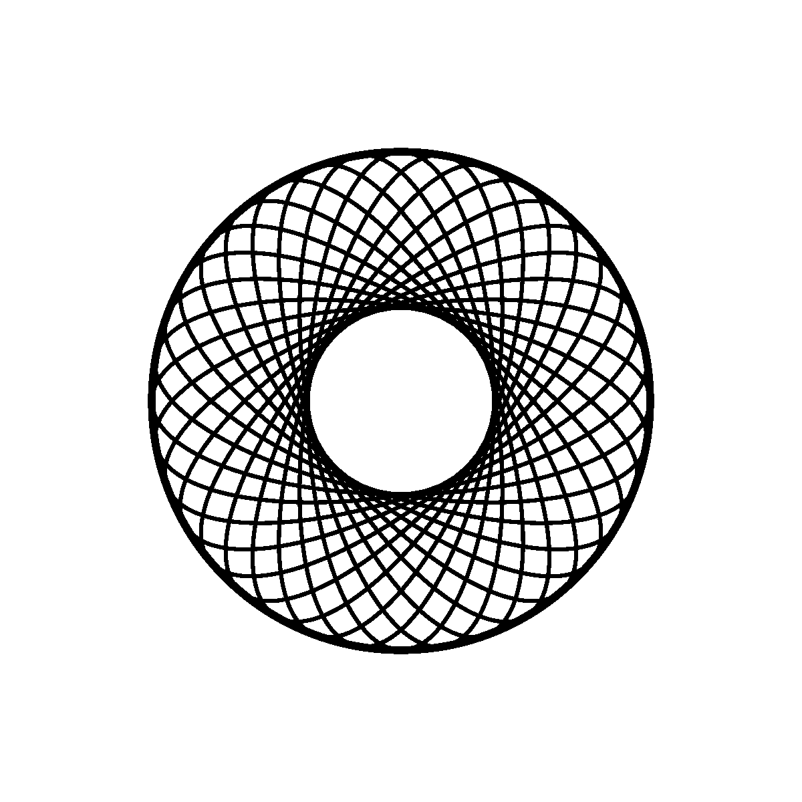
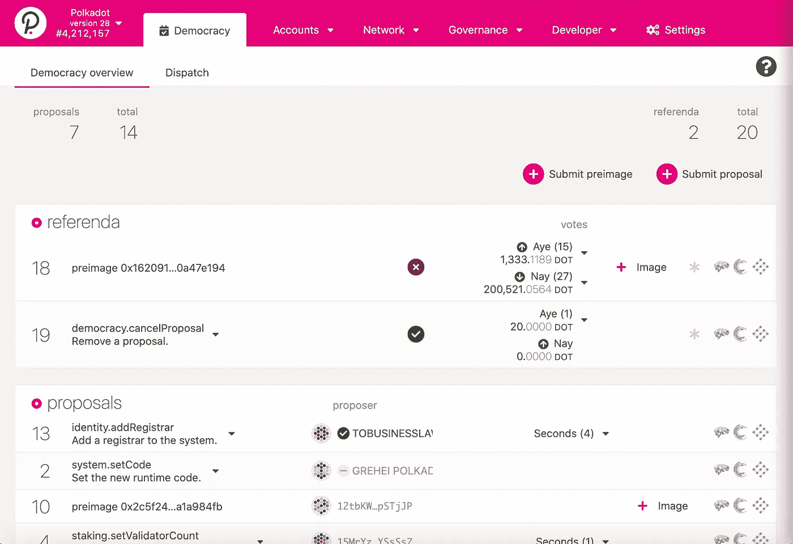

# 分权政府(DGov):我们如何建立新的系统来实现集体权力？

> 原文：<https://medium.com/coinmonks/decentralised-government-how-to-build-new-systems-that-enable-collective-power-390dd02d25e7?source=collection_archive---------0----------------------->

## 我们现在有什么工具来建立去中心化的治理体系？有哪些他们在行动的例子？我们如何构思和建造它们？

现在，在 2021 年，可用于建立具有民主“链上”治理能力的去中心化系统的工具是非常真实、非常棒的，并且在实践中有效地工作(这里有一个[例子](https://polkadot.js.org/apps/?rpc=wss%3A%2F%2Fmainnet4.edgewa.re#/explorer))。社区正在就使用投票、理事会、全民公决和财政提案决策做出决定。他们以分散的方式自我管理，民主是他们价值观和技术的基础。

## 道斯

您可以相对快速地建立一个分布式自治组织(DAO)。道是一个依靠区块链生存的不可阻挡的组织。你可以使用部署在以太坊的[阿拉贡](http://aragon.org)的智能合约。目前(2021 年初)的问题是，由于 Eth 昂贵的天然气费用，运营该组织的成本很高。

## “Gov 乐高”开发

我们已经建立了一个小社区，致力于创建关注治理的可互操作的区块链，在线或离线社区可以设计他们自己的模块化治理和财政系统。

# **DGov:基于 web3.0 的不可阻挡的组织**

**让我们简单谈谈 Web3.0 与 Web2.0 的区别，以及 DGovs 与 DApps 的区别。**

## **什么是 DGov？**

它们是人们能够以完全分散的方式组织起来的方式。没有一个潜在的中央权威可以让他们信任，或者让他们关门大吉。没有炸弹，也没有经济杀手能扰乱它。决定建立 DGov 的社区可以按照他们想要的方式组织起来。他们可以根据自己的原则和价值观设计自己的经济激励和治理体系。他们还可以通过成员委员会、提案、投票和公投对系统进行动态的更改和更新，他们可以按照自己的意愿设计这些系统。也许有些社区希望每年选举一次议会，而其他社区则希望每周选举一次。dgov 们可以和其他 dgov 们联合起来组成一个联盟。

## **什么技术支持 DGov？**

*   分散化的区块链互联网形成了一个新的信任网络，被称为“Web 3.0”，这使得 D-Gov 能够工作。
*   Web 2.0 是我们今天使用的互联网版本，就像脸书、谷歌、亚马逊一样，本质上是技术封建专制，是中央集权和独裁的，你必须信任他们的数据。
*   Web 3.0 是一个新的去中心化的 p2p 互联网，由一个可互操作的区块链网络支撑——没有中央权威和权力结构——在那里，不是亚马逊建立在其上，而是你有去中心化的网站和应用程序(或 DApps)建立在其上。这一层允许新形式的分散组织发生，并具有一定程度的系统完整性和鲁棒性。
*   DApp 的一个例子是“去中心化的 YouTube ”,在那里审查是民主决定的，而不是由独裁者决定的。
*   区块链对于分散存储和信息交流(以及类似合同的机制)很重要，即使是在一大群敌对的参与者之间。
*   但最重要的是，人们形成的叙事以及他们的价值观和心态的“社会技术”是最重要的东西，它赋予事物意义，并允许健康和连贯的有机体形成。

## DApps 与 DGovs 有何不同？

*   DApps 是以太坊社区创造的，用来定义什么项目和用例可以在以太坊网络上构建。它们是去中心化的应用。
*   DApps 和 D-gov 的主要区别在于组织者背后的叙述和意图。
*   政府官员特别考虑他们希望如何民主地组织和自治以实施他们的政策。
*   [DApps](https://blog.coincodecap.com/what-are-dapps-an-ultimate-guide) 可能专注于特定的用例，如视频、消息或文件共享。DApps 也可以有类似的治理机制。
*   DGov 更有可能成为 web 3.0 基础设施的基础层的一部分。DApps 或“DOrgs”通常会建在它们的上面。

## **DGov 的例子:**

*   一个在线社区，希望创建自己的“虚拟国家”，经济和财政治理。
*   一个厌倦了像亚马逊这样的 Web2.0 公司的工人的联盟，他们希望扩大重组和自治。
*   加泰罗尼亚合作社希望自治并形成自己的管理和经济。
*   而不是像英国工党那样的影子政府。您有一个“影子”系统，它是通过 DGov 实现的。人们可以通过在新系统中付出努力来为新的 DGov 投票，而不是在旧的(被操纵的)系统中投票给红色或蓝色。

DGov 是更小的分散的集体、组织和社团的基础设施，也可以建立在其上。DGovs 有一个更大的财政部，可以向其生态系统中较小的 DOrg 项目提供资金和赠款。

## **多个 DGov 的联合，形成一个更大的委员会**

*   影子工党 D-Gov 系统可以是一个由地方议会组成的联盟，以决定更大的政策。

2021 年的 DGov 与 2005 年左右的网站相似。仍然很早，但还没有早到难以建造的地步。

在不久的将来，DGovs 将只是一个“政府”，我们将能够生活在一个具有民主基础而不是民主外表的系统中。

我们在 Rust 中使用 [Substrate](https://substrate.dev) 区块链编程框架，这里有一些社区使用自我治理(使用 Substrate)来管理规模和价值不断增长的生态系统的例子:

*   [波尔卡多特:](https://polkadot.js.org/apps/?rpc=wss%3A%2F%2Frpc.polkadot.io#/democracy)由以太坊前创始人加文·伍德创立。该团队实施并迭代了运转良好的去中心化民主，管理着一个价值约 300 亿美元的生态系统。他们正在努力构建去中心化的 Web 3.0。

Referenda, proposals, voting, members, council and a treasury built on a decentralised network. Polkadot.

*   [草间弥生](https://polkadot.js.org/apps/?rpc=wss%3A%2F%2Fkusama-rpc.polkadot.io#/democracy):类似于波尔卡多特，但是他们正在研究的技术更具实验性。它们的经济规模约为 20 亿美元。
*   Edgeware :第一批作为副链连接到 Polkadot 中继网络的项目之一。

所有这些，以及其他多个，都在链上治理下运行，所有的决策都是民主制定的。例如，社区提出项目建议，系统中的基础货币有一个必须用于项目的金库。他们自己的中央银行和主权财富基金，在那里资金被民主地投资在社区认为重要的事情上。

我们希望通过目前的政府系统实施的政策是一项重要的工作。但是如果我们能在一个平行的分散系统中实现它们呢？

我们可以播下种子，实现我们的地方议会联盟的愿景，以我们想要的方式实施经济和货币政策。我们可以从微观世界的实验开始，但是随着网络效应，可以发展到具有本地/区域范围/洲范围/世界范围影响的规模。

**现状:**测试并设置第一个 DGov 实验“DGov1”。支持欢迎并鼓励[给我发邮件](mailto:ramseyajram@me.com)

## **下一步…**

*   请通过[电子邮件](http://ramseyajram@me.com)表达您的兴趣，或加入我们的[矩阵室](https://matrix.to/#/!ZnOnSfFIGPlpSMQNXt:matrix.org?via=matrix.org)！
*   发展开发者、参与者和社会活动家的社区。
*   路线图开发
*   授权勘探。
*   为想在测试网络中启动第一个 D-Gov 区块链节点的人设置易于使用的 readme。

## 想法、问题和…？

请陈述你的兴趣！

我希望这能引起共鸣，我期待着进一步讨论。

祝一切顺利，

拉姆齐·阿吉姆

> *去中心化创始人:为人类构建全新的去中心化解决方案。*
> 
> 我对分散式解决方案非常感兴趣，所以我是一名系统架构师和开发人员。我对越来越多的社区感兴趣，这些社区旨在建立平行系统，与当前旨在维持停滞不前的权力等级制度的中央系统相抗衡(并将最终瓦解)。