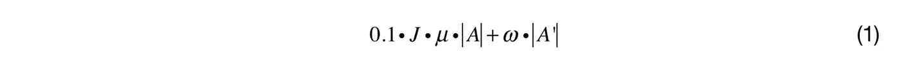
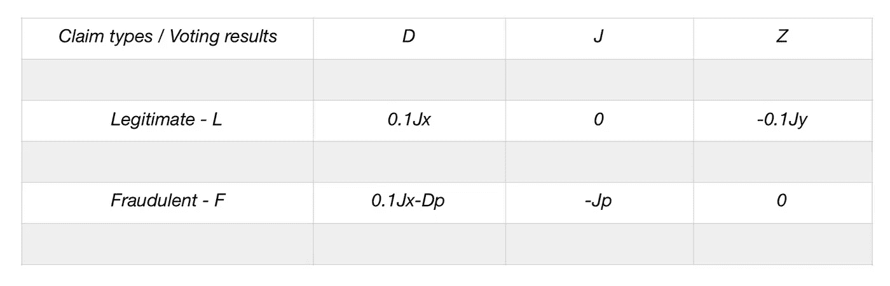
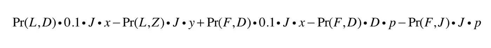
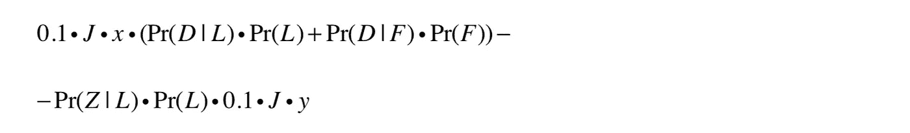
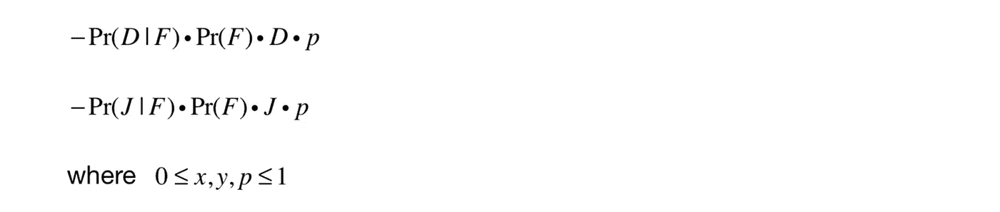
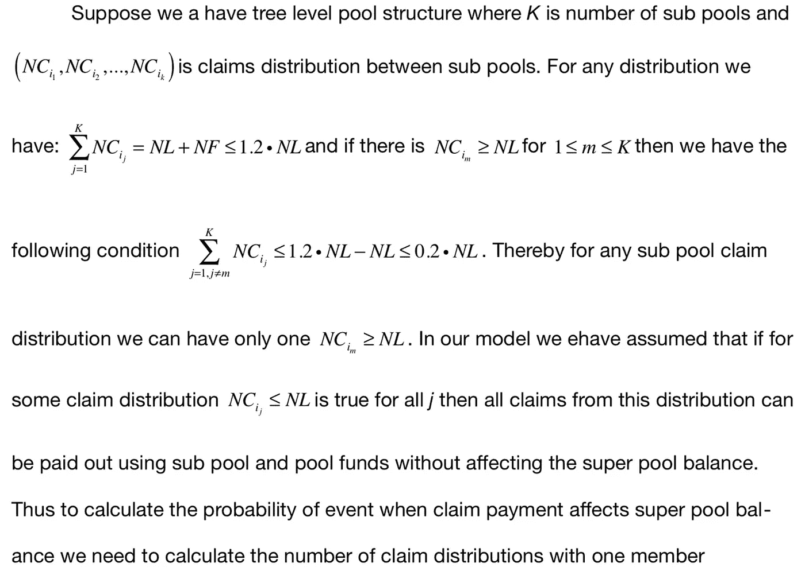
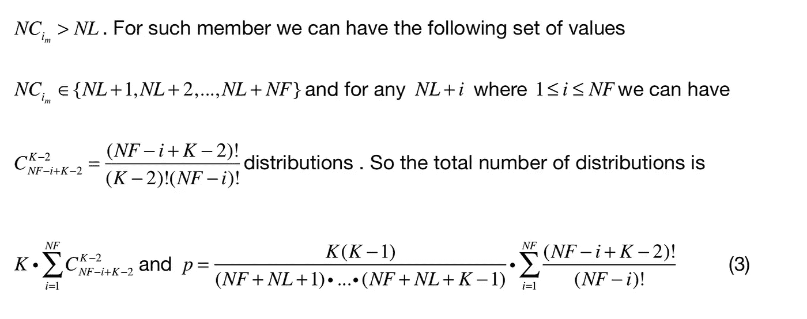
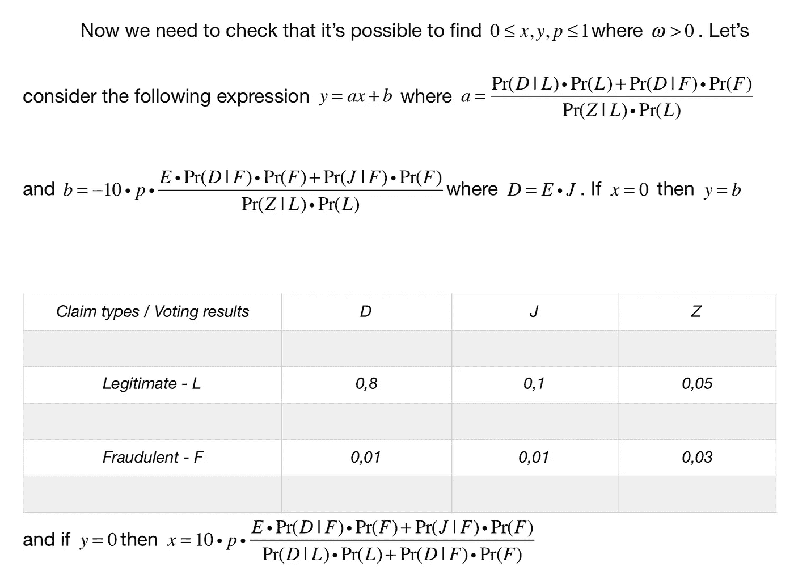
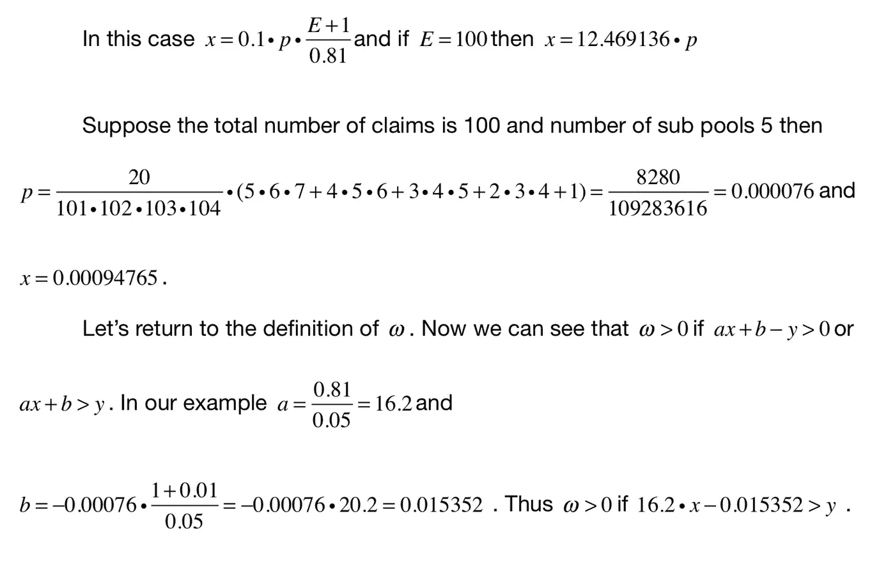

# 分散保险模式

> 原文：<https://medium.com/coinmonks/decentralised-insurance-model-c69886320a1a?source=collection_archive---------9----------------------->

## 摘要

随着共享经济和去中心化平台(如比特币和以太坊)的发展，金融产品去中心化已经成为区块链世界一些项目和研究的焦点。在本文中，我们基于我们在 REGA 风险分担方面的研究和经验建立了一个分散化保险模型，并评估了模型参数，以证明分散化保险可以作为传统保险方法的替代解决方案。

## 关键词

分散保险，区块链，智能合约，众包保险，估值，营销。

## 1.介绍

分散保险或众包意味着人们在社区中团结起来，为意外损失提供赔偿保证。与传统保险相比，在众包保险中没有保险公司、中介和经纪人，所有过程都由存储在区块链的程序控制和管理，并由分布式虚拟计算机执行。这种情况下的主要问题是如何激励社区内的人们以正确的方式使用众保计划来提供风险保障和打击欺诈。一些人的意图和行为可能与这些目标相反，但是在分散经济中，如果大多数参与者被适当地激励为社区带来价值，那么整个过程的结果将与共同的目标一致。

有两组人使用众保计划:A-加入众保池以获得风险覆盖的人和 B-帮助第一组人管理众保池内风险的人。我们称第一个群体为人群保险团体或团体，第二个群体为专家。要加入众保社区，应该有人购买众保令牌(CST)并将众保加入金额转移到众保令牌智能合约。要成为专家，一个人应该购买许可证，风险分担令牌(RST)，并将专家加入金额转移到 RST 智能合约。RST 智能合约募集的资金用于众保产品开发和初始众保资金池的资本化。在众保令牌智能合约中，有三个级别的池结构:超级池、池和子池。每个 CST 属于一个子池，该子池属于一个池以及超级池中包含的所有池。众保加入金额按以下方式在不同级别之间划分:50%进入次级资金池，20%进入资金池，10%转入超级资金池。剩下的 20%是众保智能合约佣金。CST 持有人可以激活令牌来启动风险覆盖期，在此期间他/她可以提交索赔以在意外事件的情况下接收众保付款。提交的索赔将由众保计划处理，并将提交给专家陪审团进行最终批准。对于每个悬而未决的索赔，将创建随机选择的陪审团，专家将使用众保令牌智能合同为案件投票。在索赔投票期间(最长 48 小时)，任何陪审团成员都可以审查索赔支持文件，并投票赞成或反对付款。索赔付款将由众保智能合同根据投票结果进行处理，如果付款被陪审团批准，CST 持有人可以收到索赔付款。智能合同佣金的一部分(3%)将付给专家，以补偿交易费和工作时间。如果专家被选中投票，但在投票期间没有投票，则他/她将不会获得报酬。否则所有其他专家将收到专家佣金，即使他们没有被选中投票。众保智能令牌通过超级池链接到风险分担 To- ken。如果在风险覆盖期结束时，由于专家的表现，超级池余额将超过某个阈值，则 RST 值将上升。在下一节中，我们将描述众保模型，该模型解释了专家处理索赔和投票支持合法案件并拒绝欺诈案件的动机。该模型考虑了社区成员对不同投票结果的满意度。

## 2.模型

该模型由两个风险覆盖期的众保令牌智能合约组成。与[1]类似，社区成员加入人群保险池的决策是使用成员从分散的产品体验中获得的盈余来建模的。盈余是成员对产品的估价和他/她必须转让以加入该产品的金额之间的差额。假设如果出价产生非负盈余，一个成员会加入众保池。让我们假设μ是没有提交任何索赔的群体成员的平均风险覆盖期。对于在第一个风险保障期提交索赔并已收到付款的成员，下一期的产品估价应高于平均值。另一方面，如果索赔被拒绝，那么估价必须减少。因此，我们可以假设，对于已经收到索赔付款的成员，众保合同持续μ + *x* ，而被拒绝的索赔导致μ-*y*周期。如果*a*⊂*a*是已经提交索赔的成员组，则两个风险覆盖期后的超级池财务结果可以通过以下表达式计算:

其中 *J* 是众保加入金额，ω是由于索赔处理而更新的平均超级池余额。为了计算ω，我们需要考虑以下情况:

*   提交的权利要求 *c* ∈ *L* 为合法权利要求；
*   提交的权利要求 *f* ∈ *F* 为欺诈性权利要求。

在这两种情况下，专家投票程序都会产生以下结果:

- *D* 索赔被评审团批准，会员将收到索赔付款金额*D*；

- *J* 投票程序已超时结束，且收集的票数少于规定的限制，或赞成票的数量等于反对票的数量。在这种情况下，成员将收到加入金额*J*；

陪审团拒绝了索赔，该成员没有从众保基金中得到任何报酬。

基于成员产品估值将改变他/她的平均风险覆盖期的假设，我们可以说对于( *L* ， *D* )投票结果将超级池余额记入贷方 0.1 *J x* ，( *L* ， *Z* )将记入借方 0.1 *J y* 。我们还可以假设( *L* ， *J* )会使成员产品估值盈余为 0，但它不会改变平均众保期。请注意，我们正在考虑众保模式，在这种模式下，所有合法索赔都可以使用子池和池基金支付，并且( *L* 、 *D* )、( *L* 、 *J* )投票结果不会使用超级池余额全额支付索赔 *D* 或返还众保加入金额 *J* 。另一方面，由于相应子池和池中的资金短缺，欺诈性索赔可能对超级池余额产生负面影响。从而( *F* ， *D* )结果将改变超级池余额为 0.1*J x*—*D p*和( *F* ， *J* )到 *J p* 其中 *p* 是子池和池中资金短缺的可能性。下表总结了上述结果:

我们假设，对于提交欺诈索赔的成员，投票结果( *F* 、 *J* )和( *F* 、 *Z* )不会改变平均众保期μ。另一方面，如果欺诈案例已经支付，则成员将更有可能加入下一个时间段再次尝试欺诈。

现在，我们可以使用以下表达式计算ω:

应用条件概率理论，上述等式可以改写为:

我们应该假设欺诈索赔的数量比合法索赔的数量少得多，所以我们将以下条件添加到表达式 2 中:Pr(*F*)≤Pr(*L*)*L*，其中 0<*L【<0.2。有了这个假设，我们可以试着计算资金短缺的概率。若 *N* 为总索赔数， *NL* 为合法*NF*+*NL*≤*NL*(1+*l*)≤*NL*(1+0.2)≤1.2*NL*索赔数和*在这种情况下，我们可以用下面的表达式估计 *NF* + *NL* :**

## 3.模型参数评估

考虑以下结果概率示例

如果μ = 1.1，那么我们可以假设 *y* = 0.1，并且所有已经提交 le-的成员

在第一阶段后，提出索赔但没有收到付款的人离开了联保池。另一方面，我们可以假设所有收到批准的成员都有两个周期，并且 *x* = 0.9。基于我们的示例结果概率，我们可以看到对于 *x* = 0.9 和 *y* = 0.1 ω > 0。请注意 *x* 的最小值

在我们给出 0 ≤ *y* ≤1 的示例中，为 *x* = 0.00094765，对于 *y* = 0.1，我们需要 16.2*x*0.115352 或*x*0.00712049。

## 4.总结和结论

在前面的章节中，我们已经建立了具有专家绩效函数(2)的众保模型，该模型解释了专家考虑索赔的动机，正确地投票给合法的索赔并拒绝欺诈企图。基于表达式(2 ),我们可以看到，如果专家已经决定再次对包括合法案例在内的所有案例进行投票，那么专家性能函数ω的值将变为负值，这使得 RST 令牌值减小。另一方面，如果专家已经决定批准包括欺诈案件在内的所有案件，那么这一决定将改变下一个众保期的风险平衡，因为事实上更多的欺诈企图将会出现，并且

资金池/子资金池资金短缺将会加剧。因此，随着 *p* 和 Pr( *D* ，*)的增加，Pr(*D*|*F*)Pr(*F*)*Dp*)在(2)中的值会变得更大，并且专家表现会再次变为负值。我们还使用投票结果分布的示例评估了模型参数 0 ≤ *x* 、 *y* 、 *p* ≤ 1，并证明了不存在为模型参数 0 ≤ *x* 、 *y* 、 *p* ≤ 1 给出实际值的结果分布的空集。假设平均众保期约为 1.1 是有道理的，在我们的示例分布中，我们检查到对于*y*= 0.1，专家绩效函数ω的值对于(0.00712049，0.9)中的所有 *x* 都是正的。

基于上述总结，我们可以得出结论，分散化的保险产品与两个具有不同动机的群体联系在一起，区块链计划可以创造并发挥作用，为两个群体带来价值。我们希望它将有助于众保成为风险覆盖的替代解决方案，并将在不久的将来改变保险业的格局。

## 参考

[1] Amir Gandomi 和 Saeed Zolfaghari，2011 年,“客户估价存在不确定性时忠诚度计划的盈利能力”, 2011 年工业工程研究会议论文集

> [在您的收件箱中直接获得最佳软件交易](https://coincodecap.com/?utm_source=coinmonks)

