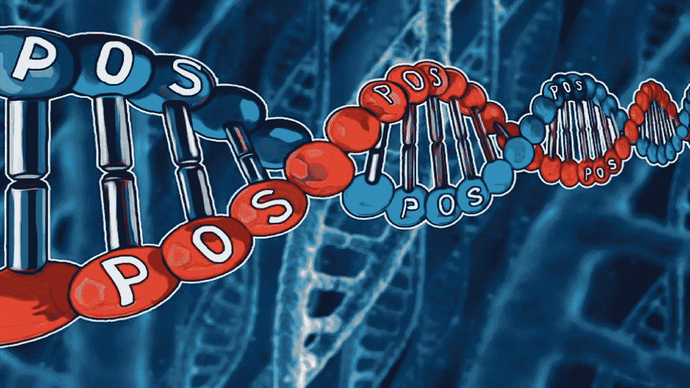

# 权力下放是卡尔达诺的核心

> 原文：<https://medium.com/coinmonks/decentralization-is-at-the-heart-of-cardano-334ecd8ad458?source=collection_archive---------5----------------------->

分散化是公共区块链网络的一个绝对关键的特征，因为正是这个特征使它们不同于当前的协议。我们来解释一下什么是去中心化，如何衡量，如何长期保持其高质量。

# TLDR:

*   公共区块链网络不符合分散化的一般定义，我们可以…