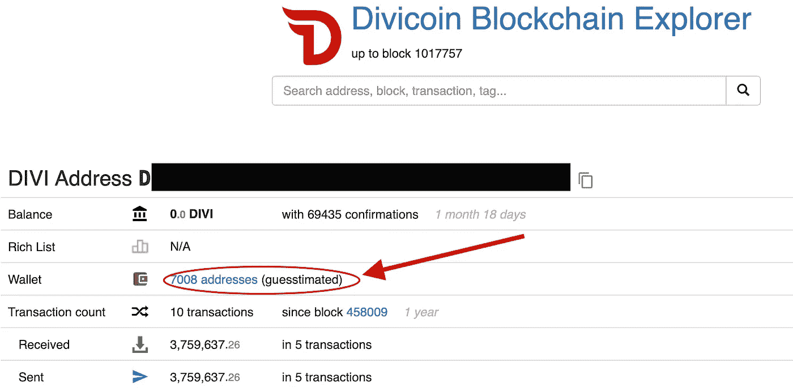

# 去中心化是好的，即使它看起来很糟糕

> 原文：<https://medium.com/coinmonks/decentralization-is-good-even-if-it-looks-bad-fdd32fd49929?source=collection_archive---------1----------------------->

## 一个区块链侦探故事

# 背景

Divi 是一个加密货币项目，致力于降低人们的每一个准入门槛，不仅仅是他们自己的硬币，而是整个市场。这个目标是项目的生命线，是他们采取的每一个行动，他们做的每一个发展。当其他项目正在创建链来解决区块链的公用事业时，Divi 正在创建工具来使其他链更容易评估，使每个人都可以获得 crypto 的好处、收入和功能。

他们是第一个创建多层主节点的人，任何人只需点击一个按钮就可以启动相同的主节点。他们是第一个将所有创收利益带给那些不能运行节点，但有电话并可以通过 SMS 和 Whatsapp 存储 Divi 来赚取收入的人。他们正在通过将 Divi 整合到开发中的游戏中来创造更多的效用，比如《围城》和《T1》。通过这样做，他们创造了现存的最好的密码社区。来自这个项目的人们现在出售咖啡、糖浆、书籍，使用由 Divi 创建的 shopify 和 wordpress 工具，使使用硬币更容易。他们才刚刚开始。他们的[小说钱包](https://wallet.diviproject.org)将于 11 月问世。

所有这一切的发展和社区支持导致价格在去年从 0.3 美分大幅上涨到现在的 3.5 美分。

## 我是谁？

关于我的简短说明。我不以任何方式为 Divi 项目或他们的任何子公司工作。我喜欢这个项目，它是一个了不起的社区。我在那里了解了区块链，甚至学会了用 Divi 制作一些与区块链相关的东西，用他们了不起的志愿者和社区成员教我。我志愿管理他们的一些电报社区，但仅此而已。我不是交易者，这些都不是交易建议。你做你想做的，你靠你自己，即使我认为这是愚蠢的，并会在这篇文章中这样说。

# 他们的价格怎么样了？

后 ICO 时代的硬币升值 10 倍已经很不错了，所以没什么可抱怨的。但是，这种硬币最近看到了 8 美分，所以在暴涨之后，已经有了相当大的跌幅。但是为什么呢？基本面没有改变。

## 一些可能性

显然，卖出压力大于买入压力，但为什么呢？

通货膨胀: 与其他合法项目相比，Divi 的通货膨胀率非常高，目前约为 30%。也许，像大多数高通胀的项目一样，是时候买单了。事实上，这是 Divi 新人最常见的抱怨之一。这种想法显然是错误的。[我有一整篇文章专门讨论对 Divi](/@shandor/let-me-help-you-out-bix-adb5339cc914) 的三大抱怨，高通胀是其中之一。不用说，股息通胀与比特币通胀没有太大区别，主节点和赌注让股息远离市场。Divi 也写过[两篇](https://blog.diviproject.org/how-divi-controls-inflation/) [关于这个话题的文章](/diviproject/inflation-and-divis-economic-model-why-inflation-can-be-good-64b7ee2b3626)。

**开发延迟:**开发延迟有可能导致大规模外流，而此时价格正表现良好。COVID 对开发进度产生了影响，就像它对经济的每个其他方面一样。所以，也许人们厌倦了等待，去了更好的地方。如果是这样，我们会看到很多人抛售。这篇文章将证明事实并非如此。

**鲸鱼出口:**这是另一种截然不同的可能性，但可能是最良性的。如果通货膨胀是一个根本问题，我们将会看到许多人逃离，包括鲸鱼。出于对开发延迟或任何其他基本面的担忧，情况也是如此。但是如果一条鲸鱼离开了，那就意味着大量的资金被分散到了社区中。这不仅降低了价格，使更多的人更容易聚集更多的资金，更多的人持有这些资金。也许一条鲸鱼死了，许多鱼出生了或者变大了。

糟糕的演员:另一种可能是糟糕的演员。也许有人从事抽水和倾倒。Divi 很快就要上新的交易所了，也许他们不得不把硬币交给交易所，然后交易所在交易开始前就抛出了价格。一个糟糕的演员可以通过很多方式对价格产生负面影响。这篇文章将表明，除非一个交易所已经持有 Divi 近 2 年，否则不可能出现这种情况。

# 侦探工作开始…

第一步真的很难，很乏味，而且需要耐心。虽然一个社区成员已经开发了一个不错的 block explorer，Divi 也已经在 T2 的 Chainz 上注册了一年多，但是这些还不足以解决这个问题。

Chainz 提供了许多额外的工具，而不仅仅是跟踪交易(而且他们最近在某种程度上破解了他们的 vanilla explorer)。他们有一个 ***实验性的*** 功能，试图将同一个钱包里的地址组合在一起。我已经多次尝试验证这个特性，虽然它有时不正确，但在大多数情况下却非常准确。我不知道他们这样做的算法，但这很酷。

Chainz does a half decent job of grouping addresses in a wallet together

我输入了我的真实存款地址，然后进入上面的页面。所以你点击“7008 地址”,它会把你带到 Bitrue 的钱包，至少是面向公众的钱包。在写这篇文章的时候，这里是你所看到的。

Does Bitrue only have 9454 Divi on their exchange? No.

这看起来很奇怪，因为如果只有这些，那就太可怕了。看起来 Bitrue 上没有基金。但是不要害怕！记住，像比特币基地、币安和 Bitrue 这样的集中交易所不会在区块链上记录交易。当你交易一些密码时，密码不是从一个地址发送到另一个地址。

不，当你将资金存入一个交易所的公共钱包时，他们会取走资金并将其存入第二个(或第三个或第四个)钱包，金额会记入你的账户。然后，当你交易时，这些值只是从相关账户的余额中加减，没有使用区块链。因此，这些资金不会在面向公众的钱包里停留太久。

Schematic of how incoming funds are handled on a centralized exchange

我一直看着价格从近 900 sats 下降到 700，然后下降到 600。如果大家一致认为 Divi 出了问题，我会期待看到更多的 Divi 从钱包里转移出来。也许我会看到，随着时间的推移，1 万到 100 万股息的大量转移频繁发生。但是我没有看到这个。我看到 Bitrue 钱包页面时不时变化很小。此外，我在 Bitrue 上看到，让我们称他们为绿色交易者，通过下一个非常大的卖单(除了其他鲸鱼或坚定持有人团体，没有人可以打破这些卖单)来设定价格上限，这往往会压低价格。然后，这些订单的所有者会失去耐心，将订单转储到买方订单簿中，进一步降低价格。明白我说的“绿色”交易者的意思了吗？稍后将详细介绍。

我怀疑一个大股东正在退出。于是我就等着，一直看着 Bitrue 钱包。你瞧，我看到一笔 700 万英镑的股息被转入一个比特地址。天哪，有人又要降价了。

我拿到了那笔 700 万的转账并跟踪了回来。我最终在一个[钻石级主节点](https://blocks.divi.domains/address/DBHJDNTgbCooFBDjJVGjhizzpiNLYFuf6x) (10，000，000 Divi)找到了地址。我知道这是一个主节点，因为 540 奖励即将到来，那里有平衡。然后，我在 Chainz 再次使用钱包猜测器…然后

这个人有 3000 万股息，在整个 8 月份，他把所有的股息都处理掉了。还有一种方法可以验证这个钱包。只需去我收到 700 万英镑汇款的地址，看看其余资金来自哪里。当你把所有从一个地址转到另一个地址的钱加起来，你也将得到大约 3000 万英镑。**这一甩就是一个人**。

Blue represents a diamond masternode, dark grey a platinum.

他分解钻石，制造铂金，然后最终处理掉所有的钻石。

我们可以看到这个人对[硬币壁虎](https://www.coingecko.com/en/coins/divi/historical_data/usd?end_date=2020-09-01&start_date=2020-08-01#panel)价格的影响。将 8 月份的日交易量相加，我们发现 8 月份 Bitrue 上的交易总额为 2.06 亿 Divi，其中 3000 万是他的。

Volume rose significantly with this person’s individual Divi exit

因此，虽然 7 月份的交易量约为每天 500 万分(这将是该月约 1.5 亿分的基线交易量)，但考虑到上个月价格飙升至 900 sats，54%的额外交易量对低流动性硬币造成了相当大的抛售压力。然后，在 crypto 的贪婪周期中，这个人的退出引起了投机交易者和以更高的价格进入这个项目的人的恐慌。

## 我们对这个人了解多少？

这篇文章并不针对任何人，坦率地说，我不知道现实生活中的那个人是谁。很容易检查 Divi 电报频道，看看是否有人提到这些地址，但这是毫无意义的。那会实现什么？

然而，我们知道这个人从区块链开始就和 Divi 在一起。我们知道他已经掌握了许多主节点。所以可以肯定地说，这不是一次袭击。逃离这个项目的人并不多。这甚至不是一群鲸鱼离开或退出骗局。这只是一条想要或需要出去的鲸鱼。

从这一切中得到的一个重要教训是，你在区块链的活动不是私人的。我不是跟踪交易的专家，但这很简单。如果我想更进一步，我会试着找到提到这些地址的地方，并将它们与某个真实的人联系起来。以我们通常使用现金或基于现金的应用程序(如 venmo)的方式使用区块链，很难维护隐私。

## 那么，他为什么要离开？

谁知道呢？人们离开一个项目有很多原因。如果他们是一个投资团体，也许他们做了成本/收益分析，并决定最好[浪费他们的钱]购买新的热点，DeFi。也许是有人通过抛售投资和逃跑来敲诈和他一起投资的人。也许他现在需要买房子，需要钱。也许是医院账单。也许送三个孩子上大学。不能知道。

但既然他和我们在一起这么久，很难相信有恶意。我认为价格的毁灭是由于交易中的绿色，最糟糕的是不体贴。

## 如何退出自己关心的项目

总的来说，目标是“双赢”。我说的“总体上”是指，这就是你如何带着对正回报的最大期望度过一生，不仅仅是财务上的，还有社会上的。以这种方式思考每一个行动，你就可以加强你与其他人的联系，保持社区运转，保持项目活力。几乎总是认为双赢对你更好。这是一个很好的例子。

当退出一个项目时，你想带着最大的利润(或最少的损失，视情况而定)退出，不是吗？如果你真的关心这个项目，你也会想在负面影响最小的情况下离开。硬币的价格在某种程度上对这个项目很重要。有刺激投资的市值门槛，创造了以前可能不存在的机会。一手拖低价格，不仅减少了销售的整体收入，还损害了项目的发展能力。这是双输，你为什么要双输呢？因此，双赢是:你可以最大限度地利用你的钱，而该项目可以利用他们目前的市场资本收益。怎么会？

1.  **场外交易**。最简单的方法就是和团队沟通。加密项目的领导层被柜台交易的请求淹没了。一些项目实际上有人处理这一点，特别是如果他们是低流动性硬币(老实说，除了前 20 名硬币，我甚至可以说前 10 名，他们都是低流动性的)。因此，很有可能通过联系团队，进行一笔或一组大额交易，出于安全考虑，可以进行托管。他们可以在不压低价格的情况下，为大买家和大卖家提供便利，你可以让所有的硬币都处于同一价格，通常是当前价格，而不是让所有人都降价。
2.  像成年人一样使用交换。好吧，也许这有点意思。但是目标是在不降低价格的同时，最大化你的销售收入。如果你打算把你所有的资金转移到交易所，为什么不慢慢来，把事情做好。你不是日内交易。你实际上是在尝试交换，而不是损失你的资金价值。

我不是交易员，这也不是交易建议，但我观察到这些基金的所有者在如何脱手方面表现得很幼稚。第一个错误是建立巨大的销售墙。当你建起一堵销售墙时，你就阻止了所有人去砸它。为什么？因为大多数低流动性资产的交易者只会看着它说“不”,因为没有人有资金去战胜它。因此，当价格下跌时，这堵墙就呆在那里。

事实上，聪明的买家会试图让你恼火，他们会一点一点地蚕食你的大卖单，直到你感到恼火，摔下墙，扔进订单簿。更糟糕的是，人们在你的墙下设置卖出指令，所以你认为价格正在远离你，所以你把墙设置得更低。竖起卖出墙是想以更低价格购买的人的工具。它不适合那些想在销售时获得最大收益的人。明白我的意思了吧，这个人在有效出售资产方面是多么幼稚？

This is a terrible way to sell a low liquidity coin, and this isn’t even as bad as it was.

耐心，引诱人们接受你的价格。在多个交易所出售，利用每个交易所的交易量。小块的更常见。用多个更小的触发命令隐藏你的墙。你可以做很多事情来避免束缚价格。最终，你会得到更多的钱，并且这个项目可以继续发展。双赢。

# 那么，我们的立场是什么？

跟着钱走了一段时间，看到这个人在 Bitrue 上还有一些钱在卖(大概就是我上面贴的那些墙)。有几个钱包，所有的主节点都关闭了。我认为在我写这篇文章的时候，他还有 140 万股股票需要出售。

所以好消息是双重的。第一，他快好了，我们可以用这么幼稚的方式回到不买卖的人身上。也许吧。至少没人有这么多的私房钱要卖。所以这是一种解脱。

硬币的基本原理没有改变。社区仍然强大，钱包即将到来，金融科技整合仍在进行，各种用例都变得强大。甚至在抛售进行的同时，masternode 的数量也在上升。我希望我们很快就能看到以前的水平。

第二个好消息是 Divi 比以前更加分散了。3000 万股息被分散给其他持有者，放入赌注钱包，并制作成更多的主节点。所有项目都有鲸鱼，迪维的鲸鱼从第 1 天就一直持有，并且继续持有(除了这个家伙)。与大多数其他重要的硬币相比，Divi 仍然更加分散。

Divi is as decentralized as other coins, and often more.

Divi 是右边的图表，它已经不如 PIVX，DASH，甚至莱特币(我必须说，对于硬币持有者来说，比特币看起来并没有那么糟糕)。能容纳 3000 多万只鲸鱼的数量实在不多。但是那些人对这个项目非常忠诚。他们提供建议，参与社交媒体渠道，为项目的各个方面贡献自己的时间。事实上，有一个人退出了(不是我刚才提到的那些人，我知道他们是谁)，这大大降低了这种情况再次发生的可能性。

我必须强调，我很高兴一只没有亲自参与这个项目的鲸鱼，基本上以比半价更好的价格把他的硬币送给了许多其他人。除了这一个人，以及那些跟随他往下走的人，卖出压力很小。

总的来说，这个退出的家伙几乎完成了，项目看起来仍然很棒，社区(和它的鲸鱼)基本上保持稳定，随着这个项目而来的增长和机会看起来很棒。

作者注:虽然我用“我”这个词来描述这里的活动，但事实是其他人也帮了很大的忙。虽然没有使用(甚至不需要)任何内部信息来编写这篇文章，但我确实从 Divi 社区的人们那里得到了很多帮助，特别是 OriZ、Giff、John Seastar 和 Voice，所以我要感谢他们。

## 另外，阅读

*   最好的[密码交易机器人](/coinmonks/crypto-trading-bot-c2ffce8acb2a)
*   [密码本交易平台](/coinmonks/top-10-crypto-copy-trading-platforms-for-beginners-d0c37c7d698c)
*   最好的[加密税务软件](/coinmonks/best-crypto-tax-tool-for-my-money-72d4b430816b)
*   [最佳加密交易平台](/coinmonks/the-best-crypto-trading-platforms-in-2020-the-definitive-guide-updated-c72f8b874555)
*   最佳[加密借贷平台](/coinmonks/top-5-crypto-lending-platforms-in-2020-that-you-need-to-know-a1b675cec3fa)
*   [最佳区块链分析工具](https://bitquery.io/blog/best-blockchain-analysis-tools-and-software)
*   [加密套利](/coinmonks/crypto-arbitrage-guide-how-to-make-money-as-a-beginner-62bfe5c868f6)指南:新手如何赚钱
*   最佳[加密制图工具](/coinmonks/what-are-the-best-charting-platforms-for-cryptocurrency-trading-85aade584d80)
*   [莱杰 vs 特雷佐](/coinmonks/ledger-vs-trezor-best-hardware-wallet-to-secure-cryptocurrency-22c7a3fd391e)
*   了解比特币的[最佳书籍有哪些？](/coinmonks/what-are-the-best-books-to-learn-bitcoin-409aeb9aff4b)
*   [3 商业评论](/coinmonks/3commas-review-an-excellent-crypto-trading-bot-2020-1313a58bec92)
*   [AAX 交易所审核](/coinmonks/aax-exchange-review-2021-67c5ea09330c) |推荐代码、交易费用、利弊
*   [德里比特评论](/coinmonks/deribit-review-options-fees-apis-and-testnet-2ca16c4bbdb2) |选项、费用、API 和 Testnet
*   [FTX 密码交易所评论](/coinmonks/ftx-crypto-exchange-review-53664ac1198f)
*   [n 零审核](/coinmonks/ngrave-zero-review-c465cf8307fc)
*   [Bybit 交换审查](/coinmonks/bybit-exchange-review-dbd570019b71)
*   [3Commas vs Cryptohopper](/coinmonks/cryptohopper-vs-3commas-vs-shrimpy-a2c16095b8fe)
*   最好的比特币[硬件钱包](/coinmonks/the-best-cryptocurrency-hardware-wallets-of-2020-e28b1c124069?source=friends_link&sk=324dd9ff8556ab578d71e7ad7658ad7c)
*   最佳 [monero 钱包](https://blog.coincodecap.com/best-monero-wallets)
*   [莱杰 nano s vs x](https://blog.coincodecap.com/ledger-nano-s-vs-x)
*   [Bitsgap vs 3 commas vs quad ency](https://blog.coincodecap.com/bitsgap-3commas-quadency)
*   [莱杰纳米 S vs 特雷佐 one vs 特雷佐 T vs 莱杰纳米 X](https://blog.coincodecap.com/ledger-nano-s-vs-trezor-one-ledger-nano-x-trezor-t)
*   [block fi vs Celsius](/coinmonks/blockfi-vs-celsius-vs-hodlnaut-8a1cc8c26630)vs Hodlnaut
*   Bitsgap 评论——一个轻松赚钱的加密交易机器人
*   为专业人士设计的加密交易机器人
*   [PrimeXBT 审查](/coinmonks/primexbt-review-88e0815be858) |杠杆交易、费用和交易
*   [埃利帕尔泰坦评论](/coinmonks/ellipal-titan-review-85e9071dd029)
*   [SecuX Stone 评论](https://blog.coincodecap.com/secux-stone-hardware-wallet-review)
*   [BlockFi 评论](/coinmonks/blockfi-review-53096053c097) |从您的密码中赚取高达 8.6%的利息