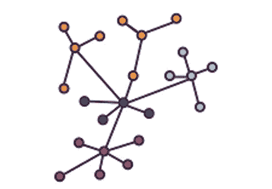
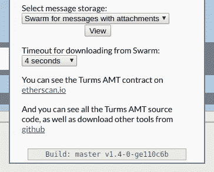

# 去中心化，加密的核心

> 原文：<https://medium.com/coinmonks/decentralization-the-heart-of-crypto-708763b2b31c?source=collection_archive---------0----------------------->

在过去的几年里，以太坊给我们带来了数百个去中心化的
应用，或者说 DApp——每隔几天就有更多的应用被介绍给我们。
让我们花点时间来回顾一下 DApp 的解剖，以及为什么 DApp 的解剖对
如此重要。

## 什么

DApp 是不受中央机构控制的应用程序。也就是说，它的运作基于一个程序或一套平等主义的规则，不能被任何独裁的个人或官僚所改变。去中心化的全部目的是消除信任单个管理实体的需要。

举个小例子，想想两个童年游戏的区别:在音乐椅子上总是有一个成年人，他负责启动和停止唱机(是的，我在和自己约会)，当两个孩子同时坐在椅子上时，他会解决任何争论。尽管成年人*参与了游戏，但她并不是一个平等的参与者。*

与“标签”相比，这在孩子们之间创造了一种非常不同的动态——在标签中有一些选择下一个搜索者的规则(“不是它！”)，同样的规则也适用于*每个人*。参与的每个人都是平等的。

这个特性比你一开始可能意识到的更重要。想想人类历史上的所有时代，君主、独裁者、国家元首或公司都建立了不公平的(有时不为人知的)规则。当我们的机构让位给 DApps 时，我们向平等主义的正义又迈进了一步。

## 权力下放的方式

比特币和以太坊等加密货币可能是 DApps 最容易使用的例子。它们基于严格的规则运作，不受任何特权管理团队或权力机构的控制。注意，这并不是说不同的玩家不能扮演不同的角色。我永远不会在比特币区块链上“挖矿”了；我可能永远也不会向以太坊核心开发者提出“EIP”或以太坊
改进建议。关键是，规则对每个人都是一样的(比特币协议)——系统中没有任何东西阻止我或世界各地成千上万的人做这些事情。

## DApp 的解剖

DApp 的典型架构非常简单:

*   业务逻辑编码在以太坊智能合约中。合同的源代码必须公布——这对于确保系统的规则是公平的至关重要；也就是说，作者没有偷偷摸摸地为自己保留一些特权。
*   用于与智能合同交互的用户界面。

用户界面必须:

1.  开源:
    这是为了让用户可以验证代码做了它声称要做的事情，而不是别的。
2.  完全在用户的计算机上运行，并且是可验证的:在后端服务器上运行的代码是一个黑盒…没有办法知道它到底在做什么。所以大多数 DApp 前端都是用 javascript 写的。原因之一是您可以在浏览器中按下< control-shift-i >来查看正在执行的实际源代码。当然，只有少数人会*实际上*检查正在运行的代码，但在大多数情况下，这就足够了——如果有什么不对劲，只需要一个人就能发出警报。有很多方法可以让代码更加可验证，我很快就会谈到。
3.  不被“托管”在中央服务器上。
    这很重要，原因有几个。首先是可靠性和审查阻力，因为任何单个服务器或小型服务器集群都可能出现故障，或者可能被审查。但更重要的是，当包含 DApp 用户界面的网站被托管在中央服务器上时，内容可以被随意修改。另一方面，如果 DApp 程序托管在一个分散的分布式系统上，如 IPFS 或 Swarm，那么内容由一个散列唯一标识，即使
    程序的一行被篡改，这个散列也会改变。

以上是 DApp 的原型架构。然而，还有更复杂的模型，例如分布式自治组织，或 DAO，其中特定的参与者扮演传统的“管理”角色。基本特征保持不变—管理角色必须对每个人开放，因为系统不会给任何一个人或组比其他人更高的特权。

## 我的 Dapps，我的誓言

如果你还没有猜到，我写 DApps。我也经常查看其他个人和团体写的 DApps。当一个新的 DApp 没有明确说明它是如何分权的时候，我总是认为这是一个危险信号。当我甚至在阅读了白皮书之后还不能判断一个系统是否使用了后端服务器时，这不是一个好的迹象。

我写的所有 DApps 都是 100%分散的。我在[diazgonewild.com](https://diazgonewild.com)建立了一个小网站，提供关于这些时髦人士的链接和文章。我最近的 DApp 是[Turms Anonymous Message Transport](https://ipfs.io/ipns/messagetransport.turmsanonymous.io)，它提供了以太坊账户之间真正分散的消息传递。像我的其他项目一样，它在 github 上是开源的；任何人都可以从源代码中重建用户界面，并看到嵌入在代码中的 git 标记与托管在 IPFS 上的版本中的 git 标记相匹配(如下面的选项面板所示)。

我制作了 [Turms 匿名消息传输](https://ipfs.io/ipns/messagetransport.turmsanonymous.io)来为我现在正在开发的另一个 DApp 打下基础。如果你喜欢我的方向，那么请检查一下。

要求分权我的朋友们！
亚历杭德罗·迪亚兹

> [在您的收件箱中直接获得最佳软件交易](https://coincodecap.com/?utm_source=coinmonks)

