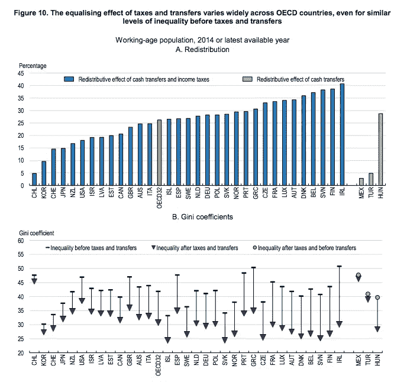
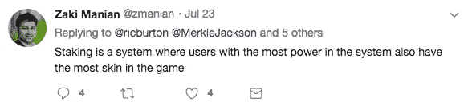

# 分散自治税收

> 原文：<https://medium.com/coinmonks/decentralized-autonomous-taxation-dat-cdc3d40e6631?source=collection_archive---------4----------------------->

区块链促进了不同方之间无摩擦协调。分布式协议和激励调整彻底改变了组织结构，提供了一种集中管理的替代方案。因此，许多技术专家设想利用分散自治组织(Dao)来建立一个更公平的游戏世界，有更多的赢家，这可以实现更大的财富分配和平等。

过去一年中，dApps 和 Dao 的增长表明人们对公共治理的兴趣越来越大，但对于哪些分散决策流程可以大规模成功执行的洞察有限。去中心化带来的回报会减少吗？还是个人有可能在没有中介的情况下集体授权任何行为？此外，对于旨在更有效地分配财富以实现更大平等的平台而言，社区能否协调并充分自我激励合作，以实施分权自治税收(DAT)等经济政策？

根据约翰·洛克(John Locke)的第二本《政府论》,公共税收是最广泛采用的创造资本反馈循环的解决方案，个人通过这种方式集中资源投资于社会和经济发展，而执行的责任则委托给政府。虽然慈善是有意义的，个人可以选择受益者，[但自愿捐款能否支持可持续发展令人怀疑。通过利用分散的技术和激励机制，用户可以自行实施 DAT 以可持续地分配资金，并补充现有的政府支出以支持经济目标。](http://www.cbc.ca/news/world/micha%C3%ABlle-jean-you-cannot-build-a-sustainable-economy-on-charity-1.1136138)

# 死亡和税收

税收被描述为死亡一样不可避免(也一样不受欢迎)。它们通常由资助发展和赚取收入的中央当局征收，作为提供公共服务的回报。尽管人们普遍厌恶税收，但有大量证据表明，财政政策对实现社会目标产生了积极影响。直接税和现金转移相结合增加了财富分配，平均而言，经合组织发达经济体的国家基尼系数(衡量收入不平等的指标)提高了大约四分之一。

此外，当比较低税收国家(如美国、英国、加拿大)和高税收国家(如挪威、瑞典、丹麦、法国)时，研究表明更高的税收会导致更低的贫困率。

纵观历史，各国都尝试过各种直接和间接税收政策，如财产税、所得税和销售税、人头税甚至宗教税等。税收起源于古埃及，向公民征收谷物，并在节日期间重新分配，以刺激基础设施建设或维持政府的谷物盈余。

古希腊人和罗马人在冲突中征税来维持当地经济。在周朝，中国政府[设立了财产税](https://www.tokendaily.co/blog/www.worldtaxation.com/uncategorized/history-of-taxation.html)，要求公民没收在他们的土地上生产所得的所有收益。而在 17 世纪，约翰·洛克在*的《文官政府第二论》*中断言，一个政府要履行促进社会契约的职责，公民就必须支付公共服务的成本。

然而，尽管实行了几个世纪的税收制度，但仍未解决哪种税收制度最能满足公共服务提供者和人民的要求，并实现最大程度的收入平等。这表明税收的范围和执行随着经济环境的变化而不断变化。因此，可以公平地假设，通过区块链技术的扩散而走向去中心化意识形态和制度的全球运动，也可能彻底改变税收在支持公共福利方面的作用。

观察生态系统如何演变，以及去中心化的治理是否能够超越道德要求而进入社会强制，将是一件有趣的事情。

这就引出了一个问题:分权治理的使用者是否可以自行制定财政政策，比如税收，以支持财富分配和公共服务；特别是如果他们能够在决定如何分配资金方面发挥更积极的作用。从本质上来说，税收是一种强制手段，但是由谁来强制征税或者简单地说如何强制征税有关系吗——如果不是由一个集中的政府机构来征收，征税的权力能够确定吗？

# 合规与担保

政府通过“约束”公民来激励他们遵守规范的税收政策，从而强制征税。出生在一个结构化的社会中，公民会立即抵押自己。公民的纳税遵从程度会影响他们:

1.  获取(例如身份、进入公共服务部门、因逃避而被监禁)
2.  金融资本(如逃税罚款、税收留置权)
3.  社会资本(例如，犯罪记录、信用评分)

如果爱丽丝(加拿大人)逃税，她将无法获得公共医疗保健，难以获得政府颁发的身份，将不得不支付罚款，并可能面临重罪判决。政府通过直接限制公民权利或迫使非政府组织也限制活动(例如，逃税→没有 ID → Alice 不能参加符合 KYC 的 ICO)来成功地强制执行收费政策。

类似地，区块链已经纳入了影响用户*访问*和*金融资本*的绑定机制，以激励在互动游戏中的合规性和歧视 sad 路径。正如 Joseph Poon [在 de conomy block chain Conference](https://www.youtube.com/watch?v=fYknp5EDwOA)、*上解释的那样，“机制设计是我们有一个目标的地方，我们正在设计规则和景观，以便玩博弈论的人根据自己的利益达到这个目标”。*

要成为利益相关者共识证明的验证者，利益相关者必须提供一份在处理无效交易时可以削减的保证书。等离子子链也利用锁定来阻止用户无效退出根链。此外，治理、争议解决和基于债务的系统保持结合，以确保选民、挑战者和贷款接受者在游戏中“利益相关”，以公平行事。在极端的情况下，不良行为者可以从平台上彻底清除(警告:只有结合 sybil 抗攻击身份解决方案才可能)。

谈到社会资本，区块链的公共性质意味着它们有助于永久的声誉建立。根据隐私保护的实施情况，用户活动会被社会担保，由此产生的信誉也会渗透到应用程序和链中。比如说；令牌管理的注册中心试图根据参与者过去的表现(例如，投票、服务质量)为各种用例导出一组高质量的参与者。

显然，政府和 Dao 强制执行的固有“游戏中的皮肤”鼓励合规——如果不纳税，个人可以过上最好生活的程度是有上限的，web3.0 平台的用户必须愿意接受约束和苛刻的参与条件。很明显,*任务*的概念是主观的，仅仅意味着个人的自身利益与遵守并朝着某个目标努力的激励相一致。

然而，由于区块链是选择加入的生态系统，尚不清楚它们是否有足够的影响力来实施参与、共识以及经济政策。要实施 DAT，用户必须首先希望使用基于区块链的平台，然后受到足够的激励，觉得纳税符合他们和公众的最佳利益。

# 人民的力量

*“人民的力量比掌权的人强大得多”——瓦伊尔·高尼姆*

在缺乏由某种削减机制、额外费用或拒绝服务所强制的 DAT 的情况下，Dao 可以依靠声誉或社会包容性来推动参与。

*Source: Black Mirror. Season 3, Episode 1\. 21*

*《黑镜》第三季第一集*是社会参与强制行为力量的一个很好的例子。这其实是每个人最喜欢的一集，因为我们都被我们正在走向的社会等级社会的影响吓呆了，但也很感兴趣。在这一集中，社交排名平台不是政府授权的，然而与坏名声相关的耻辱是如此严重，以至于它指导并经常*授权*某些行为。

2018 年，中国政府正式开始实施正式的社会信用体系，评估包括驾驶能力、吸烟习惯和假新闻贡献在内的多种指标，以激励良好行为。公民分数的含义从被贴上“坏公民”的标签到被拒绝登机和禁止孩子进入最好的学校。*(注意:我并不提倡极端公民排名，而是展示声誉系统的力量。)*

更宽泛地说，Instagram、脸书和 Twitter 等社交应用相当于基于用户参与度指标(喜欢、评论和关注者)的“社交排名系统”。这些应用程序上的社会规范不仅仅是指导方针，因为缺乏遵守可能会产生负面的社会后果——有时会根据子群体的价值观限制*访问、社会资本和金融资本*(例如，招聘人员对候选人社交媒体的审查、LinkedIn 认可、“思想领袖”地位)。

此外，社会使命也影响商业和政策决策。这方面的一个例子是像 Intuit 的 Mint 这样的第三方支付和数据提供商的崛起，他们开始从银行平台上收集客户的金融数据。出于对失去客户的恐惧，银行开始自愿开放他们的 APIs 或者是社会导向的？消费者的推动是如此之大，以至于它甚至导致了像 PSD2 和 CMA 这样的反动政策的实施，使用户对其财务数据的控制合法化。如果实体有选择进入商业模式的灵活性，然而社会压力在发展，这是强制性的还是自愿的？参与证明以及由此产生的声誉是否足以激励参与具有 DAT 政策的公共平台？

社会信仰，如对资产价值的市场投机，也可能决定行为。例如，在犯罪率高的社区，房主可能会努力打击局部犯罪，以减轻财产价值贬值。在 DAT 的情况下，如果数字资产的价值或数字资产的分配源自用户对税收的遵从(例如，税收代币)，则可以在社会上强制执行。这种激励制度与 [*亨利·乔治定理*](https://en.wikipedia.org/wiki/Henry_George_theorem) 同义，即通过税收增加公共收入可以导致参与者的“租金”增加(例如，土地增值或租金)。有了 DAT，赚取的“租金”可以是数字资产的获得和增值。

# 实践中的分权制税收

很明显，执法的界限是模糊的，公众的力量是巨大的。随着去中心化技术和加密经济学变得越来越普遍，微观经济将形成自己的货币和财政政策，激励独特的行为。将使用各种机制和声誉工具来探索支持公共福利的社会使命。

如果平台实施了本地化的 dat，其中针对利基经济目标的资金得到了补贴(例如，在枪支暴力高发的美国地区有更多的学校心理学家)；缺乏合规性导致了公开定义的抑制因素，如苛刻的条件、更高的费用或评级——**税收基本上是强制性的**。如果用户必须遵守 DAT，那么无论管理员是谁，都可以强制执行。

分权征税并非不现实。税收的 [*分权定理*](http://www.nbp.pl/badania/seminaria/17iv2015-1.pdf) 断言，如果存在有效的税收协调，分布式税收制度可能优于集中式税收。目前，这种做法在全球范围内实施，各级政府都实施了各种税收政策。

在古埃及、希腊、罗马和伊斯兰哈里发帝国，非政府组织也有税收分权的先例。**税收农业是一种分布式税收征收方法，私人承包商将在政府拍卖中竞标，以拥有指定区域内的税收，并为纳税人提供服务作为回报。这一过程本质上限制了政府收入，但却为监督纳税人的承包商(收税人)提供了更多的财富。人们认为，罗马共和国领导人喜欢这种制度，因为他们对收入的控制较少，因此对财富再分配的责任(和过错)也较少。**

**不幸的是，税收农业的实施导致承包商虐待公民，因为他们剥削他们的收入。他们还[与政府](http://www.oxfordscholarship.com/view/10.1093/acprof:oso/9780190639570.001.0001/acprof-9780190639570-chapter-4)勾结，对公民进行价格欺诈，并限制他们的上诉权力。然而，可以想象，区块链的税收农业系统可能会成功。致力于通过智能合约参数达成共识、制衡，并通过数字实时市场实现更大程度的信息共享；如果向纳税人公平收费，实施起来可能会更有成效。**

**还可以以分散的方式设计其他独特的税收框架。Eric Posner 和 Glen Weyl 最近在激进市场中提出的哈伯格税可以提高财产的分配效率。用户可以永久拍卖他们相对于自行纳税定价的财产，以确保公平的市场价格和更平等的财产分配。**

**托宾税或“罗宾汉税”可以限制资本风险和金融崩溃对公共产品分配的影响。资本投资甚至加密货币都可以征税，其收益直接支持公共服务。这个想法最初是由诺贝尔奖得主詹姆士·托宾在 1972 年提出的，但在 2008 年经济危机后再次声名鹊起。累进税在减少贫困和缩小全球贫富差距方面也很成功。**

**随着区块链生态系统随着对经济政策的进一步探索而成熟，我们将会认识到分权组织的真正能力。重新想象财富、财产、所有权和安全的驱动力是普遍的，除了现有的政府计划之外，分散的自治税收可能是调整长期公共利益的有效方法。观察生态系统如何演变，以及去中心化的治理是否能够超越道德要求而进入社会强制，将是一件有趣的事情。**

***感谢* [*凯尔文·费希特*](https://medium.com/u/60c1f53c90d?source=post_page-----cdc3d40e6631--------------------------------)*[*马克·贝林*](https://medium.com/u/6263e72bcb5d?source=post_page-----cdc3d40e6631--------------------------------) *、格伦·韦伊尔* [*木槿花*](https://medium.com/u/cc02a63257d9?source=post_page-----cdc3d40e6631--------------------------------) *为我们贡献真知灼见。****

***没有侵犯版权的意图。原载于 [*令牌日报*](https://medium.com/u/bc97a317208c?source=post_page-----cdc3d40e6631--------------------------------) *。****

> ***[直接在您的收件箱中获得最佳软件交易](https://coincodecap.com/?utm_source=coinmonks)***

******