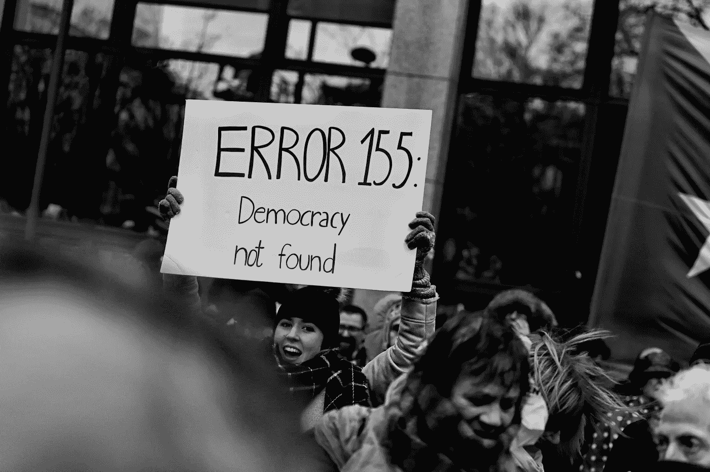

# 去中心化民主:区块链的承诺

> 原文：<https://medium.com/coinmonks/decentralized-democracy-the-blockchain-promise-b85020ed796b?source=collection_archive---------5----------------------->

Photo by [Randy Colas](https://unsplash.com/photos/TW3dFH_4nEk?utm_source=unsplash&utm_medium=referral&utm_content=creditCopyText) on [Unsplash](https://unsplash.com/search/photos/democracy?utm_source=unsplash&utm_medium=referral&utm_content=creditCopyText)

渐渐地，我们越来越一针见血。

*接下来，我们会让所有人都知道这一切；只有我们想变得更好，我们才能变得更好。*

*有效利用区块链技术正是我们必须开始的地方。*

这几乎不是一个任何人都想谈论的话题，或者许多人想听到的话题。现在扔掉这篇文章，把你的注意力集中在那些童话般的区块链项目或用例上还为时不晚，这些项目或用例在当今时代对人类几乎没有好处。如果你已经决定继续读下去，你一定是一个关心我们目前困境的人，并且对可能的解决方案持开放态度。你会惊讶于区块链技术所能达到的成就。

区块链技术背后的想法包括具有分散设置的可能性。不用说，权力下放的全部目的是将决策权交给普通人，而不是中央集权的当局。我经常对亚里士多德的一句名言的含义感到惊讶:“民主是穷人而不是富人成为统治者”。唉，我找到答案了。只有倾听人民的声音，才能称之为民主。拥有财产的人是有钱有势的人，他们在任何情况下都喜欢垄断。民主认为每个人都是平等的，不区分贫富。毕竟，这是一个人民的政府。

***“…权力下放的目的是将决策权交给普通人，而不是集权政府。”***

今天，我们生活在一个为自己的痛苦提供一种手段的社会中。然而，我们允许这一切继续下去，却没有采取什么行动来结束它。我们夜以继日地工作，牺牲一定比例的血汗钱给政府，以满足我们的一致需求，否则在我们的混合经济环境中可能会被遗漏。我们称之为税收；尽管他们经常被强行带走，却没有什么可炫耀的。我们看到和听到账目报表被公布，随后是预算和支出，但只是花在我们不知道的项目上。被偷、被用、被拿、被给予、被盗用，而我们却在日常需求的贫困中腐烂。我们是把他们放在那里的人，是的，我们也赋予他们权力。我们投票选举有财产的人来统治而不是领导，除了野心的贫困，我们一无所有；即使他们已经吃得够多了，也总是想得到更多。

***我们投票选举那些有财产的人去统治而不是去领导，除了野心的贫困之外什么也不能奉献***

Photo by [Arnaud Jaegers](https://unsplash.com/photos/IBWJsMObnnU?utm_source=unsplash&utm_medium=referral&utm_content=creditCopyText) on [Unsplash](https://unsplash.com/search/photos/vote?utm_source=unsplash&utm_medium=referral&utm_content=creditCopyText)

在过去的十年里，有记录显示，非洲各国政府发动了几次反腐败战争。然而，在许多情况下，他们受到国际捐助者推动透明度和善治以及国内压力的刺激，以履行竞选时做出的改革承诺。专家表示，利比里亚、卢旺达和坦桑尼亚等国家在减少腐败方面取得了实质性进展。美国总统巴拉克·奥巴马在 2009 年 7 月的访问中强调了加纳良好的治理记录。但包括尼日利亚、肯尼亚和南非在内的许多国家在打击腐败方面进展甚微。

如果我们能花时间观察一些重大腐败案件，并以尼日利亚为案例研究，将搜索范围至少缩小到我最熟悉的地区，我们会发现它们都有一些共同的具体因素。1950 亿奈拉被挪用的养老基金，据称是从养老金窃贼那里追回的；每月 1 亿美元的煤油补贴骗局落入辛迪加的口袋；60 亿奈拉的燃料补贴骗局，法院正在审理一个案件，但没有定罪；1 230 亿奈拉被一名前公务员主管诈骗；高级官员贪污 328 亿奈拉的警察养老基金诈骗。这份名单可以无止境地继续下去，只限于媒体能够报道的 10%。不要忘记 200 亿美元的失踪 NNPC 基金，1500 万美元的私人飞机武器丑闻，每月 10 亿美元的原油盗窃等等。大多数(如果不是所有的话)这些暴行之所以能够隐藏如此之久，是因为我们运行的系统的中央集权性质、公共会计的缺乏、纸币容易被盗窃的性质、对信息管理的不当影响等等。

作为一个本应生活富裕的国家，却生活在贫困的最底层，这一潮流是如何随着不公平的曲调而改变和舞动的。我曾经听说过一个繁荣经济的真实定义，即富人越来越富，穷人越来越穷是经济生存的唯一手段。一个忧心忡忡的人可能会问，我们是如何来到这里的。但是一个没有能力做任何事情的人，即使有了正确的答案，也可能是徒劳的。只有回忆起我们去过哪里，我们才能知道我们是如何来到这里的。

“大多数(如果不是全部的话)这些暴行之所以能够隐藏如此之久，是因为我们运行的系统的中央集权性质、公共会计的缺乏、纸币容易被盗的性质、对信息管理的不当影响等等。”

在冒险旅程中，我们偶尔会在仙境中迷路。故事一次又一次地告诉我们如何找到回去的路。我们沿着面包屑的痕迹往回走时，我们的路与小路在一条线上。随着时间的推移，我们对面包屑的理解和表示也发生了变化。面包屑代表了我们的历史，它的踪迹存在于我们存储的信息中。有了这个，你就会明白为什么信息存储应该优先保护我们的历史。你会明白为什么迫切需要一个不可变的信息记录系统。

创新并不一定是高科技，它可以授权或执行承诺的转变。一个解决方案不一定要来自长期存在的大型公司，才是可信的或值得应用的。解决我们巨大问题的方法不一定要非常昂贵才能被认为是高质量和值得推广的。我们已经深陷混乱太久了，以至于我们希望弥赛亚的终结和到来能够拯救我们。

***“解决我们巨大问题的方法不一定要非常昂贵才能被认为是高质量和值得推广的。”***

问题在于这些暴行的共同点。这些因素使得公共资金成功地被侵蚀进他们的无底洞。要解决这些问题，我们需要消除这些因素。我们需要一种新的可公开追踪的货币来提高交易的透明度。我们需要一个权力分散的机构，除了中央集权的当局之外，所有人都有作出决定的能力，在这个系统中，参议员和委员们只被授予说服人民接受正确意见的权力，但每一项决定都可以而且只能由人民投票决定。我们需要一个区块链经济和治理，一种新的民主形式。我们的面包屑痕迹在被所有人链接在一起的街区中无限地服务于它的目的，这是一个统一但未知的质量的强大纽带。我向您介绍一个专门针对 Ardor 平台的区块链解决方案。

现在问题已经被仔细地确定了，需要建立什么样的机制来结束我们的领导人----富人----缺乏雄心壮志的状况呢？区块链实施如何真正解决这个问题？许多人，尤其是那些对区块链话题知之甚少和期望甚少的人，可能会想到很多问题。出于某些令人信服的原因，我特别选择了 Ardor 平台。它现在是，而且仍然是最好的、功能上不偏不倚的平台，在这个平台上，这些想法可以被成功地推出和推广。

让我们继续下去，割下蛇头和它有毒的毒液。我认为有几件事情需要解决，并且都在使用区块链技术可以实现的范围内。请记住，“大多数(如果不是所有的话)这些暴行之所以能够隐藏如此之久，是因为我们运行的系统的中央集权性质、公共会计的缺乏、纸币容易被盗的性质、对信息管理的不当影响等等。”我们需要建立一个分散的政府系统，使用数字货币进行金融交易、支付和资金拨付。解决方案不必复杂或昂贵。它可以简单而有效，这是一个完美的例子。

在我的上一篇文章“[区块链技术和腐败的终结](/coinmonks/blockchain-technology-and-the-end-of-corruption-9d631b56d72c)”中，我做了一个例子，说明如何在堵塞挪用资金的所有漏洞的情况下，充分考虑内部产生的收入，从而使收集的资金能够充分应用于发展。这是一个更先进的设置，一个愿意打击腐败的国家会考虑将 75%的货币转换成数字货币。选择 75%的原因将在随后的段落中解释。

1.不管一个国家有多发达，总有一定比例的人没有接触到数字世界。这个百分比将由纸币的使用来满足。这些通常是在农村地区。

2.转换将是一个渐进的过程，因为较大面值的纸币将退出流通，这种货币的持有者将被要求提交它们，以换取等值的数字货币。毕竟，在从路边小贩那里买东西时，或者在数字货币或移动转账无法有效使用的农村地区，较大的货币并不真正有用。这是打击腐败和洗钱的第一步。对于那些把硬通货票据存放在各地以备将来消费的人来说，过一段时间就不再有效了。在这种情况下，银行账户中的汇款和手中的少量资金将或只能被支付和兑换。

3.区块链交易还方便了资金从一个账户到多个账户的交易，无需第三方干预。这将使养老基金能够按时转移到注册账户，而不是通过另一个表，省去了中间人和盗用机会。

4.税收汇款和账户是公开的，因为所有人都可以看到有多少应计税收，并投票决定参与哪个项目。

除了创造一种货币的可能性之外，Ardor 区块链平台还提供了额外的功能，而且还提供了一种在决策过程中进行可信和透明投票的途径——这些功能可以轻松、透明地监控交易的进出。防止资金被盗的额外安全性，比银行保险库更安全，使用暴力可以达到预期的效果。有一些机制，如防止资金完全损失的死亡开关，以及当原始持有者不在或不可用时自动转移到最近的亲属。它还拥有一个令人震惊的数字市场，不仅可以转移资金，还可以进行商品交易，以及分散的交易所，以交易可以在国家之间使用的货币。旅行或交易时，你不需要去银行或交易所兑换货币。该平台完全可以执行这些有价值的用例。

对于那些还不知道 Ardor 平台的人来说，下面几行总结的启示献给你。在仔细评估了许多顶级和常见的区块链创业公司和平台后，我可以全心全意地说，Ardor platform 及其前身是少数几个(如果不是唯一的话)不偏不倚、直截了当、注重技术和成就的区块链平台之一，专注于现实世界的使用案例，包括现在和未来。结果，他们强有力地提供了几个意想不到的和先进的使用区块链来帮助人类。

这些平台不会像一些公司那样付钱给公司使用他们的产品，也不会像大多数区块链初创公司那样，对他们无法交付的项目进行 ICO。他们不是由纸上的一千个团队成员或充满虚假承诺的白皮书组成的。他们在现实世界中以突破性的想法领先，其他人试图效仿，尽管他们羞于公开承认这一点。在几个信奉“假其为真”格言和不道德生物圈的创业公司中，这些项目背后的团队是唯一一个保持真实并专注于目标的团队。

除了创造一种货币的可能性之外，Ardor 区块链平台还提供了额外的功能，同时也是在决策过程中进行可信和透明投票的一种途径 

许多人看到的比我多，但大多数人只是有机会听到我们可以称之为编造的故事。但是我已经看得够多了，我相信需要改变。我曾坐在同一个房间里，秘密地分享装在麻袋里的一捆捆纸币中的公共资金。我听说金库里的公共资金突然不见了，这笔钱被保存起来，以备将来使用。我见过许多有权领取养老金的老工人，由于资金被挪用，多年来没有从他们应得的权利中得到一毛钱。几起数十亿资金被挪用的案件在法庭上结束，要求数千人支付保释金，其余的秘密分享。我说，现在是时候脚踏实地，对政府保密和资金挪用说够了。是时候实现真正的民主了。

延伸阅读:

[https://www . twin cities . com/2018/05/12/air-forces-loss-box-of-榴弹-rounds-in-north-Dakota-it-wants-them-back/](https://www.twincities.com/2018/05/12/air-forces-loses-box-of-grenade-rounds-in-north-dakota-it-wants-them-back/)

[https://www . tax policy center . org/briefing-book/what-are-sources-revenue-federal-government](https://www.taxpolicycenter.org/briefing-book/what-are-sources-revenue-federal-government)

[https://www . naija . ng/402850-top-12-corruption-cases . html # 402850](https://www.naija.ng/402850-top-12-corruption-cases.html#402850)

[https://medium . com/coin monks/区块链-科技与终结腐败-9d631b56d72c](/coinmonks/blockchain-technology-and-the-end-of-corruption-9d631b56d72c)

[https://www . CFR . org/backgrounder/corruption-撒哈拉以南非洲](https://www.cfr.org/backgrounder/corruption-sub-saharan-africa)