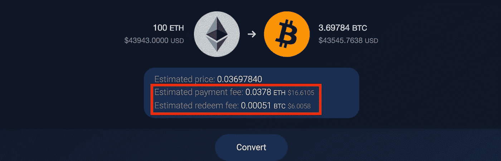
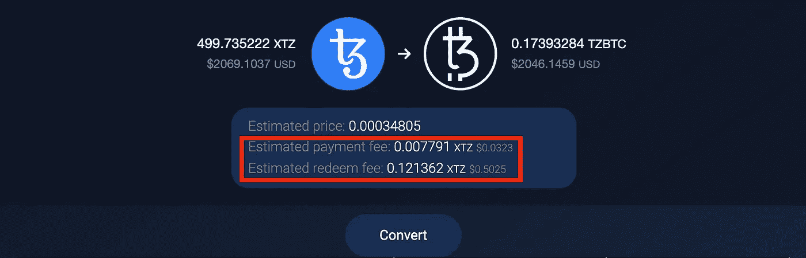
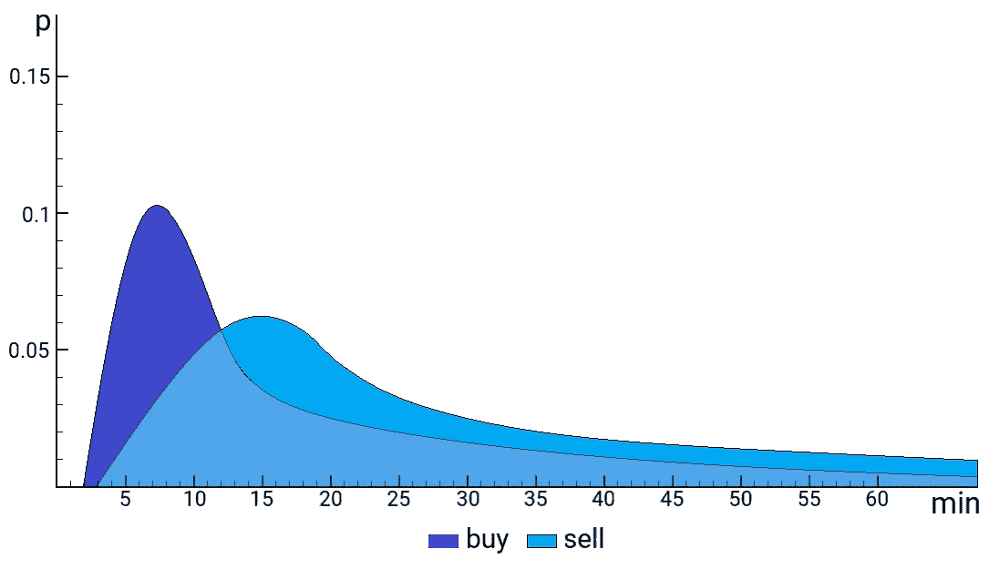
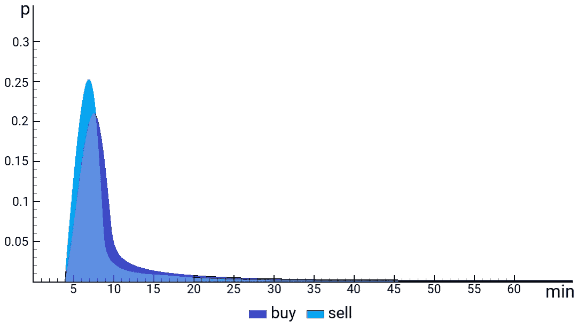

# 对 tzBTC 的去中心化兑换比对比特币便宜 10 倍

> 原文：<https://medium.com/coinmonks/decentralized-exchange-against-tzbtc-is-up-to-10-times-cheaper-than-against-bitcoin-a64fec2762ce?source=collection_archive---------4----------------------->

当我们在集中交易所交易时，我们已经习惯了这样一个事实，那就是我们交易的是哪一对交易对手并不重要——交易费用是由交易所设定的。作为一个集中的执行场所，在客户交易过程中，交易所不会对数字资产进行真正的链上操作。

# 分散交易所佣金

分散式交易所的性质完全不同。所有操作都要通过与真实交易的区块链进行交互。对于比特币和莱特币，交易是与以太坊、Tezos 或脚本中的智能合约进行交互所必需的。因此，在分散交易中有两种类型的佣金:

*   智能合同所有者的佣金(如果提供的话)。
*   与 DEX 互动时的交易费。

因此，在 DEX 上交易时，用户应该同时查看这两个参数，它们通常显示在与区块链的交互界面中。

# 原子互换交易佣金

当我们谈论通过像 Atomex 这样的原子交换进行跨链交换时，我们指的是两个不同区块链的相互作用。因此，重要的是要理解交易将在两种情况下在两个区块链发生:

*   如果交换成功，每个网络一个(启动费和赎回费)。
*   二合一网络，万一换货因为某种原因没有通过，会有退款(加盟费和退票费)。

例如，在用比特币交换以太坊的情况下，在写这篇文章时，你将支付超过 20 美元的佣金。你的交易对手将支付相同的金额。

Transaction fees with atomic swap ETH-BTC on Atomex

如你所知，通过分散兑换来兑换相对较少的金额是无利可图的。很明显，一切都取决于网络中的情况和选择的对。例如，从 XTZ 兑换到 BTC 只需 6 美元。

现在，假设你不仅想将一种货币兑换成另一种货币，还想进行投机交易。例如，你想抓住 Tezos 5–10%的价格变化，但在这种情况下，费用将占你利润的很大一部分。

# tzBTC 对 BTC 的交易

出路很简单，用 tzBTC token 交易 Tezos 兑比特币就可以了。tzBTC 是 Tezos 区块链上的代币，因此交易费以 Tezos 货币计，约为 0.12 XTZ(按当前汇率约为 0.5 美元)。你可以在[官方网站](https://tzbtc.io)上了解更多关于这个令牌的细节。最主要的是它的价值与 BTC 挂钩，所以汇率总是 1:1。

因此，我们得到 XTZ/tzBTC 交易的成本约为 0.5 美元。

Transaction fees with atomic swap XTZ-tzBTC on Atomex

当你用真正的比特币交易 XTZ/BTC 时，价格是 6 美元。

原来用 tzBTC 交易一对，盈利 10 倍以上！

# 交易速度

作为一个很好的奖励，你将看到与 tzBTC 的交易将更快地完成。Tezos 网络中每分钟都会形成一个新的区块，不像比特币网络，没有这样的速度。

对于 XTZ/BTC 或瑞士联邦理工学院/BTC 配对，平均而言，买入操作大约需要 15 分钟，卖出操作大约需要 25 分钟。有时这些操作可能需要 60 分钟甚至更长时间，这取决于比特币网络上交易的确认时间。

XTZ-BTC atomic swap operation time

使用 tzBTC 代替 BTC 可以大大节省时间，这是非常有用的，尤其是在高波动性的情况下。对于 XTZ/TZBTC 组合，买卖交易平均需要 7-8 分钟。最重要的是，15 分钟或更长时间的延迟是不可能的。

XTZ-tzBTC atomic swap operation time

用 ETH/TZBTC 对进行原子交换也需要大约 5-8 分钟！

# 结论

在本文中，我们将展示一个如何节省跨链 DEX 并提高交易执行速度的示例。如果你想交易 Tezos 汇率，并且你的金额对比特币区块链的高交易费敏感，你可以用与价值挂钩的 tzBTC 令牌取代 BTC。

与 [Atomex](https://atomex.me) 一起捕捉报价！

*原载于 2020 年 8 月 17 日*[*【https://baking-bad.org】*](https://baking-bad.org/blog/2020/08/17/decentralized-exchange-against-tzbtc-is-up-to-10-times-cheaper-than-against-bitcoin/)*。*

## 另外，阅读

*   最好的[加密交易机器人](/coinmonks/crypto-trading-bot-c2ffce8acb2a)
*   [密码本交易平台](/coinmonks/top-10-crypto-copy-trading-platforms-for-beginners-d0c37c7d698c)
*   最好的[加密税务软件](/coinmonks/best-crypto-tax-tool-for-my-money-72d4b430816b)
*   [最佳加密交易平台](/coinmonks/the-best-crypto-trading-platforms-in-2020-the-definitive-guide-updated-c72f8b874555)
*   最佳[加密借贷平台](/coinmonks/top-5-crypto-lending-platforms-in-2020-that-you-need-to-know-a1b675cec3fa)
*   [最佳区块链分析工具](https://bitquery.io/blog/best-blockchain-analysis-tools-and-software)
*   [加密套利](/coinmonks/crypto-arbitrage-guide-how-to-make-money-as-a-beginner-62bfe5c868f6)指南:新手如何赚钱
*   最佳[加密制图工具](/coinmonks/what-are-the-best-charting-platforms-for-cryptocurrency-trading-85aade584d80)
*   [莱杰 vs 特雷佐](/coinmonks/ledger-vs-trezor-best-hardware-wallet-to-secure-cryptocurrency-22c7a3fd391e)
*   了解比特币的[最佳书籍有哪些？](/coinmonks/what-are-the-best-books-to-learn-bitcoin-409aeb9aff4b)
*   [3 商业评论](/coinmonks/3commas-review-an-excellent-crypto-trading-bot-2020-1313a58bec92)
*   [AAX 交易所评论](/coinmonks/aax-exchange-review-2021-67c5ea09330c) |推荐代码、交易费用、利弊
*   [Deribit 审查](/coinmonks/deribit-review-options-fees-apis-and-testnet-2ca16c4bbdb2) |选项、费用、API 和 Testnet
*   [FTX 密码交易所评论](/coinmonks/ftx-crypto-exchange-review-53664ac1198f)
*   [n 零审核](/coinmonks/ngrave-zero-review-c465cf8307fc)
*   [Bybit 交换审查](/coinmonks/bybit-exchange-review-dbd570019b71)
*   [3Commas vs Cryptohopper](/coinmonks/cryptohopper-vs-3commas-vs-shrimpy-a2c16095b8fe)
*   最好的比特币[硬件钱包](/coinmonks/the-best-cryptocurrency-hardware-wallets-of-2020-e28b1c124069?source=friends_link&sk=324dd9ff8556ab578d71e7ad7658ad7c)
*   最佳 [monero 钱包](https://blog.coincodecap.com/best-monero-wallets)
*   [莱杰纳诺 s vs x](https://blog.coincodecap.com/ledger-nano-s-vs-x)
*   [bits gap vs 3 commas vs quad ency](https://blog.coincodecap.com/bitsgap-3commas-quadency)
*   [莱杰纳米 S vs 特雷佐 one vs 特雷佐 T vs 莱杰纳米 X](https://blog.coincodecap.com/ledger-nano-s-vs-trezor-one-ledger-nano-x-trezor-t)
*   [block fi vs Celsius](/coinmonks/blockfi-vs-celsius-vs-hodlnaut-8a1cc8c26630)vs Hodlnaut
*   Bitsgap 评论——一个轻松赚钱的加密交易机器人
*   为专业人士设计的加密交易机器人
*   [PrimeXBT 审查](/coinmonks/primexbt-review-88e0815be858) |杠杆交易、费用和交易
*   [埃利帕尔泰坦评论](/coinmonks/ellipal-titan-review-85e9071dd029)
*   [赛克斯·斯通评论](https://blog.coincodecap.com/secux-stone-hardware-wallet-review)
*   [BlockFi 评论](/coinmonks/blockfi-review-53096053c097) |从您的密码中赚取高达 8.6%的利息