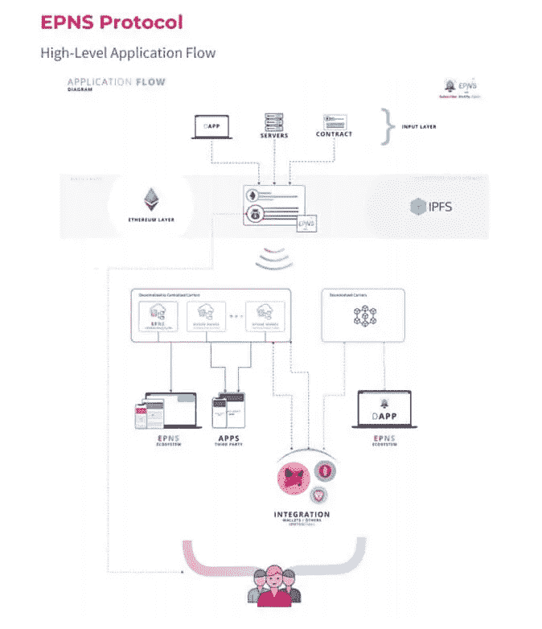
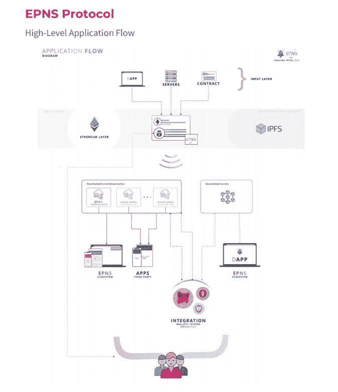

# 本地推送通知服务彻底改变了分散式金融

> 原文：<https://medium.com/coinmonks/decentralized-finance-revolutionized-with-native-push-notification-service-b8948e20a6b1?source=collection_archive---------3----------------------->

分散金融彻底改变了我们投资和交易的方式——跨 dApps 的互换、交易、借贷。我可以毫不犹豫地说，DeFi 最具革命性的方面之一就是我们将来接收推送通知的方式。

很难相信，仅在 10 年前，最流行的外汇交易软件 MetaTrader 还没有原生的推送通知服务。ETrade 是先行者，于 2009 年推出了移动推送通知。然而，所有这些通知仍然会发送到移动设备上的不同应用程序。如果你已经超过了投资组合的风险限额，可能需要一段时间来理清所有的警报。

我花了一段时间才意识到早期的区块链和早期的互联网非常相似。区块链，尽管有它所有的好处和进步，也有同样的早期问题；没有自动或推送通知系统。这就是以太坊推送通知服务(EPNS)想要解决的问题。EPNS 通过在一个地方聚合推送通知来降低这些风险。投资者可以迅速决定是否平仓或增仓，将资产转移到收入更高的赌注池，或采取其他行动。

基于区块链的通知服务是平台无关的和激励性的。服务提供商创建用户可以订阅的频道。所有频道都将消息发送到用户的钱包。所有用户使用该服务都将获得 100 美元的推送令牌奖励.

这是对移动交易推送通知警报存在之前的日子的回忆。今天，没有人会注册这项服务。同样，很快有一天，推送通知服务用户将开始期望在一个地方收到所有金融服务帐户的所有通知。一旦他们使用了 EPN，就再也不会回到过去那种孤立的通知系统了，

# 基于最新事件的用例:

2020 年 5 月， [Uniswap](https://cryptopurview.com/uniswap-uni-usd-price-live-charts/) 启动了其协议的 V2。此次发布需要大量的沟通和生态系统管理工作，因为 V2 AMM 的成功发布需要流动性提供者(LP)从 V1 迁移到 V2。由于 Uniswap 清晰的信息和社区可见性，有限合伙人的迁移是成功的——但仍然花了几个月的时间。

回想起来，联合国妇女和平研究所向 V2 的迁移本来可以得到一项通知服务的帮助，这项服务可以为联合国妇女和平研究所和和平服务社提供单一的信息和通信来源。Uniswap 将能够识别需要迁移到 V2 的 V1 LP 钱包，而不是依靠推文、电报消息和博客帖子来获得 LP 的支持。当时，不存在本地的、链上的方式来通知特定的合格钱包。

借助 EPNS， [Uniswap](https://cryptopurview.com/uniswap-uni-usd-price-live-charts/) 可以将通知发送给符合条件的钱包，从而更好地确保迁移过程中的沟通和参与。

# 谁在支持项目:

成立于 2020 年的 EPNS 已经[筹集了 141 万美元的种子资金](/ethereum-push-notification-service/epns-closes-10x-oversubscribed-extended-seed-round-ae03c60ae0f8)。收益将用于加速开发全球首个[分散通知协议](https://epns.io/)，允许服务(dApps、平台、服务、智能合约)以分散的方式与其用户(钱包地址)进行通信。EPNS 的 Alpha 版本已经上线，预计今年将公开推出服务。

收益分两轮筹集。回到 12 月，EPNS 从 Web 3.0 领导者和加密基金那里筹集了 75 万美元的种子投资，包括 Balaji Srinivasan(前比特币基地首席技术官，a16z 普通合伙人，Earn 的联合创始人)，Kenneth Ng(以太坊基金会)，Mariano Conti(前 MakerDAO 智能合同主管)等等。

在 3 月份的一轮融资中，EPNS 筹集了 66 万美元，参与投资的有几家风险投资公司，包括币安实验室、True Ventures、“神秘侠”(Mysterio)、IOSG、Bixin、Bitscale、LD Capital 和 BR Capital，以及行业领先企业 Sandeep nail wal(Polygon 的联合创始人)、Ajit Tripathi(Aave 的机构业务负责人)、Pareen(WazirX 的 AVP 营销)等。

# 谁与 EPNS 合作？

EPNS 正在积极地与著名项目签署合作协议和试点计划，以使分散式推送通知更加强大、高效和有趣。最近签署的合作包括:

*   不可阻挡的域名
*   [Uniswap](/ethereum-push-notification-service/accelerating-defi-with-epns-f2cbfaa33c91)
*   掩模网络
*   一起游泳
*   超流体
*   [阿尔法金融](/ethereum-push-notification-service/we-alpha-homora-innovations-in-defi-with-epns-3873f74dc48)等。

最近，EPNS 与 [Polygon(以前为 Matic)](https://cryptopurview.com/polygon-matic-usd-price-live-chart/) 合作，将 EPNS 扩展到可扩展的多链环境。Polygon 对整个生态系统起着至关重要的作用，因为它为以太坊扩展和基础设施开发提供了一个平台，这将极大地提高整个以太坊网络的能力。

与 Polygon 的合作伙伴关系将包括:

*   在 EPNS 协议中实施 Polygon 的基础设施，以提供可扩展的低成本通知。
*   为 Polygon 创建一个通道，并发送对其网络很重要的通知。
*   共同开发通知基础设施，以支持 Polygon 的“区块链互联网”愿景
*   为 MATIC 社区和多边形项目开发通知。以太坊生态系统推送通知的共同开发。

# 将为所有合作伙伴实施的高级应用流程:

> 加入 [Coinmonks 电报小组](https://t.me/joinchat/uiLERCQL1fQ5ZjA1)，了解加密交易和投资

## 另外，阅读

*   最好的[加密交易机器人](/coinmonks/crypto-trading-bot-c2ffce8acb2a) | [网格交易机器人](https://blog.coincodecap.com/grid-trading)
*   [加密复制交易平台](/coinmonks/top-10-crypto-copy-trading-platforms-for-beginners-d0c37c7d698c) | [如何在 WazirX 上购买比特币](/coinmonks/buy-bitcoin-on-wazirx-2d12b7989af1)
*   [CoinLoan 审核](/coinmonks/coinloan-review-18128b9badc4)|[Crypto.com 审核](/coinmonks/crypto-com-review-f143dca1f74c) | [火币保证金交易](/coinmonks/huobi-margin-trading-b3b06cdc1519)
*   [尤霍德勒 vs 考尼洛 vs 霍德诺特](/coinmonks/youhodler-vs-coinloan-vs-hodlnaut-b1050acde55a) | [Cryptohopper vs 哈斯博特](https://blog.coincodecap.com/cryptohopper-vs-haasbot)
*   [杠杆代币](/coinmonks/leveraged-token-3f5257808b22) | [最佳密码交易所](/coinmonks/crypto-exchange-dd2f9d6f3769) | [Paxful 点评](/coinmonks/paxful-review-4daf2354ab70)
*   [加密套利](/coinmonks/crypto-arbitrage-guide-how-to-make-money-as-a-beginner-62bfe5c868f6)指南| [如何做空比特币](/coinmonks/how-to-short-bitcoin-568a2d0b4ae5) | [1xBit 回顾](https://blog.coincodecap.com/1xbit-review)
*   [如何在印度购买比特币？](/coinmonks/buy-bitcoin-in-india-feb50ddfef94) | [WazirX 评论](/coinmonks/wazirx-review-5c811b074f5b) | [BitMEX 评论](https://blog.coincodecap.com/bitmex-review)
*   [印度比特币交易所](/coinmonks/bitcoin-exchange-in-india-7f1fe79715c9) | [比特币储蓄账户](/coinmonks/bitcoin-savings-account-e65b13f92451)
*   [币安收费](/coinmonks/binance-fees-8588ec17965) | [Botcrypto 审查](/coinmonks/botcrypto-review-2021-build-your-own-trading-bot-coincodecap-6b8332d736c7) | [Hotbit 审查](/coinmonks/hotbit-review-cd5bec41dafb) | [KuCoin 审查](https://blog.coincodecap.com/kucoin-review)
*   [我的密码交易经验](/coinmonks/my-experience-with-crypto-copy-trading-d6feb2ce3ac5) | [购买硬币评论](https://blog.coincodecap.com/buycoins-review)
*   [逐位融资融券交易](/coinmonks/bybit-margin-trading-e5071676244e) | [币安融资融券交易](/coinmonks/binance-margin-trading-c9eb5e9d2116) | [超位审核](/coinmonks/overbit-review-9446ed4f2188)
*   [加密货币储蓄账户](/coinmonks/cryptocurrency-savings-accounts-be3bc0feffbf) | [YoBit 审核](/coinmonks/yobit-review-175464162c62) | [Bitbns 审核](/coinmonks/bitbns-review-38256a07e161)
*   [Botsfolio vs nap bots vs Mudrex](/coinmonks/botsfolio-vs-napbots-vs-mudrex-c81344970c02)|[gate . io 交流回顾](/coinmonks/gate-io-exchange-review-61bf87b7078f)
*   [最佳比特币保证金交易](/coinmonks/bitcoin-margin-trading-exchange-bcbfcbf7b8e3) | [萝莉点评](/coinmonks/lolli-review-e6ddc7895ad8) | [比特币保证金交易](https://blog.coincodecap.com/bityard-margin-trading)
*   [创造并出售你的第一个 NFT](https://blog.coincodecap.com/create-nft) | [本地比特币评论](/coinmonks/localbitcoins-review-6cc001c6ed56)
*   [加密保证金交易交易所](/coinmonks/crypto-margin-trading-exchanges-428b1f7ad108) | [赚取比特币](/coinmonks/earn-bitcoin-6e8bd3c592d9) | [Mudrex 投资](https://blog.coincodecap.com/mudrex-invest-review-the-best-way-to-invest-in-crypto)
*   [如何在印度购买以太坊？](https://blog.coincodecap.com/buy-ethereum-in-india) | [如何在币安购买比特币](https://blog.coincodecap.com/buy-bitcoin-binance)
*   [顶级付费加密货币和区块链课程](https://blog.coincodecap.com/blockchain-courses) | [币安评论](/coinmonks/binance-review-ee10d3bf3b6e)
*   [MXC 交易所评论](/coinmonks/mxc-exchange-review-3af0ec1cba8c) | [Pionex vs 币安](https://blog.coincodecap.com/pionex-vs-binance) | [Pionex 套利机器人](https://blog.coincodecap.com/pionex-arbitrage-bot)
*   [在美国如何使用 BitMEX？](https://blog.coincodecap.com/use-bitmex-in-usa) | [BitMEX 评论](https://blog.coincodecap.com/bitmex-review)