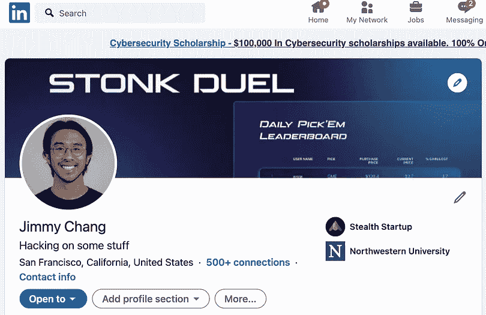
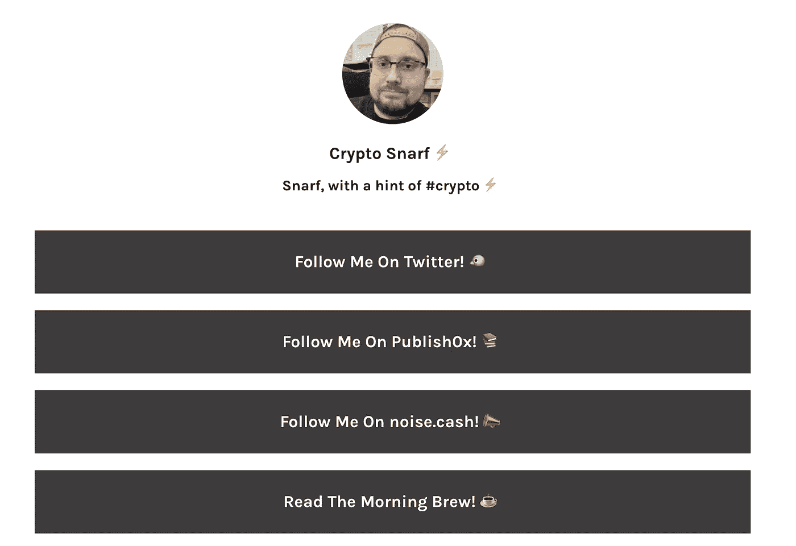

# 分散身份从拥有你的名字开始

> 原文：<https://medium.com/coinmonks/decentralized-identity-starts-with-owning-your-name-3fbfca9d8ff?source=collection_archive---------3----------------------->

## Web3 元宇宙仅适用于名称所有权


Source: [Medium](/@LoupVentures/the-metaverse-explained-part-1-an-inside-look-f6e15696ae0c)

作者注:这是我的 NFT 系列的第 4 部分。 [*点击这里阅读第一部分*](https://jimmy-chang.medium.com/how-did-nfts-become-so-popular-f894eea22f90) *，我在这里记录了 NFTs 的崛起。而* [*这里为 Part 2*](/the-shadow/the-metaverse-web3-and-the-inevitability-of-nfts-18c8fff1db2a) *，在这里我把它作为新世界的一个基础来谈。这里的* [*是第 3 部分，*](/geekculture/nfts-unlock-a-new-form-of-digital-identity-7145aa7b48c9) *我在这里谈到拥有我们的社交媒体内容+社交媒体作为我们的数字身份。*

你是谁？

我谅你也不会说出你的名字。

名字到底是什么？

它是声音和音节的集合。吉姆-我的昌。

What about my name in another language? What if I were Jaime in Spanish, or 张吉米 (weird name, I know) in Chinese? Do I identify as those names? Or am I just Jimmy Chang?

詹姆斯怎么办？昵称怎么样——金宝，吉姆，J？

对我来说，名字是键-值对中的一个键，这个键-值对返回大量关于你到底是谁*T21 的信息。*

```
"Job": "Product Manager"
"Location": "San Francisco, CA"
"Hobbies": [
    {
      "Primary": "Backpacking",
      "Second": "Fashion"
    }
]
```

*注意:这不是我做过的最好的 JSON 回应*

我的名字是构成我是谁的一个更大的元数据集合的标识符。我的工作，我的爱好，我的价值观，我的人际关系。

但是如果没有这个标识符，你就不可能成为某个人——我们需要名字来索引人们，并将他们组织成列表，以便以后找到他们。否则，每个人都会成为与他人相关的某个人。

"昨晚聚会上的那个人是谁？"

“谁？”

“我想他是你室友的女朋友在她上一家公司的同事”

“呃，不知道—对不起”

**TLDR；名字对我们的身份很重要。**

因此，让我们把这个名字的线索拉得更长一点，并带回我以前关于[元宇宙、Web3 和数字身份](/the-shadow/the-metaverse-web3-and-the-inevitability-of-nfts-18c8fff1db2a)的帖子。

概括地说，我认为我们的世界将慢慢走向元宇宙——首先是一个与他人社交的地方，然后是我们生活和工作的第二人生。

为了让元宇宙真正属于我们，而不是被那些利用它来赚取广告费的大公司所拥有，我们需要将元宇宙建立在开放、分散、无权限、抵制审查的原则之上。

这就是 NFT 的用武之地:一种可靠地、可验证地确保数字商品所有权的方法。

也就是说，如果我们希望元宇宙归人民所有，元宇宙的一切(我是说一切)都必须是 NFT 的:衣服、房屋、博物馆、公园、土地。

就像我们如何拥有这些东西一样，我们可以通过 NFTs 在数字平面中拥有它们。

但是与 IRL 不同的是，在数字世界中，我们还需要思考拥有我们自己的*身份*意味着什么。

我们是谁是真实世界固有的。我是吉米。当我出生时，国家给了我一张出生证明，上面写着我是谁。

每个和我交往过的人都知道我是谁，因为这反映在我们的交往中:我的价值观，我的言谈举止，我的外表。

元宇宙的情况并非如此。

人们可以[谎报自己的身份](https://en.wikipedia.org/wiki/Catfishing)。人们可以冒充名人以获取影响力，甚至恶意掠夺他人。

人们可以选择在网上展示自己最好的一面——这取决于环境。

正如我在我的[数字身份帖子](/geekculture/nfts-unlock-a-new-form-of-digital-identity-7145aa7b48c9)中提到的:

> 每个[社交媒体]平台都展示了我们的一个角色——我们整个人格的不同部分，我们将其打包到与上下文相关的互动中，无论是约会、社交、炫耀等。我们关心我们在网上的形象，因为在 Covid 期间，这已成为我们与家庭以外的世界互动的唯一方式。



Which profile is me? Or are they both me?

人们可以使用化名——主动选择将真实的物理自我与他们的网络化身分开。见鬼，人们甚至可以有多个假名，就像我们在社交媒体平台上有不同的个人资料一样。

所以为了将身份认同带入元宇宙，我们需要两个条件:

1.  证实你就是你所说的那个人
2.  将所有不同的角色整合成一个统一的身份

**我们通过 NFTs 做到这一点:以你的名字命名的 NFT。**

在元宇宙，你需要拥有自己的名字——在区块链证明你就是你所说的那个人。

回到我之前的类比，这个名字是键-值对中的键，因此当查询它时，会返回大量信息——这些信息实际上告诉其他人你是谁。

查询我的 NFT 名字(就叫它— jimmy.crypto)会返回我的 Twitter 账户、LinkedIn、我的出生日期、公民身份等。—有点像 [LinkTree](https://linktr.ee/) 但是是分散的和用户所有的，而不是一个托管和拥有你的身份的公司。



NFT names will replace Linktree

这个 NFT 用户名(我将把它称为分散身份)加密了它的所有底层信息，因此个人可以只授予某些人读取敏感信息的权限/ PII。

像您的 Twitter 句柄这样的公共信息可能会暴露给任何查询分散身份的人。

但假设你想在元宇宙购买数字啤酒，法定年龄是 21 岁。你出现在数字酒类商店，数字收银员要求你出示身份证。

她 pings 你的分散身份，并询问你是否超过 21 岁。你没有回你的出生日期，只是回了一个简单的“是/否”的答案——认为她没有必要知道你的确切年龄。

再比如如果你想从数字纽约飞到(即瞬移)数字巴黎。在数字巴黎机场的数字海关，数字海关官员会问你是否有进入的许可。他查询你的分散名字，它返回“是的，我有权限”。他不需要知道你的出生日期，甚至你的国籍；但是，它可以登录到一个加密系统，供数字法国日后查看。那个特定的官员不需要知道。

最棒的是，你不必做你在元宇宙时的样子。

就像在 *Spy Kids 3D* 或 *Ready Player One* 中一样，你可以成为你真正想成为的任何人，拥有一个分散的身份应该能够实现这一点——而不是限制你的 IRL 身份。

[梅塔科万](https://twitter.com/metakovan?lang=en)，这位[6900 万美元 NFT](https://www.theverge.com/2021/3/11/22325054/beeple-christies-nft-sale-cost-everydays-69-million) 的购买者，称假名是“外衣”而不是“面具”。人们没有在网上隐藏自己，他们在给自己充电——在一个没有任何约束的世界里，让自己成为他们想成为的人。

[Balaji Srinivasan](https://twitter.com/balajis) ，一位著名的加密企业家，参加了 Tim Ferriss 的节目，并谈到了一个真正的假名世界——为了不让我们的 IRL 自己因为我们在数字世界中的所作所为而受到任何 IRL 伤害(例如，因为在 Twitter 上发布一些东西而受到死亡威胁)。

许多著名的加密开发人员，比如 0xMaki，选择使用假名——本着加密的精神，它的创造者 Satoshi Nakomoto 也不是不合法的。

即使加密行业需要遵守像 KYC 这样的国际金融法规，分散的身份也能以一种安全的方式轻松实现这一点。

目前，来自 KYC 进程的 PII 存储在银行和密码交易所的中央服务器中。如果这些集中的数据库被黑客攻击或泄露，这些信息可能会泄露给公众。

对于分散的身份，这种情况永远不会发生，因为 PII 在区块链中是加密的，只能通过个人拥有的私钥访问，这意味着没有中心位置来存储这些信息，没有公司(或任何人)可以访问这些信息。

分散的身份提供了许可的 PII，而不用担心它泄露给世界——使用的原则与比特币如何从一个地址发送到另一个地址而不会在中间被泄露相同。

*如果你认为这篇博文值得你花 5 分钟来阅读，请帮我在下面鼓掌(最多 50 次)或者与一个会从这篇内容中受益的朋友分享。非常感谢！*