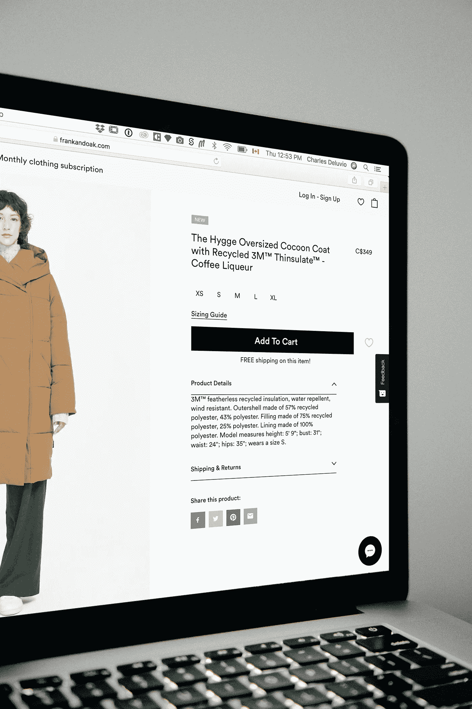

# 分散的 ML:第一部分(导言)

> 原文：<https://medium.com/coinmonks/decentralized-ml-part-i-introduction-695cdcb864ff?source=collection_archive---------6----------------------->

分散式机器学习系列的第一部分通过一个直观的例子着重于理解分散化的必要性。

Photo by [Clint Adair](https://unsplash.com/@clintadair?utm_source=unsplash&utm_medium=referral&utm_content=creditCopyText) on [Unsplash](https://unsplash.com/s/photos/network?utm_source=unsplash&utm_medium=referral&utm_content=creditCopyText)

*这是主题为* [*去中心化机器学习*](https://www.quora.com/q/mqociezojalnmhew) *的系列博客的第一部分。在整个系列中，我将介绍分散化机器学习领域，解释分散化的必要性，涵盖一些用于实现分散化的工具和技术，并通过提供该领域当前研究现状和开放问题的详细说明来结束系列。我目前还没有决定我计划在该系列中提供的零件数量，但请继续关注更多信息。*

*加入我的* [*Quora 空间*](https://www.quora.com/q/mqociezojalnmhew) *，获取关于去中心化机器学习的定期新闻和更新。由于在构建和研究分散式机器学习系统方面经验丰富，我将发布关于学术界和行业最新进展的原创内容。请访问我的* [*个人网站*](https://vivekkhimani.github.io/) *了解更多关于我的教育、技能、经历和资历的详细信息。*

Photo by [energepic.com](https://www.pexels.com/@energepic-com-27411?utm_content=attributionCopyText&utm_medium=referral&utm_source=pexels) from [Pexels](https://www.pexels.com/photo/blue-and-yellow-graph-on-stock-market-monitor-159888/?utm_content=attributionCopyText&utm_medium=referral&utm_source=pexels)

机器学习和数据科学作为一个整体，目前是一个非常蓬勃发展的领域，因为它能够提供强大的解决方案，这可能是使用基于规则的程序所无法想象的。然而，数据是任何机器学习系统的最大瓶颈。今天，虽然我们可能能够想到真正创新的基于机器学习的解决方案，但如果没有相关数据，实际上不可能实现任何一个。

Photo by [Pixabay](https://www.pexels.com/@pixabay?utm_content=attributionCopyText&utm_medium=referral&utm_source=pexels) from [Pexels](https://www.pexels.com/photo/internet-screen-security-protection-60504/?utm_content=attributionCopyText&utm_medium=referral&utm_source=pexels)

虽然有很多方法可以从 web 上获取公开可用的数据，但实际上不可能获取对用户或组织来说可能是私有的数据。根据我的说法，我们在坚持安全和隐私原则的同时间接利用私人数据的能力将实际上决定未来机器学习的范围。尽管使用公开可用的数据构建大量解决方案实际上是可能的，但我们在某个时候会走进死胡同。

Photo by [Charles Deluvio](https://unsplash.com/@charlesdeluvio?utm_source=unsplash&utm_medium=referral&utm_content=creditCopyText) on [Unsplash](https://unsplash.com/s/photos/ecommerce?utm_source=unsplash&utm_medium=referral&utm_content=creditCopyText)

更重要的是，私人数据的不可用性对我们能够提供的解决方案的类型施加了各种限制。例如，我们经常在电子商务网站上看到的购买推荐系统提供了可靠的建议，使我们的生活变得更加轻松。但是，由于它只针对其他用户的购买实践和组织专有的数据进行培训，因此存在一些我们几乎没有注意到的限制。想象一个场景，很多人同时购买了 20 美元的笔记本电脑套和 2000 美元的笔记本电脑。因此，如果您的购物车中只有一个 20 美元的笔记本电脑套，系统很有可能会推荐您购买 2000 美元的笔记本电脑。这有时可能会令人恼火，但除非电子商务组织能够了解买家的预算或银行余额，否则无法解决这个问题。如果电子商务推荐者知道你的银行账户中没有足够的余额，或者你的信用卡没有足够的限额，它就不会推荐你购买 2000 美元的笔记本电脑。同样，如果银行能够从电子商务网站上了解客户的购物偏好，它们也可以为客户提供更多的定制产品、服务和优惠。然而，为了确保其用户的隐私，这些组织不能彼此直接共享数据。

Photo by [Terry](https://unsplash.com/@blueskin?utm_source=unsplash&utm_medium=referral&utm_content=creditCopyText) on [Unsplash](https://unsplash.com/s/photos/blockchain?utm_source=unsplash&utm_medium=referral&utm_content=creditCopyText)

因此，虽然机器学习目前是一个蓬勃发展的领域，但它在未来可能不一定相关。虽然我们在机器学习和深度学习领域取得了巨大的进步，但还有很多问题需要解决，其中最直接的就是数据的*去中心化。尽管近年来在该领域做了大量的研究，但仍存在许多问题(安全性、可伸缩性、架构等。)仍然没有解决。*

**在接下来的几篇文章中，我计划介绍可以用来在机器学习环境中实现去中心化的工具和技术。除了引言之外，我将在文章末尾提供博客和资源，这将有助于你扩展所提供的信息。当心* ***去中心化 ML:第二部分(区块链基础)。*** *感谢阅读！**

**同样，如果你希望获得关于分散式机器学习的定期新闻和更新，请关注我在*[*Quora*](https://www.quora.com/q/mqociezojalnmhew)*上的空间。基于我作为一名研究人员的经验，我将分享与分散式机器学习领域的工业和学术进展相关的原创内容。**

## *另外，阅读*

*   *最好的[密码交易机器人](/coinmonks/crypto-trading-bot-c2ffce8acb2a)*
*   *[密码本交易平台](/coinmonks/top-10-crypto-copy-trading-platforms-for-beginners-d0c37c7d698c)*
*   *最好的[加密税务软件](/coinmonks/best-crypto-tax-tool-for-my-money-72d4b430816b)*
*   *[最佳加密交易平台](/coinmonks/the-best-crypto-trading-platforms-in-2020-the-definitive-guide-updated-c72f8b874555)*
*   *最佳[加密贷款平台](/coinmonks/top-5-crypto-lending-platforms-in-2020-that-you-need-to-know-a1b675cec3fa)*
*   *[最佳区块链分析工具](https://bitquery.io/blog/best-blockchain-analysis-tools-and-software)*
*   *[加密套利](/coinmonks/crypto-arbitrage-guide-how-to-make-money-as-a-beginner-62bfe5c868f6)指南:新手如何赚钱*
*   *最佳[加密制图工具](/coinmonks/what-are-the-best-charting-platforms-for-cryptocurrency-trading-85aade584d80)*
*   *[莱杰 vs 特雷佐](/coinmonks/ledger-vs-trezor-best-hardware-wallet-to-secure-cryptocurrency-22c7a3fd391e)*
*   *了解比特币最好的[书籍有哪些？](/coinmonks/what-are-the-best-books-to-learn-bitcoin-409aeb9aff4b)*
*   *[3 商业评论](/coinmonks/3commas-review-an-excellent-crypto-trading-bot-2020-1313a58bec92)*
*   *[AAX 交易所评论](/coinmonks/aax-exchange-review-2021-67c5ea09330c) |推荐代码、交易费用、利弊*
*   *[Deribit 审查](/coinmonks/deribit-review-options-fees-apis-and-testnet-2ca16c4bbdb2) |选项、费用、API 和 Testnet*
*   *[FTX 密码交易所评论](/coinmonks/ftx-crypto-exchange-review-53664ac1198f)*
*   *[n 零审核](/coinmonks/ngrave-zero-review-c465cf8307fc)*
*   *[Bybit 交换审查](/coinmonks/bybit-exchange-review-dbd570019b71)*
*   *[3Commas vs Cryptohopper](/coinmonks/cryptohopper-vs-3commas-vs-shrimpy-a2c16095b8fe)*
*   *最好的比特币[硬件钱包](/coinmonks/the-best-cryptocurrency-hardware-wallets-of-2020-e28b1c124069?source=friends_link&sk=324dd9ff8556ab578d71e7ad7658ad7c)*
*   *最佳 [monero 钱包](https://blog.coincodecap.com/best-monero-wallets)*
*   *[莱杰 nano s vs x](https://blog.coincodecap.com/ledger-nano-s-vs-x)*
*   *[bits gap vs 3 commas vs quad ency](https://blog.coincodecap.com/bitsgap-3commas-quadency)*
*   *[莱杰纳米 S vs 特雷佐 1 vs 特雷佐 T vs 莱杰纳米 X](https://blog.coincodecap.com/ledger-nano-s-vs-trezor-one-ledger-nano-x-trezor-t)*
*   *[block fi vs Celsius](/coinmonks/blockfi-vs-celsius-vs-hodlnaut-8a1cc8c26630)vs Hodlnaut*
*   *Bitsgap 评论——一个轻松赚钱的加密交易机器人*
*   *为专业人士设计的加密交易机器人*
*   *[PrimeXBT 审查](/coinmonks/primexbt-review-88e0815be858) |杠杆交易、费用和交易*
*   *[埃利帕尔泰坦评论](/coinmonks/ellipal-titan-review-85e9071dd029)*
*   *[SecuX Stone 评论](https://blog.coincodecap.com/secux-stone-hardware-wallet-review)*
*   *[BlockFi 评论](/coinmonks/blockfi-review-53096053c097) |从您的密码中赚取高达 8.6%的利息*