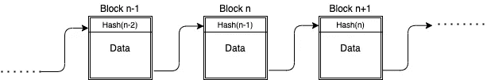
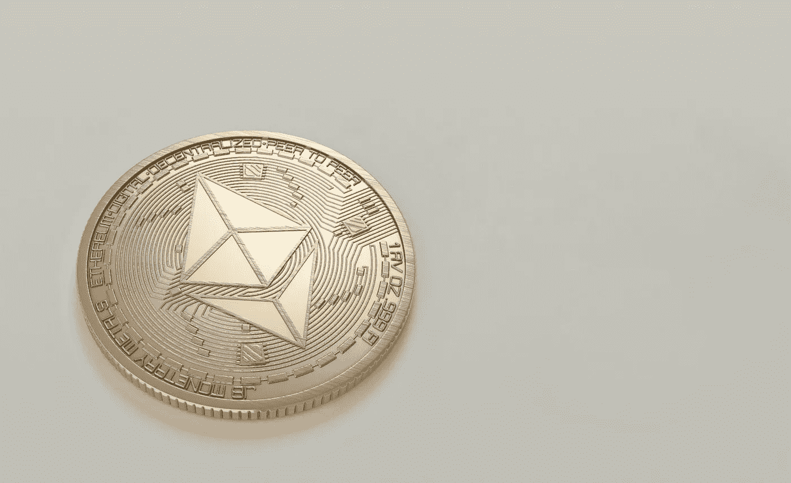

# 去中心化 ML:第二部分(区块链基础)

> 原文：<https://medium.com/coinmonks/decentralized-ml-part-ii-blockchain-basics-51948d926666?source=collection_archive---------3----------------------->

去中心化机器学习系列的第二部分介绍了区块链的基本概念，这是一种用于去中心化的工具。

Photo by [Launchpresso](https://unsplash.com/@launchpresso?utm_source=unsplash&utm_medium=referral&utm_content=creditCopyText) on [Unsplash](https://unsplash.com/s/photos/blockchain?utm_source=unsplash&utm_medium=referral&utm_content=creditCopyText)

*这是主题为* [*去中心化机器学习*](https://www.quora.com/q/mqociezojalnmhew) *的系列博客的第二部分。在整个系列中，我将介绍分散化机器学习领域，解释分散化的必要性，涵盖一些用于实现分散化的工具和技术，并通过提供该领域当前研究现状和开放问题的详细说明来结束系列。我目前还没有决定我计划在该系列中提供的零件数量，但请继续关注更多信息。*

*加入我的* [*Quora 空间*](https://www.quora.com/q/mqociezojalnmhew) *，获取关于去中心化机器学习的定期新闻和更新。由于在构建和研究分散式机器学习系统方面经验丰富，我将发布关于学术界和行业最新进展的原创内容。请访问我的* [*个人网站*](https://vivekkhimani.github.io/) *了解更多关于我的教育、技能、经历和资历的详细信息。*

思考 ***去中心化*** 总的来说，区块链无疑是我们首先想到的技术。然而，在深入挖掘区块链的基本细节和建筑之前，有必要澄清一些人们通常对区块链的误解。

Photo by [Wendelin Jacober](https://www.pexels.com/@wendelinjacober?utm_content=attributionCopyText&utm_medium=referral&utm_source=pexels) from [Pexels](https://www.pexels.com/photo/red-and-white-stop-road-signage-1411397/?utm_content=attributionCopyText&utm_medium=referral&utm_source=pexels)

最重要的一点是比特币和区块链的区别。虽然加密货币近年来已经成为区块链的主要应用之一，但重要的是要理解它并不能概括区块链的整体概念。此外，很多人喜欢把区块链想象成一个不可编辑的数据库。尽管区块链是一个具有存储数据能力的不可变结构，但在关系特性、查询和可伸缩性方面，它永远无法与现代数据库相比。毫无疑问，这些概念是获得关于区块链工作和应用的直觉的良好起点，但重要的是理解更广泛的想法，将区块链应用于更广泛的原则，如 ***分散式机器学习。***

顾名思义，在最基本的层次上，区块链是一个数据结构，可以用一串块来表示。然而，区块链的重要性源于这样一个事实，即每个块都有能力*存储数据*，并且它们使用*链式*结构连接(和排序)在一起。

Photo by [MESSALA CIULLA](https://www.pexels.com/@messalaciulla?utm_content=attributionCopyText&utm_medium=referral&utm_source=pexels) from [Pexels](https://www.pexels.com/photo/notebook-with-blank-pages-942872/?utm_content=attributionCopyText&utm_medium=referral&utm_source=pexels) & [Damir Kopezhanov](https://unsplash.com/@kpzhnv?utm_source=unsplash&utm_medium=referral&utm_content=creditCopyText) on [Unsplash](https://unsplash.com/s/photos/office?utm_source=unsplash&utm_medium=referral&utm_content=creditCopyText)

让我描述一个我经常用来描述区块链基本思想的类比。想象一个*空白精装*笔记本，在办公室里用来记录员工的出勤情况。根据经验，每位员工每天早上进入办公室时都必须输入姓名、报到时间和签名。这本书最初没有写任何东西，但是*所有的员工*都可以在书上登记。此外，数据必须在同一页面上输入。只有当上一页被完全填满时，员工才能开始使用新的一页。但是，有几个条件:

*   没有授权的(或集中的)人员跟踪记录簿中输入的记录
*   一旦员工输入了数据，就不允许对其进行修改
*   员工登录时，办公室里的每个人都会验证输入的签到时间是否正确，而不是中央机关。只有在办公室至少有 *67%* 人同意签到时间时，该条目才能生效
*   由于这本书是精装的，从书中撕下任何一页都会毁掉整本书，系统也会崩溃

正如您所注意到的，在办公室中维护这样一个出勤规程将完全消除对跟踪出勤情况的集中授权的需要。在个人(或团队)中央集权的情况下，许多员工可以通过说服该权力对他有利来危害系统。但是对于一个人来说，要说服 *67%* 的员工为他说谎是极其困难的。因此，这种系统被称为 ***分散系统*** ，在没有集中权力监督系统的情况下，参与者可以独立运行。正如我们所注意到的，即使在没有中央集权的情况下，也很难(在生产级区块链的情况下几乎不可能)破坏这个系统。

Blockchain Structure

现在，让我们看看这个天真设计的出勤记录系统如何应用于区块链的概念。在区块链中，*区块*类似于*页面*，*参与者*类似于构成网络的*员工*。类似于办公室设置，参与者被允许*将数据*存储在最近的*块(页面)*上，并且在最近的块被完全填满之前，没有新的块被添加到链中。一旦块被数据填充，它就被添加到链中，并且被称为*矿工*的参与者子集负责验证数据。同样，真正的区块链通常有一个强有力的共识协议，这有助于它坚持真实性，并为矿工的贡献支付报酬。由于区块链上的数据存储在顺序连接的数据块上，因此不可能删除或修改任何数据块，因为这将破坏数据链。

Photo by [Moose Photos](https://www.pexels.com/@moose-photos-170195?utm_content=attributionCopyText&utm_medium=referral&utm_source=pexels) from [Pexels](https://www.pexels.com/photo/round-gold-colored-ethereum-coin-1036637/?utm_content=attributionCopyText&utm_medium=referral&utm_source=pexels)

如前所述，区块链架构目前被广泛用于开发加密货币。在这种情况下，所有块都存储了*交易数据*和*矿工*负责验证交易的真实性。然而，以太坊区块链也允许用户在区块链上存储自定义数据，并构建完全分散的应用程序。他们还提供了一种叫做*可靠性*的特殊图灵完整语言，可以用来开发网络中其他参与者可以调用的方法。Solidity 允许用户存储自定义数据(字符串、整数、映射等。)并执行基本操作(算术、循环等)。)在区块链上。然而，值得注意的是，与现代编程语言相比，Solidity 提供的功能极其有限，因为参与者需要为区块链上的*存储*和*操作*支付数据。例如，如果参与者调用部署在区块链上的智能协定方法，该方法遍历字符串数组，执行某些操作，并将结果存储在区块链上，则被调用者将支付费用，除非智能协定中另有规定。智能合约还允许在区块链上执行交易。这意味着我可以向任何拥有有效以太坊地址的参与者付款或收款。尽管当前的智能合约编程环境存在许多限制和可扩展性问题，但仍有可能构建极具创意的分散式应用程序，并且还有大量 API 和工具可用于从外部环境连接智能合约(web3 是最受欢迎的一个)。例如，一个非常受欢迎的初学者项目是在区块链上建立一个电子商务平台，以确保买方和卖方之间的透明度。我们将使用一套类似的区块链开发工具来构建和部署 ***分散式机器学习*** 应用。因为很难在一篇文章中涵盖所有的工具和概念，所以我将在文章的最后分享一些资源，并且当我在接下来的文章中讨论一些有趣的研究发现时，我也会解释不同的组成部分。

在真实的区块链中，有许多固有的细节，如共识协议、矿工补偿、块地址、链接等。我无法在这篇文章中讲述。此外，还有各种各样的漏洞(如谁将验证第一个雇员的进入，验证方法的实际含义和可扩展性等。)在我们上面讨论的天真设计的出席协议中。此外，我知道真正先进的自动化系统已经可以跟踪员工的出勤和签到时间。但是，这个例子足以让你对这个概念有一个全面的了解。然而，我会在文章最后提供相关的链接和资源，这将有助于你扩展我们从这篇文章中获得的知识。

Photo by [Pixabay](https://www.pexels.com/@pixabay?utm_content=attributionCopyText&utm_medium=referral&utm_source=pexels) from [Pexels](https://www.pexels.com/photo/black-and-white-blackboard-business-chalkboard-356043/?utm_content=attributionCopyText&utm_medium=referral&utm_source=pexels)

最后，正如我在上一篇文章中的承诺，这里有一大堆在线资源(博客、视频、在线课程等)。)这将帮助你更深入地了解区块链的世界:

*   ***在线课程:***
*   [区块链](https://www.coursera.org/specializations/blockchain) (Coursera 专业化)
*   [区块链](https://www.edx.org/learn/blockchain) (Edx)
*   ***博客:***
*   [区块链讲解](https://www.investopedia.com/terms/b/blockchain.asp)
*   [如何用以太坊搭建区块链 App，Web3.js & Solidity 智能合约| Dapp 大学](https://www.dappuniversity.com/articles/how-to-build-a-blockchain-app#preview)
*   [区块链有哪些智能合约？—区块链脉搏:IBM 区块链博客](https://www.ibm.com/blogs/blockchain/2018/07/what-are-smart-contracts-on-blockchain/#%3A~%3Atext%3DSmart%20contracts%20are%20lines%20of%2Cthe%20people%20who%20developed%20them)。
*   [构建集成 web 3 监控的以太坊 DApp 教程](https://www.moesif.com/blog/blockchain/ethereum/Tutorial-for-building-Ethereum-Dapp-with-Integrated-Error-Monitoring/)
*   [终极以太坊 Dapp 教程(如何一步一步搭建全栈去中心化应用)| Dapp 大学](https://www.dappuniversity.com/articles/the-ultimate-ethereum-dapp-tutorial)

一般来说，理解区块链、区块链开发和智能合约编程的基础知识，将对我们探索 ***分散式机器学习的旅程非常有帮助。*** 尽管有局限性，我们还是会注意到研究人员是如何在复杂的机器学习系统中频繁使用区块链来实现去中心化的。

*在接下来的几篇文章中，我计划介绍可以用来在机器学习环境中实现去中心化的工具和技术。除了引言之外，我将在文章末尾提供博客和资源，这将有助于你扩展所提供的信息。当心* ***去中心化 ML:第三部分(以太坊)。*** *感谢阅读！*

*同样，如果你希望获得关于分散式机器学习的定期新闻和更新，请关注我在*[*Quora*](https://www.quora.com/q/mqociezojalnmhew)*上的空间。基于我作为一名研究人员的经验，我将分享与分散式机器学习领域的工业和学术进展相关的原创内容。*

## 另外，阅读

*   最好的[密码交易机器人](/coinmonks/crypto-trading-bot-c2ffce8acb2a)
*   [密码本交易平台](/coinmonks/top-10-crypto-copy-trading-platforms-for-beginners-d0c37c7d698c)
*   最好的[加密税务软件](/coinmonks/best-crypto-tax-tool-for-my-money-72d4b430816b)
*   [最佳加密交易平台](/coinmonks/the-best-crypto-trading-platforms-in-2020-the-definitive-guide-updated-c72f8b874555)
*   最佳[加密贷款平台](/coinmonks/top-5-crypto-lending-platforms-in-2020-that-you-need-to-know-a1b675cec3fa)
*   [最佳区块链分析工具](https://bitquery.io/blog/best-blockchain-analysis-tools-and-software)
*   [加密套利](/coinmonks/crypto-arbitrage-guide-how-to-make-money-as-a-beginner-62bfe5c868f6)指南:新手如何赚钱
*   最佳[加密制图工具](/coinmonks/what-are-the-best-charting-platforms-for-cryptocurrency-trading-85aade584d80)
*   [莱杰 vs 特雷佐](/coinmonks/ledger-vs-trezor-best-hardware-wallet-to-secure-cryptocurrency-22c7a3fd391e)
*   了解比特币最好的[书籍有哪些？](/coinmonks/what-are-the-best-books-to-learn-bitcoin-409aeb9aff4b)
*   [3 商业评论](/coinmonks/3commas-review-an-excellent-crypto-trading-bot-2020-1313a58bec92)
*   [AAX 交易所评论](/coinmonks/aax-exchange-review-2021-67c5ea09330c) |推荐代码、交易费用、利弊
*   [德里比特评论](/coinmonks/deribit-review-options-fees-apis-and-testnet-2ca16c4bbdb2) |选项、费用、API 和 Testnet
*   [FTX 密码交易所评论](/coinmonks/ftx-crypto-exchange-review-53664ac1198f)
*   [n 零审核](/coinmonks/ngrave-zero-review-c465cf8307fc)
*   [Bybit 交换审查](/coinmonks/bybit-exchange-review-dbd570019b71)
*   [3Commas vs Cryptohopper](/coinmonks/cryptohopper-vs-3commas-vs-shrimpy-a2c16095b8fe)
*   最好的比特币[硬件钱包](/coinmonks/the-best-cryptocurrency-hardware-wallets-of-2020-e28b1c124069?source=friends_link&sk=324dd9ff8556ab578d71e7ad7658ad7c)
*   最佳 [monero 钱包](https://blog.coincodecap.com/best-monero-wallets)
*   [莱杰 nano s vs x](https://blog.coincodecap.com/ledger-nano-s-vs-x)
*   [bits gap vs 3 commas vs quad ency](https://blog.coincodecap.com/bitsgap-3commas-quadency)
*   [莱杰纳米 S vs 特雷佐 one vs 特雷佐 T vs 莱杰纳米 X](https://blog.coincodecap.com/ledger-nano-s-vs-trezor-one-ledger-nano-x-trezor-t)
*   [block fi vs Celsius](/coinmonks/blockfi-vs-celsius-vs-hodlnaut-8a1cc8c26630)vs Hodlnaut
*   Bitsgap 评论——一个轻松赚钱的加密交易机器人
*   为专业人士设计的加密交易机器人
*   [PrimeXBT 审查](/coinmonks/primexbt-review-88e0815be858) |杠杆交易、费用和交易
*   [埃利帕尔泰坦评论](/coinmonks/ellipal-titan-review-85e9071dd029)
*   [SecuX Stone 评论](https://blog.coincodecap.com/secux-stone-hardware-wallet-review)
*   [BlockFi 评论](/coinmonks/blockfi-review-53096053c097) |从您的密码中赚取高达 8.6%的利息