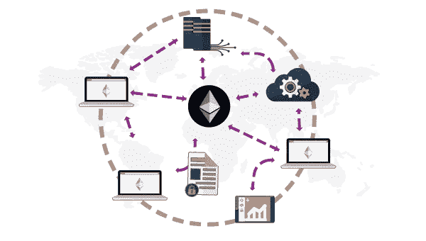

# 分散式 Oracle 网络

> 原文：<https://medium.com/coinmonks/decentralized-oracle-networks-9fead28f5fe5?source=collection_archive---------1----------------------->

> 每一场战斗都是在开战前就赢得了。真正的赢家只有在上场的那一刻就知道自己已经赢了，才会去比赛。与有可能获胜的另一个队一起比赛是准备工作的失败，也是纪律不够严明的证据。-战争的艺术

