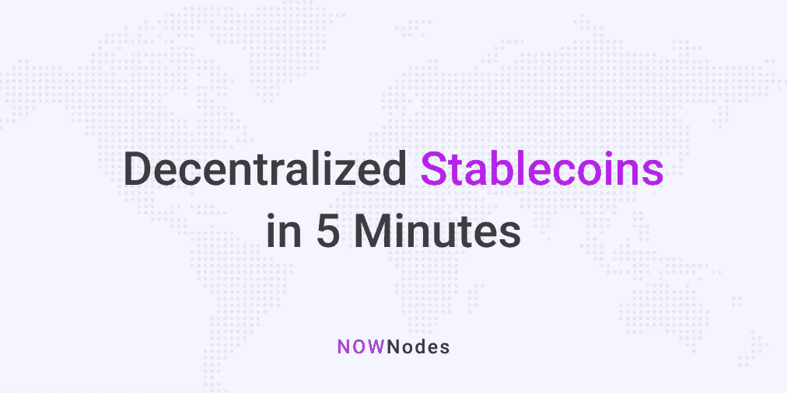

# 分散稳定在 5 分钟内

> 原文：<https://medium.com/coinmonks/decentralized-stablecoins-in-5-minutes-1a88a656bc06?source=collection_archive---------3----------------------->

## 最初发表于 [NOWNodes 博客](https://nownodes.io/blog/decentralized-stablecoins-in-5-minutes)

在我们深入探讨分散化[稳定资本](https://blog.coincodecap.com/stablecoins-a-simple-overview)的话题之前，让我们快速回顾一下稳定资本。那么，稳定币到底是什么？它是一种加密货币。但与大多数加密货币不同，稳定币的价值与一个国家或多个国家的法定货币挂钩。不仅国家货币，而且稳定的货币也与实物资产挂钩。基本上，稳定货币是一种加密货币，其价值由一种或多种金融资产支持。

# 稳定圈有哪些类型？

稳定资产类别基于支持稳定资产价值的资产。有四种类型的稳定图标:

(一)法定抵押稳定债券

(二)商品抵押债券

(三)加密担保稳定债券

(四)无抵押的稳定债券

# 菲亚特抵押债券

当谈到最常见的稳定硬币类型时，菲亚特抵押的稳定硬币领先于一批稳定硬币。这些稳定的货币的价值由一种或多种法定货币支持。这里最流行的法定货币是美元、欧元和英镑。

每种法定担保的稳定货币与各自法定货币的比率为 1:1。这意味着 1 美元支持的稳定币相当于 1 美元单位。对于流通中的每一种稳定的货币，都需要等量的法定货币来支持。支持法定抵押债券的金额通常存在银行账户中。

假设某人有 100 美元支持的稳定货币。现在，他想把稳定的硬币兑换成等量的美元。因此，管理马房的公司将通过他们的储备金向他的银行账户汇 100 美元。那么，如果有人把 100 美元支持的稳定债券兑换成法定美元，会发生什么呢？它要么被销毁，要么 100 美元支持的稳定硬币将从流通中被移除。

# 商品抵押债券

商品抵押债券不是由法定货币支持，而是由贵金属等资产支持。事实证明，黄金是商品抵押债券领域最常见的商品。房地产、其他贵金属和石油等其他资产也被用作抵押品来创造商品抵押债券。

持有商品抵押稳定货币的优势在于，它的持有者实际上分享了一些有实际价值的东西——不像大多数加密货币。如果担保资产的价格在未来上涨，这类稳定债券的持有者也能从中受益。

# 加密抵押债券

加密抵押品 stablecoins 由领先的加密货币如比特币和以太坊支持。这些稳定的货币比那些由法定货币和各种商品支持的货币分散得多。超额抵押是秘密抵押稳定信贷的一大部分。为什么会这样呢？它起到对冲价格波动风险的作用。它有助于加密抵押债券吸收价格波动。

例如，要获得价值 100 美元的加密抵押稳定币，你必须存入价值 150 美元的 ETH。你可以看到这里的抵押率是 200%。现在，即使基础资产价格下跌，稳定的债券也能够承受价格贬值。但是如果价格下跌足够低，那么稳定的硬币将会自动平仓。

你想要可靠、安全、透明的稳定密码吗？加密抵押债券是你最好的朋友。这是因为它们比菲亚特和商品支持的 stablecoins 分散得多。谈到加密抵押稳定币基金，没有一个实体说了算。它们也有更好的风险分配，因为它们通常由多种加密货币支持。

如果你选择这些类型的稳定债券，你也将受益于其较高的流动性。这些稳定的密码也可以以低廉的价格转换成底层的加密资产。但它们也是最复杂的稳定货币之一，因此，它们没有看到法定支持的加密货币所具有的那种吸引力。

你知道哪种加密担保的稳定币最受欢迎吗？你一定听说过这件事。没错，我说的就是马可道的戴。这是一种稳定的货币，其价值得到了 ETH 的支持。戴的面值与美元挂钩，抵押的 ETH 以智能合约的形式持有。

# 无抵押稳定债券

他们的名字一定已经表明没有资产支持无抵押稳定债券的价值。考虑到 stablecoins 实际上是什么，这可能会引起许多人的惊讶。以美元为例——在过去，每一美元都是由黄金支撑的。但现在情况变了，美元已经几十年没有任何支撑了。美元在任何时候都变得不稳定了吗？当然，它没有！无抵押稳定债券使用相同的概念。

铸币税模型是无抵押稳定债券供应运作的核心。算法控制的方法控制这些稳定的内容的供应。如果对无抵押稳定硬币的需求增加，新的硬币就会产生。这导致价格下降，很快价格又回到正常水平。当无抵押稳定债券的价格变得过低时，就会出现相反的情况。你可以看到，市场供求使这些稳定的商品价格保持稳定。

当谈到市场上最分散的稳定债券时，非抵押稳定债券独占鳌头。即使美元或欧元等法定货币随着加密市场崩溃，无抵押的稳定货币仍将保持强劲，并在崩溃中幸存下来。但是无抵押稳定币有一个大问题——一旦崩溃，稳定币持有者将无法清算。这是因为这类稳定的债券没有抵押品。

那么，哪种类型的 stablecoins 是分散的呢？加密抵押和非抵押的稳定货币是真正分散的稳定货币。让我们更多地了解戴，它是目前密码市场上最受欢迎的分散稳定币。

# 戴简介——最受欢迎的分散式稳定器

如上所述，DAI 是一种加密抵押稳定币。这是一个 ERC20 令牌。戴是马克尔道借贷平台的核心部分。所有马克尔道用户都要求戴借款并偿还借款。您可以轻松地跨以太坊钱包转移戴。

智能合约会自动执行，以控制戴的价格。当戴的价格增加超过一美元时，就会被烧掉。万一戴的价格相对于一美元大幅下降，那么就创造更多的戴代币来稳定价格。

没有必要依靠任何人来保持戴的稳定——你一定在想，为什么会这样？嗯，原因是所有的工作都是由 MakerDAO 的算法完成的。管理戴价格的是算法。

你想为你自己要一些戴吗？关于戴的事情是，只有当一个人从 MakerDAO 平台贷款时，它才会被创建。贷款一还，戴就毁了。所以，你可以在马可道的绿洲平台上贷款来得到戴。这是得到戴最直接的方法。另一种方式是在马克尔道的绿洲平台上交易戴。你也可以在任何一个中央交易所交易 DAI。

# 为什么分散的稳定资本很重要？

谈到分散的 stablecoins，我们可以放心，他们对自己的运营和资金非常透明。因为他们资金的所有细节都在公开的区块链上，每个人都可以核实。

稳定的密码在密码交易市场中扮演着非常重要的角色。害怕加密货币波动性的交易者和加密爱好者仍然可以涉足加密行业。是的，有可能通过马厩。他们可以持有稳定的货币，因为它们不像其他加密货币那样不稳定。

# 结论

截至目前，法定抵押的稳定货币在加密货币市场中占据最大的市场份额。但是分散的稳定信用债券紧随法定抵押的稳定信用债券之后。我们预计分散的稳定资本将保持增长势头。随着 [DeFi](https://blog.coincodecap.com/the-ultimate-guide-to-defi-decentralized-finance) 越来越受欢迎，分散的 stablecoins 在市场上超过菲亚特支持的 stablecoins 只是时间问题。

## 另外，阅读

*   最好的[密码交易机器人](/coinmonks/crypto-trading-bot-c2ffce8acb2a)
*   [密码本交易平台](/coinmonks/top-10-crypto-copy-trading-platforms-for-beginners-d0c37c7d698c)
*   最好的[加密税务软件](/coinmonks/best-crypto-tax-tool-for-my-money-72d4b430816b)
*   [最佳加密交易平台](/coinmonks/the-best-crypto-trading-platforms-in-2020-the-definitive-guide-updated-c72f8b874555)
*   最佳[密码借贷平台](/coinmonks/top-5-crypto-lending-platforms-in-2020-that-you-need-to-know-a1b675cec3fa)
*   [最佳区块链分析工具](https://bitquery.io/blog/best-blockchain-analysis-tools-and-software)
*   [加密套利](/coinmonks/crypto-arbitrage-guide-how-to-make-money-as-a-beginner-62bfe5c868f6)指南:新手如何赚钱
*   最佳[加密制图工具](/coinmonks/what-are-the-best-charting-platforms-for-cryptocurrency-trading-85aade584d80)
*   [莱杰 vs 特雷佐](/coinmonks/ledger-vs-trezor-best-hardware-wallet-to-secure-cryptocurrency-22c7a3fd391e)
*   了解比特币的[最佳书籍有哪些？](/coinmonks/what-are-the-best-books-to-learn-bitcoin-409aeb9aff4b)
*   [3 商业评论](/coinmonks/3commas-review-an-excellent-crypto-trading-bot-2020-1313a58bec92)
*   [AAX 交易所评论](/coinmonks/aax-exchange-review-2021-67c5ea09330c) |推荐代码、交易费用、利弊
*   [Deribit 审查](/coinmonks/deribit-review-options-fees-apis-and-testnet-2ca16c4bbdb2) |选项、费用、API 和 Testnet
*   [FTX 密码交易所评论](/coinmonks/ftx-crypto-exchange-review-53664ac1198f)
*   [n 零审核](/coinmonks/ngrave-zero-review-c465cf8307fc)
*   [Bybit 交换评论](/coinmonks/bybit-exchange-review-dbd570019b71)
*   [3Commas vs Cryptohopper](/coinmonks/cryptohopper-vs-3commas-vs-shrimpy-a2c16095b8fe)
*   最好的比特币[硬件钱包](/coinmonks/the-best-cryptocurrency-hardware-wallets-of-2020-e28b1c124069?source=friends_link&sk=324dd9ff8556ab578d71e7ad7658ad7c)
*   最佳 [monero 钱包](https://blog.coincodecap.com/best-monero-wallets)
*   [莱杰 nano s vs x](https://blog.coincodecap.com/ledger-nano-s-vs-x)
*   [bits gap vs 3 commas vs quad ency](https://blog.coincodecap.com/bitsgap-3commas-quadency)
*   [莱杰纳米 S vs 特雷佐 one vs 特雷佐 T vs 莱杰纳米 X](https://blog.coincodecap.com/ledger-nano-s-vs-trezor-one-ledger-nano-x-trezor-t)
*   [block fi vs Celsius](/coinmonks/blockfi-vs-celsius-vs-hodlnaut-8a1cc8c26630)vs Hodlnaut
*   Bitsgap 评论——一个轻松赚钱的加密交易机器人
*   为专业人士设计的加密交易机器人
*   [PrimeXBT 审查](/coinmonks/primexbt-review-88e0815be858) |杠杆交易、费用和交易
*   [埃利帕尔泰坦评论](/coinmonks/ellipal-titan-review-85e9071dd029)
*   [赛克斯石评论](https://blog.coincodecap.com/secux-stone-hardware-wallet-review)
*   [BlockFi 评论](/coinmonks/blockfi-review-53096053c097) |赚取高达 8.6%的加密利息