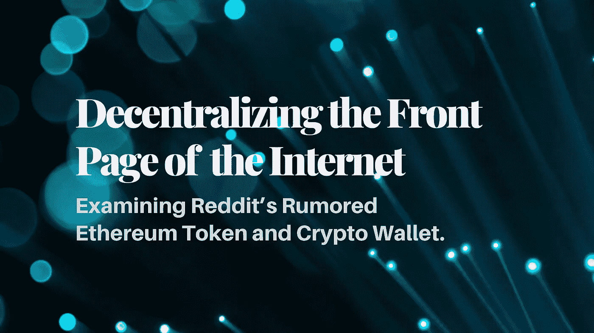
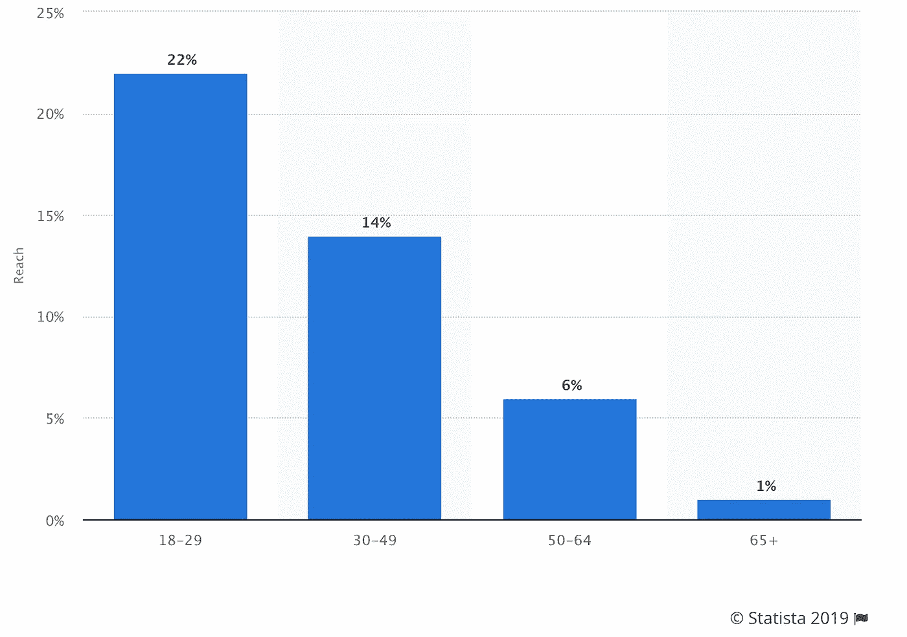
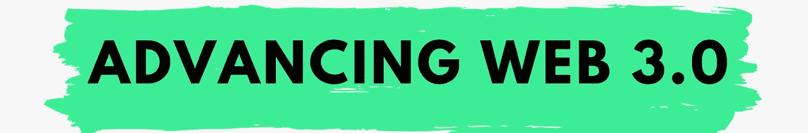

# 互联网首页去中心化

> 原文：<https://medium.com/coinmonks/decentralizing-the-front-page-of-the-internet-c04883aff1d4?source=collection_archive---------1----------------------->

## 检查 Reddit 的传闻以太坊令牌

# Reddit 新令牌的基本概要

Reddit 经常被称为互联网的头版。佛瑞德·威尔森[将这个平台](https://avc.com/2020/01/stack-today-stack-tomorrow/)描述为互联网宝藏——互联网上的一项服务，1)是开放的，2)当更多的人使用它时会变得更好，3)解决我们许多人/所有人的需求。

虽然互联网宝是准确的，但我更愿意将 Reddit 视为互联网黑社会。在这个地方，你既可以找到非常有价值的信息，也可以找到让你**永生难忘的奇怪故事。永远不会。**

有传言称，Reddit 正在进行一个内部加密项目,该项目将基于 Reddit 的“社区点数”推出一个 ERC-20 令牌。Reddit 似乎也将推出一款加密钱包，让个人能够管理自己的代币。显然，这都是谣言和猜测，但想到 Reddit 可能会推出 ERC20 令牌，这很令人兴奋！

这篇文章提到了这个令牌发布的几个特点。这是 TLDR:

*   **社区积分:**类似于 Reddit Karma(稍后将详细介绍)，但可在个人之间交易。显然，它们已经存在于一些子街道中，只是名称不同。
*   **信誉**:通过社区内的点数来衡量，显示在用户名和帖子旁边。
*   **会员资格**:用户可以使用积分购买社区(子编辑)会员资格，这将解锁徽章(图标/图像)、动画表情符号和特殊 gif(发音为 Giff，而不是 Jiff)等专属功能。)Reddit 不会收取会员费的任何积分/百分比，相反，积分会被烧掉，这减少了供应量，增加了其他会员积分的价值。会员资格仍然可以用美元购买，Reddit 会为用户烧掉积分。
*   **投票**:普通投票视图(每人 1 票)，新增“加权投票”(每点一票)。加权投票将使用个人当前的社区点数余额**或曾经获得的**总社区点数(以较少者为准)进行计算，以确保影响力不被收买。

社区点(CP)的分布:

*   将会有 5000 万 CPs 的初始分配，基于在子区域中获得的 Karm。
*   在第一年里，将再发放 5000 万份 CPs，这一数字将逐渐减少，直至发放 2 . 5 亿份 CPs。
*   20%的 CPs 将进入 Reddit
*   20%的 CPs 将留给 Reddit 社区
*   10%将去主持人的行政工作
*   每月有一半的点数会被重新引入到下一次分配中

Reddit 的新加密钱包:

*   看起来它的功能很像一个 **MetaMask** 钱包
*   Reddit 服务器上的加密备份将有一个单独的密码。Reddit 声称他们无法访问私钥。
*   将有一个标准的 12 个词的恢复短语，将使人们能够恢复他们的帐户/钱包。

# 深入探讨:Reddit 应该推出代币吗？

Reddit 上有一个流行的帖子叫做[TIFU](https://www.reddit.com/r/tifu/)——今天我搞砸了。该帖子包含一些常见的故事，比如那次你见了你女朋友的父母，还有[假装你从来没见过土豆](https://www.reddit.com/r/tifu/comments/2tdbig/tifu_by_enraging_the_parents_of_my_girlfriend_by/)。你知道，相关的东西…

无论如何，问题变成了这是一个可怕的错误还是一个天才的时刻？有两个主要问题可以帮助回答这个问题:

1)Reddit 目前是如何赚钱的，也就是说，Reddit 创造代币是因为它遇到了财务困难，还是因为它找到了增加其平台价值的方法？

2)什么是附加值，一个令牌如何让 Reddit 变得更好？

# Reddit 是怎么赚钱的？

**简而言之:**广告和风险投资。然而，Reddit 是一家私人公司，看起来并不像它那样利润丰厚。

**更长的答案:** Reddit 规模庞大，但似乎没有盈利。它是访问量排名第九的网站，在全球保持着超过 3 . 3 亿的月活跃用户。在美国，年龄在 18-29 岁之间的互联网用户中有近 25%使用 Reddit。

Source: [FoundationInc](https://foundationinc.co/lab/reddit-statistics/)

Reddit 的最新私人估值为 30 亿美元。相比之下，Twitter 和 Snapchat 的市值约为 200 亿美元，这在很大程度上是因为 Twitter 和 Snapchat 上的广告更有效。

## 寻找 Reddit 的收入

2014 年，Reddit [将其 2014 年广告收入(80 万美元)的 10%捐赠给了 10 家非营利组织，因此总共赚了 800 万美元。然后，有传言称公司](https://venturebeat.com/2015/02/26/these-10-charities-will-get-10-of-reddits-2014-ad-revenue/)[在 2018 年取得了](https://www.cnbc.com/2018/06/29/how-reddit-plans-to-make-money-through-advertising.html)1 亿美元的广告收入。2019 年，Reddit [筹集了](https://www.cnbc.com/2019/02/11/reddit-raises-300-million-at-3-billion-valuation.html)3 亿美元，而不是上市，可能是因为该公司需要现金(14 岁的公司现在通常会尝试进行流动性活动)。

Reddit 是一个互联网宝藏，许多互联网宝藏(Reddit、StackOverflow、Quizlet、Wikipedia)的问题是它们通常没有很好的商业模式。他们获得了广泛的成功，但与他们创造的价值相比，他们没有回报经济价值。老实说，这真的很可悲，我希望我们的社会能够找到一种方式来评估这些公司/服务。好的一面是，加密网络为评估这些类型的互联网财富提供了一个独特的机会。因此，让我们来看看 Reddit 社区积分令牌背后的附加值。

## 子编辑之间的阅读:社区点是用来做什么的？

社区积分(CP)在以太坊上作为 ERC-20 代币发行，但这些积分没有任何明确规定的用途，而是声称:

> *“积分是一种灵活的工具，可以在不同的社区以不同的方式使用。随着时间的推移，社区会找到方法来使用对他们来说独特的、符合他们文化的积分。”*
> 
> *“社区积分可以自由交易，不受 Reddit 的限制或控制”*

现在，对于那些经常光顾 Reddit 的兔子洞的人来说，你可能知道 Reddit 已经有了一个类似的功能，叫做 Karma，这是 Reddit 如何奖励个人帐户的发帖、投票和评论。

业力已经服务于防止钓鱼的目的。许多子编辑要求个人拥有最低数量的因缘点数，以便在子编辑中发布、评论或分享某些内容。Karma 将仍然是由 Reddit 维护的集中式积分系统，而社区积分将成为一种更开放的具有货币价值的 Karma 形式。

Reddit 还提供了购买“[硬币](https://www.reddit.com/coins)的选项，这些硬币独立于 Karma，可以奖励给贡献者，以表示伟大的评论或帖子。花在硬币上的钱直接进入 Reddit，作为用户善意的一种形式。乍一看，社区积分似乎是同一概念的翻版，增加了公开交易的好处。

因此，虽然我对一个互联网宝藏被表现为加密网络的世界感到极度兴奋，但我不确定 Reddit 的这一举措会有成效。

## 一个寻找效用的平台

大多数 Reddit 社区(超过 50，000 个)没有太多的货币价值，除了一些子 Reddit 产生的互联网流量。Karma 在阻止巨魔帖子方面已经做得足够好了。许多子网站都有自动删除违反 Reddit 政策的内容的机器人。此外，如果我可以用现金支付 Subreddit 会员资格，那么社区积分就显得过时了。

我看到一家私营公司正在寻找一种方法来将他们的用户群货币化并创造经济价值。问题是最好的加密令牌是提供实际效用的令牌。迄今为止，最成功的代币形式是抵押品、证券或资源所有权。Reddit 的令牌没有提供对 Reddit 资源的显式声明。CP 持有者无权获得任何现金流。也没有任何理由代币会升值，除了一半的代币被烧掉以换取购买会员资格的事实。看起来社区点可能有一些投票/治理的角色，但是我不相信 Reddit 在当前的形式下需要这样的机制。Reddit 上的绝大多数个人是消费者，而不是内容创造者或社区参与者。除了 Reddit 社区想出或发现社区点数的用途似乎是一个危险信号。如果平台的所有者 Reddit 想不出其令牌的伟大用途——除了状态信号图标和 gif——那么也许你应该更努力地考虑一下令牌。

如果这个传言是真的，我希望 Reddit 发布更多信息，显示社区积分具有明确的效用。我的意图不是抨击 Reddit——我爱 Reddit。我一直在使用它，这也是我希望公司成功的原因。如果 Reddit 真的发布了代币，无论成功与否，这都将是一个迷人的实验。

[**推进 Web 3.0**](https://advancingweb3.substack.com/) 是一份关于加密货币、分散金融( [DeFi](https://consensys.net/blog/news/2019-was-the-year-of-defi-and-why-2020-will-be-too/) )和塑造下一个互联网时代的技术的每周时事通讯。欢迎来到流血边缘。欢迎来到 Web 3。

**关于作者:**我是[梅森·奈斯特伦](https://twitter.com/masonnystrom)，一名作家和有抱负的天使投资人。之前，我在 ConsenSys 公司担任营销人员，主要负责 ConsenSys 公司及其投资组合公司的营销策略。在加入 ConsenSys 之前，我在 Gatecoin 担任业务分析师，这是第一家上市以太币的加密货币交易所，以太坊的本地加密货币。

我对比特币、以太坊、DeFi、Web 3.0 和所有加密技术充满热情。当我不写东西或埋头于 crypto 时，我在 Lambda School 学习成为一名开发人员。

> [在您的收件箱中直接获得最佳软件交易](https://coincodecap.com/?utm_source=coinmonks)

*所表达的观点、信息和意见仅由作者个人所有，仅供参考，不作为买卖任何证券、加密资产或其他金融产品的建议或投资建议。*