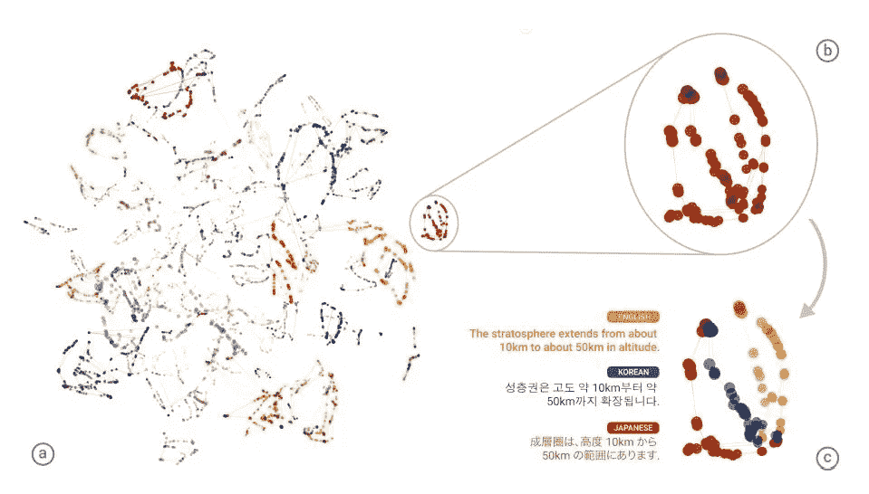

# 破译谷歌翻译的潜意识

> 原文：<https://medium.com/coinmonks/deciphering-google-translates-subconscious-91ae4f70c2af?source=collection_archive---------5----------------------->

在当今技术飞速发展的时代，试图理解我们周围的巨大飞跃都变得很难。在机器学习领域，这一飞跃似乎是如此之大，以至于普通人不了解它的能力，而且不理解它背后的过程。自从深度学习的“复兴”开始以来(大约在 2014 年)，反对该领域的核心论点很简单——我们如何理解机器的理解，或者换句话说，网络学习什么，以及我们如何能够监控它的行为。

这一切都始于一位同事兴奋地走过来对我说:“我愿意，你一定要看看这个！”。然后，他打开谷歌翻译网站，将输入语言切换到索马里语，并开始反复书写“Soi”这个词。

开始的时候，翻译就像你所期待的那样——只有英文单词“Soi”。据我所知,“Soi”这个词在索马里语中没有意义，所以你可能不会对翻译成英语有太大的期望。接下来发生的事情是，当我们一次又一次地添加单词“Soi”时，输出开始看起来很奇怪——它吐出了真实的句子，老实说，令人毛骨悚然的句子。

Just me messing around, I encourage to play with this, it’s a lot of fun

在第一部分，我认为我被套套了——我认为一个谷歌工程师对用户随意输入字母很感兴趣，但后来我开始仔细观察。在整个互联网上，到处都有以完整句子作为输出的乱码输入的例子，输出诸如来自书籍的东西，看起来像是来自. js 文件的东西，或者谈论即将到来的天启的文本。

首先，讲一点历史。谷歌早在 2006 年就宣布了它的第一个机器翻译模型，使用的统计模型主要依赖于所谓的“基于短语的翻译”(PBMT)。目标很简单——实现完整的句子/段落翻译，而不是以前仅限于基于单词翻译的任何模式。随着新机器学习模型的炒作，谷歌在 2016 年发布了以下论文:

 [## [1609.08144]谷歌的神经机器翻译系统:弥合人类与机器之间的鸿沟…

### 吴永辉、迈克·舒斯特、、郭诉乐、穆罕默德·诺鲁齐、沃尔夫冈·马切雷、马克西姆·克里昆、、秦高、克劳斯…

arxiv.org](https://arxiv.org/abs/1609.08144) 

这个模型比前一个模型先进几光年，因为它利用了深度神经网络的力量。这个模型被称为“*谷歌神经机器翻译* (GNMT)”。

# **GNMT 是什么？**

PBMT 的问题在于，在将内容拆分成小部分的过程中，你会失去整个句子的真正含义。GNMT 旨在解决这个问题。它由两个主要部分组成——编码器和解码器。把编码器想象成接受输入(在输入语言中)并变成“机器语言”。类似地，解码器负责以“机器语言”的形式获取这个标记向量，并以输出语言输出翻译。

**lstm:**

一个相对较新(旧)的模型已经在机器学习的许多领域取得突破，它是 LSTM 模型的变体。这个模型基本上是一个非常快速和智能的 RNN 网络。对于我们这些新进入这个领域的人来说:RNN ( [递归神经网络)是一个能够处理不同大小的输入/输出(像机器翻译)的模型，与经典的 FNN 和 CNN 相比，它看起来有点滑稽。我不会在这里过多地谈论细节，但是 LSTM(长短期记忆)的目标是利用上一段输入(短期)构建下一段输出，同时记住它迄今为止获得的所有知识(长期)。特定时间的给定输入被输入到网络中，并帮助网络预测最可能的下一个结果。](https://en.wikipedia.org/wiki/Recurrent_neural_network)

那么 LSTMs 是如何连接到 GNMT 的呢？还记得我们说过的编码器和解码器吗？嗯，它们基本上是一堆相互堆叠的 LSTM 层级，以赋予模型理解高级(深层)概念的能力，比如人类语言。当然，这是一个非常保守的说法:GNMT 模型比我说的要复杂得多，但是主要思想是使用这些漂亮的小节点。为了更深入地了解架构，我推荐这篇很棒的博文:

 [## 了解新的谷歌翻译

### 谷歌在 2016 年 9 月推出了新版翻译。从那以后，出现了一些有趣的…

codesachin.wordpress.com](https://codesachin.wordpress.com/2017/01/18/understanding-the-new-google-translate/) 

伴随着这个漂亮的模型，神奇的事情发生了，在我看来这是真正的奇迹。叫做“零镜头翻译”。这基本上意味着，如果我训练机器将句子“我有一只白狗”从英语翻译成西班牙语，以及从西班牙语翻译成法语，机器将从训练中推断如何将句子从英语翻译成法语。这看起来似乎是理所当然的，但事实远非如此。实际上，机器会理解句子的语义，而不仅仅是句子中的单词。“我有一只白狗”这句话的语义是统一的理解，但机器能够跨不同语言识别它的相似性这一事实是值得注意的。摘自:

Figure 2: A t-SNE projection of the embedding of 74 semantically identical sentences translated across all 6 possible directions, yielding a total of 9,978 steps (dots in the image), from the model trained on English↔Japanese and English↔Korean examples. (a) A bird’s-eye view of the embedding, coloring by the index of the semantic sentence. Well-defined clusters each having a single color are apparent. (b) A zoomed in view of one of the clusters with the same coloring. All of the sentences within this cluster are translations of “The stratosphere extends from about 10km to about 50km in altitude.” © The same cluster colored by source language. All three source languages can be seen within this cluster.

[https://research.google.com/bigpicture/](https://research.google.com/bigpicture/)

我们可以看到一个更直观的图表。在这里，我们看到不同语言中语义相同的句子。如图所示，意思相同的句子在不同的语言中聚集在一起。当然，这是大维度缩减技术(t-SNE)，这些当然是巨大的维度向量，但这种缩减确实向我们展示了主要的直觉:GNMT 理解句子的语义思想。

# GNMT 为什么给我们提供奇谈怪论的翻译？！

就这部分而言，这些只是推测。据我所知，谷歌对此似乎没有正式的评论，所以我能做的就是试着把这些碎片拼在一起。我们可以从“零镜头翻译”的成功中得出的理论是，我们实际上有一个固有地理解语义的模型**。也就是说，通过严格的训练，它已经发现，意义相似的事物应该以某种方式“接近”在一起。让我们假设 WLOG 的模型的输入和输出大小是恒定的(当然，事实远非如此，因为不同语言中的句子可以有不同的长度，即使在同一种语言中，也不是所有的句子都有相同的长度，只是为了更直观地理解这一点)。我们将标注:输入语言: **A** ，机器“令牌语言”(原谅不正式) **L** ，输出语言 **B** 。然后我们有一个函数，对于 A** 中的一个句子 **s，计算一个 **L** 中的匹配向量(通过编码器)，然后计算这个向量到 **B** 的映射。如果我让你说映射有多好，你会怎么评分？很明显，你可能会期望，对于 **A** 中的任何逻辑句子， **B** 中的匹配句子会有相同的意思。 **A** 中随机字母的映射怎么样？你会要求它以某种方式翻译它们吗？也就是你会怎么把**【SD ds FD】**翻译成西班牙语？不太容易，是吗？更重要的是，它没有很好的定义。翻译胡言乱语的句子不是目标的一部分，但是因为我们有一个映射(以最宽松的方式)，这些句子将被映射到 **B** 中的某个句子。**

## 结果看起来仍然很奇怪

是的，他们看起来很奇怪，坦率地说，很多时候很搞笑。在我看来，这不是故障！这不是错误。机器在它巨大的数千维向量空间中发展了某种“语义接近”的感觉，在那里它能够理解(如果我可以补充的话，相当好)一个句子背后的思想。它不需要限制如何翻译没有任何意义的句子，所以它找到了一个与其标准相匹配的“功能”。这种功能能够获得一个句子，并在机器翻译中前所未有的水平上翻译它，接近人工翻译。要点是:如果你告诉某人去学打篮球，你不能因为他在足球上表现不好而生气，尤其是当他的篮球技术达到专家水平的时候。

## 捍卫神经网络

总的来说，神经网络或机器学习的最大飞跃是，你不是找到一种回归模式，向它提供你认为它学习所需的确切参数，而是赋予它以最“舒适”的方式学习概念的能力。通常，在这个领域，似乎有很多人类的特征被赋予了模型，但最终这就是我们想要完成的。NN 通常很难理解，在某些任务中可能表现得很奇怪，但它的好处在于它自己想出了这些“独特”的方法，这是**学习**。

1.  [https://codesachin . WordPress . com/2017/01/18/understanding-the-new-Google-translate/](https://codesachin.wordpress.com/2017/01/18/understanding-the-new-google-translate/)
2.  [https://ai . Google blog . com/2016/11/zero-shot-translation-with-Google . html](https://ai.googleblog.com/2016/11/zero-shot-translation-with-googles.html)
3.  [https://research.google.com/bigpicture/](https://research.google.com/bigpicture/)
4.  [https://arxiv.org/pdf/1611.04558v1.pdf](https://arxiv.org/pdf/1611.04558v1.pdf)
5.  [https://arxiv.org/abs/1609.08144](https://arxiv.org/abs/1609.08144)