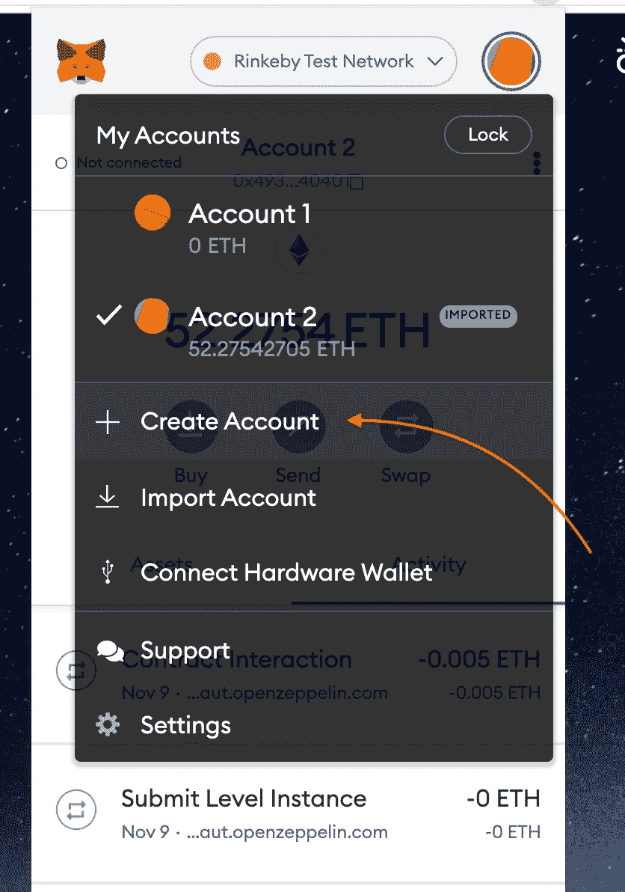
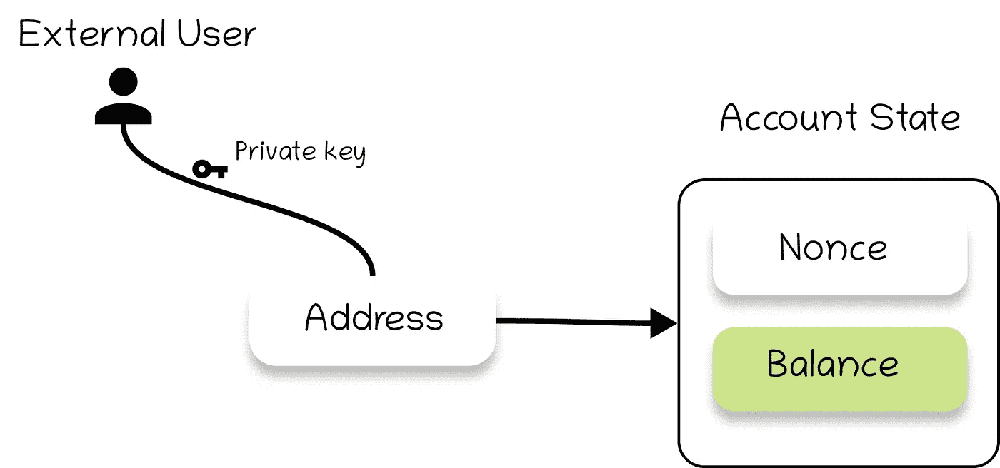
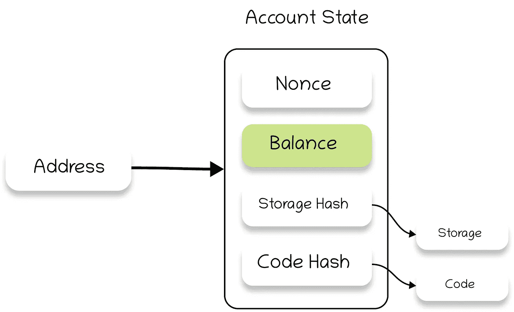
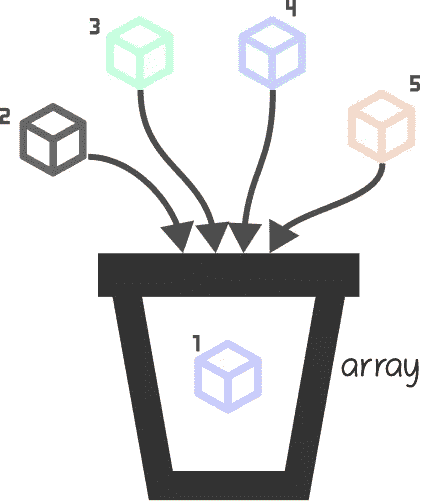
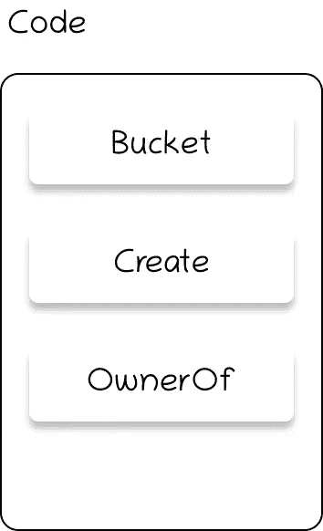

# 解码 NFT

> 原文：<https://medium.com/coinmonks/decoding-an-nft-741dd346026b?source=collection_archive---------3----------------------->


地址是区块链上最关键的标识符。区块链上每个人的钱包无非就是一个和地址挂钩的账户。你将需要提交许多文件，以获得一个与你相关联的账号，从而平均每天开立一个银行账户。在区块链中，就像泡茶一样简单😄好吧，我会说我有时也发现那很难！但是回到正题，在区块链网络上创建一个账户是毫不费力的。为开发人员在以太坊上创建一个帐户是一行命令。

```
geth account new
```

对于一个普通人来说，这就像在钱包上点击“创建账户”按钮一样简单。



这样做可以得到一种叫做键值对的东西。想象你用一把唯一的钥匙(你的私人钥匙)锁东西。但这个包裹只能用与你相关的另一把钥匙打开，而后一把钥匙就是你给整个世界的东西。从这个“公钥”，我们得出你的地址。这个地址现在可以保存您的帐户余额和其他一些有助于区块链网络的属性。

到目前为止，我们有:

1.  私钥，
2.  公钥，
3.  从这个公钥导出的地址。



现在让我们向帐户状态添加几个属性。

1.  链接到帐户存储的存储哈希
2.  链接到帐户代码的代码哈希。



这是什么？

**智能合同！**

但是，该帐户不受任何拥有私钥的用户控制。它只受它所包含的代码的控制。此代码一旦部署，就不能更改！正如您在这里所看到的，智能契约只不过是一个钱包，其中有一些操作该钱包的代码逻辑。

今天，你创造了一件艺术品。在这一天，你画了一个尺寸如此完美的立方体，这件艺术品让你觉得与众不同。这件艺术品是如此的杰作，以至于你现在想做的就是永远珍藏这件艺术品(有点夸张，但这应该行得通😄).


你怎么能确定这件艺术品是你的？你如何确保有人不能复制这件艺术品，并声称它是他们的？

作为一名开发人员，我在上面创建的智能契约的代码部分添加了一些属性。想象一下，我做了一个收集立方体的篮子:“以编程方式。”(在编程界，这个篮子叫做数组)。我把艺术家创造的独特的立方体放入我的篮子，然后返回一个数字给你。任何艺术家以后都可以使用这个号码来跟踪他们的立方体。



现在你我都知道这个代码一旦被部署就不能被修改。因此，在部署这段代码之前，我添加了一些辅助功能，任何艺术家都可以使用这些功能来上传他们的作品并获得这个数字。

那么到目前为止我们的代码中有什么呢？

*   储存我们的立方体的桶
*   一个创建助手，帮助艺术家上传他们的立方体到桶中，并获得一个数字。
*   “拥有者”助手。



现在，这个帮手的主人是谁？

这个辅助函数返回上传立方体的艺术家的地址！作为一名参与区块链网络的艺术家，你将会有一个与你相关联的地址的钱包(如上所示)。要将您的多维数据集上传到 Smart Contract，在本例中是 bucket，您需要调用 Create helper 并用您的地址签署该事务。代码现在会将返回给您的号码映射到您的地址。

现在，因为一旦部署了代码，没有人能改变它(我们已经提到过一百万次了)，你可以向全世界展示你的艺术作品，并提供隔音证据，证明你是它的所有者。

简而言之，这一切都是 NFT。你上传你的作品，并附上你的地址，向世界证明你是创作者。

我们现在可以开始修改代码来添加更多的助手函数。我可以添加一个转移助手，将我的艺术品的所有权转移到其他地址(可能是在拍卖中出售)。我可以添加一些逻辑，让我的艺术品的所有者不断地给我转账，也许是每年一次。我可以创作音乐而不是艺术，并以数字形式上传。我可以创造十亿个口袋妖怪，把它们分散在一个增强现实世界中，你可以抓住这些口袋妖怪，向全世界证明你拥有这种稀有的口袋妖怪😄。可能性是无限的。

# 结论:

1.  我们看到了在区块链上创建虚拟银行账户是多么容易。
2.  我们看到了智能合约是如何简单地扩展这个帐户并受其代码逻辑控制的。
3.  我们知道艺术家如何使他们的艺术不朽，并向他人证明这是他们的。
4.  简要了解 NFT 是如何创建的。

阅读这个帖子可能会有很多问题。请在下面发表评论，以便我们在以后的文章中回答这些问题。

更多阅读链接:

1.  ERC721 规范文档:智能合约的编码标准是有效的 NFT 令牌
2.  [ERC 721 合同建造指南](https://docs.openzeppelin.com/contracts/3.x/erc721)
3.  [心智模型](https://takenobu-hs.github.io/downloads/ethereum_evm_illustrated.pdf)

这篇文章最初发表在我们的博客[blockchainseasy](https://blockchainiseasy.github.io/decoding-an-nft/)上。

> 加入 Coinmonks [电报频道](https://t.me/coincodecap)和 [Youtube 频道](https://www.youtube.com/c/coinmonks/videos)了解加密交易和投资

## 也阅读

[](https://blog.coincodecap.com/best-swap-platforms) [## 2021 年最佳加密交换平台| CoinCodeCap

### 如果我们看看今天的场景，许多加密货币交换平台提供了广泛的功能和深度…

blog.coincodecap.com](https://blog.coincodecap.com/best-swap-platforms) [](/coinmonks/top-5-crypto-lending-platforms-in-2020-that-you-need-to-know-a1b675cec3fa) [## 2021 年最佳加密借贷平台| 6 大比特币借贷平台

### 获得比特币和其他加密货币的最佳贷款利率

medium.com](/coinmonks/top-5-crypto-lending-platforms-in-2020-that-you-need-to-know-a1b675cec3fa) [](/coinmonks/the-best-cryptocurrency-hardware-wallets-of-2020-e28b1c124069) [## 2021 年 6 大最佳硬件钱包|顶级加密硬件钱包[更新]

### 最好的加密货币硬件钱包是绝对必要的。我们将在 NGRAVE、Ledger Nano X 和…

medium.com](/coinmonks/the-best-cryptocurrency-hardware-wallets-of-2020-e28b1c124069) [](/coinmonks/crypto-trading-bot-c2ffce8acb2a) [## 2021 年最佳免费加密交易机器人

### 2021 年币安、比特币基地、库币和其他密码交易所的最佳密码交易机器人。四进制，位间隙…

medium.com](/coinmonks/crypto-trading-bot-c2ffce8acb2a) [](/coinmonks/best-crypto-signals-telegram-5785cdbc4b2b) [## 最佳 4 个加密交易信号电报通道

### 这是乏味的找到正确的加密交易信号提供商。因此，在本文中，我们将讨论最好的…

medium.com](/coinmonks/best-crypto-signals-telegram-5785cdbc4b2b) [](https://blog.coincodecap.com/bitsgap-review) [## 获取信号、交易机器人和套利

### 编辑描述

blog.coincodecap.com](https://blog.coincodecap.com/bitsgap-review) [](https://blog.coincodecap.com/best-telegram-channels) [## 40 个最佳电报频道，用于加密、电影、表演和演讲| CoinCodeCap

### 随着我们周围无限的信息，我们很难筛选和了解有价值的信息。电报有…

blog.coincodecap.com](https://blog.coincodecap.com/best-telegram-channels) [](https://blog.coincodecap.com/best-social-trading-platforms) [## 5 个最佳社交交易平台[2021] | CoinCodeCap

### 困惑于社交交易和副本交易哪个平台最好？本文将带您了解各种…

blog.coincodecap.com](https://blog.coincodecap.com/best-social-trading-platforms) [](https://blog.coincodecap.com/blockfi-review) [## BlockFi 评论 2021:利弊和利率| CoinCodeCap

### 编辑描述

blog.coincodecap.com](https://blog.coincodecap.com/blockfi-review) [](/coinmonks/buy-bitcoin-in-india-feb50ddfef94) [## 如何在印度购买比特币？2021 年购买比特币的 7 款最佳应用[手机版]

### 如何使用移动应用程序购买比特币印度

medium.com](/coinmonks/buy-bitcoin-in-india-feb50ddfef94) [](/coinmonks/best-crypto-tax-tool-for-my-money-72d4b430816b) [## 加密税务软件——五大最佳比特币税务计算器[2021]

### 不管你是刚接触加密还是已经在这个领域呆了一段时间，你都需要交税。

medium.com](/coinmonks/best-crypto-tax-tool-for-my-money-72d4b430816b) [](https://blog.coincodecap.com/best-hardware-wallet-bitcoin) [## 存储比特币的最佳加密硬件钱包[2021] | CoinCodeCap

### 保管您的数字资产很容易，但找到正确的存储方式却是一项繁琐的任务。在线钱包有一个风险…

blog.coincodecap.com](https://blog.coincodecap.com/best-hardware-wallet-bitcoin) [](/coinmonks/pionex-review-exchange-with-crypto-trading-bot-1e459d0191ea) [## Pionex 评论 2021 |免费加密交易机器人和交换

### Pionex 是为交易自动化提供工具的后起之秀。Pionex 上提供了 9 个加密交易机器人…

medium.com](/coinmonks/pionex-review-exchange-with-crypto-trading-bot-1e459d0191ea)