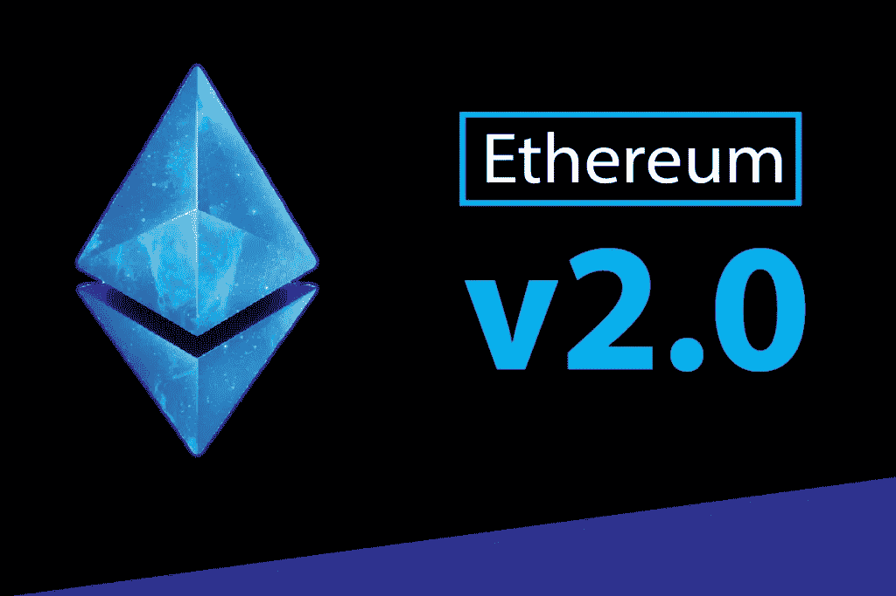

# 解码以太坊 2.0

> 原文：<https://medium.com/coinmonks/decoding-ethereum-2-0-5fd813f2ccc9?source=collection_archive---------4----------------------->

在区块链世界，以太坊可以被认为是最可信和最安全的网络之一。有了大量活跃的客户端，开发人员不断地工作。现在，它即将获得重大升级。这次升级将使以太坊比以前更快更安全。一些关键的更新包括**利害关系证明**解决方案( [**信标链**](https://blog.coincodecap.com/ethereum-beacon-chain) ，**卡斯珀·FFG**， [**分片**](https://blog.coincodecap.com/sharding-in-ethereum) ， [**eWASM**](https://blog.coincodecap.com/ewasm-ethereum-webassembly) ，**等离子**，**雷电**等等。

这些更新的大部分都集中在解决扩展问题(这使得交易更快，并使环境更适合编写智能合同)，改变以太坊的开采方式，并使网络更加安全。

# 那么现有的网络呢？

有一种方法可以解决所有问题，那就是平静。根据这一概念，上述所有升级可以合并在一起，形成另一个与现有链完全兼容的平行链。

# 以太坊的推出最初计划分为四个阶段

1、**前沿**:发布时的初始构建。

2.**家园:**带我们进入 2018 年的建筑

3.**大都会:**当前阶段(由两个硬叉组成的两部分阶段，**拜占庭**和**君士坦丁堡**)。

4. **Serenity:** 从 2019 年到 2021 年(时间表可能会更改)，分三个阶段将我们带到“以太坊 2.0”的最后阶段。

# **以太坊 2.0 打算如何解决某些问题？**

*以下是以太坊正在升级网络的一些领域:-*

## 1.从工作证明(pow)转向利益证明(pos)

*Proof-of-stage，或*[*PoS*](https://cointelegraph.com/tags/pos)*，是一些区块链使用的共识机制。*

PoS 为那些持有网络令牌股份的人提供了权利[通过验证块](https://cointelegraph.com/news/the-five-hidden-principles-in-staking-and-validating)获得奖励。这与工作证明(proof-of-work)或 [PoW](https://cointelegraph.com/tags/pow) 、比特币使用的共识模型( [BTC](https://cointelegraph.com/bitcoin-price-index) )形成了鲜明对比。PoW 将块确认权分配给那些显示出最大计算能力的块。

一旦验证者同意标记它的令牌，这个标记就被锁定了。在许多情况下，如果验证程序没有按照网络的利益行事，它将被全部或部分没收——不管是有意还是无意。

原则上，任何人都可以下注代币；但在现实中，将使用一个协议来确定哪些参与者被选中来验证块并获得赌注奖励。验证一个区块并获得奖励的权利通常是根据股份的比例价值来分配的。因此，押下总价值 1%的人将验证所有区块的 1%。然而，赌注被锁定的时间长度也可能成为验证者选择协议的一个因素。

## 2.分片

分片是数据库管理系统中的一个概念，当我们必须处理大量数据时使用，这使得定位和遍历数据变得困难。所以*分片所做的是*它水平地划分你的数据库，并且变得更容易处理子数据库。

以太坊区块链的架构使得高可扩展性变得困难。节点越多，验证和确认的时间就越长。

> 分片将以太网扩展到每秒 1000 次交易

***问题来了，Eth 2.0 是如何使用分片概念的？***

所以分片所做的就是把整个区块链分成更简单、更易管理的碎片。每个以太坊账户都会和碎片关联。

## 3.**埃瓦斯姆接替 EVM**

以太坊之所以成为一个可行的平台和比特币统治地位的有力挑战者，其中一个特点是它实现了以太坊虚拟机(EVM)。EVM 是一个运行在所有网络节点上的执行环境，[便于使用智能合同](https://journal.binarydistrict.com/understanding-the-enigmatic-ethereum-virtual-machine/)。正是这些智能合约使得以太坊的区块链成为一个全球计算设备，而不仅仅是一个金融系统。EVM 的智能合约可以运行游戏，执行复杂的金融交易，甚至可以运营社交网络。

尽管 EVM 被广泛使用，但它仍然是一个谜——即使对于具有高度编程技能的人来说也是如此。为了解决这个问题，以太坊 2.0 将开始使用网络汇编语言，在一个他们称之为 eWASM 的系统中。这将使以太坊应用程序代码可以在今天的网络浏览器中执行，这是对 EVM 的一个巨大改进。此外，它将允许程序员从 Rust、C 和 C++等几种语言中进行选择，来编写在区块链上运行的代码。eWASM 将一举增加生态系统潜在程序员的数量，因为它将向无需学习纯以太坊语言的用户敞开大门。

# 4.第 2 层技术

为了构建一个良好的区块链生态系统，我们需要在架构中做一些事情来平衡安全性、去中心化和可伸缩性的需求。第 2 层区块链技术系统是那些连接到以太坊的系统，并依赖以太坊作为安全和终结的基础层。

换句话说，我们没有改变基础以太坊，而是在主区块链协议上添加了智能契约，它与链外活动进行交互。

第 2 层平台和协议处理数据的方式减少了基础层(根链)通常承受的负担。通过将交易从主链卸载到第 2 层平台，区块链网络可以处理更高的交易吞吐量。

> [在您的收件箱中直接获得最佳软件交易](https://coincodecap.com/?utm_source=coinmonks)

