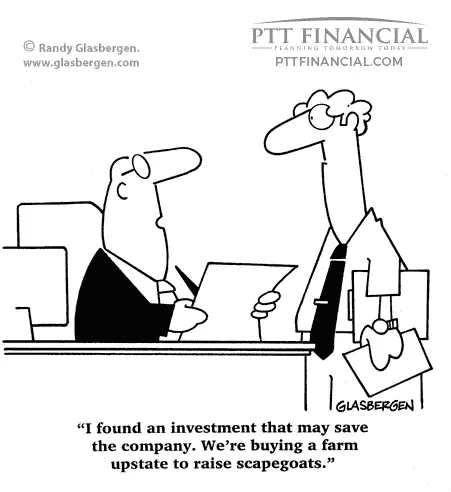

# 解码共同基金——行话简化

> 原文：<https://medium.com/coinmonks/decoding-mutual-funds-jargon-simplified-42788ad769ba?source=collection_archive---------5----------------------->

嘿，伙计们，希望利用这里的最后一个帖子，你已经能够把你的投资放在一个良好的基础上。只是重申和巩固股票市场大师的古老经验……..让我们修改一些基本但非常有效的策略。第一个原则是**永远不要被别人的成功故事所诱惑**并且在投资你辛苦赚来的钱之前**永远做好自己的研究**。其次，没有人能够预测股市的走势，因此，**永远不要在任何一只股票上投资超过 5%**，并根据你的风险承受能力和风险偏好分散投资于不同的资产类别。第三，**绝不赌博**。如果你的投资范围是中长期的(至少一年以上)，你很可能会安然度过这场风暴。第四，无论是上升趋势还是下降趋势，**市场将始终尊重处于正确价格水平的优质企业**。因此，即使这些股票呈下降趋势，请放心，这只是暂时的，逆转将比你能预测的更快。最后，即使你被盘旋下跌的小盘股或中盘股套牢，也要鼓起勇气继续持有，因为最终所有盈利的业务都会升值。因此，除非影响业务的宏观条件发生了变化，如政府政策或财务比率的不利变化，以及资产负债表开始出现红色标记，否则请坚持你的数字和研究。

让我们继续讨论共同基金。在前四篇文章中，我们已经看到了所有类型的 MF。尽管如此，如果你试图挑选一只基金进行投资，很可能你会被仍然令人困惑的共同基金命名所难倒。让我们从上一篇文章中随机抽取同样的例子，看看我们是否能破译它们，如果不能，那么是哪一部分？？第一个例子是“华润股票混合基金— RP — (G)”。如果你一直在追踪金融新闻，你会很容易认出大写的前两个字符是 Canara Robeco (CR)的缩写。其次是共同基金的类型，在这种情况下，它是一种混合基金，股票部分多于债务部分。接下来的两个字母，大写字母“RP”用于表示常规计划，而不是直接计划，直接计划通常使用大写字母“D”。最后，括号中的大写字母 G 用来表示它是一个“增长选项”。同样，“雪绒花银行和 PSU 债务-注册(G)”只是表明它是一个由雪绒花资产管理公司提供的“债务”共同基金，该公司将其资金投资于银行和 PSU 发行的债券。这是一个带有增长选项的常规计划。

我相信到现在为止，上面讨论的大部分内容都已经被你很好地接受了。到目前为止，我们还没有讨论的术语有— **增长与红利**期权，以及**定期与直接**计划。因此，在我们开始分析哪个曼氏金融对你来说是“萨亥亥”之前，让我们直接解码它们。

**常规与直接计划**——有如此多的共同基金公司或资产管理公司(AMC)提供各种各样的 MF 和计划，如果你对选择正确的工具来管理你的投资感到困惑，或者你只是时间太紧，你很可能会寻求专业帮助。如果您通过顾问/代理或经销商投资 MFs，您选择的是常规计划。但是，如果你选择自己投资，你的计划将是一个直接的计划。这两个计划都代表同一个 MF，由同一个基金经理管理相同的投资组合。他们唯一不同的地方是**费用比率**或**装载**。基本上，这些是基金公司为管理特定基金而产生的费用。但是为什么会这样呢？？？？…….装载的不同是因为支付给顾问或经纪人的佣金。因此，直接计划的费用比率或**负载将始终低于常规计划，而**在长期 SIP 或更长持续时间的集中污水坑投资的情况下，费用比率或**负载可能会变得可观。**

**增长与红利选项** —如果你的目标是创造财富，你可能会想把从 MF 中获得的利润再投资回去，以便在 MF 期限结束时获得复合利润。这只不过是一种增长选择，MF 不断将其利润用于投资，从而为您创造财富。然而，许多投资者基于他们的财务需求，要求定期支付通常称为股息的利润，这种选择定期支付的选择被称为股息期权。基于特定的需求和投资目的，这两种选择都是有利的。

**费用比率或负荷** —如上文所述，这些是共同基金公司因管理共同基金计划而产生的经常性费用。这些费用包括销售、营销、广告、管理费用、交易费用、投资管理费、登记费、托管费、审计费。简而言之，无论基金公司在维护一个 MF 计划上花费多少，它都会以总费用比率从投资者那里收回，总费用比率是总费用除以已发行给投资者的单位总数。这通常表示为一个单位的 NAV(净资产值)或当前市场价值的计算成本的百分比。一般来说，新基金发行的加载量是最大的，随着基金规模的增长，加载量会减少。比较和选择最低负荷的 MF 是非常重要的，因为这也有复利的力量，并将对你的到期收益产生不利影响，特别是对于长期 sip。

**SIP vs 一次付清** —几乎所有的 MF 都允许你按月、按季度、按半年或按年定期投资同一个 MF 计划。因此，如果你有固定的收入，并且你想系统地投资以创造更大的资金池，系统投资计划(SIP)是你的最佳选择。本质上，它类似于定期银行存款，唯一的区别是 SIPs 投资于股票、债券或混合基金。然而，如果你有一个资金池，你想一次性投资，MFs 允许你一次性投资，这通常被称为一次性投资。由于 SIPs 定期投资，它平均了市场风险，在一定程度上也获得了收益。但一次性投资，尤其是期限较短的投资，会暴露于市场风险，因此，需要进行尽职调查以选择正确的选项。

伙计们…..我敢肯定，你们中的许多人一定对这么多的理论感到有些不安，但请相信我……在学习金融市场上所有不同的产品和各种选项以满足几乎所有需求之前，没有更好的方法了。如果到目前为止你一直和我在这个主题上…..感到骄傲……你现在被授权做出自己的决定。为了快速检查…..回到共同基金页面上的【moneycontrol.com ，随机挑选任何一只共同基金…..看看你是否能够破译它的意思…..我相信经过这么多的努力…..这将是一件轻而易举的事。

现在是时候说 MF advisor 的语言了，但首先……你是你自己的顾问。因此，请随时准备好您的疑问，即投资多少资金、所有资金的比例……以满足您的特定要求或投资范围。我们将在下一篇博文中讨论所有这些，这将帮助你根据自己努力获得的知识制作自己的作品集。因此，为你的努力感到自豪，并准备创建你的模型组合。快乐的投资人…..下周日见。

请随意与你所有的联系人、爱人和朋友分享这篇文章。此外，如果你喜欢这篇文章，请点击左下角的**按钮**来表达你的赞赏，如果你最近加入了我们，不要忘记点击页面左上角的**关注按钮**。

> 加入 Coinmonks [电报频道](https://t.me/coincodecap)和 [Youtube 频道](https://www.youtube.com/c/coinmonks/videos)了解加密交易和投资

## 另外，阅读

*   [Bookmap 评论](https://blog.coincodecap.com/bookmap-review-2021-best-trading-software) | [美国 5 大最佳加密交易所](https://blog.coincodecap.com/crypto-exchange-usa)
*   [如何在 FTX 交易所交易期货](https://blog.coincodecap.com/ftx-futures-trading) | [OKEx vs 币安](https://blog.coincodecap.com/okex-vs-binance)
*   [如何在势不可挡的域名上购买域名？](https://blog.coincodecap.com/buy-domain-on-unstoppable-domains)
*   [印度的秘密税](https://blog.coincodecap.com/crypto-tax-india) | [altFINS 审查](https://blog.coincodecap.com/altfins-review) | [Prokey 审查](/coinmonks/prokey-review-26611173c13c)
*   [布洛克菲 vs 比特币基地](https://blog.coincodecap.com/blockfi-vs-coinbase) | [比特坎评论](https://blog.coincodecap.com/bitkan-review) | [币安评论](/coinmonks/binance-review-ee10d3bf3b6e)
*   [Coldcard 评论](https://blog.coincodecap.com/coldcard-review) | [BOXtradEX 评论](https://blog.coincodecap.com/boxtradex-review)|[uni swap 指南](https://blog.coincodecap.com/uniswap)
*   [阿联酋 5 大最佳加密交易所](https://blog.coincodecap.com/best-crypto-exchanges-in-uae) | [SimpleSwap 评论](https://blog.coincodecap.com/simpleswap-review)
*   [购买 Dogecoin 的 7 种最佳方式](https://blog.coincodecap.com/ways-to-buy-dogecoin) | [ZebPay 评论](https://blog.coincodecap.com/zebpay-review)
*   [iTop VPN 审查](https://blog.coincodecap.com/itop-vpn-review) | [曼陀罗交易所审查](https://blog.coincodecap.com/mandala-exchange-review)
*   [比特币基地 vs 瓦济克斯](https://blog.coincodecap.com/coinbase-vs-wazirx) | [比特鲁点评](https://blog.coincodecap.com/bitrue-review) | [波洛涅克斯 vs 比特鲁](https://blog.coincodecap.com/poloniex-vs-bittrex)
*   [美国最佳加密交易机器人](https://blog.coincodecap.com/crypto-trading-bots-in-the-us) | [经常性回顾](https://blog.coincodecap.com/changelly-review)
*   [A-Ads 审查](https://blog.coincodecap.com/a-ads-review) | [Bingbon 审查](https://blog.coincodecap.com/bingbon-review) | [Mudrex 投资](https://blog.coincodecap.com/mudrex-invest-review-the-best-way-to-invest-in-crypto)
*   [最好的卡达诺钱包](https://blog.coincodecap.com/best-cardano-wallets) | [冰棒副本交易](https://blog.coincodecap.com/bingbon-copy-trading)