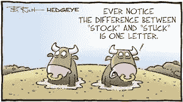
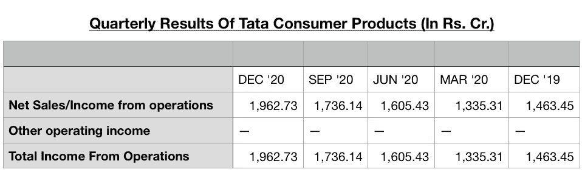
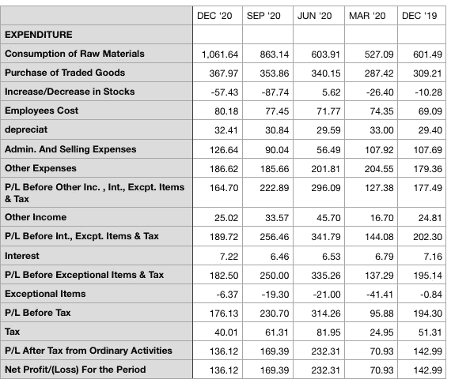

# 解读季度业绩，检查财务状况

> 原文：<https://medium.com/coinmonks/decoding-quarterly-results-to-check-financial-health-466a1642d531?source=collection_archive---------4----------------------->

在上一篇文章中，我们剖析了利润以及与之相关的各种术语，还讨论了作为投资者，我们为什么应该对营业利润和营业利润率而不是总利润或净利润更感兴趣。当社交媒体上有大量建议告诉你买什么或卖什么时，我们的许多年轻朋友仍然不相信我们为什么需要学习会计基础知识。因此，在分析今天的主题资产负债表之前，让我们再次讨论一下为什么它是绝对必要的。

我的第一点是，我们需要对大多数公司进行一次彻底的分析，之后只是跟进，看看增长是否符合预期。这可以与田径或游泳教练的剖析相比较，一旦他们知道你的强项和弱项，他们只是将你现在的表现与以前的进行比较。其次，一旦你学会了为一家公司做分析，以后的每一次分析所花的时间就会越来越少。最后，也是最重要的一点，没有人能够确定未来，因此，你不想将风险降到最低，从而增加你的金融农场越来越高的收益的可能性吗？

我知道，你们中的许多人可能仅凭直觉就赚到了利润，但如果你是常客，也要对自己诚实，并反思自己遭受了多少次损失。如果我告诉你，发展你自己的战略，你会给你的直觉、不安全感、贪婪以分量，但同时也要注意公司的财务状况。一般来说，如果你减少一定数量的损失，你的净利润会增加一个值**大于这个值**。因此，始终保持谨慎，不要投资于财务状况不佳的公司，如果你出于任何原因这样做，限制你在这类投资中的风险敞口。

**专业建议** :-制作自己的核对清单，并分配优先级，如财务优先级 1、商业/市场情绪优先级 2、购买价格离拐点有多近优先级 3 等。如果越来越多的标准得到满足，你的**投资将有更大的成功机会。**

我们今天的主题是分析一家公司的季度资产负债表，该公司通常被称为“**季度**或“**季度业绩**”，正如我在上一篇文章中承诺的那样，我们将讨论塔塔消费品公司的业绩，看看这家公司的财务状况是否健康？？？为此，您可以从任何免费网站(如 Money Control)或直接从 NSE/ BSE 官方网站获取季度结果。为方便起见，我从货币控制网站复制了结果，摘录如下

为了便于理解，我将表格主要分成两部分，第一部分是关于**净销售额**，正如我们在之前的帖子中看到的，这也称为我**来自运营**。这告诉我们核心日常业务运营产生了多少收入。这是该公司为赚取利润而经常做的事情。因此，如果我们比较它的季度表现，我们应该会看到一个逐步和持续的增长，这或多或少是这种情况。除了 3 月 20 日

本季度(可能受到疫情冠状病毒爆发的影响)，该公司的销售数字显示出稳定而强劲的增长，这是**一份良好的血红蛋白(Hb)血液报告(请参见之前的帖子……)** 血红蛋白确保身体每个细胞都有足够的氧气，健康的销售收入确保资金到达公司的每个部门，使他们能够继续有效地履行自己的职责，而不会遇到障碍或资源短缺。

接下来是资产负债表或季度业绩分析的第二部分，这部分都是关于费用和利润的。我确信，你们中的许多人会寻找熟悉的术语，如运营费用或 Opex、非运营费用、Capex 等..虽然，这些可能没有被直接提及，但现在我们知道这些意味着什么。因此，如果我们把前几行加起来，直到前面的其他费用，我们就得到一个运营费用的近似值。下一行是**扣除其他收入、利息、特殊项目和税之前的利润，**是通过从运营总收入中减去运营费用得出的，我们知道它更常见的名字是 **EBIT** ( **扣除利息和税之前的收入**)。我们为什么想要

这个？？？？？因为，它告诉我们企业的盈利能力。今天这家公司可能会盈利，但是明天呢？？？？

**专家提示:——积极而稳健的 EBIT 告诉我们，我们可以期待公司明天也会做得很好，因此我们在这家公司的投资也会增加**。

我相信你们中的许多人会注意到，虽然收入增长或多或少是稳定的，但净利润在截至 6 月 20 日的季度达到峰值，此后下降到低于 12 月 19 日的水平，换句话说，公司的净利润率在 6 月 20 日达到峰值后稳步下降。如果这种趋势持续下去，这可能是一个令人担忧的原因，必须在随后的几个季度予以关注。这可能是因为公司无法控制的各种原因，如原材料成本上升、政府政策变化、管理和销售费用。如果你足够仔细地观察，你会注意到 6 月 20 日季度的管理和销售费用最少，导致利润丰厚。那是由于电晕效应吗？？正如我前面所说，这也需要在随后的几个季度里仔细观察。目前，虽然利润在前两个季度呈下降趋势，但仍然是健康的，因此我们投资于该公司的资金是安全的。

我真诚地希望，你和我一样喜欢这个分析。表格中有几个其他术语我们故意没有讨论，因为它们更多地与会计实务有关，而不是透露公司的任何财务秘密。我们的目标是揭开行话的神秘面纱，看看我们应该在哪里投资，以降低风险并获得最大利润，到目前为止，我们已经成功做到了这一点。还有什么免费的东西可以减少我们的辛苦工作？？？？答案是更多的数字，有些是重要的财务比率，因此，我们将在下一篇文章中快速浏览其中的一些。

再见，伙计们，在我结束之前，只是提醒你喜欢并与朋友和家人分享这篇文章。新读者！！请不要忘记点击左上角的**跟随**按钮，这样你会收到下一篇文章的通知。

> 加入 Coinmonks [电报频道](https://t.me/coincodecap)和 [Youtube 频道](https://www.youtube.com/c/coinmonks/videos)了解加密交易和投资

## 另外，阅读

*   [网格交易机器人](https://blog.coincodecap.com/grid-trading) | [Cryptohopper 审查](/coinmonks/cryptohopper-review-a388ff5bae88) | [Bexplus 审查](https://blog.coincodecap.com/bexplus-review)
*   [7 个最佳零费用加密交易平台](https://blog.coincodecap.com/zero-fee-crypto-exchanges)
*   [去中心化交易所](https://blog.coincodecap.com/what-are-decentralized-exchanges) | [比特恩斯 FIP](https://blog.coincodecap.com/bitbns-fip) | [Pionex 评论](https://blog.coincodecap.com/pionex-review-exchange-with-crypto-trading-bot)
*   [用信用卡购买密码的 10 个最佳地点](https://blog.coincodecap.com/buy-crypto-with-credit-card)
*   [加密复制交易平台](/coinmonks/top-10-crypto-copy-trading-platforms-for-beginners-d0c37c7d698c) | [如何在 WazirX 上购买比特币](/coinmonks/buy-bitcoin-on-wazirx-2d12b7989af1)
*   [CoinLoan 审核](https://blog.coincodecap.com/coinloan-review)|[Crypto.com 审核](/coinmonks/crypto-com-review-f143dca1f74c) | [火币保证金交易](/coinmonks/huobi-margin-trading-b3b06cdc1519)
*   [Bookmap 评论](https://blog.coincodecap.com/bookmap-review-2021-best-trading-software) | [美国 5 大最佳加密交易所](https://blog.coincodecap.com/crypto-exchange-usa)
*   最佳加密[硬件钱包](/coinmonks/hardware-wallets-dfa1211730c6) | [Bitbns 评论](/coinmonks/bitbns-review-38256a07e161)
*   [新加坡十大最佳加密交易所](https://blog.coincodecap.com/crypto-exchange-in-singapore) | [购买 AXS](https://blog.coincodecap.com/buy-axs-token)
*   [投资印度的最佳加密软件](https://blog.coincodecap.com/best-crypto-to-invest-in-india-in-2021) | [WazirX P2P](https://blog.coincodecap.com/wazirx-p2p)
*   [加拿大最佳加密交易机器人](https://blog.coincodecap.com/5-best-crypto-trading-bots-in-canada) | [库币评论](https://blog.coincodecap.com/kucoin-review)
*   [用于 Huobi 的加密交易信号](https://blog.coincodecap.com/huobi-crypto-trading-signals) | [HitBTC 审查](/coinmonks/hitbtc-review-c5143c5d53c2)