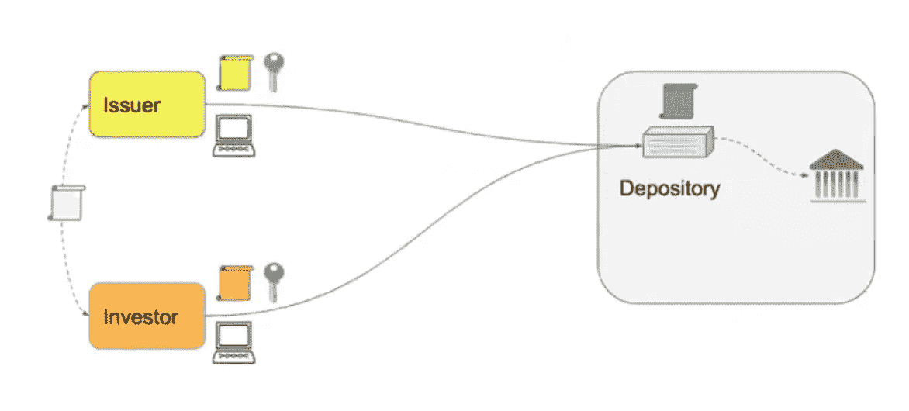
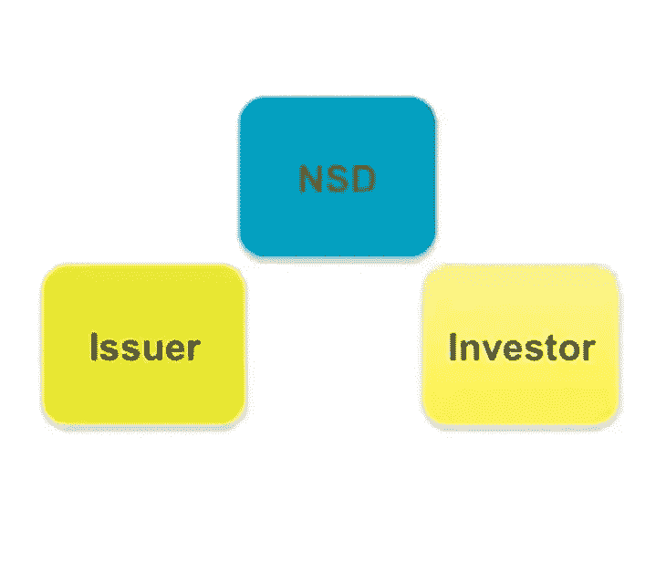
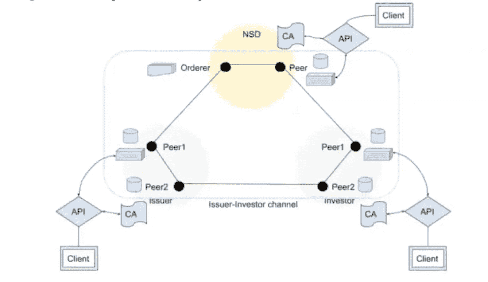
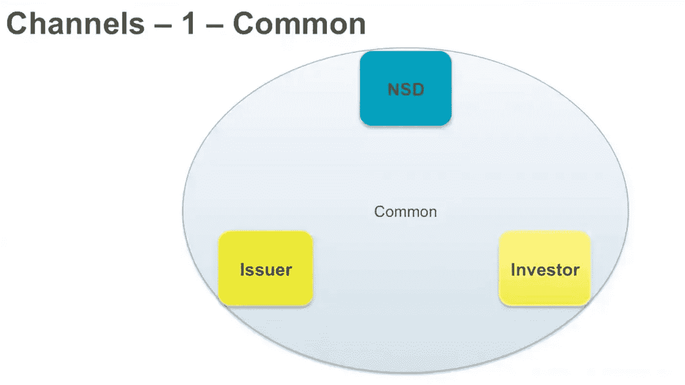
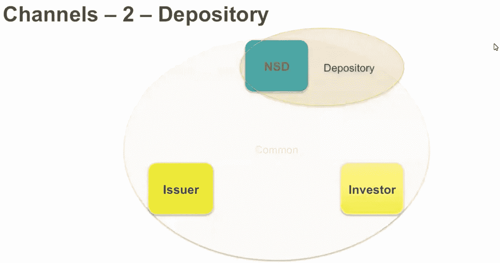
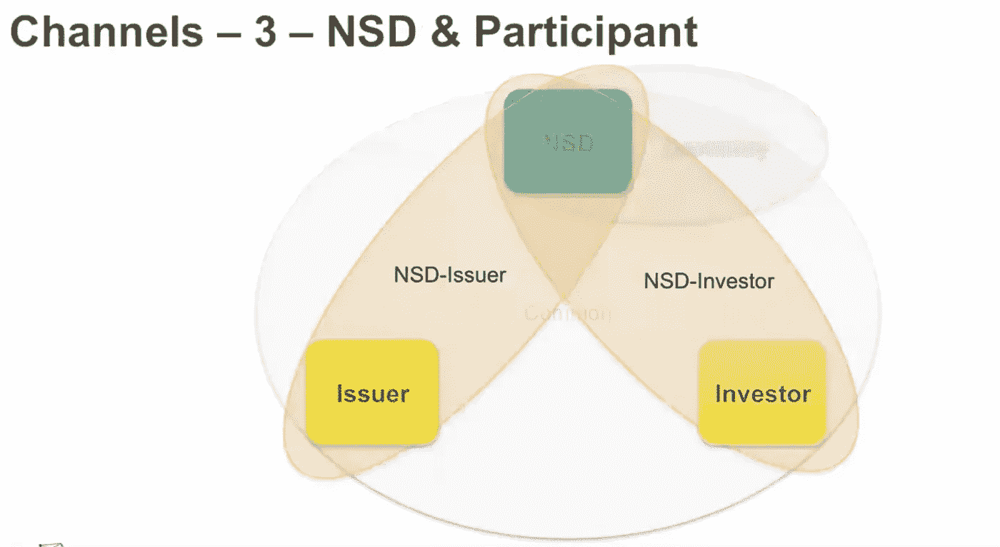
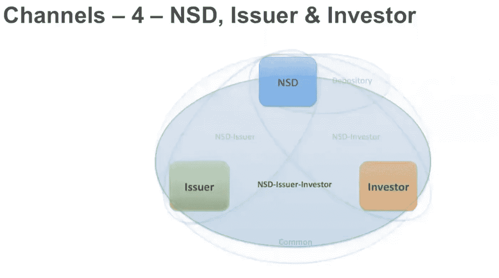
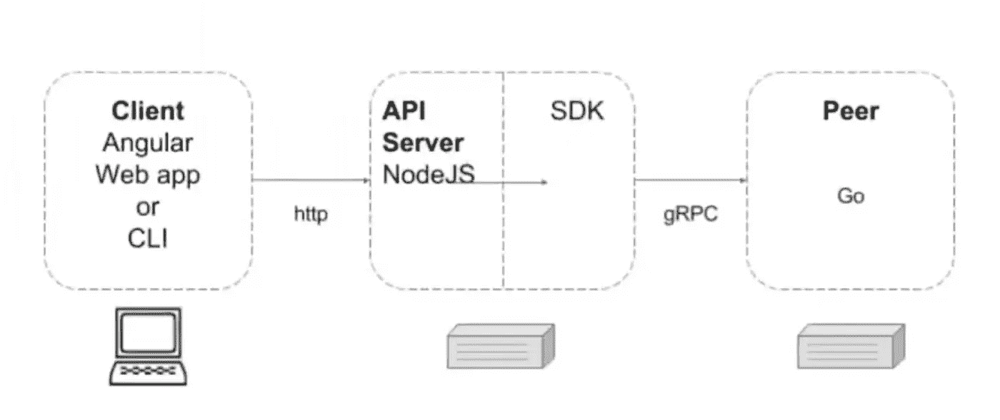

# 解码基于 Hyperledger Fabric 的 P2P 证券交易应用程序的架构—共识 2018

> 原文：<https://medium.com/coinmonks/decoding-the-architecture-of-p2p-securities-transfer-app-on-hyperledger-fabric-based-app-41c9aa8765d2?source=collection_archive---------3----------------------->

2018 年 5 月，Hyperledger 主办的共识活动。许多 Hyperledger 成员展示了他们使用不同的区块链平台开发的产品和平台。

其中一位成员介绍了基于 Hyperledger 架构开发的 P2P 安全交易平台。

在解释应用程序之前，我们可能会有一个问题。

> **什么是证券/商业票据？**

## 由金融/公司或大公司针对其公司发行的短期债务证券。

> 谁是投资者？

## **通过转让行为从发行人或其他投资者处接收或转让商业票据合同的商业实体。**

合同结束时，投资者通过利率或 5%的利润获得适当的回报。它用于短期贷款。一般来说，商业票据是折价出售的。但是在赎回合同时，他们将获得合同的全部货币价值。

在商业票据中，有不同的到期期限。

1.  六个月
2.  9 个月。(最长 270 天)

在金融领域，任何少于 270 天的交易都被认为是货币市场。货币市场交易不需要 T4 证券交易委员会的注册和批准。金融市场中的商业票据。

# 通过避免证券交易委员会的注册，它的成本更低。这是公司的一大优势。这就是为什么公司使用证券作为短期贷款来满足财务需求。

它避免了商业贷款和 SEC 批准的成本和时间。

商业票据的问题:

*   商业票据是无担保的
*   如果公司到期未能付清欠款，购买者对公司资产没有要求权。

正因为如此，拥有良好信用的人可以成功地出售商业票据。

商业票据以大面额出售，

*   10,00,000$

商业票据的大部分投资是由大公司和富有的个人完成的。

# **用例:点对点安全传输的中介。自动化区块链上的结算流程。**

当前状态问题:

*   传统的结算过程缓慢且成本高昂
*   中介手动管理交易
*   系统不透明
*   难以扩展。

# 解决方案:

在这种情况下，三个不同的组织被用来解释这种情况。

**NSD:** 国家安全存管机构— **可信第三方**。谁负责将人带入系统并创建联盟。

技术责任:

1.  与三个组织建立区块链网络
2.  运行“订购者”，相当于 miner。
3.  创建针对公司的新证券发行记录。
4.  维持发行人和投资者的平衡

**发行人:**通过提及转让指令/规则将商业/证券票据转让给投资者的**商业**实体。

**投资者:**一个**业务**实体，通过按照规定的规则发起转让，从发行人或其他投资者处接收或转让商业票据合同。

**步骤 1 —网络架构** —渠道和组织

我们将使用 hyperledger 结构配置创建三个组织渠道。在网络之上，业务逻辑将通过**链码/智能合同**实现

**网络中的参与者**

这是一个双对等网络。发行者和投资者各有两个对等方

# 频道

1.  **公共频道:**

用于向所有其他组织广播数据的频道。每个人都可以看到的频道数据。这就像学校里的通知，每个人都可以看到上面写的数据。

用于查询网络中创建和可用的安全文件(资产)

**存管渠道**

1.  NSD(国家安全存管机构)余额的维护。
2.  谁是渠道的参与者
3.  记录双方之间的资产转移

**NSD 投资者/发行人**

1.  该通道用于 NSD →发行人和 NSD→投资者的数据通信。

**发行人-NSD-投资者**

这是通道，用于 NSD 发行人投资者

# 链码/智能合同/业务逻辑

现在，我们可以看到业务逻辑安装在通道上

## 1.图书:部署在存管渠道

a.维护组织持有的证券数量的记录。

b.一旦接收到匹配指令

→验证转账器的余额

→将指定数量的证券从转让方余额转移至转让接收方。

## 2.指令链代码:部署在 NSD-发行人-投资者

a.有效日期转移指令

b.转移证券数量并存储它。

c.一旦接收到接收者的指令

→如果存在，查找相应的转移

d.存管指令匹配转账成功后，将状态更改为已执行或已拒绝。

**3。位置链码:部署在 NSD 会员频道**

a.维护每个成员持有的证券查询的奖励

b.收到**簿**中记录的移动后，更新成员数量。

**4。安全链码:部署在公共频道**

a.维护证券记录。

b.操作员可以记录证券的生命周期事件

c.支付息票、到期和赎回。

# Web 界面和 RestAPI

请看这里的[视频](https://www.youtube.com/watch?v=eAwCgTUK6tc&list=PL0MZ85B_96CGWiKwZ4e8jxFzU0X7UdVFp)的演示。

请留下您的宝贵意见。