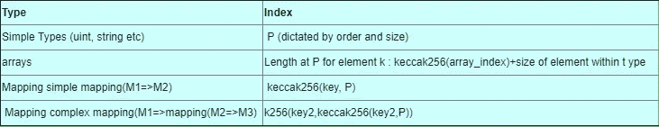
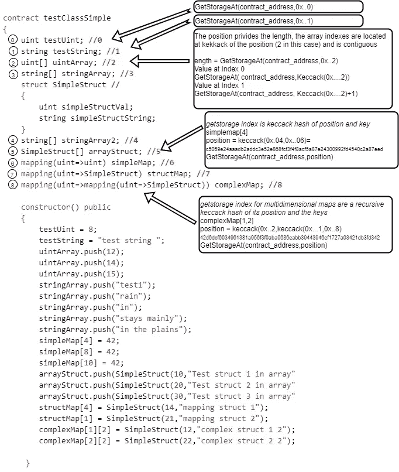
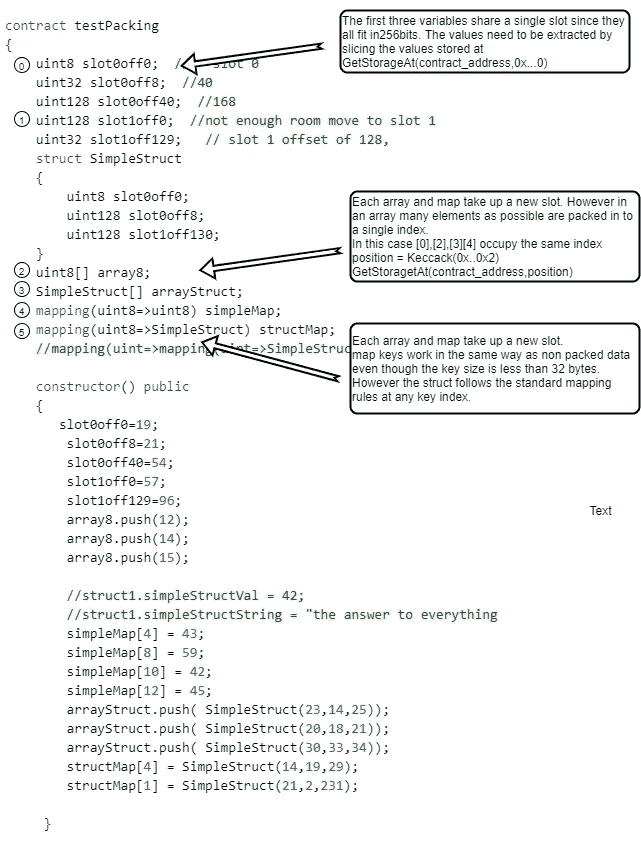

# 解码以太坊契约的存储

> 原文：<https://medium.com/coinmonks/decoding-the-memory-of-an-ethereum-contract-52c256f83f07?source=collection_archive---------0----------------------->

本文是探讨以太坊虚拟机(EVM)存储机制的系列文章的第 1 部分。

[第 2 部分](http://inuka.dev/an-ethereum-storage-decode-tool/)介绍了使用本文中的概念编写的存储解码工具。

## **以太坊记忆**

EVM 允许执行智能合同代码。约定状态或存储器存储在约定地址。这种存储可以被认为是位于契约地址的无限长的类似数组的数据结构。存储机制确保存储位置没有冲突，并遵循一组规则。使用这些规则，我们可以解码任何合同的状态。解码存储在地图中的数据需要知道所使用的密钥。使用 RPC 调用 [eth_getStorageAt](https://github.com/ethereum/wiki/wiki/JSON-RPC#eth_getstorageat) 对合同数据进行解码。

## **插槽位置**

智能合约的存储数组中变量的位置由它在代码中出现的顺序和变量的大小决定。这个位置称为插槽。如果变量小于 256 位，EVM 会尝试在空间中装入多个变量，因此，多个变量可能会占用存储阵列中单个槽的空间。一个映射或数组将总是占用一个槽。数组和映射元素的位置遵循一组特殊的散列规则，本文将对此进行讨论。这些规则在[以太坊](https://blog.coincodecap.com/tag/ethereum/) [文档](https://solidity.readthedocs.io/en/v0.4.20/miscellaneous.html#layout-of-state-variables-in-storage)中也有描述。

下表(表 1)简要总结了 EVM 遵循的分配规则。我们将查看两个契约示例，并使用表 1 中提供的规则对它们进行解码

## **256 位变量的简单示例**

首先让我们看一个简单的例子，所有变量都是 256 位(32 字节长)。这样做允许我们在不考虑可变包装的情况下查看分配。

请注意，当对数字应用 keccack 哈希时，数字必须是 0 填充的 64 位值。

所有的解码都是使用[以太坊](https://blog.coincodecap.com/tag/ethereum/) RPC 调用[eth _ getstoraget](https://github.com/ethereum/wiki/wiki/JSON-RPC#eth_getstorageat)来执行的，在文章中表示为 getstoraget。任何语言包装器如 nethereum 或 web3j 都可以用来调用这个 RPC api。

下图(图 1)显示了如何对协定的地址和传递给它的位置值进行 GetStorageAt 调用。图 1 左侧的数字是变量的位置。对于基本类型(uint、string 等。)这个位置可以传入 GetStorageAt 来获取变量值。对于数组，位置将返回数组的长度。

通过将 Keccack 哈希传递给索引 0 的 GetStorageAt 来解码数组索引。数组的每个后续索引位于与位置相加的哈希值处。这可以被认为是访问指向数组的指针并增加它的位置来找到每个元素，类似于 C 或 C++。

地图稍微复杂一点。传递给 GetStoragetAt 的每个键的位置值是键的 keccack 散列和映射声明的位置。对于多维映射，Keccack 散列值被递归调用用于键和变量位置。请参见图 1 中的示例进行说明。

接下来让我们看一个变量打包的例子。打包时要记住的一点是:

1.  它只适用于出现顺序的基本变量类型(uint128、string、int 等)。EVM 将按照变量在代码中列出的顺序，在 256 位空间中封装尽可能多的变量。
2.  每个映射和数组变量将占用一个新的槽。
3.  数组变量映射将遵循打包规则。也就是说，如果元素小于 256 位，数组的多个索引将占用存储数组中的单个槽。

以太坊[文档](https://solidity.readthedocs.io/en/develop/miscellaneous.html#layout-of-state-variables-in-storage)中也解释了这些规则

图 2 显示并解释了发生的打包。当一个类型的长度小于 256 位时，EVM 会尝试将额外的变量装入该槽中。EVM 按照列出的顺序挑选要打包的变量。地图和数组总是出现在新的位置。但是，打包规则仍然适用于解码数组索引，打包规则仍然适用于存储在映射中的结构。参见图 2，了解在这种情况下变量是如何存储的。

## **继承**

关于继承的一个注记。当契约继承其他契约时，基础契约的存储变量按照继承顺序占据存储阵列的第一个槽。子类的存储变量会在后面出现。

## **结论**

如上所述，我们可以使用本文描述的规则来解码以太坊智能合约的记忆。[第 2 部分](http://inuka.dev/an-ethereum-storage-decode-tool/)将描述一个使用本文描述的规则编写的工具

> [在您的收件箱中直接获得最佳软件交易](https://coincodecap.com/?utm_source=coinmonks)

*原载于 2020 年 3 月 30 日*[*https://inuka . dev*](https://inuka.dev/decoding-the-memory-of-an-ethereum-contract/)*。*

