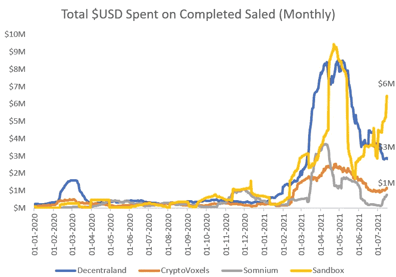

# 解码元宇宙:在分散游戏令牌组学的罩下

> 原文：<https://medium.com/coinmonks/decoding-the-metaverse-under-the-hood-of-decentralized-gaming-tokenomics-b5cd9d907cfa?source=collection_archive---------1----------------------->

## **概述**

自 Vitalik Buterin 最初的以太坊论文以来，去中心化游戏一直被吹捧为智能合约技术的最高潜在用例之一。过去一周，投机热情已经赶上了这一论点，因为在令人印象深刻的基本面增长的支持下，AXS 和沙子等代币出现了有意义的价格波动。在这篇文章中，我们来看看分散式游戏空间的构建模块:虚拟世界。

随着分散式游戏生态系统开始成形，虚拟世界已经成为行动的中心。从广义上讲，这些是游戏不可知的生态系统，开发者和用户可以在虚拟世界中购买房地产来构建游戏和其他吸引人的东西。然后，用户和开发者可以创建和交换虚拟资产，这些虚拟资产将永远留在链上。这是一个利润丰厚的市场，因为最终可能会有 1-2 个这样的宇宙获得大规模采用，其生态系统最终将带来数亿美元的价值，如果不是数十亿美元的话。因此，人们争相捕捉未来的房地产，这是可以理解的，在一些平台上，月销售额飙升至 1000 万美元左右的高点。

目前在元宇宙/虚拟世界领域有四个主要参与者:

1.  分散土地
2.  沙箱
3.  隐体素
4.  Somnium

Source: [Nonfungible.com](https://nonfungible.com/)

鉴于它们在主动钱包和相对价值获取方面的相对突出地位，我们在这一块重点关注分散土地和沙盒。

Source: [Nonfungible.com](https://nonfungible.com/)

## **1。分散土地**

分散土地有固定的 90k 块土地供应，用户/开发者可以购买这些土地来开发游戏和其他景点。土地是通过燃烧分散地的原生代币法力来购买的，使其通货紧缩(并间接将价值重新分配给代币持有者)。法力的最大供应量为 2.2 吨，循环供应量为 1.3 吨。在大约 8 亿美元的 MCAP 中，法力令牌有两种使用情况:

1.  交易媒介:可以用来购买土地和其他游戏中的物品
2.  治理:随着分散土地迁移到 DAO 结构，法力持有者可以参与平台的治理决策

最后，当购买土地时，令牌持有者也将从法力令牌燃烧中受益，因为这将降低供应量并提高价格。

分散土地作为首批分散虚拟世界之一，已经得到了有意义的采用，其 9 万块土地中的大部分现在只在二级市场上交易。法力也是少数几个灰度图特别信任的标志之一，表明了强烈的机构需求。随着超过 50%的最大供应量已经在流通，法力看起来像是一个相对成熟的项目，它已经度过了早期项目面临的大多数发展困难。这一价值被马纳的通货紧缩象征经济学进一步放大。

 [## 最佳免费加密交易机器人——前 16 名比特币交易机器人[2021]

### 2021 年币安、比特币基地、库币和其他密码交易所的最佳密码交易机器人。四进制，位间隙…

medium.com](/coinmonks/crypto-trading-bot-c2ffce8acb2a) 

## **2。沙盒**

沙盒在 2012 年开始作为 Web 2.0 平台，积累了超过 4000 万次下载，然后在 2018 年推出 Web 3.0 版本。这一先前的成功以现有用户基础的形式给了沙盒团队操作杠杆，这是其他虚拟世界竞争者所没有的。

与分散化土地非常相似，沙盒生态系统运行在它的本地实用工具 token SAND 上。像分散土地，沙盒也有有限数量的地块，可以购买使用沙子。然而，与分散土地不同，用户不需要燃烧沙子代币来购买它。更确切地说，用于购买的沙子是在卖家和沙盒金库之间分配的。总的来说，SAND 令牌有三个主要用例:

1.  交易媒介:沙子可以用来交换土地和其他游戏中的物品
2.  治理:沙地持有者可以参与平台的治理决策
3.  赌注:用户可以在沙堆和代币上下注，并从平台的广告和交易费收入中获利

以下是该平台收入来源的完整列表:

根据我们的粗略估计，SAND 的交易价格相对较低，为其国债价值的 1.7 倍(来自一级土地销售+预计。交易费用)

## **卖地**

123，000 块可供购买的土地中的大部分都是通过大约 1，000 块独特销售在 2020 年的一次销售中购买的。从那时起，二级市场也销售了约 900 台。如果土地销售是采用的任何迹象，沙盒已经做到了这一点。

## **沙堆组学**

桑德的 3B 代币供应量最大，发行量为 7 亿枚(23%)。另外 12 亿英镑(40%)在公司的金库里，2 . 8 亿英镑(9%)在基金会账户里。这意味着只有大约 28%仍然由团队/顾问所有。以下是沙代币的行权时间表。虽然目前只有约 23%的最大供应量在流通，但大部分剩余供应量都在基金会和公司储备中，这使得潜在的代币倾销不太可能发生。

总的来说，迄今为止，沙盒已经获得了强劲的采用和收入。SAND 令牌也有一组健壮的令牌组学。基于治理、汇率和收入的联合赌注尤其强劲。

 [## 最佳 6 个加密交易信号电报通道

### 这是乏味的找到正确的加密交易信号提供商。因此，在本文中，我们将讨论最好的…

medium.com](/coinmonks/best-crypto-signals-telegram-5785cdbc4b2b) 

## **结论**

虚拟世界处于去中心化游戏革命的最前沿，随着空间的成熟，它将继续增长。鉴于围绕房地产估价的社会共识的基本结构，我们预计在未来 5-10 年内，这一领域将由 1-2 家公司主导(这类似于《我的世界》和 Roblox 的 Web 2.0 虚拟世界双头垄断)。我们已经开始看到分散的市场主导地位和沙盒作为领导者出现。在这两者中，数字表明沙盒在参与度和价值获取方面开始超过分散式。鉴于其相对较低的市值和强大的收入+代币价值转移模式，我们预计 SAND token 具有有意义的增长跑道。

> 加入 [Coinmonks 电报频道](https://t.me/coincodecap)，了解加密交易和投资

## 另外，阅读

 [## BlockFi 评论 2021 —通过您的加密获得 8.6%的利率

### 让你的密码发挥作用，获得比特币和其他加密货币的最佳利率

medium.com](/coinmonks/blockfi-review-53096053c097)  [## 加密税务软件——五大最佳比特币税务计算器[2021]

### 不管你是刚接触加密还是已经在这个领域呆了一段时间，你都需要交税。

medium.com](/coinmonks/best-crypto-tax-tool-for-my-money-72d4b430816b) 

*   [尤霍德勒 vs 科恩洛安 vs 霍德诺特](/coinmonks/youhodler-vs-coinloan-vs-hodlnaut-b1050acde55a) | [隐蝠 vs 哈斯博特](https://blog.coincodecap.com/cryptohopper-vs-haasbot)
*   [币安 vs 北海巨妖](https://blog.coincodecap.com/binance-vs-kraken) | [美元成本平均交易机器人](https://blog.coincodecap.com/pionex-dca-bot)
*   [如何在印度购买比特币？](/coinmonks/buy-bitcoin-in-india-feb50ddfef94) | [WazirX 审核](/coinmonks/wazirx-review-5c811b074f5b) | [BitMEX 审核](https://blog.coincodecap.com/bitmex-review)
*   [比特币主根](https://blog.coincodecap.com/bitcoin-taproot) | [Bitso 评论](https://blog.coincodecap.com/bitso-review) | [排名前 6 的比特币信用卡](/coinmonks/bitcoin-credit-card-bc8ab6f377c6)
*   [双子座 vs 比特币基地](https://blog.coincodecap.com/gemini-vs-coinbase) | [比特币基地 vs 北海巨妖](https://blog.coincodecap.com/kraken-vs-coinbase) | [硬币罐 vs 硬币点](https://blog.coincodecap.com/coinspot-vs-coinjar)
*   [印度密码交易所](/coinmonks/bitcoin-exchange-in-india-7f1fe79715c9) | [比特币储蓄账户](/coinmonks/bitcoin-savings-account-e65b13f92451) | [Paxful 审核](/coinmonks/paxful-review-4daf2354ab70)
*   [杠杆令牌](/coinmonks/leveraged-token-3f5257808b22) | [最佳加密交易所](/coinmonks/crypto-exchange-dd2f9d6f3769) | [AscendEX 评论](/coinmonks/ascendex-review-53e829cf75fa)
*   [Godex.io 审核](/coinmonks/godex-io-review-7366086519fb) | [邀请审核](/coinmonks/invity-review-70f3030c0502) | [BitForex 审核](/coinmonks/bitforex-review-c4bb28d9e271) | [HitBTC 审核](/coinmonks/hitbtc-review-c5143c5d53c2)
*   [Crypto.com 费用](/coinmonks/binance-fees-8588ec17965) | [僵尸密码审查](/coinmonks/botcrypto-review-2021-build-your-own-trading-bot-coincodecap-6b8332d736c7) | [替代品](https://blog.coincodecap.com/crypto-com-alternatives)
*   [MXC 交易所评论](/coinmonks/mxc-exchange-review-3af0ec1cba8c) | [Pionex vs 币安](https://blog.coincodecap.com/pionex-vs-binance) | [Pionex 套利机器人](https://blog.coincodecap.com/pionex-arbitrage-bot)
*   [我的密码交易经验](/coinmonks/my-experience-with-crypto-copy-trading-d6feb2ce3ac5) | [比特币基地评论](/coinmonks/coinbase-review-6ef4e0f56064)
*   [CoinFLEX 评论](https://blog.coincodecap.com/coinflex-review) | [AEX 交易所评论](https://blog.coincodecap.com/aex-exchange-review) | [UPbit 评论](https://blog.coincodecap.com/upbit-review)