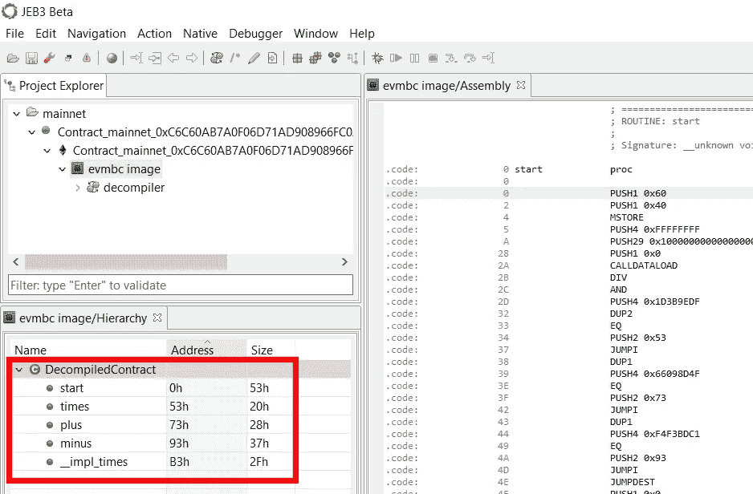
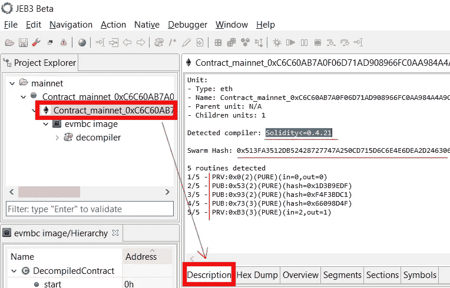
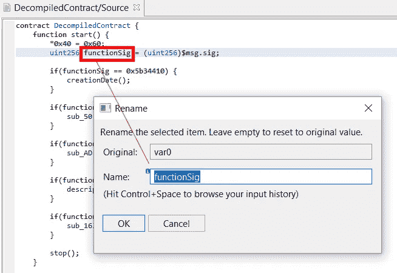

# 反编译以太坊智能合约

> 原文：<https://medium.com/coinmonks/decompiling-ethereum-smart-contracts-b283ae80f8a0?source=collection_archive---------0----------------------->

我们非常兴奋地宣布，我们的以太坊智能合同反编译预发布可用。我们相信它将成为安全审计员、漏洞研究人员和逆向工程师检查以太坊平台上运行的不透明智能合同的首选工具。

**匆匆忙忙？** [**下载试玩 build 并开始反转合约**](https://www.pnfsoftware.com/jeb/demoevm) **。记得在 DecompiledContract 节点上按 TAB 键来查看其类似于 Solidity 的源代码。**

请继续阅读，了解反编译器的当前特性；如何使用它，了解它的输出；它当前的局限性和计划中的增加。

[This opaque multisig wallet](https://etherscan.io/address/0x3DBB3E8A5B1E9DF522A441FFB8464F57798714B1) is holding ~ USD $22 million as of 10/30/2018!

# 能力

反编译器模块提供以下特定功能:

*   反编译器将编译后的智能合约 EVM 代码作为输入，并将它们反编译成类似于源代码的 [Solidity](https://solidity.readthedocs.io/en/latest/index.html) 。
*   最初的 EVM 代码分析通过确定契约的公共和私有方法，包括由编译器综合生成的公共方法的实现。
*   代码分析试图在不访问 ABI 的情况下确定方法和事件的名称以及原型。
*   反编译器还试图恢复各种高级构造，包括:众所周知的接口的实现，如标准令牌的 ERC20、不可替换令牌的 ERC721、MultiSigWallet 契约等；存储变量和类型；高层次的坚固性神器和习惯用法，包括:函数可变性属性；功能支付能力状态；事件发射，包括事件名称；address.send()或 address.transfer()的调用；预编译合同调用

除此之外，JEB 后端和客户端平台还提供了以下标准功能:

*   反编译器使用 JEB 的优化管道来产生高级别的干净代码。
*   它使用 JEB 代码分析核心特性，因此允许:代码重构(例如，一致地重命名方法或字段)，注释和标注，导航(例如，交叉引用)，键入，绘图等。
*   用户可以通过 JEB API 访问中级 IR 表示和高级 AST 表示。
*   更一般地说，API 允许高级用户编写扩展，从 Python 中的简单脚本到 Java 中的复杂插件。

我们的以太坊模块在活跃于以太坊主网和测试网上的数千份智能合约上进行了测试。

# 基本用法

通过*文件打开合同，打开智能合同…*菜单项。

您将有两种选择:

*   打开已经存储在磁盘上的二进制文件。
*   从一个主要的以太网下载并打开合同: *mainnet* 、 *rinkeby* 、 *ropsten* 或 *kovan* 。选择网络，提供合同 20 字节地址，单击下载并选择文件目的地。

*Open a contract via the File, Open smart contract menu entry*

请注意，要被识别为 EVM 代码，文件必须:

*   要么有一个”。evm-bytecode”扩展:在这种情况下，文件可能包含二进制或十六进制编码的代码；
*   或者已经是一个了”。运行时“或”。bin-runtime”扩展(由 solc Solidity 编译器生成)，并包含十六进制编码的 Solidity 生成代码。

如果您正在打开 raw 文件，我们建议您附加“.evm-extension ”,以保证它们将作为 evm 合同代码进行处理。

## 合同处理

JEB 将处理您的合同文件，并生成一个 *DecompiledContract* 类项目来表示它:

*The Assembly view on the right panel shows the processed code.*

要切换到反编译视图，在层次视图中选择“反编译合同”节点，按 TAB 键(或右键，*反编译*)。

*Right-click on items to bring up context menus showing the principal commands and shortcuts.*

The decompiled view of a contract.

反编译后的契约以类似 Solidity 的代码呈现:大部分是 Solidity 代码，但不完全是；在整个代码中，非法的结构被用来表示反编译器不能表示的指令。示例包括:代表一些低级 EVM 指令、内存访问的低级语句，或者非常罕见的 goto 语句。不要指望一个反编译的契约会被轻易地重新编译。

## 代码视图

如果您希望同时导航汇编和高级代码，可以调整视图面板，使之具有并排视图。

*   在 routine 的装配视图中，按 Space 以可视化其控制流图。
*   若要在程序集和源代码之间来回导航，请按 TAB 键。插入符号将定位在最接近的匹配指令上。

Side by side views: assembly and source

## 合同信息

在项目浏览器面板中，双击合同节点(带有以太坊基金会官方标志的节点)，然后在打开的视图中选择描述选项卡，查看有关已处理合同的有趣信息，例如:

*   检测到的编译器和/或其版本(当前支持 Solidity 和 Vyper 编译器的变体)。
*   检测到的例程列表(私有和公共，及其哈希)。
*   元数据文件的群组哈希(如果有)。

The contract was identified as being compiled with Solidity <= 0.4.21

## 命令

常用的命令可以用来重构和注释汇编或反编译的代码。您将在*动作*和*本地*菜单中找到详尽的列表。以下是基本命令:

*   使用 N 键重命名项(方法、变量、全局变量等)
*   使用 X 键通过检查交叉引用来导航代码(例如，找到一个方法的所有调用方，并跳转到其中一个调用方)
*   使用斜杠键进行注释
*   如前所述，TAB 键有助于在低级 EVM 代码和高级反编译代码之间来回导航

我们建议阅读[用户手册](https://www.pnfsoftware.com/jeb/manual/)来了解如何使用 JEB。

Rename an item (eg, a variable) by pressing the N key

请记住，您可以通过使用 B 键来更改即时数字基数和渲染。在下面的例子中，您可以看到在 [bad Fomo3D](https://etherscan.io/address/0xdd9fd6b6f8f7ea932997992bbe67eabb3e316f3c) 契约中出现了几个字符串，最初以十六进制呈现:

All immediates are rendered as hex-strings by default.

Use the B key to cycle through base (10, 16, etc.) and rendering (number, ascii)

# 理解反编译合同

这一节强调了你在反编译伪可靠性代码中会遇到的习惯用法。下面的例子展示了 JEB UI 客户端，左侧是一个程序集，右侧是高级反编译代码。作为例子使用的合同是当前活跃的以太坊 *mainnet* 的实时合同。

我们还强调了当前的限制和计划增加的内容。

## 调度程序和公共功能

地址为 0 的契约的入口点函数通常是它的调度程序。它被 JEB 命名为 start()，在大多数情况下，它包含在一个 if 语句中，将输入的 calldata 散列(前 4 个字节)与预先计算的散列进行比较，以确定要执行哪个例程。

*   JEB 试图通过使用哈希字典(目前包含超过 140，000 个条目)来确定公共方法名。
*   由 Solidity 编译的契约通常使用合成的(编译器生成的)方法作为公共例程(使用公共以太坊 ABI)和内部例程(使用编译器特定的 ABI)之间的桥梁。这些例程也被标识，如果它们对应的公共方法被命名，将被赋予一个相似的名称 *__impl_{PUBLIC_NAME}* 。

注意/计划添加:目前，JEB 并不试图处理公共例程的输入数据，并将其按摩回带有常规变量的显式原型。因此，您将看到在公共方法中对 CALLDATA 字节的低级访问。

A dispatcher.

下面，请参见公共方法 collectToken()，该方法从 calldata 中检索其第一个参数—一个 20 字节的地址。

A public method reading its arguments from CALLDATA bytes.

## 接口发现

在撰写本文时，可以检测到以下接口的实现:ERC20、ERC165、ERC721、ERC721TokenReceiver、ERC721Metadata、ERC721Enumerable、ERC820、ERC223、ERC777、ERC223/ERC777 接口使用的 TokenFallback 以及通用的 MultiSigWallet 接口。

例如，以下合同被确定为 ERC20 令牌实施:

This contract implements all methods specified by the ERC20 interface.

## 功能属性

杰布尽全力找回:

*   低级状态可变性属性(纯、只读、读写)
*   为公共方法保留的高级 Solidity“payable”属性

显式不可支付的函数具有较低级别的合成存根，用于验证没有接收到以太网。如果情况属实，它们会恢复原状。如果 JEB 决定删除这个存根，这个函数将总是有一个行内注释 **/*non payable*/** ，以避免任何歧义。

下面的契约展示了两个公共方法，一个有默认的可变性状态(不可支付)；另一个是应付的。(注意，哈希 0xFF03AD56 没有被解析，因此方法的名称是未知的，被设置为 sub _ AF 您可能还会看到对 collect()的桥接函数 __impl_collect()的调用，如前一节所述。

Two public methods, one is payable, the other is not and will revert if it receives Ether.

## 存储变量

预发布的反编译器附带了一个有限的存储重建器模块。

*   大多数情况下，对原语(int8 至 int256，uint8 至 uint256)的访问是重新构造的
*   提取存储字中打包的小原语(例如，包含 2 个 uint8 和 1 个 int32 的 256 位存储字，并在整个代码中访问，将产生 3 个契约变量，正如人们期望在 Solidity 契约中看到的那样

Four primitive storage variables were reconstructed.

然而，目前对复杂存储变量的访问，如映射、映射的映射、结构的映射等。都没有简化。这个限制将在完整版本中解决。

当存储变量未被解析时，您将看到简单的“存储[…]”赋值，例如:

Unresolved storage assignment, here, to a mapping.

由于以太坊上的存储是如何设计的(uint256 到 uint256 的键值存储)，Solidity 在内部使用两个或多个间接层来计算实际的存储键。那些低级存储键取决于高级存储变量的位置。KECCAK256 操作码用于计算中间密钥和最终密钥。我们将在以后的博客文章中详细介绍这一机制。

## 预编译合同

以太坊在地址 1，2，3，4 定义了[四个预编译契约](https://github.com/ethereum/aleth/blob/master/libethereum/ChainParams.cpp#L41)。(其他地址(5–8)被保留用于额外的预编译合同，但这仍处于 ERC 阶段。)

JEB 识别最终将导致预编译代码执行的调用，并在反编译代码中将其标记为这样: *call_{specific}* 。

下面的例子显示了 [34C3 CTF 契约](https://etherscan.io/address/0x949a6ac29b9347b3eb9a420272a9dd7890b787a3)的 *__impl_Receive* (名为 recovered)方法，该方法调用地址#2，这是一个预编译的契约，提供了 SHA-256 的快速实现。

This contract calls address 2 to calculate the SHA-256 of a binary blob.

## 以太发送()

Solidity 的 *send* 可以翻译成一个较低级别的调用，有一个标准的气体津贴和零参数。它主要用于通过目标协定回退函数向协定发送以太网。

注意:目前，JEB 将它们呈现为 send(address，amount ),而不是 address.send(amount)

以下合同在 mainnet 上直播。它是一个简单的转发器，不存储以太网:它将收到的金额转发给另一个合同。

This contract makes use of address.send(…) to send Ether

## 乙醚转移()

Solidity 的 transfer 是 send 的一个更高级的变体，如果呼叫失败，它会检查并回复数据。杰布也认出了那些电话。

注意:目前，JEB 将它们呈现为 transfer(address，amount ),而不是 address.transfer(amount)

This contract makes use of address.transfer(…) to send Ether

## 事件发射

JEB 试图部分重建 LOGx (x in 1..4)操作码返回到高级实体“发出事件(…)”。通过反转事件方法原型哈希来解析事件名称。在写的时候，我们的字典包含超过 20，000 个词条。

如果 JEB 不能反转 LOGx 指令，或者如果使用 LOG0，那么将使用较低级别的 log(…)调用。

注意:目前不处理事件参数；因此，反编译代码中使用的 *emit* 构造具有以下形式:emit Event(memory，size[，topic2[，topic3[，topic4]])。topic1 始终用于存储事件原型哈希。

An Invocation of LOG4 reversed to an “emit Deposit(…)” event emission

# 应用程序接口

JEB API 允许复杂或重复任务的自动化。后端插件或复杂脚本可以用 Python 或 Java 编写。JEB 3.0-beta 6 附带 API 更新允许用户查询反编译的合同代码:

*   访问中间表示(IR)
*   访问最终的类固体表示(AST)

API 的使用超出了这里的范围。我们将在随后的博客文章或我们的公共 [GitHub 库](https://github.com/pnfsoftware/)上提供例子。

# 结论

如果你正在对不透明的合同进行逆向工程，给杰布一个尝试:在这里下载演示，并随时让我们知道你在评论区、Twitter (@jebdec)或通过电子邮件在 contact@pnfsoftware.com 的反馈。

> [直接在您的收件箱中获得最佳软件交易](https://coincodecap.com/?utm_source=coinmonks)

