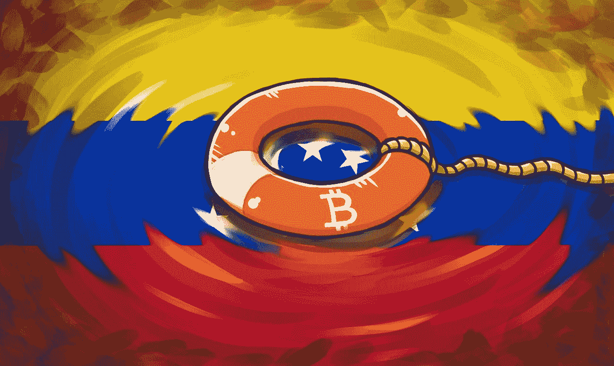

# 解构委内瑞拉关于比特币的神话和戏剧。

> 原文：<https://medium.com/coinmonks/deconstructing-myths-and-drama-about-bitcoin-in-venezuela-c6319cb70835?source=collection_archive---------7----------------------->

当我们谈论加密货币作为关键经济体的某种“生命救星”时，我们确实倾向于将更多的注意力放在戏剧上，而不是整体上，因此我们错过了一些重要的事实；就像“非洲的孩子正在挨饿”这个借口，当我们不喜欢一顿饭时，我妈妈和我以及我妹妹用这个借口让我们吃，所以我们长大后认为非洲是贫穷的同义词(事实并非如此)。

好吧，现在有一种倾向，只把比特币看作是一种用于生存的金融工具(又错了)。你想要戏剧？我给你一些。

所以我在这里，在委内瑞拉的一场后世界末日“革命”医疗危机中，处理我奶奶几乎崩溃的肺和相当敏感的心脏状况。随着密码价格的上涨，我正在通过比特币来支付她的治疗费用，以及我和我家人的基本需求的责任，来完成生存的戏剧。

我必须强调，对该国许多人来说，这种情况并不常见。是的，密码帮助我生存，但使用它们的意义远远不止于此，因为我正在围绕它们建立职业生涯，而其他人则将其作为投资而不是货币。我只是说，这不全是钱的问题。

有一次，我遇到了一位德国记者，他对拉丁美洲采用 cryptos 非常感兴趣，所以我们在哥伦比亚的一次会议上聊了一会儿。当我的同事听到我在 crypto 做编辑的收入是如何帮助我度过在我的国家强加的破碎的社会主义模式的最糟糕时期时，他的眼睛亮了起来。这就像找到一个土著人告诉你所有关于晚餐猎狮什么的。

从那以后，我真的没有和任何人说起过这件事。我目前靠我的积蓄生活，因为我追求我的职业目标，这与产生任何怜悯或同情无关，而是知识和对在我的国家使用加密货币等分散技术的真实感知。还有一个事实是，到处公开说你拥有 crypto 从来都不是一个明智的选择，所以我不这么做。

我采访了许多寻找这种戏剧素材的矿工和投资者，但我的发现会让那些认为比特币或加密技术是糟糕的经济和金融形势的某种神奇解决方案的人深感失望。所以让我们来揭开一些神秘的面纱:

委内瑞拉的每个人都把加密作为最后的经济手段。就像不是每个非洲孩子都在挨饿一样，也不是每个委内瑞拉人都在使用加密技术度过危机。事实上，在一个现金匮乏代表着巨大混乱的国家，绝大多数人不熟悉 P2P 支付，甚至不知道什么是加密货币。尽管最近政府采取了许多行动来采纳它，这一事实并没有改变，包括突然推出 ICO 并开始与采矿社区接触(在政治迫害仍在继续之后)。

另一方面，这一领域的教育仍处于起步阶段。很难让人们使用他们不确定如何工作的东西，通常被解释为“好交易”或听起来很像一个计划的东西。

**委内瑞拉的采矿业发展迅猛，每个人都在这么做。**哦，对了，著名的“廉价基本服务”卡。好吧，事情是这样的:电力很便宜，因为它由政府补贴，是的，这对采矿活动很有吸引力。然而，这并不意味着它有效。实际上，停电一点也不罕见。有些州甚至一天断电 8 小时(顺便说一句，他们[试图将其归咎于矿工](http://versionfinal.com.ve/politica-dinero/mineria-de-criptomonedas-colapsa-el-sistema-electrico/))。

甚至不要让我在互联网上开始，这是拉丁美洲最慢的，每秒 1，6 兆位(Mgbps)。冠军们，祝你们在网络中击败所有对手时好运。

此外，加密货币和获得加密货币的设备是你首先购买的东西，以便从它的未来价值中受益(也就是投资)，它们并不完全在委内瑞拉的常规优先事项列表中，也不在玻利瓦尔福特斯的最低工资中，最低工资下降到——做好准备——相当于每月不到 5 美元。目前，标准的家庭食物篮子不低于 73 美元，这对于超过 90%的人口来说已经负担不起，更不用说负担得起 2000 美元的 S9 AntMiner，如果你正在考虑获得比特币。这还不是重点。

拥有密码会让你自然而然地变得富有。 [我已经说过了](https://twitter.com/criptodiana/status/974372318804881417):不，加密货币不是一种快速的金融解决方案。回到规则一:你不能说你拥有密码。有一个简单的原因，那就是如果你提到它，每个人都会认为你坐在一个黄金王座上。又错了。就像 73 美元对于那些在不到一天的时间里赚到这么多钱的人来说听起来不算多，对于那些生活在委内瑞拉的人来说也不算多，即使是用比特币。

回到我奶奶脆弱的健康状况，她 3 天的治疗价值不低于 400 美元。我们说的只是医疗费用中的最低工资 x80。有能力支付并不意味着我很富有，而是非常幸运。

建立在对加密技术投资的财富承诺基础上的计划所遗漏的部分是，当市场下跌时，运气可能会耗尽。因为两周前，当市场比《烟鬼之歌》中的节拍下跌得更厉害的时候，我连花在我奶奶治疗上的一半钱都付不起。

此外，我接触过的矿工并没有谈论致富，而是谈论如何生存。现在，没有什么比 20 多岁，甚至 30 多岁时经济独立更难得了，所以他们现在都在努力过正常的生活，或者接近正常的生活。不，不是比特币，而是通常更容易挖掘的现金、乙醚和其他替代货币。顺便说一句，没有人使用 Petro。

所以你看，这是已经到达委内瑞拉的加密繁荣背后的真实的一部分。这个国家确实有一个新兴的群体专注于这项技术，并且日益强大。随着它在世界任何地方的复制，知识的采用和传播以社会允许的最快速度增长，并通过教育尽可能多地吸引秘密社区。

区块链和加密货币生态系统成为主流伴随着经济和金融低估的必要性日益增长，更不用说技术领域了。我们有很多东西要学，与此同时，看看这将如何影响我们的文化，让我们——现金和银行的传统信徒——更接近金融科技的可能性，这将是一件有趣的事情。