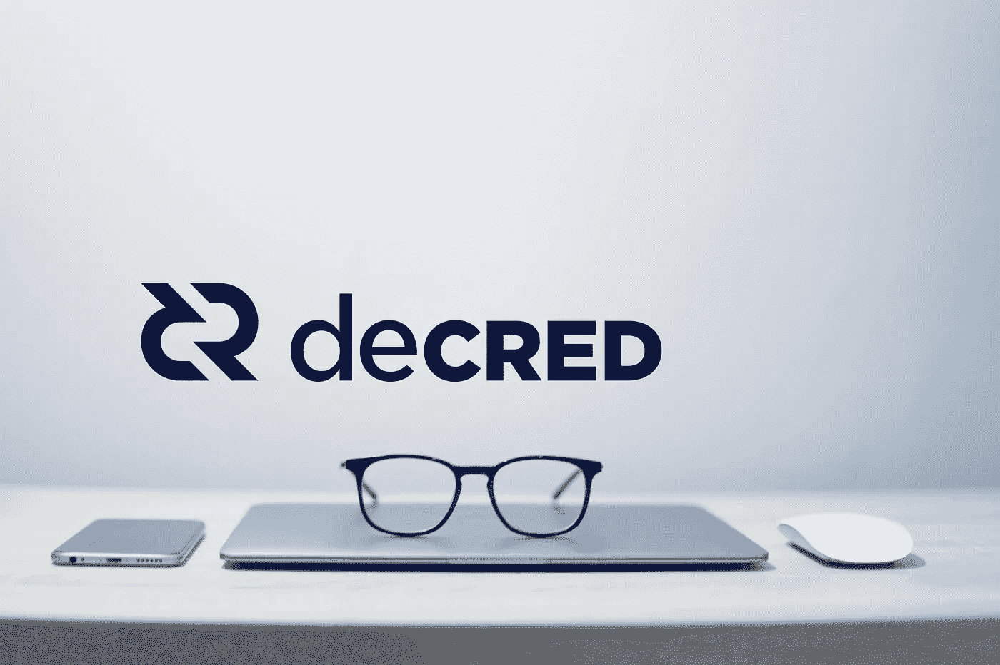

# 颁布法令

> 原文：<https://medium.com/coinmonks/decred-4cb7eb66db14?source=collection_archive---------1----------------------->

## 价值的合理储存

我最近一直在研究 DCR，对这种货币的基本面感到非常惊讶。所以我要求 Decred 社区为我们可爱的 Coinmonks 的读者写一个简单的 FAQ，Haon 做了。

***注*** *:非投资建议，由* [*Haon*](https://medium.com/u/e13e954912de?source=post_page-----4cb7eb66db14--------------------------------) *撰写，出于教育目的，关注他上*[*Twitter*](https://twitter.com/NoahPierau)*获取更多法令更新。*

## 什么是法令？

Decred 是一种社区驱动的数字货币，旨在提供一种真正去中心化、公平和主权的传统货币替代品。

它是一种安全且适应性强的货币，是一种优质的价值储存手段。每个人都投入并积极参与帮助 Decred 取得成功。

## 谁创造了法令？

Decred 的起源可以追溯到 2013 年，当时一个名叫“tacotime”的匿名 Bitcointalk 用户发起了一个[线程](https://bitcointalk.org/index.php?topic=169204.msg1760397)，并为 Memcoin2 (MC2)发布了[白皮书](http://mc2.xwebnetwork.com/storage/mc2_0.05.pdf)。Tacotime 与另一位匿名用户“_ ingsoc”一起工作。

2014 年初，tacotime 似乎也开始开发另一种流行的加密货币:Monero。_ ingsoc 带着 tacotime 的 MC2 概念找到了 Zero 公司的首席执行官 Jake Yocom-Piatt。

当时，Zero 公司主要专注于开发 btcsuite，这是一种用 Go 编写的替代性全节点比特币实现。他们的代码在加密社区受到高度重视，并被许多领先的项目使用，如以太坊、BitGo、Factom、OpenBazaar 和闪电网络团队。

最终，他们联手开发了 Decred。

## 为什么要创造法令？

Decred 的创立是为了提供比特币的替代品。2015 年，零公司发表了一篇[帖子，概述了比特币最大的挑战](https://blog.companyzero.com/2015/11/bitcoins-biggest-challenges/):治理、开发者资金以及权力矿工权力过大。

法令赋予持有货币的人更多的权力。

## 被判为比特币的分叉？

不。Decred 是由前比特币开发者创造的一种独立货币，他们面临比特币管理方式的问题。他们研究了比特币的成功之处，以及通过从一开始就整合正式的监管，他们可以增加什么。

目标是创建一个结构，通过这个结构，社区中任何一个在游戏中有皮肤的人都可以拥有和操作系统，制定规则，并决定项目的方向。

## Decred 是什么时候上线的？

法令于 2016 年 2 月 8 日推出。

## 法令是如何运作的？

法令区块链的基本工作证明(PoW)基础层扩展了利益证明(PoS)。其结果是一个具有混合 power+PoS 共识系统的独特区块链，提供了额外的安全层和正式的治理模型。

## Decred 和比特币有什么不同？

Decred 在三个关键方面不同于比特币:

1.  **安全** : Decred 被证明比纯 PoW 的[攻击](https://blog.usejournal.com/apples-to-apples-decred-is-20x-more-expensive-to-attack-than-bitcoin-68bafeb4546f)成本更高，这要归功于它的混合 PoW+PoS 模型，该模型协调了矿工和选民之间的激励。这确保了长期稳定性。
2.  **适应性** : Decred 内置了正式的[治理](https://docs.decred.org/governance/overview/)，允许它在避免硬分叉的同时对其共识规则进行更改。
3.  **可持续** : Decred 是通过整体奖励资助的。只有在游戏中有实际利益的利益相关者才能投票批准财政部的支出，这使得项目在长期内是可持续的。

## 我能用法令赚钱吗？

除了投机收益(类似于 BTC 或长期贷款持有者)，DCR 持有者可以决定参与 PoS 系统。就像战俘矿工被奖励保护网络(60%的街区奖励)，PoS 投票者被激励去治理被破坏的网络(30%的街区奖励)。

赌注可以带来可观的投资回报，并允许长期投资者在决定改变共识规则和批准财政部支出(由剩余的 10%整体奖励资助)时有发言权。

当你为破旧的生态系统提供价值时，额外的机会就会出现，因为破旧的国库可能会为你的服务付费。

## 为什么我没有听到更多的法令？

Decred 在过去的 3.5 年里一直在悄悄地建设。这使得社区能够专注于创建一个卓越的长期价值存储，它将独立存在——营销无法取代一个伟大的产品。

## 路线图上有什么？

Decred 的愿景是建立一个自我导向、分散的未来，由社区的集体智慧来管理。通过[提案平台](https://proposals.decred.org/)，所有利益相关者都可以提交提案，改变未来方向。

2019 年的显著成就:

*   [闪电网](https://matheusd.com/post/announcing-dcrlnd/) ⚡️
*   [隐私功能](https://blog.decred.org/2019/08/28/Iterating-Privacy/)🔒

## 继续教育

Decred 是一种高度复杂的数字货币，需要一些研究才能完全理解。以下是精选的最佳读物、播客和视频，帮助你理解这个项目。

## 阅读:

*   [法令文件](https://docs.decred.org/)法令文件
*   [占位 VC 颁布投资论文](https://www.placeholder.vc/blog/2018/5/12/decred-investment-thesis)
*   蓝源资本[发布投资论文](/@BlueYard/decred-82b284b4a795)
*   [笨蛋资本颁布投资论文](https://www.blockheadcap.com/post/decred-investment-thesis)
*   [Decred 这样的 altcoins 能和比特币竞争吗？](/@_Checkmatey_/monetary-premiums-can-altcoins-compete-with-bitcoin-54c97a92c6d4)
*   [颁布:黄金和比特币想成为什么](https://seekingalpha.com/instablog/49962360-pascal-thellmann/5324856-decred-gold-bitcoin-wanted)
*   [with decered](https://withdecred.org/):社区驱动的门户网站

## 听着:

*   [法令概述](https://soundcloud.com/decredindepth/ep-1-jonathan-zeppettini-jz-dcr-101)
*   [被规定为价值储存手段](https://soundcloud.com/decredindepth/murad-mahmudov-dcr-investment-thesis-sov-narrative-crypto-economics)
*   [法令及其隐私实施](https://unchainedpodcast.com/after-years-of-secret-work-decred-adds-a-new-feature-privacy/)
*   [decreed 如何革新加密领域的资金投入](https://evolvement.io/how-decred-revolutionizes-funding-in-crypto-with-marco-peereboom/)
*   [颁布区块链治理的混合方法](https://soundcloud.com/epicenterbitcoin/eb-193)

## 手表:

*   [与比特币有何不同](https://www.youtube.com/watch?v=qHPs6XdP4gQ)
*   [法令治理如何运作](https://www.youtube.com/watch?v=qT9oBsbzUos)

## 社区:

*   [颁布社区](https://www.decred.org/community/)

## 分析:

*   [DCRonChain](https://DCRonChain.com) —门户网站，提供来自[将军会](https://medium.com/u/5280ca5bd9c9?source=post_page-----4cb7eb66db14--------------------------------)和 [Permabull Nino](https://medium.com/u/b206642e7692?source=post_page-----4cb7eb66db14--------------------------------) 的图表和链上研究

## 在 Coinmonks 上发布

如果你喜欢在 crypto/区块链空间上写教育文章，并且想在 Coinmonks 出版物上发表。只需在**发邮件给我或者 DM 我**[***推特***](https://twitter.com/coinmonks)**

> ***“我们是一个非宣传性和非营利性的教育出版物，如果您喜欢阅读*[*【coin monks】*](https://medium.com/coinmonks)*[*您也可以捐助我们*](/coinmonks/monks-need-your-help-7440418d67ec) *。****

******暂时就这样，送我❤️，下次再说。******

******

> ***[直接在您的收件箱中获得最佳软件交易](https://coincodecap.com/?utm_source=coinmonks)***

******