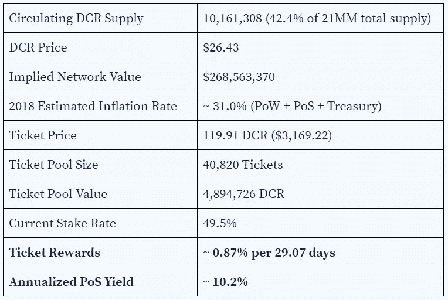
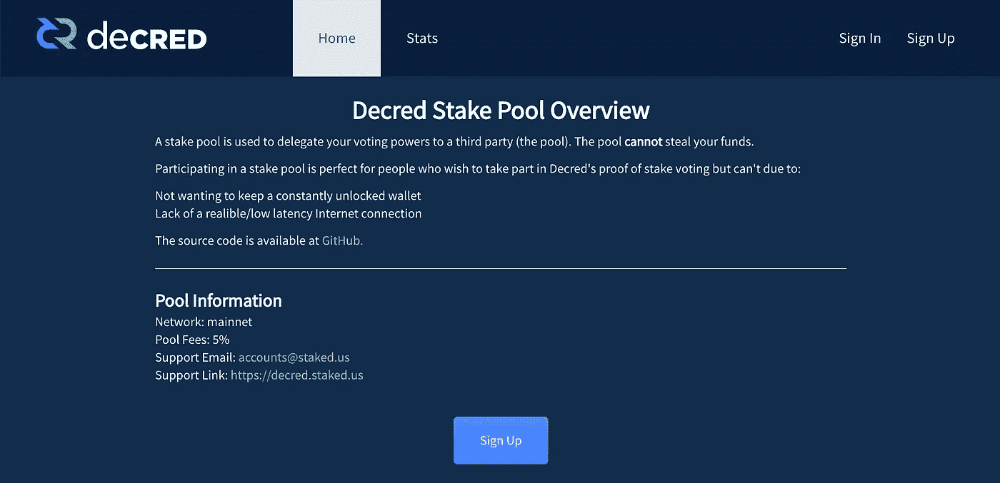
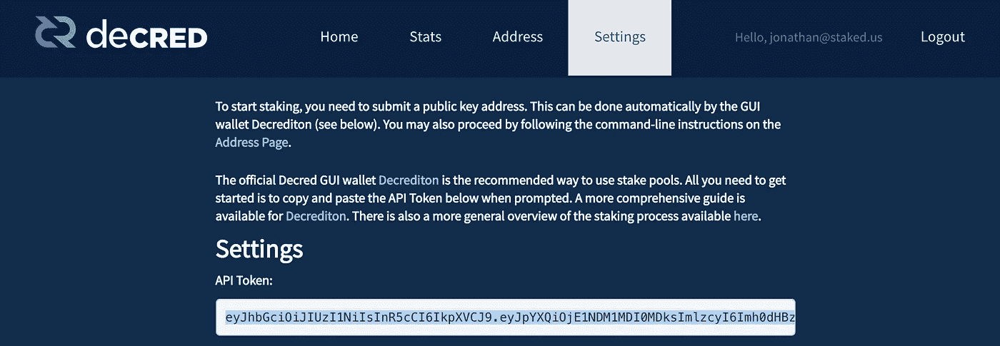
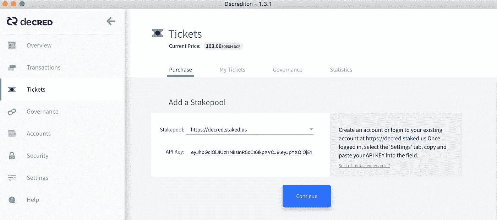
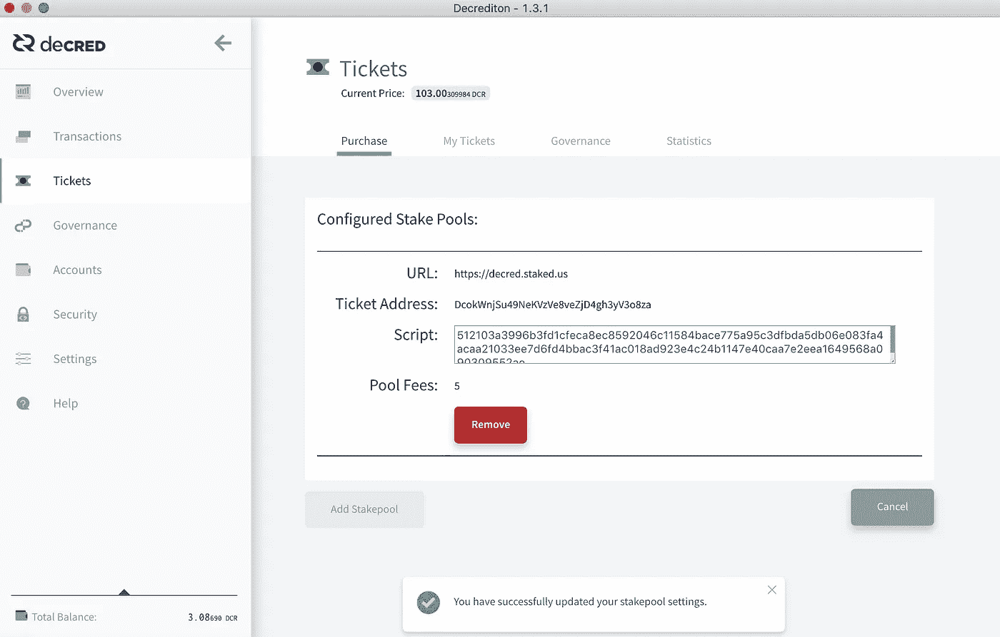
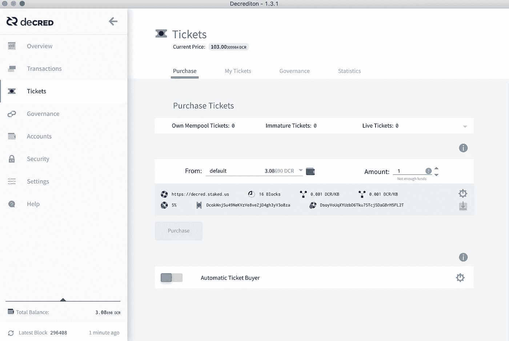
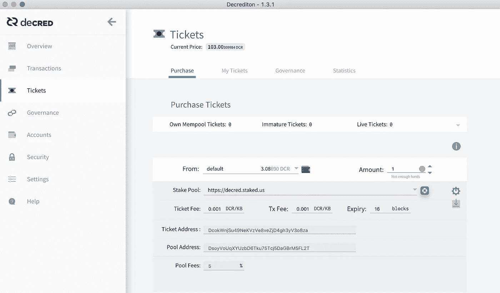
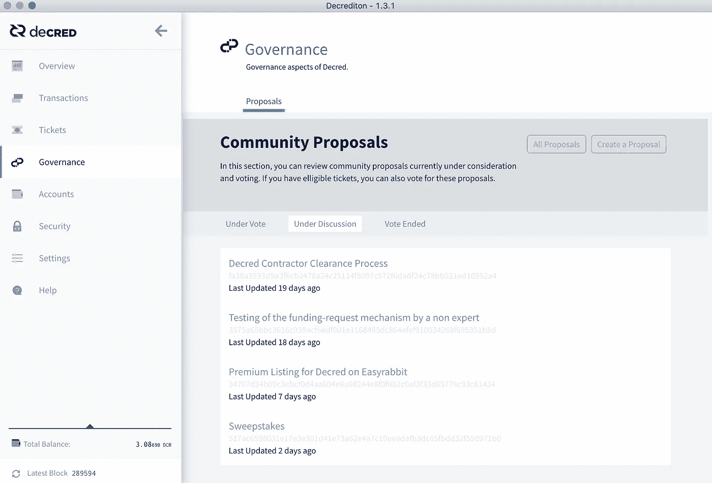

# 法令标桩指南

> 原文：<https://medium.com/coinmonks/decred-staking-guide-2e569d0390ff?source=collection_archive---------3----------------------->

## 押注 DCR 的当前年收益率约为 14.3%。

# **总结**

Decred (DCR)是一种加密货币，具有混合的工作证明(PoW) /利益证明(PoS)共识机制和链上治理系统。**目前押注 DCR 的收益率约为每 29.07 天 0.87%，或每年 10.2%。**

# 象征经济学(2019 年 7 月 31 日)

https://explorer.dcrdata.org/的[和 https://dcrstats.com/](https://explorer.dcrdata.org/)[的](https://dcrstats.com/)是实时 DCR 门票和网络指标的绝佳资源。

# 概观

Decred 于 2016 年 2 月由 0 公司推出，基于该团队之前开发 btcsuite 的工作，BTC suite 是用 Go 而不是 C++编写的比特币核心的替代实现。总供应量的 8%，即 1.68 毫米 DCR，由 0 公司在发行时预先开采，剩余的 92%随着时间的推移被开采，直到 2039 年[共发行 2100 万枚硬币。规定的块奖励每 21 天减少 1%(相比之下，比特币每 4 年减半)。pre-mine 的 50%分配给了约 3000 名早期采用者，剩余部分用于偿还公司 0 的 150 万美元开发成本。](https://dcrstats.com/subsidy)

DCR 区块奖励在战俘矿工(60%)、PoS 票持有者(30%) 和法令项目金库(10%)之间分配。目前的区块奖励是 19.35 DCR，或 11.61 为 PoW，5.80 为 PoS (1.16 每 PoS 选票)，1.93 为国库。大约每 5 分钟开采一个新区块。

Staked 为 Decred 提供了一个匿名、非托管和全自动的赌注池。利益相关者仅将其验证 PoW 工作的权利委托给利益相关者。赌注不能花费或窃取 DCR。下面是创建赌注池帐户、购买和委托入场券的详细说明。

# **PoS 投票票**

PoS 在 Decred 中用于验证 PoW 挖掘工作，并批准或拒绝对共识协议提出的规则更改。颁布持有人时间锁，或**DCR 股份**以获得投票权。目前，持票者每张票可获得 5.80 DCR(每张票 1.16 *每张票 5 张)，或者说是投票所得的 30%。

Decred 使用抽奖系统，根据块头中包含的伪随机性，从池中为一个块选择活动的投票单。**从当前 40，820 张票中随机选择每张票，使用泊松分布，平均选择时间约为 28 天，最长时间约为 142 天(4.7 个月)**。如果一张票没有被选中(0.5%的几率)，那么它就过期了，并退还原来的票价。一旦一张票已经投票、错过或过期，资金(票价加上区块奖励减去门票费)进入 256 区块(~ 20 小时)的等待期，然后被返还给所有者。考虑到不成熟期，Decred 的平均锁定期为 30.74 天(29.07 天+ 1.67 天不成熟期)，但也可能长达约 144 天。

每个新的 DCR 区块包括随机选择的 5 张票，用于对前一区块的有效性以及对共识协议的任何改变进行投票。所选的 5 张票中至少有 3 张必须确认之前为战俘矿工生成的区块，以获得区块奖励，这抑制了恶意行为，如开采空区块。持票人可以投票否决一个区块，即使它符合网络的共识规则。

购买门票的价格由难度算法确定，该算法使用已购买门票的加权平均数和先前区块中合格门票池的大小。每 144 个区块(约 12 小时)，赌注难度算法计算一个新的门票价格，旨在保持 40，960 张门票的目标池大小。

# **购票和代理购票**

Sign Up for a stakepool account at [https://decred.staked.us](https://decred.staked.us) to get an **API Token**

After logging into your account, copy the **API Token** on the **Settings** tab

Click on the **Tickets** tab in the [Decrediton](https://www.decred.org/downloads/) wallet. Select [https://decred.staked.us](https://decred.staked.us) from the Stakepool drop-down, enter your **API Token** in the **API Key** field and then click **Continue** to connect to the Staked pool.

You will receive a ‘successfully updated your stakepool settings message’.

Enter the number of tickets to buy with a default transaction fee of 0.001 (the minimum) and an Expiry of 16, and then click **Purchase**. Enter the passphrase for your wallet to complete the purchase. Click on the **Automatic Ticket Buyer** button to re-purchase tickets automatically once your active tickets have voted.

购买门票后，在**购买**部分将显示一条**成功**消息，交易将被放入内存池，直到被挖掘。一张票被开采出来后，在成为 **live** 并有资格被选中投票之前，有一个 256 block (~ 20 小时)的成熟期。在此期间，票证在“挖掘”选项卡中被标记为**未成熟**。平均而言，每 28 天就要选择投票，但可能需要 142 天，或 4.7 个月。

* If you are already staking and have connected to a different stakepool, click on the **gear** icon to display the settings menu, and then click on the blue **stakepool** icon next to the **Stake Pool** drop-down to add Staked as an additional stakepool option.

# **治理**

除了 PoW 验证，PoS 票持有者还负责使用 Decred**“polite ia”**系统投票批准或拒绝协议共识规则的变更。Politeia 允许利益相关者提议、讨论和资助新的项目、计划和共识变更。Politeia 系统于 2018 年 10 月 15 日发布到 production / mainnet，国库余额约为 57 万 DCR，当时价值约为 2300 万美元，截至 2019 年 7 月 31 日价值约为 1500 万美元。

当提案被提交投票时，所有的**现场**票都有资格投票赞成或反对，在 8，064 个区块(约 30 天)内计票，以允许整个票池参与。提议的改变必须得到 75%非弃权票的同意才能生效。选票已经统计完毕。如果利益相关者投票改变协议，链将自动硬分叉激活新规则。

Ticket holders vote on Politeia-based proposals using the Decrediton wallet in the **Governance** tab.

# **关于押后**

Staked 帮助机构投资者通过投资和借贷，每年以 5%-100%的速度安全可靠地复合他们的密码。Staked 运行验证节点，用于验证货币，并提供链上和链下贷款选项，这些选项提供实物货币的年化收益率。

如果你喜欢我们正在建设的东西，请在 [**Twitter**](https://twitter.com/staked_us) 、 [**LinkedIn**](https://www.linkedin.com/company/staked) 上给我们留言，或者告诉你的朋友和同事。 [**Staked blog**](/@staked) 和[**weekly newsletter**](https://staked.substack.com/)**也是跟上 Staked 的重要资源。**

## ****同样，请阅读****

*   **[最佳加密交易机器人](/coinmonks/whats-the-best-crypto-trading-bot-in-2020-top-8-bitcoin-trading-bot-c16adeb13317)**
*   **最好的比特币[硬件钱包](/coinmonks/the-best-cryptocurrency-hardware-wallets-of-2020-e28b1c124069?source=friends_link&sk=324dd9ff8556ab578d71e7ad7658ad7c)**
*   **最好的[加密税务软件](/coinmonks/best-crypto-tax-tool-for-my-money-72d4b430816b)**
*   **[最佳加密交易平台](/coinmonks/the-best-crypto-trading-platforms-in-2020-the-definitive-guide-updated-c72f8b874555)**
*   **最佳[加密贷款平台](/coinmonks/top-5-crypto-lending-platforms-in-2020-that-you-need-to-know-a1b675cec3fa)**
*   **Bitmex 上的[保证金交易的白痴指南](/coinmonks/the-idiots-guide-to-margin-trading-on-bitmex-dbbd7742c6fc?source=friends_link&sk=7bfa99d2a181142510c8442c8ddb0786)**
*   **[加密摇摆交易的权威指南](/coinmonks/the-definitive-guide-to-crypto-swing-trading-7e4af6496d4d?source=friends_link&sk=70448050bd9323b42f63bfc0bb1e60d1)**
*   **[Bitmex 高级保证金交易指南](/coinmonks/bitmex-advanced-margin-trading-guide-2270c195ce25?source=friends_link&sk=1d986cca731f5084b9a2db4a4bc4a7ad)**
*   **面向开发者的最佳加密 API**
*   **[加密套利](/coinmonks/crypto-arbitrage-guide-how-to-make-money-as-a-beginner-62bfe5c868f6)指南:新手如何赚钱**
*   **顶级[比特币节点](https://blog.coincodecap.com/bitcoin-node-solutions)提供商**
*   **最佳[加密制图工具](/coinmonks/what-are-the-best-charting-platforms-for-cryptocurrency-trading-85aade584d80)**

> **[直接在您的收件箱中获得最佳软件交易](https://coincodecap.com?utm_source=coinmonks)**

****