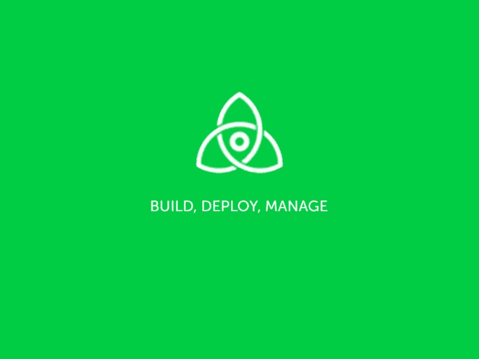
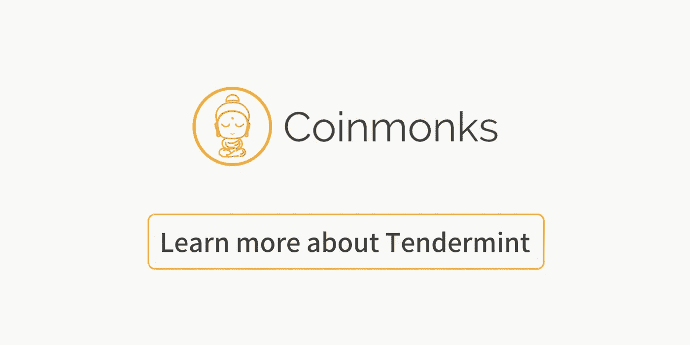

# 尽情享用嫩薄荷吧

> 原文：<https://medium.com/coinmonks/deep-dive-into-cosmos-tendermint-cf5bff5cb0c?source=collection_archive---------2----------------------->

[source](https://cryptocurrencyhub.io/technology-fridays-tendermint-wants-to-be-the-zookeeper-of-the-blockchain-world-90bbe3c3f5aa)

区块链技术正在成为我们这个时代的技术。社区正以惊人的速度发展，优秀的开发者发誓要改变世界。

作为一名区块链工程师，我认为 Tendermint 协议是创造更光明未来的技术。在我的文章中，我想分享我对 Tendermint 的想法，希望你会觉得有用。

# 概述

*   为什么研究者致力于共识？
*   一致性算法的里程碑
*   为什么比特币和以太坊不够用？
*   Tendermint:协议和项目

# **我们为什么需要共识？**

共识是我们如何从不可靠的基础上得到可靠的东西。当共识引导宇宙脱离混沌时，宇宙的熵就会减少。生命的进化是动物体内所有细胞对 DNA 排列达成共识的一种方式；社会对国家的下一步行动达成了共识。

对共识的需求可以追溯到飞机上的微处理器。在一架飞机内，可能有数百个芯片，它们发送信号并与其他芯片通信。这些芯片会受到外界干扰的影响，如辐射和低温等。控制系统必须就飞机的状况达成共识，即使传感器芯片发出了错误的信号。

随着计算机网络在 20 世纪 70 年代开始形成，计算机工程师开始面临容错计算的问题，他们采用控制飞机的技术来解决协调问题。在早期的研究中，越来越多的专业人员开始形式化算法和共识协议。

一个一致性协议可以提供两个特征，即安全性和活性。

*   安全意味着坏事不会发生。所以，每个人都会同意相同的历史日志，没有分歧。
*   活泼意味着最终会有好事发生，系统可以继续运行。

# 一致性算法发展的里程碑

*   **分布式系统共识的开始**

在 1978 年出版的开创性著作中， [Leslie Lamport](https://en.wikipedia.org/wiki/Leslie_Lamport) 提出了分布式计算中的许多关键概念，这些概念捕捉了分布式系统中的时序和因果关系。在计算机历史上，我们第一次开始研究如何让计算机网络协同工作。接着，1982 年，兰波特等人发表了《拜占庭将军问题》的论文。在这篇论文中，他描述了一种情况，几个拜占庭将军希望制定一个攻击罗马城市的计划。当只有信使可以交流时，他们必须决定是“进攻”还是“撤退”。如果忠诚的(无过失的)将军们对他们的策略有多数同意，拜占庭式的容错是可以实现的。当将军们不能协调一致时，就会出现“拜占庭式的失败”。在对等网络中，当一个或多个节点发生故障或无法正常工作时，整个系统都会发生故障，从而导致“拜占庭故障”。

*   **FLP 不可能**

后来，越来越多的工程师和研究人员试图找到解决“拜占庭将军问题”的方法。1985 年 4 月，Fischer、Lynch 和 Patterson 发表了一篇短文[‘一个错误的过程不可能达成分布式共识’](http://cs-www.cs.yale.edu/homes/arvind/cs425/doc/fischer.pdf)。该论文表明，在一个异步系统中，即使只有一个处理器崩溃，系统也不可能达成一致。这篇论文最终获得了授予分布式计算领域最有影响力论文的 Dijkstra 奖，为分布式进程在异步环境中可能实现的目标确定了一个上限。

*   **DLS 的部分同步**

FLP 不可能使研究者的工作更加困难。幸运的是，分布式系统中的部分同步的概念是在一篇论文“[Consensus in presence of partial synchronous](https://www.google.com/url?sa=t&rct=j&q=&esrc=s&source=web&cd=1&ved=2ahUKEwjzrNer183aAhUD72MKHW5dBx0QFjAAegQIABAu&url=https%3A%2F%2Fgroups.csail.mit.edu%2Ftds%2Fpapers%2FLynch%2Fjacm88.pdf&usg=AOvVaw1byQ82jwG43uTAqzl_JbxH)”中介绍的。这个结果也被称为 DLS 共识结果，以作者德沃克，林奇和斯托克梅耶斯命名。因此，在同步系统和异步系统之间，我们可以定义一个星期或部分系统。部分同步系统被设置为具有超时上限。这样，我们就能设计出一个可行的 BFT 协议。

*   **Paxos &筏**

1990 年，Leslie Lamport 介绍了一种实用的解决方案，用于在异步网络中实现**崩溃容错**一致性。Paxos 以难以理解著称。Paxos 是第一个在面对异步网络时被证明是可靠的正确协议。当消息不可用时，Paxos 牺牲活跃度，它等待直到良好行为被报告。Paxos 非常受欢迎，已经在 Zookeeper 和 Unix systemm 中实现。

2001 年，Leslie lamport 发表了另一篇论文“ [Paxos 制造了简单的](http://Paxos Made Simple - Leslie Lamport)”。在这篇论文中，他用一些基本的方式解释了算法，你找不到任何公式，而且非常简短。

2013 年，Diego Ongaro 发表了他关于让 Paxos 变得可以理解的作品。在他的 [Raft 论文](https://raft.github.io/raft.pdf)中，他证明了 Raft 在容错和性能上是等价的。不同之处在于 Raft 更容易实现。它被分解成相对独立的子问题，并且干净利落地解决了实际系统所需的所有主要部分。Raft 已经在各种系统中实现，今天仍然流行。您可以在不同的语言中找到它的实现。

*   **PBFT**

另一方面，在拜占庭容错案例中，Miguel Castro 和 [Barbara Liskov](https://en.wikipedia.org/wiki/Barbara_Liskov) 在 1999 年引入了“实用拜占庭容错”(PBFT)算法，该算法提供了高性能的拜占庭状态机复制，每秒处理数千个请求，延迟增加了亚毫秒级。他们的解决方案实际上解决了异步环境中的复杂问题，并成为行业标准。

# 比特币和以太坊如何处理共识？

*   **中本聪共识**

2008 年，一个叫中本聪的人发表了著名的论文:比特币一个点对点的电子现金系统。本文提出了一种解决方案来帮助解决交易订单问题。后来，人们意识到这实际上是 BFT 在真正的无许可经济制度下的一个解决方案。Nakamoto consensus 假设网络通道是完全同步的(即消息被即时传递而没有延迟)。系统中的所有参与者同意一起构建公共分类账，其中包含所有已验证的交易。该协议说，第一个宣布的包含计算难题的解决方案的正确块被认为是有效的；所有其他矿工将开始寻找下一个区块。由于计算下一个块总是需要一定的时间，所以网络总是可以使用最长的链来帮助监控进程。那么只要诚实的节点占多数，我们总能信任最长的链条，达成共识。

Nakamoto Consensus 的天才之处在于，我们引入了工作证明来寻找解决方案，并跳过了异步或确定性协议的约束。因为找到解决方案是相当概率性的，我们只要等待足够长的时间，最终，总会有一个解决方案。

*   **幽魂**

现在我们可以理解，长的阻断时间是中本聪安全的关键。平均阻塞时间为 10 分钟，这在许多情况下是不可接受的。如果我们减少阻塞时间，就会损害系统的安全性。

以太坊共识协议是“贪婪最重观测子树”(GHOST)协议，由 Yonatan Sompolinsky 和 Aviv Zohar 于 2013 年 12 月首次提出。GHOST 背后的动机是，具有快速确认时间的区块链目前由于高陈旧率而遭受安全性降低，因为数据块需要一定的时间在网络中传播。在 GHOST 中，不仅最长的链，而且相关的祖先也被包括在计算中。这样，我们解决了集中化偏差的问题，同时保持了较低的块延迟。

# 为什么如此需要嫩薄荷？

*   **PoW 的弊端**

电力不是一个节能选择，我们每年都浪费了大量的能源。此外，51%攻击对于基于 PoW 的共识是一个潜在的安全问题。随着矿池越来越集中，集中的风险也很明显。

*   **股权证明预招标的历史**

[股权证明](https://cointelegraph.com/tags/proof-of-stake) (PoS)最早由 Sunny King 和 Scott Nadal 在 2012 年的一篇论文中提出，旨在解决比特币挖矿的高能耗问题。Peercoin 等第一代 PoS 协议实现得很幼稚，但却是朝着正确方向迈出的一步。

当时，PoS research 做了一个很大的假设，即系统中对等体的数量是固定的，并且在很长一段时间内是稳定的。这在区块链的环境中是完全不现实的。PoS 还有一个可能出现的问题是“**无利害关系**”问题，其中区块生成器通过投票支持多个区块链历史不会有任何损失，从而阻止达成共识。这使得 PoS 不是分布式共识协议的理想选择。

**远程攻击**源自这样一个场景:攻击者提取存款后，可以在任意长的距离内建造一个叉子，而不用担心被砍。通过这种方式，拥有 2/3 权力的攻击者可以创建第二个链，并可以双倍消费，甚至包括一些任意的交易。

*   **什么是 Tendermint 协议？**

Tendermint 就是将传统的 PBFT 解决方案与现代的区块链技术结合在一起。Tendermint 属于在部分同步系统模型中解决一致性的一组协议。这是一个确定性协议，这意味着它不使用随机性，只依赖同步来终止。更准确地说，在异步的情况下，它从不分叉。除非超过 1/3 的投票权掌握在有缺陷甚至错综复杂的程序中。或者，如果系统没有足够长的同步周期，它可能永远不会终止。为同步系统模型设计的其他共识算法使用进程速度的界限。

Jae Kwon 的主要创新是，他和 Ethan Buchman 一起继承了 BFT 的研究，并用区块链的技术对它们进行了优化，如:Merkel 证明，hash link 等。它还支持动态验证器集和旋转领导者选举。最后，他们解决了在公共区块链背景下应用 BFT 研究的问题，并从 2014 年开始推广 geneius 理念。关于 Tendermint 协议证明的更多细节可以在 Ethan Buchman 的[论文](https://t.co/WNFm8PCYZE)中找到。他和 Jae 还开发了 Tendermint 软件的 alpha 版本。

*   **Tendermint 如何解决无利害关系的问题**

“无利害关系”问题提出了下面的场景:验证者可以通过在给定的块高度投票给多个冲突的块来破坏安全性，而不会为此产生成本。在 PoW 中，验证者被阻止在不同的链上投票，因为挖掘者会因为分裂 scare hash 能力而遭受损失。天真的 PoS 没有动力去聚合在一个独特的链上。经济上最优的策略是在尽可能多的岔道上投票，以获得最多的街区奖励。

Jae Kwon 引入了“砍”的概念来解决这个问题。他在最初的[白皮书](https://tendermint.com/static/docs/tendermint.pdf)中阐述了苛刻的条件和想法。通过这种方式，验证器被鼓励遵循一个独特的链，因此安全性得到了很好的保护。

*   **嫩薄荷如何解决远程攻击问题**

远程攻击来自右侧，一旦保证金未绑定，不在某个街区高度之前对远程分叉进行投票的激励就被消除了。这样，当超过⅔的验证者没有被绑定时，他们可能会恶意地创建第二个链。这可能会导致任意的替代事务。PoS 中的远程攻击在[弱主观性](https://blog.ethereum.org/2014/11/25/proof-stake-learned-love-weak-subjectivity/)模型下得到纠正。Tendermint 采用一种简单的锁定机制(在 Tendermint 中通俗地称为“冻结”),它将股份“锁定”一段时间(3 周),以防止任何恶意的验证者联盟违反安全性。

# **后造币时代**

在后 Tendermint 时代，大量的共识算法(Honeybadger、Ouroboros、Tezos、Casper)涌现出来，它们都结合了以前 BFT 研究的元素以及区块链的其他优化策略。

*   **ABCI:开发者友好的设计**

Tendermint 已经实施。它是开源的，你可以在 github.com/tendermint/tendermint.上找到知识库。第一个实现是用 Go 写的，它以处理巨大的吞吐量而闻名。该团队正在努力使 Tendermint 成为一个通用的拜占庭容错状态机复制引擎。在 Tendermint 社区的帮助下，我们现在有了在 Java、C、Haskell、Erlang、Python 等上的实现。您可以期待看到越来越多的实现。

为了帮助开发者用他们喜欢的任何语言编写应用程序，Tendermint 引入了 ABCI 的概念，即应用程序区块链接口。与以太坊和比特币不同，ABCI 使应用逻辑脱离共识。比特币的堆栈是单片的，所以我们对它的脚本语言没什么可做的。虽然以太坊虚拟机似乎是一个更好的选择，但你必须学习可靠性，这可能会导致一些安全灾难。我们不想重复奇偶校验中发生的事情。

因此，Tendermint 所做的只是暴露应用程序接口，它处理状态机逻辑。现在开发人员可以构建他们自己的有限状态机，然后让它在 Tendermint 上运行。我们可以用 ABCI 做更好的测试和调试工作。

*   **以太薄荷**

我们都同意 EVM 是一个了不起的发明，对于那些想要将他们的以太坊 DApp 迁移到 Tendermint 之上的开发人员来说，有一个名为 Ethermint 的解决方案。Ethermint 完全兼容以太坊的 web3 接口，以及通过 RPC 端点围绕以太坊客户端的现有工具。你可以在这个官方的[博客](https://blog.cosmos.network/a-beginners-guide-to-ethermint-38ee15f8a6f4)中找到更多信息。目前，代码回购不在维护中，因为团队专注于 Cosmos Hub。

# **参考:**

1.  宇宙网
2.  Tendermint&Cosmos 白皮书
3.  cosmos consensus prodcast: [具有 Ethan Buchman 的共识系统 http://traffic . lib syn . com/sedaily/2018 _ 03 _ 26 _ tender mint . MP 3 podcast:在新窗口中播放|下载共识协议用于允许计算机协同工作。一个共识协议让 dif…softwareengineeringdaily.com](https://t.co/04NsT8MFIi)
4.  [https://www . technology review . com/s/529631/les lie-lamport-60/](https://www.technologyreview.com/s/529631/leslie-lamport-60/)
5.  [https://raft.github.io](https://raft.github.io)
6.  比特币协议分析，[https://eprint.iacr.org/2016/454.pdf](https://eprint.iacr.org/2016/454.pdf)
7.  以太坊白皮书，[https://github . com/ether eum/wiki/wiki/White-Paper # bit coin-as-a-state-transition-system](https://github.com/ethereum/wiki/wiki/White-Paper#bitcoin-as-a-state-transition-system)
8.  股权证明的历史，[https://coin telegraph . com/news/the-history-and-evolution of-proof-of-stage](https://cointelegraph.com/news/the-history-and-evolution-of-proof-of-stake)

**Click to read more about Tendermint**