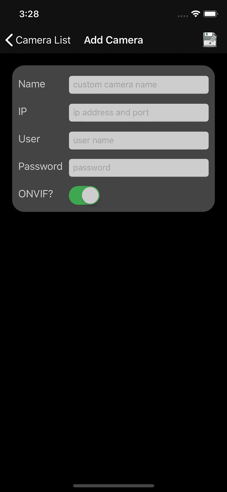
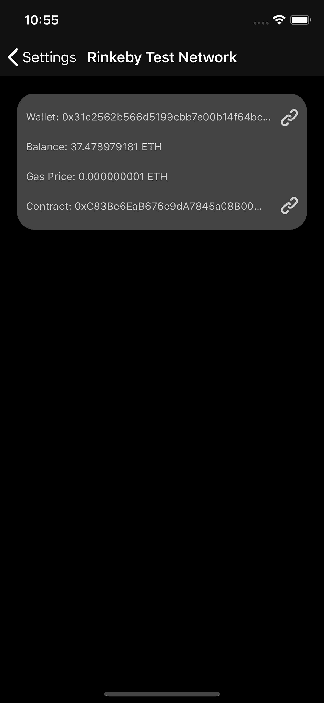

# 实践中的深度学习+ IPFS +以太坊区块链

> 原文：<https://medium.com/coinmonks/deep-learning-ipfs-ethereum-blockchain-in-practice-7ef6665330dd?source=collection_archive---------5----------------------->

最近， [ONVIF](https://www.onvif.org/) 举办了 [ONVIF 开源聚焦挑战赛](https://onvif-challenge.bemyapp.com/)，这是一项为创新的 IP 视频流应用开发开源应用的技术竞赛，旨在帮助解决全球安全问题。我报名参加了比赛，并建立了“ [cam X](https://onvif-spotlight.bemyapp.com/#/projects/5b059d5d1b428b000497e09d) ”一个用 Swift 编写的概念验证 iOS 项目，以演示深度学习、ipFS 和以太坊技术如何在实践中一起应用，为普通的 IP 摄像机配备超能力。可以从 [GitHub](https://github.com/yingliqiao/camX) 获得项目。

**当前证券市场面临哪些问题**

*   视频分析通常配置复杂、耗费资源且任务单一。
*   传统的视频管理解决方案数据存储空间有限且昂贵，备份和维护极其困难，并且存在单点故障风险。
*   有价值的数据大多集中存储，没有加密，有被篡改的风险，并有隐私问题。

**cam X 的魔解是什么**

你只需要一部手机！cam X 提供了一个无服务器解决方案，配备了两个通用对象检测引擎 Tiny Yolo，可实时检测 20 种对象类型，Yolo 2 是一个稍慢的版本，可检测 80 种对象类型，精确度更高。cam X 可以在弹指之间将任何 IP 摄像头变成人工智能野兽。IPFS 以太坊是一个无缝的解决方案，保持数据加密，并将不可改变的指纹放入区块链交易中。

**凸轮 X 如何工作**

*第一步:摄像机管理*

App 初始视图是一个摄像头列表。有三个部分:ONVIF，IP 和移动。ONVIF 包含一些竞赛赞助商提供的演示摄像机，使用最新的 Profile T 协议。IP 摄像机是使用 http 或 rtsp 协议的网络摄像机。移动是 iOS 设备内置摄像头。我为每个部分预装了一些默认摄像头。

*   单击左上角导航栏上的“+”图标，显示“添加摄像机”对话框
*   单击右上角导航栏上的“-”图标，在每个摄像机行前面显示删除图标
*   单击每个摄像机行末端的“I”图标，显示摄像机编辑对话框
*   单击摄像机名称开始播放实时流

*步骤 2:对象检测视频分析配置*

进入设置->对象检测->模型选择视频分析引擎或关闭视频分析。cam X 装备了两个深度学习预训练的物体检测模型:Yolo 2 和 Tiny Yolo。Yolo 2 可以探测和定位 80 种物体类型。它在 iPhone 8 或 iPad Pro 上以 2–3 FPS 的速度运行。版本 2 具有更好的准确性。Tiny Yolo 可以探测和定位 20 种物体类型。它在 iPhone 8 或 iPad Pro 上几乎实时运行(20-30 FPS)。微型版本准确性较差，但检测速度更快。两个神经网络都运行在 CoreML 上。Yolo 2 是默认引擎。

[**【YOLO】:实时物体检测**](https://pjreddie.com/darknet/yolo/)

你只看一次(YOLO)是一个最先进的，实时对象检测系统。与 R-CNN 等其他基于分类器的检测系统在多个位置和尺度上将模型应用于图像不同，YOLO 将单个神经网络应用于图像。它将图像分成多个区域，并预测每个区域的边界框和概率。边界框由预测概率加权。它还通过单个网络评估进行预测，速度非常快。

Comparison to Other Detectors

Performance on the COCO Dataset

Yolo 2 Demo Video

导航到对象过滤器选项卡，对象类型列表取决于在显示的设置中选择的引擎。您可以为每个单独对象打开或关闭检测或警报，或者进行批量更改。检测是指在被检测的对象周围绘制边界框和名称。警报指的是红色边界框，警报标签显示在对象名称旁边。发出警报时，还会捕获快照并临时保存在内存中。关闭检测也会自动关闭警报，因为如果检测不到物体，就不会发出警报。默认情况下，所有对象的检测打开，警报关闭。警报阈值设置用于避免拍摄过多的警报快照。多个对象可以在一帧中发出警报，静止对象的警报可以持续每一帧。

*第三步:通过对象检测视频分析进行直播*

激动人心的部分终于来了。我实现了一个 FFmpeg 视频播放器来解码来自网络摄像机的视频流。你可以使用 [FFmpeg-iOS-build-script](https://github.com/kewlbear/FFmpeg-iOS-build-script) 为 iOS 构建 FFmpeg。覆盖包括徽标、摄像机名称、检测到的对象类型和边界框、引擎名称和当前检测 FPS。引发的警报显示在红色框中，对象名称旁边有警报标签。

*第四步:报警查看器*

警报快照显示在网格视图中。用户可以手动选择报警存储在 IPFS 和以太坊。当用户第一次加载视图时，所有保存的警报将从 IPFS 和以太坊恢复。保存的警报有绿色边框。未保存的报警有灰色边框。选定的报警有灰色背景。双击单元格以全屏显示警报。每个单元格显示警报时间戳、摄像机名称、引擎名称、对象名称触发的警报和快照。点击顶部导航栏的保存图标，保存或删除警报，并查看警报详细信息。

*步骤 5:离线和在线报警存储*

我提到了 IPFS 和以太坊的存储。它们是什么？我们使用它们有什么好处？我不打算谈论技术细节。这篇文章并不打算成为“cam X”背后的这些技术的教程。

# [IPFS](https://ipfs.io/)

# [**以太坊**](https://www.ethereum.org/)

[**in fura**](https://infura.io/)**提供对以太坊 API 和 IPFS 网关的安全、可靠和可伸缩的访问。“cam X”使用 [swift-ipfs-api](https://github.com/ipfs/swift-ipfs-api) 库通过 Infura 远程节点访问 ipfs，使用 [web3swift](https://github.com/BANKEX/web3swift) 库通过 Infura 远程节点访问以太坊。我在项目中使用了以太坊 Rinkeby 测试网络。**

************

**Wallet Address**

****

**Smart Contract Address**

****区块链救人报警****

****

1.  **单击保存警报按钮。**
2.  **警报快照被保存到 IPFS 并返回一个散列值。**
3.  **警报元数据和警报快照哈希一起保存到 IPFS，并返回另一个哈希。**
4.  **报警元数据散列被添加到以 json 格式保存的报警列表文件中，该文件是报警根文件并返回根散列。每当文件内容更新时，根哈希都会发生变化。**
5.  **返回的告警根哈希通过智能合约 AddHash 方法保存到以太坊，并返回一个回执。**
6.  **Tx Hash 是以太坊返回的交易回执。**
7.  **当应用程序下次启动时，通过智能合约 GetHash 方法从以太坊恢复保存的警报 Hash。**

****区块链删除报警****

****

1.  **单击删除警报按钮。**
2.  **警报元数据从保存的警报列表中删除，并返回更新的散列。IPFS 文件是永久性的，因此报警快照文件和报警元数据文件不会从 IPFS 中删除。**
3.  **返回的告警根哈希通过智能合约 AddHash 方法保存到以太坊，并返回一个回执。**

*****这是一个简单明了的查找表智能契约，用于存储报警根哈希。iOS 设备 UUID 被用作密钥。*****

****

***This is a straightforward lookup table Smart Contract used to store alarm root hash. iOS device UUID is used as the key.***

**让我们看一个警报[元数据文件](https://ipfs.infura.io/ipfs/QmYSP1FVEkSfA5oVLTdNaWZ3HebKMoRV8TNt56ZBXcdwHX)的例子。页面上的散列链接是上面提到的全尺寸报警[快照文件](https://ipfs.infura.io/ipfs/QmfYwexLfgLxfBNw2up83c2tp7CHMZmJhT3rpocYESzcFQ)。**

****

**[报警根文件](https://ipfs.infura.io/ipfs/QmNxLUgXXs7KifBtADJa1LcvL411fiHkqKKrwgU5z4qXDw)。**

****

**以太坊智能合约交易[回执](https://rinkeby.etherscan.io/tx/0xebe718e7a6554639a451a488ff42a96ae60acc5faa0ec43929158987e6da7aaf)。**

****

****如何使用“cam X”的快速演示视频****

**就是这样。希望我的项目能启发你结合这些革命性的技术创造出令人敬畏的应用程序。请随时给我打电话或发表评论。**

**如果你喜欢我的工作，你可以给我小费:**

**ETH:0x 330533 c 313 DC 617 BCF cc 716 a 66642 C3 E6 e 57973**

**比特币:3bwebigbzkqvw 1 mvn 4g brh 3 kwyu 19 exl ny**

****************