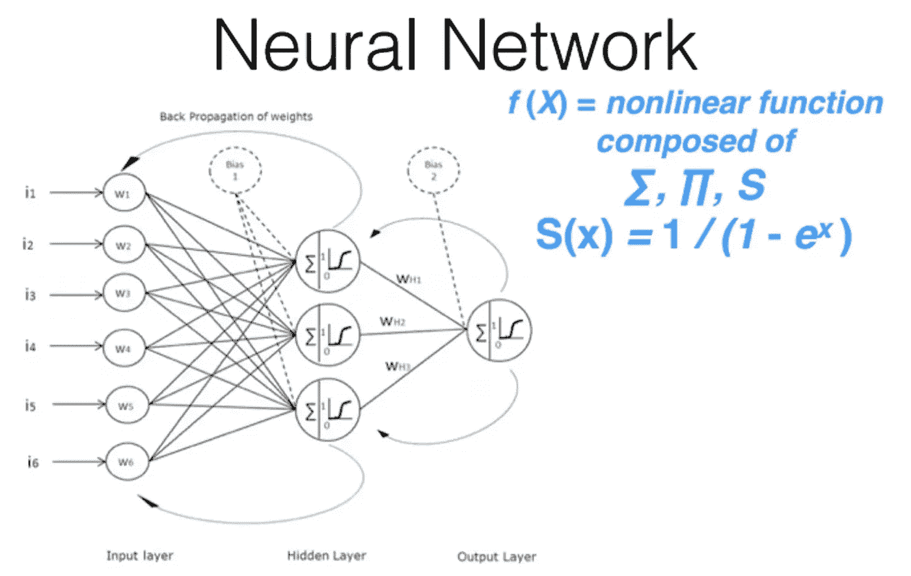

# 深度学习；个人笔记第 1 部分第 1 课，图像分类

> 原文：<https://medium.com/coinmonks/deep-learning-personal-notes-part-1-lesson-1-f134cc8a7f2e?source=collection_archive---------3----------------------->

这个博客系列将会更新，因为我已经第二次学习了快速人工智能[的课程。](http://www.fast.ai/)这些是我个人的笔记，力求把事情理解清楚，解释好。没什么新意，只有对得起这个 [*博客*](/@itsmuriuki/why-i-will-be-writing-about-machine-learning-and-deep-learning-57c68090f201) *。*

我将租用 Paperspace GPUs(图形处理单元)来训练神经网络，因为成本似乎相当实惠。具体来说，我们将使用 Nvidia GPU，因为它们支持 CUDA。

fast.ai 需要 python 3

**快速人工智能的简要回顾**

快速人工智能建立在 pytorch 的基础上，py torch 是脸书建立的深度学习库。该图书馆采用了行业和研究领域的最佳实践和方法。每当发表一篇有趣的论文，他们就在各种数据集上测试它，调整它，并在图书馆上实现它。

快速的人工智能灵活性允许你尽可能多地或尽可能少地使用这种策划好的最佳实践。它可以很容易地编写自己的数据增强，损失函数和网络架构。快速人工智能的理念是按需学习。

《快速人工智能》是代码驱动的，使用自上而下的方法或者大卫·佩尔金斯的[整体游戏方法](https://www.thepositiveencourager.global/david-perkins-making-learning-whole/)。它让学生马上使用神经网络并尽快得到结果。

然后，它会逐渐剥离这些层，以查看引擎罩下是什么，而不是自下而上的方法，在这种方法中，您会了解您需要的构建块，并最终将所有东西放在一起。

让我们接受猫和狗的挑战。

在这个[竞赛](https://www.kaggle.com/c/dogs-vs-cats)中，你将编写一个算法来分类图像是包含一只狗还是一只猫。对人类来说，识别狗和猫很容易，但你的电脑会觉得这有点挑战性。

我们将使用卷积神经网络对图像进行分类

进口货


数据路径


这种文件夹结构是共享图像分类文件的标准方式。每个文件夹告诉你的标签，如猫和狗。


看着一只猫的图像


`f’{PATH}valid/cats/{files[4]}’` —这是一个 Python 3.6。格式化字符串，这是一个方便的格式化字符串。

绘制图像


How the raw data looks like

让我们看看数据是什么样子的…


该图像是 3 阶张量或 3 维阵列。`*(374, 500, 3)*`

`*(66,38,24)*`是在`0`和`255`之间的红色、蓝色和绿色像素值。这些数字代表了计算机内部图像的一个子集。我们将利用这些数字，通过查看大量图片来预测图像是猫还是狗。

**让我们跳到训练一个模型。**

我们将使用一个预先训练好的模型，这个模型是由其他人创建的，用来解决一个不同的问题。

而不是从零开始建立一个模型来解决一个类似的问题。我们将使用一个在 ImageNet(120 万张图片和 1000 个类)上训练过的模型。该模型是一个卷积神经网络(CNN)。

## 什么是预训练模型？

预训练模型是之前已经在数据集上训练过的模型，并且包含表示它在其上训练的任何数据集的特征的权重和偏差。

学习到的特征通常可以转移到不同的数据中。例如，在大型鸟类图像数据集上训练的模型将包含可转移到数据集的学习特征，如边缘或水平线。

## 为什么要使用预先训练好的模型？

预先训练好的模型对我们有很多好处。通过使用预先训练的模型，您可以节省时间。其他人已经花费了时间和计算资源来学习许多特性，您的模型可能会从中受益。

我们将使用 [**resnet34**](https://arxiv.org/pdf/1512.03385.pdf) 模型。

Resnet34 是赢得 2015 年 ImageNet 竞赛的模型版本。计算机视觉中的其他架构包括:AlexNet、VGG 网、谷歌网、ResNeXt 等


`arch`定义我们将使用的架构(resnet34)

`data`对象包含训练和验证数据。

`ImageClassifierData.from_paths`读入图像及其标签作为子文件夹名称:

*   `path`:数据的根路径(用于存储训练模型、预计算值等)
*   `bs`:批量大小。默认 64。
*   `tfms`:转换(用于数据扩充)。例如`tfms_from_model`的输出。默认“无”
*   `trn_name`:包含训练图像的文件夹的名称。默认“列车”
*   `val_name`:包含验证图像的文件夹的名称。默认“有效”
*   `test_name`:包含测试图像的文件夹的名称。默认“无”
*   `num_workers`:工人数量。默认“8”

转换——这使数据准备好传递给我们的模型。例如标准化和调整大小。

`learn`包含模型

`ConvLearner.pretrained`:

*   `f`:拱形。例如 resnet34
*   `data`:之前定义的数据对象
*   `precompute`:包含/排除预计算激活。默认为“假”(预计算-使用预先训练的权重)

`learn.fit`通过给定的学习率和时期训练/拟合模型。在这种情况下，它将使用 `0.01 learning rate`执行`3 epochs`，这意味着它将总共查看每张图像三次。

`trn_loss`和`val_loss`是[交叉熵](http://ml-cheatsheet.readthedocs.io/en/latest/loss_functions.html)损失函数的值。

这种模式有多好？我们的模型得到了`99%`的精度。最先进的是 80%,但竞争导致了 98.9%准确性的巨大飞跃。不到 4 年后，这个结果可以在几秒钟内被打破。

所以在 2013 年，你可以在 17 秒和 3 行代码内得到一个 [Kaggle](https://www.kaggle.com/c/dogs-vs-cats/leaderboard) 获奖图像分类器。但是，首先它从网上下载一个预先训练好的模型；这需要 2 分钟。然后，它预计算一些缓存；第一次运行模型时，这需要 1 分半钟。后续训练需要 20 秒。

因此，说深度学习需要大量时间、资源和数据是不符合事实的。

**分析结果**

看验证集，是一堆`0's`和`1’s`，其中 `0’s`代表猫，`1’s`代表狗。


让我们看看前十个预测


第一栏是猫，第二栏是狗。该模型返回预测的对数，而不是概率。为了得到概率，得到`log`的`exp`。


打印一些随机的正确图像


狗是 1，所以任何大于 0.5 的都是狗，小于 0.5 的都是猫。

打印不正确的图像


最正确的猫


最正确的狗


最不正确的猫(归类为狗，但他们是猫)


最不正确的狗(机器实际上认为是猫的狗)


最不确定的预测接近 0.5。分类器并不真正知道如何处理这些图像。


查看您的数据的原因是尝试并可视化模型构建的内容，以便您可以利用它做得好的地方，并修复它做得不好的地方。在这种情况下，我们看到了一些不应该出现在这里的图像。我们也可以使用数据论证来改进模型。

*任务:抓取两个或更多不同事物的一些数据，将它们放在不同的文件夹中，并通过代码(模型)的树行传递。最好的照片应该是人们拍摄的日常照片。注:*卫星图像*，CT 扫描，显微镜和病理图片对该代码不起作用。(10 个例子应该能行)*

**图像分类示例**

查看[这个](https://www.splunk.com/blog/2017/04/18/deep-learning-with-splunk-and-tensorflow-for-security-catching-the-fraudster-in-neural-networks-with-behavioral-biometrics.html)图像分类器使用鼠标移动图像来检测欺诈交易。

让我们回溯一点，什么是深度学习？

深度学习是机器学习的一种。然而，它不等于机器学习。在机器学习中，我们必须自己完成大多数特征工程，在深度学习中，我们将这些留给神经网络。

C-Path(计算病理学家)是传统机器学习方法的一个例子。本研究采用了乳腺癌活检的病理切片。然后，许多病理学家就什么样的模式或特征可能与长期存活相关的想法进行了咨询。然后，他们编写专业算法来计算这些特征，通过逻辑回归运行并预测存活率。算法胜过病理学家。然而，领域专家和计算机专家花了许多年的工作来构建。

以下是使深度学习类算法更好的属性:


如果您正确地设置了函数的参数，您可以构建一个无限灵活的函数来解决任何问题，而不是用大量的特性工程来构建特定领域的函数。然后建立一个快速和可扩展的通用方法来设置该函数的参数。

深度学习使用的底层功能称为神经网络



A neural net with one hidden layer

神经网络包含多个线性层，其间间隔有多个非线性层。这样就给了我们通用的逼近定理，即这类函数可以以任意接近的精度解决任何给定的问题——只要你加入足够的参数。这证明了它是一个无限灵活的函数。

为了进行通用的参数拟合，我们使用梯度下降法。对于我们拥有的不同参数，我们需要问自己它们在解决手头问题方面有多好。

让我们找出一组更好的参数，这些参数恰好沿着损失函数向下寻找最小值，从而在局部最小值处结束。


参数的查找必须在合理的时间内完成，因此，GPU 的使用。

从下图可以看出，GPU 比 CPU 快 10 倍。


> 为了让神经网络变得可扩展和快速，我们需要多个隐藏层，因此有了“深度学习”这个词。


链接到另一个例子；

[诊断肺癌](https://digit.hbs.org/submission/beat-cancer-with-enlitic-a-winner-in-medical-diagnostics/)

你可以利用深度学习的东西；


卷积神经网络的一个关键部分是卷积，这个[网站](http://setosa.io/ev/image-kernels/)有卷积的直观解释。也来看看[这本](http://neuralnetworksanddeeplearning.com/chap4.html)神经网络互动书。

## **如何设置参数**

让我们取一个二次函数，试着求最小值。

首先，随机选择一个点`Xn`，通过求导计算二次曲线上该点的二次值。这给了你梯度，告诉你哪条路是向下的，哪条路是向上的。

向左迈出一小步，创建一个新的点`Xn+1`,并通过迈出一小步，不断重复这个过程，每次都让你更接近最小值。


ℓ表示的小步长和数字称为**学习速率。**

步长过大，最终会导致发散而不是收敛。如果学习率太小，收敛将需要更长的时间。


Divergence on the right convergence on the left

结合线性、非线性、卷积和梯度下降，我们得到一个卷积神经网络

## **选择学习率**

```
learn.fit(0.01, 3)
```

`0.01`是学习率。这是你必须设置的。

学习率是当你在你的梯度中体面地迈出每一步时，你乘以你的梯度的量。设定好学习速度是很重要的，这样你就不会发散或者花太长时间去收敛。学习率影响模型性能。


方法`learn.lr_find()`帮助你找到一个最佳的学习速度。它使用了 2015 年论文[中开发的技术，用于训练神经网络](http://arxiv.org/abs/1506.01186)的循环学习率，我们只是从一个非常小的值开始增加学习率，直到损失停止下降。我们可以绘制不同批次的学习率，看看这是什么样子。

我们首先创建一个新的学习者，因为我们想知道如何为一个新的未经训练的模型设置学习率。

我们的`learn`对象包含一个属性`sched`，该属性包含我们的学习率调度器，并且具有一些方便的绘图功能，包括下面这个:


注意，在前面的图中*迭代*是 SGD(随机梯度下降)的一次迭代或*小批*。在一个时代有(`num_train_samples/num_iterations`)的 SGD。

随机梯度下降——随机(或混洗)选择样本，而不是作为单个组(如标准[梯度下降](https://en.wikipedia.org/wiki/Gradient_descent))或按照它们在训练集中出现的顺序。

我们可以看到损失与学习率的关系图，以了解我们的损失在哪里停止下降:


回过头来看看我们在哪一点上看到了最好的改进，然后使用那个学习率。损失在`lr=1e-2 (0.01)`还在明显改善，所以我们用的就是这个。

请注意，在我们训练模型时，最佳学习率可能会发生变化，因此您可能需要不时地重新运行此函数。

**损失**就是模型有多精确，预测离目标有多远。我们选择曲线快速下降的点，而不是最小点，因为这可能是它跳得太远的点。

模型的训练没有到达`100%`，因为它注意到损失越来越严重并停止了。它到达`75%`

然后，在这种情况下，我们选择损失仍在明显改善的学习率。最高的学习率，但仍在提高。

## 选择历元的数量

```
learn.fit(0.01, 3)
```

这是纪元的数量。

一个历元是模型要学习的数据集的一个完整表示。

在每个时期，我们打印训练损失，验证和准确性。


你可以运行尽可能多的时期，但精度可能会因为过度拟合而开始变差。

其他一些考虑因素是模型的大小和数据量。如果两者都太大，则需要大量时间来训练模型。因此，你只能根据你所拥有的时间来选择你的纪元。

## jupyter 笔记本的提示和技巧

1.检查一个你不记得的函数名，输入第一个字母，然后按一次`tab`。

2.如果你不记得方法的参数是什么，点击`shit+tab`

3.如果你不记得这个函数做了什么，点击`shift+ tab + tab`。它会调出文档。

4.在一个函数前输入`??`调出源代码。

5.按下`H`调出快捷键。试着每天学习 4 到 5 个，然后练习。

完成工作后，一定要停止使用你的 paperspace、crestle 或 AWS。否则你将被起诉。

慢慢来，逛逛 [*论坛。*](http://forums.fast.ai/)

感谢阅读，我很感激！*追随*[*@ itsmuriuki*](https://twitter.com/itsmuriuki)*。*

回归学习！