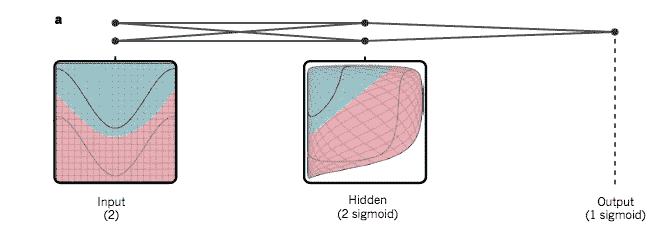
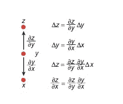
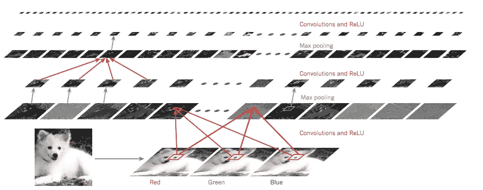
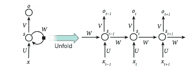

# 深度学习评论

> 原文：<https://medium.com/coinmonks/deep-learning-review-d7c7f6fca3f6?source=collection_archive---------3----------------------->

## 介绍

在本帖中，我们将回顾由 Hinton、LeCun 和 Bengio 撰写的关于[深度学习](http://www.cs.toronto.edu/~hinton/absps/NatureDeepReview.pdf)的综述论文，他们都因在该领域的开创性工作而闻名。这篇论文发表于 2015 年，所以这篇综述可能有点过时，但我仍然从这篇论文中发现了很多价值。这篇论文很好地总结了深度学习的趋势以及当前技术面临的挑战。与我过去报道的其他论文不同，这并没有专门谈论一个系统，而是提供了深度学习背后的高级直觉和大约 2015 年的事态。在进一步深入之前，我希望对经典的机器学习有所了解，但是你也可以跳过这些细节。

## 深度学习的动机

目前，ML 被用于许多应用中，例如网络搜索、内容分类/过滤、电子商务产品推荐等..传统的监督学习技术，如回归或 SVM，是有效的，但也需要大量的工程努力。为了构建成功的应用程序，需要在领域专家的帮助下仔细识别特征，需要清理原始数据并将其转换为特征向量，然后系统可以使用这些向量进行分类/预测。

深度学习试图克服这些挑战。它属于 ***表征学习方法*** 的范畴，在这种方法中，原始数据可以输入网络，然后它可以自动发现内部表征(特征)。随着更多的非线性学习层被添加到系统中，更新的和更复杂的表示就形成了。一个很好的例子就是检测图像中的物体。在深层模型中，第一层可以识别边缘，随后的层可以识别由边缘形成的主题。接下来的几层实际上代表了物体的一部分，最后的几层实际上检测到了熟悉的物体。在每一层，深度学习网络不依赖于非常精确的特征表示，即边缘可以不同地定向，它们可以出现在图片中的其他地方，图像中不同地方的照明可以关闭。深度学习模型可以从原始像素开始，然后通过使用通用技术，在没有大量特征调整的情况下构建这些中间表示。正因为如此，随着计算和数据变得更加容易获得，深度学习模型也可以表现得更好。

## 浅层学习 vs 深度学习

让我们先回顾一下传统的学习方法，详细对比一下这两种方法。

**常规浅层学习**

在传统的浅层监督学习方法中，例如简单的神经网络或线性回归，向模型显示一些标记的数据，例如被标记的图像，例如包含或不包含肿瘤的医学图像。然后，模型创建者仔细设计输入数据，选择可能感兴趣的特征，然后将经过筛选的特征向量以一定的权重提供给输入模型。然后使用这些权重和特征组合，计算相对于期望输出的输出误差。然后，算法的目标是调整权重和特征，以便首先针对训练集，然后针对看不见的输入，最小化预测误差。

权重的调整过程通过使用随机梯度下降算法来完成。梯度(用于局部最小化误差的偏导数)被用在这些特征-权重组合上以减少误差。这是反复进行的，直到模型不能再减少误差为止。这种技术已被证明对于减少传统机器学习中所有样本的总体误差非常有效。这种线性分类器所做的是将空间划分为由超平面分隔的简单区域。为了获得更多的非线性，可以使用非线性核，例如高斯核，但是研究表明它们可能不总是很好地概括。

**深度学习**

深度学习试图克服上一节提到的一些问题。深度学习模型可以被调整为对输入的变化不敏感。在图像和语音识别中，位置变化(例如，一只狗在图像的中间还是在图像的角落)、人脸光照变化(光线充足还是光线不足)是很常见的。在语音识别中，需要忽略重音或音调的变化。深度学习能够处理这种敏感性权衡——模型不需要敏感的情况(不同位置的相似狗)和我们确实需要敏感的情况——考虑一些相似(但不同)的狗和狼的物种——[一只看起来像狼的狗](http://www.pethealthnetwork.com/dog-health/dog-breeds/samoyed)。传统的浅层分类器不能有效地进行这些区分，因为原始像素数据在前者中看起来非常不同，而在后者看起来非常相似。当从原始像素中提取的特征可以忽略或突出那些特征时，传统技术只能做到这一点。这就是深度学习的用武之地，它避免了繁重的功能工程的需要——功能是通过本质上通用的代表性学习方法自动学习的。

深度学习架构由多层模块组成——每一层都代表某种被学习的功能。这些模块通常使用非线性函数映射。通过 5-20 深度的多个非线性层，系统可以学习微小的显著差异(狗与狼)，也可以学习忽略不相关的差异，如位置、背景或照明的变化。

## 反向传播的历史和基本原理

多层网络很长一段时间都不流行了。在 70 年代和 80 年代，有很多关于如何训练多层网络的研究。关键的突破，至少在对这些网络的理解上，是在探索多层网络上随机梯度下降的应用时出现的。

多层神经网络由一些输入层、一些隐藏层和输出层组成。输入层表示输入，输出层表示神经网络实现的结果，例如给定图像是否包含狗、猫或马。隐藏层添加非线性平滑函数，如 ReLU(relu(z) = max(0，z))。这些函数可以将较小维度的输入转换到更高维度的空间，从而更清晰地分离出数据。

Non-linear cleaner separation achieved using non-linear functions

这种多层网络中的梯度下降通过从输出层开始并计算输出 w.r.t .对其连接的前一层权重的偏导数来工作。可以从中间/隐藏层到先前的层，一直到输入，重复向后的步骤。事实证明，这不过是衍生品链式法则的一个应用。这是理解神经网络的关键进展之一。请看一个简单的神经网络图:

x is the input layer, one single hidden unit y and then output layer at z. If you start from z and back propagate gradients to x using chain rule of derivatives, we can use these gradients in the next feedforward pass to reduce the error on z.

如果你想阅读更多关于反向传播的细节，我会强烈推荐[安德烈·卡帕西](https://medium.com/u/ac9d9a35533e?source=post_page-----d7c7f6fca3f6--------------------------------)的[神经网络](http://karpathy.github.io/neuralnets/)黑客指南——他在解释偏导数和反向传播如何导致目标函数的优化(减少误差)方面做得非常出色。

**多层学习的历史问题:**在具有许多丘陵区域和山谷的多维空间的情况下，被认为是梯度下降的问题之一是它可能陷入局部最小值，即与全局最深的山谷相反的一些小的局部山谷。经验结果和进一步的研究似乎表明，这不是一个如此大的问题，因为系统在大多数情况下最终会落在一个好的最小值上。另一个问题是，训练这种具有数百万个权重的大型多层网络需要很长时间。GPU 的出现，并行算法在这方面有所帮助。

为了解决仔细特征工程的一个早期问题，2000 年代的研究开发了对未分类数据的无监督学习(预训练),作为一个合理的特征提取器。这些自动提取的特征然后可以反馈到传统的神经网络中，该神经网络可以使用标准的反向传播方案来训练。手写数字的检测和语音处理受益于此。一种在图像上表现良好的前馈网络被称为卷积神经网络(ConvNet ),这将在下一节讨论。

## ConvNet

ConvNet 是一种深度学习网络，对检测图像中的模式特别有效。该架构背后的直觉是，图像由高度相关的值的局部小块组成，并且这样的小块可以是位置独立的。图像是由较小的物体组成的，即边缘形成图案，图案形成物体的一部分，等等。类似的组合属性也存在于语音处理中。深度学习网络擅长通过创建多个深层来利用这种组合性质——每个新层都使用其下一层来构建更复杂的结构。典型的 ConvNet 架构由以下几层组成:

1.  卷积层:这一层包括在图像上创建更小的滑动窗口，然后使用这些窗口连接神经元。输出是权重和滑动窗口中相应输入的乘积。ReLU 层然后应用非线性函数 it。滑动窗口可以以一定的步幅(例如 1 或 2)滑动，以捕获图像中可能存在的各种模式。
2.  合并图层:合并图层然后对 conv 图层中的数据进行缩减采样并降低其维数，然后创建一个较小的样本。例如，池层可以使用 2×2 像素的窗口应用最大池，然后只选取最大值作为该区域的代表。因此，一个 4 x 4 的图像可以转换为 2x2，通过这种最大池池使用步幅 2。
3.  全连接层:这与传统的全连接层相同，它将这些中间层转换为最终输出——例如给定输入的分类。

A patch of an eye along the RGB dimension undergoes convolution and ReLU first. The next layer performs max pooling. Typically 10–20 layers can be stacked stacked with millions of weights.

尽管之前取得了成功，但 ConvNets 在主流 ML 社区中很大程度上不受欢迎。当 2012 年 ImageNet 竞赛开始时，这种情况开始改变。本文的一些作者使用 ConvNets 将数百万张图像分类到数千个对象类别中，与当时所有其他最先进的方法相比，这将错误率降低了一半以上。传统上，这些被认为是非常昂贵的培训。但随着 GPU 的出现，高效的正则化技术，如 [dropout](http://www.cs.toronto.edu/~rsalakhu/papers/srivastava14a.pdf) 、ReLUs 以及使用单个现有输入来创建许多轻微变形的输入样本，大大缩短了训练时间。类似地，ConvNets 似乎也能很好地处理 FPGAs。ConvNets 在诸如检测图像中的人脸、检测街道标志、阅读支票、检测生物图像中的模式等应用中非常有用。

## 递归神经网络

这是另一种深度前馈网络，可用于处理文本或语音等顺序输入。RNN 的主要应用之一是预测单词中的下一个字符或句子中的下一个单词。类似的应用也存在于语音处理中。RNNs 的一个有趣的应用是通过使用图像作为输入来生成字幕或有意义的文本。可以把它想象成为一部电影的封面或用英语描述一幅图像而生成的字幕。这可以通过将 ConvNet 的输出作为 RNN 的输入来实现。

传统上，使用 rnn 的反向投影很难收敛梯度(因为它们会随着时间的推移而消失或爆炸)，新技术使 rnn 的复杂应用成为可能。现在，RNNs 可以用来提取图像或句子表达的“思想”，然后可以输入另一个 RNN，翻译成不同的语言。

As RNN model us unfolded, it becomes apparent how backprop can be used to train such a model. All the states s share the same weights and also capture some past state that can be input to the new state.

RNN 中的隐藏单元最终会隐式捕获系统中的过去状态。随着 rnn 的展开，它们可以被认为是具有许多层的神经网络，其中所有层最终共享相同的权重。该研究似乎表明，很难存储反映真实长期依赖关系的状态。这导致了 LSTM 的出现——基于长期短期记忆的网络。

## LSTM

研究人员发现，在语音识别等应用中，LSTM 网络比 rnn 更有效。在 LSTM，为了解决 RNNs 的存储或记忆问题，研究人员已经提出给神经网络增加记忆。这可以通过添加特殊的隐藏神经元来实现，这些隐藏神经元可以充当累加器，或者自身的权重为 1。后一部分有助于在下一个时间步中复制它自己的值。这种连接可以由另一个单元控制，然后该单元可以学习何时清除这种记忆。

沿着添加存储模块的路线，其他研究人员提出了神经图灵机的概念，通过添加磁带，网络可以读写的关联存储器。显然，这种基于存储器的网络在基于问答的应用中表现良好。在这样的应用中，网络被要求记住一个故事，然后网络需要回答一个关于这个故事的问题。神经图灵机的另一个应用是能够学习算法——当每个项目都指定了优先级时，一些人已经成功地对数据集进行了排序。

## 截至 2015 年深度学习的未来

虽然监督学习取得了很大的成功，但作者认为深度学习的未来似乎与无监督学习的更多进步联系在一起。这似乎是人类学习新思想的相同方式——通过观察而不是总是被监督来学习每一个小的新事物。

在计算机视觉方面，ConvNets、RNNs 和强化学习的结合似乎有进一步发展的潜力。当时的研究处于早期阶段，仍然显示出令人印象深刻的结果。“语言理解”范畴的许多问题可以从 RNN 的进步中获益。

作者似乎表明，人工智能的巨大进步将来自于本文中强调的表征学习技术和复杂推理方面的更多进步的结合。

> [在您的收件箱中直接获得最佳软件交易](https://coincodecap.com/?utm_source=coinmonks)

