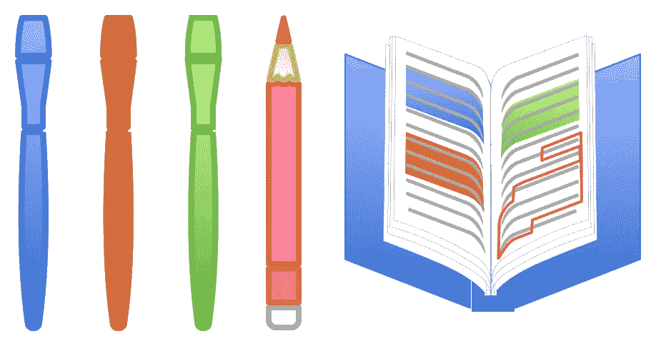

# 污损图书—实施

> 原文：<https://medium.com/coinmonks/defaced-book-implementation-9a22715403bf?source=collection_archive---------4----------------------->

## 如何在不暴露个人数据的情况下使用社交媒体

Illustration by Kitty West

普通的社交媒体平台使用个人数据的集中化，这对个人，甚至整个社会来说都是一件非常糟糕的事情。

然而，我们可以建立一个分散的社交媒体平台来解决这些问题。