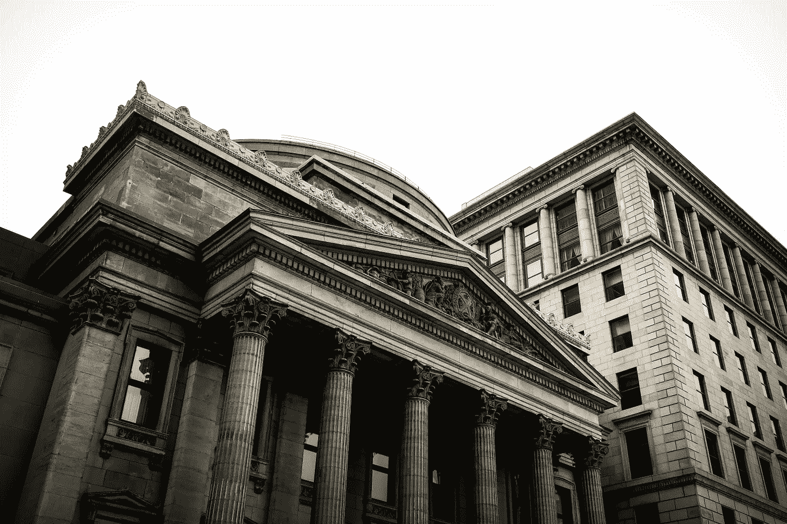

# DeFi:初学者指南

> 原文：<https://medium.com/coinmonks/defi-a-beginners-guide-604874f76e37?source=collection_archive---------0----------------------->

## 到底什么是去中心化金融？

去中心化金融——加密货币领域目前的宠儿。一套旨在将金融产品“链上”的工具和协议。DeFi 正在迅速获得牵引力，但它究竟是什么？

DeFi 有很多方面，分散化交易所、衍生品、稳定硬币、打包资产等。但是要理解 DeFi，你需要理解当前的空间之王。借贷协议是这一领域的主导者。

在撰写本文时，DeFi 的产品已经锁定了 21.6 亿美元的资金。其中大约 17 亿美元存在于“贷款协议”中。让我们找出原因。

# 贷款协议

## 传统金融的起源

借贷协议从传统金融中提取了一些非常简单的概念，如借贷，并通过智能合同在链上实现它们。

让我们来看一个传统的金融借贷的例子，你在你的银行账户里存了一些钱，你可以在任何时候存取这些钱，存这些钱的好处是你可以得到利息。

你赚取利息的原因是银行用你存的钱发放房贷等低风险贷款。这些贷款通常比你存钱的利率要高。这种差异是银行盈利的方式之一。

现在你可能会问，如果我的钱是通过抵押贷款借出去的，我怎么能随时取钱呢？你可以这样做，因为你的存款和其他所有人的存款被汇集在一起，成为一个流动资金池。

从概念上讲，所有的东西都出来并进入这个池，贷款的资金，从你的账户中提款，存入你的账户，等等。

Think of each deposit as a droplet of water, these droplets in aggerate can create a “liquidity” pool

银行做了一些计算，并制定了一些法规，以确保池中始终有资金可供人们提取。尽管如此，事情可能会出错。

该模型之所以有效，是因为它假设每个人都不想同时取出所有资金。这种情况可能并且已经发生，被称为“银行挤兑”。

例如，在 2008 年的金融危机中，人们开始担心银行会倒闭，所以他们开始撤回资金。这反过来增加了银行破产的可能性，因为他们现在的池中流动性更少了。

有消息称，人们正在从银行提取资金，因此其他人也在提取资金。这就产生了一个负反馈循环，并在银行最终倒闭时成为一个自我实现的预言。

现在你对传统的金融模式有了一个了解，让我们来看看新的闪亮的去中心化的世界和他们的方法。

## DeFi 贷款协议，他们解决什么？

借贷协议是目前 DeFi 中最大的市场，这并不奇怪，因为它们解决了持有加密货币的一个主要问题。理想情况下，人们希望持有能够升值并提供收益的资产。收益的例子有股票的股息、债券利率、银行利率等。

在 DeFi 之前，加密货币通常不提供收益机会(除了赌注)。由于持有加密货币的风险，加密货币的收益率为负。如果放在交易所，你的资金可能会被黑客攻击/窃取，放在硬件钱包上，设备可能会丢失，如果你死了而没有告诉其他人，这些资金将永远丢失。

我们接受了这些风险，因为资产增值的上升空间如此之大，以至于收益率并不重要。DeFi 中的贷款协议现在为我们提供了一种在不放弃对我们资产的监管的情况下赚取加密货币收益的方法。他们通过以太坊区块链的智能合约做到这一点。

智能合约代表了一个可以将资产汇集在一起的地方，就像在银行将存款汇集在一起一样。有了这些流动资金，就可以发放贷款。

## 贷款机制

之前我提到了抵押贷款等低风险贷款，抵押贷款风险低的原因之一是因为通常有房屋价值 10%的首付，而且如果你违约，房子可以用作抵押。

如果你停止支付抵押贷款，银行将收回你的房子，卖掉它来偿还贷款。这种抵押品的概念也在 DeFi 中使用，借款人需要提供某种形式的抵押品，这样如果他们违约，债务可以得到偿还。

这种抵押品通常采用其他加密货币的形式，需要超额抵押。150%的抵押率意味着我需要为 100 美元的贷款提供价值 150 美元的抵押品。这种超额抵押的原因是加密货币资产的总体波动性。

资产价格在一天之内波动+/- 50%并不罕见。因此，协议需要通过确保即使在价格急剧下跌的情况下，贷款也可以通过出售抵押品来弥补来保护自己。

协议进一步保护自己免受这些急剧下降影响的另一种方法是使用清算阈值。清算阈值通常是抵押品价值与贷款价值的比率。

在上面的例子中，100 美元贷款的抵押率为 1.5，抵押额为 150 美元。协议可能说你不能低于 1.3 的比率。如果你的抵押品，比如说比特币，价格下跌了 15%，那么美元价值将降至 127.50 美元。1.3 的比率阈值要求美元价值至少为 130 美元，因此在这种情况下，你将被清算。

清算包括智能合约在公开市场上出售你的比特币，并终止你的贷款。你可以保留借出的 100 美元，但你失去了你的比特币，在出售时价值 127.50 美元。

现在我们已经讨论了抵押品，让我们看看这些贷款的利率。利率通常是可变的，这意味着它们可以在贷款期间上下浮动。从借款人的角度来看，这远非理想。

可变利率意味着他们不能为未来做计划，他们不能知道在贷款期限结束时他们将要支付的利息的确切数额。他们需要不断了解利率的最新变化。

利率不断变化，取决于存款和贷款的数量。一般用一个数学公式来计算利率。它使用存款和贷款来获得池的利用率，这反过来有助于计算利率。

举个例子，一个有 100 个比特币和 80 个借出的比特币的池将代表 80%的利用率。通常利率在 5-15%的范围内，但最高可达 60%，最低可达 0.5%。

## 用例

你可能想知道谁会冒着清算的风险，以及高达 60%的可变利率来获得贷款，他们可以通过出售部分抵押品来获得贷款。一个很好的问题，让我们来看看其中的两个主要用例。

借款人的第一个用例是想做空加密货币的人。当你做空一项资产时，你是在赌这项资产的价格会下跌。

他们可以拿出一枚与美元挂钩的稳定硬币作为以太坊贷款的抵押品，立即出售以太坊，等待价格下跌，再买回，偿还贷款，并从支付的利息和高价出售以太坊和低价回购以太坊之间的差价中获利。不用说，如果以太坊涨价，你就有麻烦了。

另一个可能的使用案例是为那些拥有大量密码但没有钱的人。想象一下，你持有价值 1500 美元的比特币，你认为它的价格将在未来几个月内上涨。你的车坏了，需要修理，要花 1000 美元。

你可以卖掉你的比特币，但你不想卖，因为你认为价格会上涨。相反，你决定用你的比特币申请 DeFi 贷款。你收到 1000 美元稳定的硬币贷款，年息 12%，可以转换成真正的美元。你用它来修理你的车，并在接下来的两个月里从你的薪水中偿还贷款。

加上利息，你必须偿还 1020 美元，但比特币在过去两个月上涨了 20%，所以你的比特币现在价值 1800 美元。你高兴地离开，知道你的直觉是正确的(这一次)。

这两个例子看起来都有风险，事实也确实如此，但人们愿意承担这些风险。如果你的抵押品或卖空资产的价格与你想象的方向相反，这两个故事都可能以悲剧收场。

## 结论

DeFi 还处于起步阶段，它仍在成长，但已经表明它可以真正为加密社区的人们增加价值。我们已经了解了传统金融的起源，以及在智能合约中实现这些概念的机制。我们对其中涉及的一些风险有所了解，也看到了一些潜在的使用案例。DeFi 正在推出新的协议和创新，只有时间才能证明这些协议是否会成为区块链的突破性产品。让我们拭目以待。

> [在您的收件箱中直接获得最佳软件交易](https://coincodecap.com/?utm_source=coinmonks)

