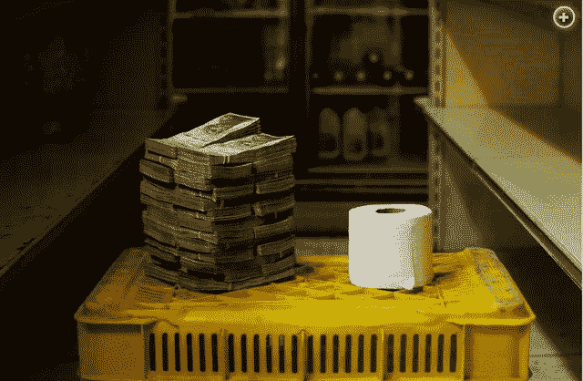
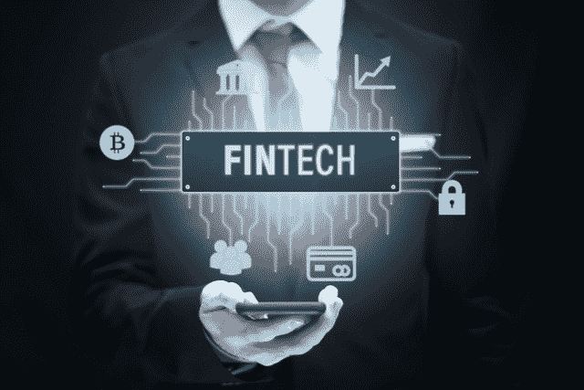

# DeFi:对银行业的威胁

> 原文：<https://medium.com/coinmonks/defi-a-threat-to-the-banking-establishment-c6fe1fb1dc16?source=collection_archive---------12----------------------->

Source: [Bitcoin.com](https://static.news.bitcoin.com/wp-content/uploads/2021/07/shutterstock_1903643956.jpg)

今年我们见证了一个大事件，许多人都预料到了，但很少有人预料到会见证如此大规模的事件。

2021 年的分散金融(或 DeFi)动摇了传统金融机构的基础。DeFi 增长始于 2020 年初，虽然以太坊社区接受了它，但很难预测这样一个爆炸性的结果。

DeFi 改变了我们对加密行业的看法。我们被关于加密货币无法达到广泛采用水平的叙述和极端压力所困扰，但加密货币再次找到了新的定义，数字金融革命重新点燃。

## 加密货币代替“法定货币”

Image from [Pixabay](https://pixabay.com/illustrations/blockchain-cryptocurrency-bitcoin-3212312/)

商家采用似乎极其困难。这取决于人们决定改变方式，但坦率地说，我们大多数人附近没有任何商店或商家接受任何形式的加密货币。当我们找到一个并在付款时拍照和录像是很酷的，但是这些商店有多少秘密顾客呢？

我准备改变我的消费习惯，使用加密而不是菲亚特，然而，大多数人没有。他们不会改变。他们不想持有 BTC，BCH，瑞士联邦理工学院，XRP，但更喜欢一些更稳定的。

在国家法定货币完全失灵的国家(委内瑞拉、津巴布韦)，人们将决定寻找一种新的方法。尽管如此，只有一小部分人采用了加密技术。床垫下会藏着美元和邻国的其他货币，帮助这些家庭度过难关。

一个更好的解决方案是一些费用低廉的加密货币，可以帮助他们更好地经营业务。但是，即便如此，还是有一个很大的问号。为什么委内瑞拉人没有大规模采用加密货币？

也许他们尝试了比特币和以太坊，但发现他们为一笔交易支付的费用占了整个月的工资。自 2017 年以来，Dash 一直试图在国内创造一股采用浪潮。然而，这一努力失败了，2018 年的熊市导致 Dash 的价格下跌了 95%(甚至更多)。

我和委内瑞拉的朋友聊过，他们是密码爱好者，他们解释说 Dash 有一天不再关心了。随着资金的枯竭，领养实验也结束了。

[Source](https://thefinanser.com/2021/04/venezuela-replaces-national-currency-with-bitcoin.html/)

如今，委内瑞拉正试图通过比特币现金采用加密技术。比特币现金社区的很大一部分希望 BCH 加密货币作为一种支付方法被大规模采用而获得成功。我也希望如此，但也许委内瑞拉的消费群体还没有准备好。

委内瑞拉的通货膨胀令人无法忍受，大多数人生活在不卫生的环境中。当然，金钱可以改善一些状况，但也有一些重大问题只有通过大规模改革才能缓解。

我支持摆脱菲亚特经济，转而使用 crypto，但四年后，我仍然没有看到所需的人口比例同意这一变化。尽管一些国家在与高通胀率作斗争，但美国和欧盟 5%的(官方)通胀率并不算极端。

它正在损害银行存款，因此投资将更加实际。就支付方式而言，在任何西方或稳定的经济体中看到这种变化都是难以承受的。

## 传统金融的敌人

在经历了爆炸性增长后，DeFi 现在被认为是对传统银行体系的威胁。

它是 CryptoVerse 中的一个不同领域，一个未经探索的领域，在 2018 年首次作为一个话题出现(如果我没记错的话)。DeFi 诞生于以太坊社区内部，以太坊仍然保持着这个领域的大部分发展。

去年夏天，当加密货币市场再次处于繁荣周期的开端时，它首次变得引人注目。

化合物，平衡器，制造商开始迅速增长，数以千计的 DeFi 项目出现。这是 ICO 热潮的重演，同样的热情，同样的投机者，唯一不同的是。DeFi 是关于把金融系统变得更好。

核心概念是贷款和收益率，但采用的方法比银行体系好得多。没有信用评分，没有限制，没有偏袒。

不需要信任，也不需要讨论条款。分散的区块链大多是基于共识运行的自治网络。虽然，有时在区块链，一个特定的力量可以控制该机制的某些部分，并强加其意志。当这种不规则出现时，那么去中心化就没有了。

关键是没有人控制，没有统治者，或者没有银行家在监管框架下工作。共识规则是区块链交易遵循的唯一规则。

DeFi 是现代金融革命，给了密码行业更多的潜力。通过 DeFi，它向银行机构发起挑战，提供类似的贷款服务，只是标准更高，利率更高。

联邦理工学院的学费达到上限是有原因的。这些金额与小额交易无关，但大笔资金正在流入。这笔钱不在乎 200 美元的费用。这些投资者为仅仅 2%的年利率向他们的银行支付十倍多的费用。他们不会在乎以太坊区块链的费用是 200 美元还是零。以太坊就是因为这个原因而完美运作的。

## 自主银行业务

Source: [Pixabay](https://cdn.pixabay.com/photo/2018/09/27/09/22/artificial-intelligence-3706562_960_720.jpg)

银行业从 DeFi 吸取教训。流动性、收益率、贷款和清算的智能合约机制提供了金融创新。银行已经表明，他们可以跟踪进展，特别是在数字基础设施方面的最新发展。但是他们缺乏对分散系统的基本理解。使用智能合同(或类似技术)立即采取行动的算法服务已经在开发中。

银行明白，通过使用不需要人工参与的系统，他们可以轻松削减成本(和工作岗位)。其中之一是贷款，DeFi 已经证明贷款可以自动化。我希望银行至少 90%的服务实现自动化。

此外，银行正在测试人工智能解决方案的实施，至少是在财务管理的较低层面。

这需要时间，政府可以禁止和监管，尽管他们不能阻止一个分散的网络。取而代之的是，将会有同样的策略来拖延创新，直到落后的经济领域迎头赶上。

## 结论——现代金融竞赛

Source: [Pixabay](https://pixabay.com/photos/binary-one-zero-space-universe-3044663/)

加密是一个类似于 P2P 种子网络的故事。娱乐业赶上了新技术，并在网上向每个人提供服务。仍然有相当数量的用户在使用，但对这个行业不再是一个明确的威胁，所以监管机构已经停止浪费资源追捕种子网络。

研究和开发是任何行业的核心。从 80 年代到最近，银行一直在使用同样的系统。他们的方法是不合时宜的，投资银行是投机性的，而且经常是欺诈性的。

在集中式环境中，决策来自顶层，并传播到其余组件。在分散自治的环境中，决策需要绝大多数人的一致同意。去中心化提供了抵制审查的交易，这是财务自由的载体。能够在没有第三方授权交易的情况下控制我们的资金。

DeFi 还没有为没有银行账户的人提供金融服务，尽管似乎用不了多久，每个人都可以贷款或使用这些服务。那些被排除在银行系统之外的人被新经济所接受。如果银行保持基于过时方法的做法，低估进步，那么它们将无法跟上。

事实上，银行又一次落后于最新的金融创新 10 年，只要它们不重视去中心化，它们就会在现代金融的竞赛中落后。

**关注我:**

)(...)(...)(...)(...)(...)(...)(...)(...)(...)(...)(...)(...)(...)(...)(...)(...)(...)(...)(...)(...)(...)(...)(...)(...)(...)(...)(...)(...)(...)(...)(...)(...)(...)(...)(...)(...)(...)(...)(...)(...)(...)(...)(...)(...)(...)(...)(...)(...)(...)(...)(...)(...)(...)(...)(...)(...)(...)(...)(...)(...)(...)(...)(...)(...)(...)(...)(...)(...)(...)(...)(......(...)(...)(...)(......(...)(...)(...)(...)(......(...)(...)(......(...)(...)(...)(...)(......(...)(...)(...)(......(...)(......(...)(...)(...)(...)(...)(

)(我)(们)(都)(没)(想)(到)(这)(样)(,)(我)(们)(还)(没)(想)(到)(这)(样)(,)(我)(们)(就)(没)(想)(到)(这)(样)(了)(,)(我)(们)(就)(没)(想)(到)(这)(样)(。

*最初发表于* [*https://leofinance.io*](https://leofinance.io/@pantera1/defi-lending-and-yields-a-threat-to-the-banking-establishment) *2021 年 9 月 6 日(T99)*

*   [Leveraged Token 【T101) |](/coinmonks/leveraged-token-3f5257808b22) [最佳加密交换](/coinmonks/crypto-exchange-dd2f9d6f3769) | [AscendEX Review 【T105)](/coinmonks/ascendex-review-53e829cf75fa)
*   [Godex.io Review](/coinmonks/godex-io-review-7366086519fb) [Invity Review](/coinmonks/invity-review-70f3030c0502) [BitForex Review](https://blog.coincodecap.com/bitforex-review) [HitBTC Review](/coinmonks/hitbtc-review-c5143c5d53c2)
*   [Crypto.com 费用](/coinmonks/binance-fees-8588ec17965) | [Botcrypto 审查](/coinmonks/botcrypto-review-2021-build-your-own-trading-bot-coincodecap-6b8332d736c7) | [替代方案](https://blog.coincodecap.com/crypto-com-alternatives)
*   [有哪些交易信号？](https://blog.coincodecap.com/trading-signal) | [Bitstamp vs 比特币基地](https://blog.coincodecap.com/bitstamp-coinbase) | [买索拉纳](https://blog.coincodecap.com/buy-solana)
*   [ProfitFarmers 回顾](https://blog.coincodecap.com/profitfarmers-review) | [如何使用 Cornix Trading Bot](https://blog.coincodecap.com/cornix-trading-bot)
*   [MXC 交易所评论](/coinmonks/mxc-exchange-review-3af0ec1cba8c) | [Pionex vs 币安](https://blog.coincodecap.com/pionex-vs-binance) | [Pionex 套利机器人](https://blog.coincodecap.com/pionex-arbitrage-bot)
*   [我的密码交易经验](/coinmonks/my-experience-with-crypto-copy-trading-d6feb2ce3ac5) | [《比特币基地评论》](/coinmonks/coinbase-review-6ef4e0f56064)
*   [CoinFLEX 评论](https://blog.coincodecap.com/coinflex-review) | [AEX 交易所评论](https://blog.coincodecap.com/aex-exchange-review) | [UPbit 评论](https://blog.coincodecap.com/upbit-review)
*   [AscendEx 保证金交易](https://blog.coincodecap.com/ascendex-margin-trading) | [Bitfinex 赌注](https://blog.coincodecap.com/bitfinex-staking) | [bitFlyer 审核](https://blog.coincodecap.com/bitflyer-review)
*   [麻雀交换评论](https://blog.coincodecap.com/sparrow-exchange-review) | [纳什交换评论](https://blog.coincodecap.com/nash-exchange-review)
*   [加密货币储蓄账户](/coinmonks/cryptocurrency-savings-accounts-be3bc0feffbf) | [赌注加密](https://blog.coincodecap.com/staking-crypto) | [加密交易机器人](https://blog.coincodecap.com/best-crypto-trading-bots)
*   [BigONE 交易所评论](/coinmonks/bigone-exchange-review-64705d85a1d4) | [CEX。IO 审查](https://blog.coincodecap.com/cex-io-review) | [交换区审查](/coinmonks/swapzone-review-crypto-exchange-data-aggregator-e0ad78e55ed7)
*   [最佳比特币保证金交易](/coinmonks/bitcoin-margin-trading-exchange-bcbfcbf7b8e3) | [比特币保证金交易](https://blog.coincodecap.com/bityard-margin-trading)
*   [加密保证金交易交易所](/coinmonks/crypto-margin-trading-exchanges-428b1f7ad108) | [赚取比特币](/coinmonks/earn-bitcoin-6e8bd3c592d9) | [Mudrex 投资](https://blog.coincodecap.com/mudrex-invest-review-the-best-way-to-invest-in-crypto)
*   [WazirX vs CoinDCX vs bit bns](/coinmonks/wazirx-vs-coindcx-vs-bitbns-149f4f19a2f1)|[block fi vs coin loan vs Nexo](/coinmonks/blockfi-vs-coinloan-vs-nexo-cb624635230d)
*   [BlockFi 信用卡](https://blog.coincodecap.com/blockfi-credit-card) | [如何在币安购买比特币](https://blog.coincodecap.com/buy-bitcoin-binance)
*   [火币交易机器人](https://blog.coincodecap.com/huobi-trading-bot) | [如何购买 ADA](https://blog.coincodecap.com/buy-ada-cardano) | [Geco。一次审查](https://blog.coincodecap.com/geco-one-review)
*   [加密副本交易平台](/coinmonks/top-10-crypto-copy-trading-platforms-for-beginners-d0c37c7d698c) | [五大 BlockFi 替代方案](https://blog.coincodecap.com/blockfi-alternatives)
*   [CoinLoan 点评](https://blog.coincodecap.com/coinloan-review)|【Crypto.com】点评 | [火币保证金交易](/coinmonks/huobi-margin-trading-b3b06cdc1519)
*   [Bybit vs 币安](https://blog.coincodecap.com/bybit-binance-moonxbt)|[stealth x 回顾](/coinmonks/stealthex-review-396c67309988) | [Probit 回顾](https://blog.coincodecap.com/probit-review)
*   [顶级付费加密货币和区块链课程](https://blog.coincodecap.com/blockchain-courses)