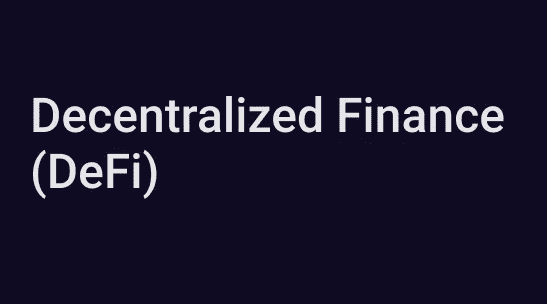

# Defi:对传统金融体系的威胁？

> 原文：<https://medium.com/coinmonks/defi-a-threat-to-the-traditional-financial-system-701c5ed05154?source=collection_archive---------8----------------------->

## 解释金融的未来

在过去的二十年里，新技术不断涌现，其唯一的目的就是让人类的生活更加轻松，没有压力。

这些新兴技术正在改变人们对全球金融体系的贡献方式。

接受分散式金融系统作为传统金融系统和金融未来的替代方案是金融行业令人兴奋的议程之一。

现在的问题是:它会提升还是降低金融业的地位？

在这篇文章中，我将给出 Defi 是什么及其对未来金融的影响的清晰分类。

## **传统金融和早期发明的历史。**

让财务更加体面的尝试并非始于今天，而是始于 20 世纪初会计机器的引入。

监控计算机发明于 20 世纪 50 年代，目的是促进破败的银行系统的发展。

20 世纪 70 年代，自动取款机和信用卡被发明出来。它们是作为现金和支票的替代品，从而促进了商业和消费者的交易。

上世纪 70 年代末，今天金融体系的一个关键要素诞生了:*股票市场* **。**

本发明的目的是加速买方和卖方之间的证券交易，从而提供一个更安全的市场。

随着新的想法和创新不断涌现，这些推动金融体系发展的努力并没有就此停止。

在 20 世纪后期，由于互联网越来越被接受，金融银行的计算机化开始出现。这一发展使客户能够在自己舒适的家中访问他们的银行账户并进行电汇。

21 世纪初，金融科技革命诞生了。这场革命致力于用用户友好、自动化、透明和高效的产品和服务来吸引客户。

我们可以赞扬为使金融体系变得更好而付出的努力，而且实话实说:金融体系远非完美。

如果你问我下一步该怎么走:**答案是去中心化金融(DEFI)**

## **什么是分权财务？**

最简单地说，分散金融是对当前金融体系的一种开放替代，而当前金融体系是由几十年的基础设施维系的。它利用密码学、区块链和去中心化的力量来建立一个新的金融系统。

该系统提供了对众所周知的金融服务的访问，例如更有效和公开的支付、借贷和交易，还消除了中介或第三方。

Defi 为任何人铺平了道路，他们可以使用以太坊和互联网连接来访问产品和服务，而不需要一个集中的权威。有了 Defi，没有当局可以阻止你的付款或拒绝你访问任何东西，你有完全的自主权，你的钱去哪里，如何花。

这很吸引人，Defi 为发展中国家和欠发达国家的人们摆脱严重的通货膨胀和金融动荡铺平了道路。

**Defi 有三个显著特征**

*   它是开放和可编程的:任何人都可以构建一个新的 Defi 应用程序，并为生态系统做出贡献。新的应用程序可以利用现有的协议，并建立在现有的解决方案之上。
*   所有服务都是免费的:你需要的只是一个浏览器和互联网连接。
*   平等和透明:不需要文件验证或收入报表。国籍和种族不是必须的。巅峰时期的平等！

## **威胁还是解决方案？**

为了更好地了解分散化金融的价值主张，让我们来看看传统金融中的一些常见问题，以及在 Defi 中如何解决这些问题。

*   **为对外交易支付巨额转让费**:

人们支付高达 10-30%的汇款作为转账费用。那是无耻和光天化日之下的抢劫。

【Defi 如何解决这个问题？

在 Defi 中，你可以用相当于这个价格的一小部分来发送以美元为基础的稳定硬币(USDT，戴)。资金在几秒钟内到达，而不是几天。

此外，你可以在区块链上找到所有公开的会计记录，这使得会计更容易和完全自动化。

因此大大降低了对人力资本的需求。

*   **一群人关起门来做决定**

在传统的系统中，一群人进行最后的筛选。他们决定什么时候停止交易，或者对数百万人来说最好的利率。

在 Defi 中，利率根据协议配置的某些资产的需求利率和风险参数自动调整。

股票市场上著名的游戏停止传奇( [GME](https://cheddar.com/media/everything-you-need-to-know-about-the-gamestop-stock-saga) )是一个理想的场景，表明一群人对数百万人做出有争议的决定。

像这样的情况在 uni swap 这样的分散交易所是不可能发生的，因为没有人能够禁用或改变平台的交易功能。没有一个权力机构代表用户作出决定。

在 Defi 中，交易是民主化的。

**Defi 解决的其他一些问题有:**

*   低效而昂贵的银行和汇款服务
*   获得金融服务的机会不平等，从而使全球数十亿人没有银行账户。
*   新支付者的准入门槛极高，如果没有大量资本，拥有一家金融科技初创公司是不可行的，因此扼杀了创新。
*   金融科技公司提供的漂亮用户界面只掩盖了一个事实，即他们的金融系统建立在一个低效的基础上。因此在处理简单交易时造成通常的延误。

**挑战 Defi**

你没想到会看到这个？也许是的。

Defi 有一个独特的价值主张，但它也带来了挑战。

这些挑战包括:

*   无抵押贷款和抵押贷款:这是传统金融的一大领域，在 Defi 中实施起来有点困难。

幸运的是，最近已经有了尝试进行这种锻炼的进展。已经有像 [AAVE](https://aave.com/) 这样的协议，正在探索不同的可能性，如信贷授权和令牌化抵押贷款。

*   缩放:Defi 的接受产生了对以太坊街区空间的巨大需求，导致用户的燃气费上涨。很高兴知道这个问题正在由 [ETH 2.0](https://ethereum.org/en/eth2/) 和[第 2 层扩展解决方案解决。](https://coinmarketcap.com/alexandria/article/what-are-cryptocurrency-layer-2-scaling-solutions)
*   黑客:真正拥有自己资产所有权的用户会承担更多责任，用户必须确保他们的资产不会落入坏人之手。

这些挑战并不能否认 Defi 是一项独特的创新。我坚信这些挑战将很快得到解决。

## **传统金融的未来**

如果 Defi 跟上这个步伐，我认为传统金融系统将不得不迅速适应。否则，过不了多久，它就变得无关紧要了。

我们可能会看到一些现任者挖掘 Defi 的无限可能性。这最有可能从银行和金融科技公司涉足加密货币开始。

**最终想法**

在我看来，Defi 更像是金融界的解决方案，而不是对传统体系的威胁。

随着 Defi 的迅猛发展，很难不对其未来感到乐观。很快，传统金融机构将开始挖掘其无限的可能性。

有了 Defi，人们可以平等地获得金融服务，而不需要中央集权或第三方。

Defi 决心彻底改革整个金融体系，这只是时间问题，它将会实现。

Defi 是金融业的未来，它将一直存在。你不会想错过这个的。

好奇 Defi 如何让你受益？

**查看以下文章:**

*   【Defi 有什么大不了的，你是怎么投资的？
*   【Defi 可以产生被动收入的 4 种方式

**拍手，分享，留言评论。**

> 加入 Coinmonks [电报频道](https://t.me/coincodecap)和 [Youtube 频道](https://www.youtube.com/c/coinmonks/videos)了解加密交易和投资

## 另外，阅读

*   [Bybit vs 币安](https://blog.coincodecap.com/bybit-binance-moonxbt)|[stealth x 回顾](/coinmonks/stealthex-review-396c67309988) | [Probit 回顾](https://blog.coincodecap.com/probit-review)
*   [顶级付费加密货币和区块链课程](https://blog.coincodecap.com/blockchain-courses)
*   [在美国如何使用 BitMEX？](https://blog.coincodecap.com/use-bitmex-in-usa) | [BitMEX 评论](https://blog.coincodecap.com/bitmex-review)
*   [最佳期货交易信号](https://blog.coincodecap.com/futures-trading-signals) | [流动性交易所评论](https://blog.coincodecap.com/liquid-exchange-review)
*   [南非的加密交易所](https://blog.coincodecap.com/crypto-exchanges-in-south-africa) | [BitMEX 加密信号](https://blog.coincodecap.com/bitmex-crypto-signals)
*   [MoonXBT 副本交易](https://blog.coincodecap.com/moonxbt-copy-trading) | [阿联酋的加密钱包](https://blog.coincodecap.com/crypto-wallets-in-uae)
*   [Remitano 审查](https://blog.coincodecap.com/remitano-review)|[1 英寸协议指南](https://blog.coincodecap.com/1inch) | [购买 Floki](https://blog.coincodecap.com/buy-floki-inu-token)
*   [MoonXBT vs Bybit vs 币安](https://blog.coincodecap.com/bybit-binance-moonxbt) | [Arbitrum:第二层解决方案](https://blog.coincodecap.com/arbitrum)
*   [买 PancakeSwap(蛋糕)](https://blog.coincodecap.com/buy-pancakeswap)|[matrix export Review](https://blog.coincodecap.com/matrixport-review)
*   [最佳免费加密信号](https://blog.coincodecap.com/free-crypto-signals) | [YoBit 评论](/coinmonks/yobit-review-175464162c62) | [Bitbns 评论](/coinmonks/bitbns-review-38256a07e161)
*   [OKEx 回顾](/coinmonks/okex-review-6b369304110f) | [Kucoin 交易机器人](/coinmonks/kucoin-trading-bot-automate-your-trades-8cf0ca2138e0) | [期货交易机器人](/coinmonks/futures-trading-bots-5a282ccee3f5)
*   [AscendEx Staking](https://blog.coincodecap.com/ascendex-staking)|[Bot Ocean Review](https://blog.coincodecap.com/bot-ocean-review)|[最佳比特币钱包](https://blog.coincodecap.com/bitcoin-wallets-india)
*   [霍比评论](https://blog.coincodecap.com/huobi-review) | [OKEx 保证金交易](https://blog.coincodecap.com/okex-margin-trading) | [期货交易](https://blog.coincodecap.com/futures-trading)
*   [比特币基地赌注](https://blog.coincodecap.com/coinbase-staking) | [Hotbit 评论](/coinmonks/hotbit-review-cd5bec41dafb) | [KuCoin 评论](https://blog.coincodecap.com/kucoin-review)
*   [最佳加密交易信号电报](/coinmonks/best-crypto-signals-telegram-5785cdbc4b2b) | [MoonXBT 评论](/coinmonks/moonxbt-review-6e4ab26d037)
*   [Coinswitch 俱吠罗评论](/coinmonks/coinswitch-kuber-review-1a8dc5c7a739) | [电网交易机器人](https://blog.coincodecap.com/grid-trading) | [比特币基地收费](/coinmonks/coinbase-fees-831e77d4f2c5)
*   [Bitget 回顾](https://blog.coincodecap.com/bitget-review) | [双子 vs 区块链](https://blog.coincodecap.com/gemini-vs-blockfi) | [OKEx 期货交易](https://blog.coincodecap.com/okex-futures-trading)
*   [OKEx vs KuCoin](https://blog.coincodecap.com/okex-kucoin) | [摄氏替代品](https://blog.coincodecap.com/celsius-alternatives) | [如何购买 VeChain](https://blog.coincodecap.com/buy-vechain)
*   [Stormgain 回顾](https://blog.coincodecap.com/stormgain-review) | [Bexplus 回顾](https://blog.coincodecap.com/bexplus-review) | [币安 vs Bittrex](https://blog.coincodecap.com/binance-vs-bittrex)
*   [Bookmap 评论](https://blog.coincodecap.com/bookmap-review-2021-best-trading-software) | [美国 5 大最佳加密交易所](https://blog.coincodecap.com/crypto-exchange-usa)
*   [如何在 FTX 交易所交易期货](https://blog.coincodecap.com/ftx-futures-trading) | [OKEx vs 币安](https://blog.coincodecap.com/okex-vs-binance)
*   [如何在势不可挡的域名上购买域名？](https://blog.coincodecap.com/buy-domain-on-unstoppable-domains)
*   [印度的秘密税](https://blog.coincodecap.com/crypto-tax-india) | [altFINS 审查](https://blog.coincodecap.com/altfins-review) | [Prokey 审查](/coinmonks/prokey-review-26611173c13c)