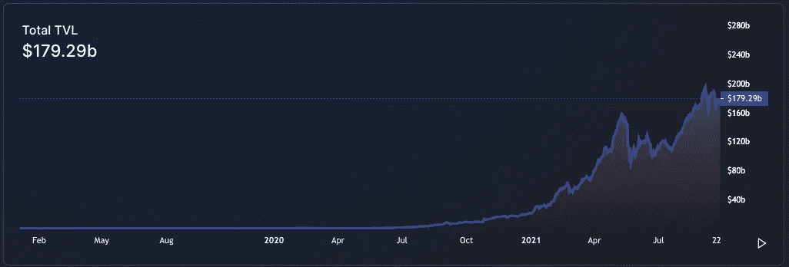
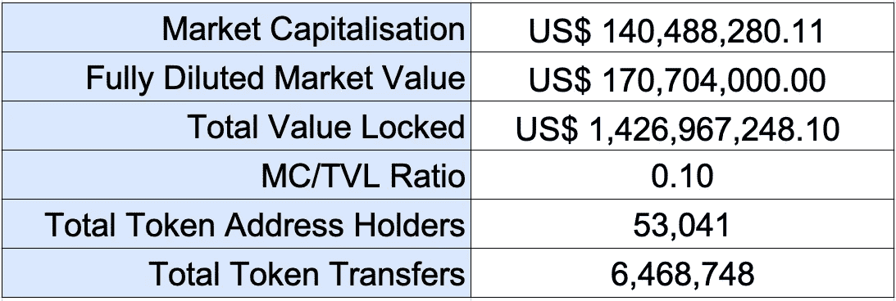
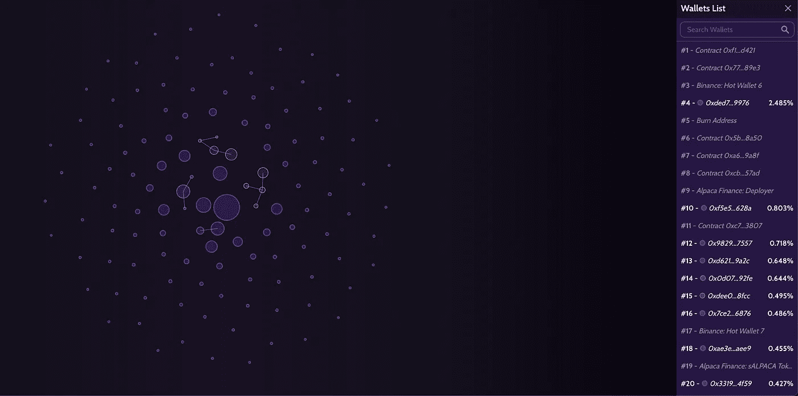
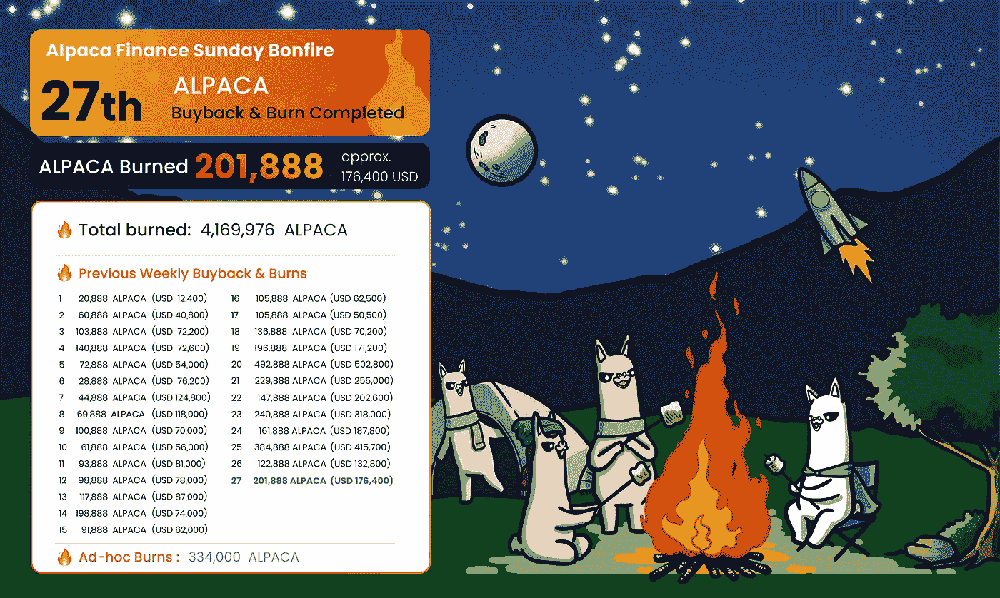

# DeFi —羊驼金融:我的分析和 DCF 估值

> 原文：<https://medium.com/coinmonks/defi-alpaca-finance-my-analysis-and-dcf-valuation-d741d9cfc249?source=collection_archive---------1----------------------->

*免责声明:此处包含的信息仅供参考。本文中的任何内容都不应被解释为金融建议，仅代表作者的观点，作者不是持牌金融顾问或注册投资顾问。交易加密货币会带来相当大的损失风险。作者不保证任何特定的结果。*

Photo by [SpaceX](https://unsplash.com/@spacex?utm_source=medium&utm_medium=referral) on [Unsplash](https://unsplash.com?utm_source=medium&utm_medium=referral)

## **DeFi 只会越来越大**

最近几个月，加密货币市场遭受了多次打击。早在 5 月份，埃隆·马斯克(Elon Musk)就因环境问题改变了立场，接受比特币作为特斯拉的付款。此外，我们看到中国宣布反对加密货币的立场，并采取行动取缔采矿场。

最近，我们担心美联储加息，恒大拖欠贷款，中国再次确认他们反对加密货币的立场。

Source: [https://defillama.com/home](https://defillama.com/home)

尽管有各种负面压力，DeFi 生态系统继续向新的历史高点推进。截至 2021 年 9 月 27 日，DeFi 在所有网络中的 TVL 估计为 1792.9 亿美元，以太坊排名第一，币安智能连锁(BSC)排名第二。仅仅一年时间，空间增长了 22 倍！

当我们查看其他链上指标时，我们也看到了良好的牵引迹象。根据 on-chain data explorer，BscScan，BSC 网络在一年内实现了接近[200 万](https://bscscan.com/chart/bep20-active-address)日活跃用户(按唯一地址衡量)和超过[860 万](https://bscscan.com/chart/bep2etxns) BEP-20 日令牌传输。

我们看到了真正的牵引力和引擎盖下的活动。我坚信 DeFi 将会继续存在，这一领域的创新将会让所有人大吃一惊。

## **DeFi 创新的第一波浪潮**

在 DeFi 创新的第一波浪潮中，我们看到了由自动化做市商(AMMs)驱动的分散式交易所(DEXes)的崛起，如 Uniswap 和 Pancakeswap，以及借贷平台，如 AAVE 和金星。这些平台对“不是你的钥匙，不是你的硬币”的坚定信仰者具有强大的吸引力，并让农民寻求天价年率，因此获得了大量采用和牵引力，使他们成为币安、火币和 FTX 等集中交易所的有力竞争对手。

然而，随着他们的成长，我认为他们正面临着一系列可能阻碍 DeFi 继续发展的问题。

1.  滑点不是微不足道的，因为没有足够的流动性来满足交易需求。
2.  资本效率不太理想的产量农业，因为只有过度抵押贷款可用。

考虑到上述限制，我可以说集中交易更有优势。

## **羊驼金融 DeFi 创新的下一波浪潮**

但随着 DeFi 创新的下一波浪潮，集中式交易所可能很快不得不退居二线。在这一波 DeFi 创新中，我喜欢把我的重点放在[羊驼金融](https://app.alpacafinance.org/lend)上，我认为它是一个强有力的候选人，可以将 DeFi 推向一个新的水平。

羊驼金融是币安智能链(BSC)上公平启动的杠杆产量养殖协议。2021 年 3 月上线。

作为一个杠杆产量农业协议，他们的核心是解决上述限制。他们为寻求在 Pancakeswap 等分散交易所利用其 LP 头寸的贷款人和借款人牵线搭桥。在 Alpaca Finance 上，借款人可以获得高达 6 倍的杠杆头寸，以提高他们的农业收益。这反过来有助于减少借款人选择押注的分散交易所的下滑。作为贷款人，由于更高的利用率，他们也可以享受更高的回报。这对所有相关方来说都是一个双赢的局面。

此外，羊驼金融的原生 BEP-20 token 羊驼，也有一个合成的计息 token ibALPACA。这为它们成为未来收益率令牌化生态系统的一部分创造了机会，该生态系统将颠覆传统金融市场的利率衍生品。2020 年，全球利率衍生品(IRD)名义未偿金额估计为[466.5 万亿美元](https://www.isda.org/a/iSDgE/Key-Trends-in-the-Size-and-Composition-of-OTC-Derivatives-Markets-in-2H-of-2020.pdf)。是啊！万亿不是十亿。

## **羊驼金融—竞争优势**

自然，羊驼融资并不是提供杠杆收益农业的唯一协议，他们也不是第一个这样做的。然而，以下是一些关键点，我认为这些点使他们有别于他们的竞争对手。

随着 DeFi dapps 中的 TVL 呈指数级增长，生态系统也未能幸免于黑客的鬼祟之手。2021 年 2 月，一名攻击者成功地从杠杆收益农业的先驱 Alpha Homora 那里吸走了 3700 万美元。为了尽可能避免与 Alpha Homora 相同的命运，并向用户提供保证，羊驼金融采取了有效措施来降低此类事件的可能性和影响。

1.  羊驼金融上禁止闪贷。
2.  自推出以来，羊驼金融已经接受了 Certik、Peckshield、SlowMist 和 Inpex 共 11 次审计。这是迄今为止在如此短的时间内执行审计最多的协议之一。
3.  与 Nexus Mutual 和 InsurAce 合作，为用户提供协议保险。
4.  来自管理员(核心开发人员小组)的每个订单都必须通过 Timelock 合同，并延迟 24 小时才能生效。如果出现任何不良的代码操作，这给了社区足够的时间来做出反应。
5.  实施安全功能，羊驼守卫-一个自动激活的机制，以保护用户免受潜在的价格操纵，快速清算和市场失灵。

根据 [Alpaca Finance 对 Alpaca Guard](/alpaca-finance/a-review-of-alpacas-oracle-guard-during-recent-market-activity-a-potential-exploit-in-other-9e162d8deefe) 的审查，在 2021 年 6 月 22 日的市场崩溃期间，尽管在 TVL 拥有超过 13 亿美元，但它实际上将清算的总头寸减少到约 90 万美元，坏账总额仅为 57，020 美元。

就我个人而言，我可以证明羊驼卫队的有效性。2021 年 9 月 7 日，市场遭受了另一次闪电崩盘，导致我的头寸在几分钟内跌破了预期的平仓阈值，但由于羊驼卫士，我的头寸得到了保护，我没有被平仓。

## **羊驼金融—关键绩效指标**

6 个月内，羊驼金融在 TVL 积聚了 14 亿美元，并在 2021 年 8 月达到了 18 亿美元的 TVL 峰值。目前，它们在所有杠杆产量农业协议中排名第一。就 TVL 而言。

Dated: 27 Sep 2021

## **羊驼金融—代币发放**

Source: Bubble Maps by Moonlight — 0x8f0528ce5ef7b51152a59745befdd91d97091d2f

根据 Moonlight 的[链上数据分析，很明显，代币在代币持有者之间公平分配，彼此之间几乎没有联系。这是一个好迹象，因为这降低了拉地毯事件的概率。](https://bubbles.moonlighttoken.com/token/0x8f0528ce5ef7b51152a59745befdd91d97091d2f)

## **羊驼金融—代币价值累积**

鉴于羊驼金融的所有定义性品质，作为代币持有者，能够获得平台带来的经济利益非常重要。

目前，令牌持有者可以通过以下方式从平台收入流中获益:

1.  **单一资产蛋糕库上的收益养殖头寸的 19%绩效费的 10% 按照协议 APR 分配给羊驼贷款储户。**
2.  ****任何清算机器人收取的每笔清算奖金的 5%中，有 4%用于回购和焚烧羊驼令牌。****
3.  ******贷款人获得的 19%的贷款利息中，有 10%用于回购和焚烧羊驼标志。******

******作为回购和焚烧机制的一部分，共有 4，169，976 只羊驼被焚烧。按照今天的价格，这相当于 400 万美元。******

************

******Source: [https://docs.alpacafinance.org/proof-of-burn](https://docs.alpacafinance.org/proof-of-burn)******

******由于存在几个机制，羊驼本质上是通货紧缩的，有 1.88 亿代币的固定供应量。******

## ********羊驼金融— DCF 估值********

******根据羊驼金融采用的代币价值累计机制，我认为将向借款人收取的费用视为现金流是合适的，经济利益通过回购和焚烧间接分配给代币持有人。在这种形式下，使用 DCF 模型来发现今天的公平令牌价格似乎是合理的。******

******由于各种系统因素，我认为这些因素可能会在一定程度上限制平台的短期增长，因此我选择使用一组假设来评估令牌，这些假设与 DeFi 生态系统中最近的历史增长率相比更加保守。******

******以下是我在 DCF 模型中做出的关键假设。******

******假设 1:在过去的一年里，TVL 可能经历了指数增长，但随着我们接近牛市超级周期的最后阶段，可能存在潜在的下行风险。我相信可以有把握地假设，在未来 5 年内，DeFi 生态系统的 TVL 将以每年 50%的速度增长。******

******假设 2:根据我的评估，羊驼金融被认为是杠杆收益率养殖领域的先驱之一，其优势不容易被竞争对手复制，并且在 TVL 方面处于领先地位。我相信他们在 DeFI 生态系统中的市场份额将在未来 5 年内继续以每年 5%的速度增长。******

******假设 3:由于羊驼金融被认为是运营约 6 个月的早期创业公司，因此仍被认为是高风险投资。我认为假设贴现率为 40%是公平的。******

******假设 4:与成熟公司的估计和发达国家的 GDP 估计一致，在 5 年后达到终端价值时，我假设羊驼金融可以继续以 2%的持续增长率增长。******

******根据上述假设，我推断出羊驼币在当前流通供应量下的价值应为**每枚 6.17** 美元( **MC/TVL: ~0.81** )和**总供应量下每枚 3.22**)(**FDV/TVL:~ 0.42**)。与目前的象征性价格相比，基于保守的前景，有至少 300%的大幅上涨潜力。******

****关于我的假设的完整分类，请随意查看我的电子表格[这里](https://docs.google.com/spreadsheets/d/16HH7WKWtoQbyawvtgWiT4pwcMk3p8TRUSRs_3ky1TI8/edit?usp=sharing)。****

## ******总结******

****作为一个可以提供安全环境以赚取高 APY 的平台，我发现这对于正在寻找可预测的被动收入来源的农民和机构来说非常有吸引力。在接下来的几年里，我预计这个领域会有更多的竞争。我很高兴看到羊驼金融的进步，以及他们如何继续创新，以保持领先地位。****

> ****加入 Coinmonks [电报频道](https://t.me/coincodecap)和 [Youtube 频道](https://www.youtube.com/c/coinmonks/videos)了解加密交易和投资****

## ****也阅读****

*   ****[Arbitrum:第二层解决方案](https://blog.coincodecap.com/arbitrum)****
*   ****[信任钱包 vs 元掩码](https://blog.coincodecap.com/trust-wallet-vs-metamask)****
*   ****[如何开始通过加密贷款赚取被动收入](https://blog.coincodecap.com/passive-income-crypto-lending)****